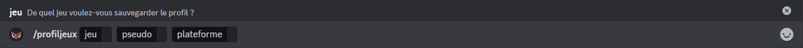

## Relier vos pseudo à DraftBot
Vous avez la possiblité de partager vos pseudos de jeux ainsi de consulter les pseudos des autres utilisateurs et votre profil avec la commande \</profil> puis mettez le pseudo du `membre`.

::tabs
  ::tab{ label="Via la commande /profiljeux" }
    Pour relier votre jeux à votre profil Discord, vous devez exécuter la commande \</profiljeux> puis de sélectionner votre `jeux`, votre `pseudo` ainsi que la `plateforme`.

    
  ::

  ::tab{ label="Via le panel" }
    Pour relier votre jeux à votre profil Discord, vous devez vous rendre sur [draftbot.fr](https://draftbot.fr) puis rendez-vous sur le [panel](https://draftbot.fr/dashboard) et allez dans [profil](/dashboard/user/profil).

    Par la suite, vous descendez vers le bas et vous pourrez lier vos jeux directement.
    
  ::
::

## Les différents type d'identifiant
Certains jeux ne demande pas de pseudo, mais des **identifiant** ou des **TAG**.

- Clash Of Clans : `TAG` (EX : #ABC123)
- Clash Royale : `TAG` (EX : #J8UOYV92C)
- CS:GO : `TAG` (EX : #AHKMX-F8TA)
- Brawl Stars `TAG` (EX : #GYCLLP0PU)
- Valorant `TAG` (EX : ls62#0069)
- Brawlhalla : `ID` (EX : draftman_dev)

## Profil de jeux
Vous avez la possiblité de consulter les pseudos des autres utilisateurs et votre profil avec la commande \</profil> puis mettez le pseudo du `membre`.

## Statistiques des jeux

### /stats brawlhalla

### /stats brawlstars

### /stats clashofclans

### /stats clashroyale

### /stats osu

### /stats paladins

### /stats wolfy
