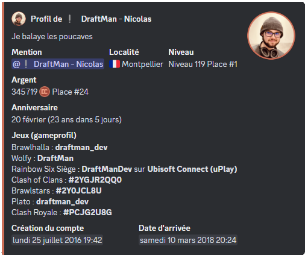

## Relier vos pseudo à DraftBot
Vous avez la possibilité de partager vos pseudos de jeux ainsi de consulter les pseudos des autres utilisateurs avec la commande \</profil> puis `l’utilisateur`.

Voici les différentes méthodes pour associer votre pseudo à votre profil.

::tabs
  ::tab{ label="Via la commande /profiljeux" }
    Pour relier votre jeux à votre profil Discord, vous devez exécuter la commande \</profiljeux> puis de sélectionner votre `jeux`, votre `pseudo` ainsi que la `plateforme`.

    
  ::

  ::tab{ label="Via le panel" }
    Pour relier votre jeux à votre profil Discord, vous devez vous rendre sur la page de configuration de votre [profil](/dashboard/user/profil).

    Ensuite, vous descendez vers le bas et vous pourrez lier vos différents jeux.

    
  ::
::

## Les différents type d'identifiant
Certains jeux ne demande pas de pseudo, mais des **identifiant** ou des **TAG**.

::collapse{ label="Listes des différents jeux qui propose un ID ou un TAG" }
  - Clash Of Clans : `TAG` (EX : #ABC123)[^1]
  - Clash Royale : `TAG` (EX : #J8UOYV92C)
  - Brawl Stars `TAG` (EX : #GYCLLP0PU)
  > Pour récupérer votre ID, appuyez sur le bouton Profil dans le coin supérieur gauche de l'écran.

  - CS:GO : `TAG` (EX : #AHKMX-F8TA)
  - Brawlhalla : `ID` (EX : draftman_dev)
  > Pour récupérer votre pseudo appuiez sur votre photo de profil ou votre nom d’utilisateur, sélectionnez Profil, cliquez sur Modifier le profil, entrez le pseudo dans la section Nom de profil, et cliquez sur Enregistrer.

  - Valorant `TAG` (EX : ls62#0069)
::

## Profil de jeux
Vous avez la possiblité de consulter les pseudos des autres utilisateurs et votre profil avec la commande \</profil> puis mettez le pseudo du `membre`.

## Statistiques des jeux

### /stats brawlhalla
- Le clan
- Le Niveau
- Le Rank
- Temps de jeu
- Vos Parties
- Meilleure légende
- Meilleure arme

### /stats brawlstars
- Tous les brawleurs
- Le club
- Le nombres de trophés
- Le nombres de blings

### /stats clashofclans
- Niveau du village
- Tag du joueur
- Clan
- Contributions à la capitale
- Préférences en guerre des clans
- Étoiles de guerre
- Troupes données
- Troupes reçues
- Hôtel de Ville
- Maisons des ouvriers
- Héros
- Troupes
- Super Troupes
- Troupes de la maison des ouvriers
- Sorts

### /stats clashroyale
Pour obtenir les différentes statistiques de clashroyale, effectuez la commande \</stats paladins> et entrez l'identifiant de l’utilisateur ou mentionnez-le.

- **Le niveau** : Indique le niveau global de votre compte.
- **Le tag** : Le tag du joueur.
- **L’arène** : Représente la zone dans laquelle vous vous battez.
- L**e clan** : Le clan du joueur.
- **Troupes données** : Nombre total de cartes que vous avez offertes à vos coéquipiers de clan.
- **Troupes reçues** : Indique combien de cartes vous avez reçues de la part des membres de votre clan.
- **Cartes de clans collectées** : Total des cartes gagnées lors des guerres de clan.
- **Nombre de trophées** : Le nombre de trophées au total.
- **Meilleurs trophées** : Le nombre de trophées au total.
- **Nombre de victoires** : Comptabilise toutes vos victoires en combat.
- **Les défaites** : Nombre de matchs perdus.
- **Les égalités** : Nombre de matchs se terminant sans vainqueur.

### /stats osu
Pour obtenir les différentes statistiques d'osu, effectuez la commande \</stats paladins> et entrez le pseudo de l’utilisateur ou mentionnez-le.

- **Nombre de parties jouées** : Le total des parties que vous avez jouées.
- **Score classé** : Le score cumulé obtenu uniquement dans les maps classées.
- **Précision** : Un pourcentage calculé en fonction de la précision de vos frappes par rapport au timing parfait des notes.
- **Points de performance** : Votre niveau de compétence global.
- **Différents counts de rangs** : Le nombre de fois où vous avez atteint chaque rang (SS, S, A, etc.) dans vos parties.
- **Temps de jeu total** : La durée totale que vous avez passée à jouer.
- **Date d'inscription** : La date à laquelle vous avez créé votre compte.

### /stats paladins
Pour obtenir les différentes statistiques de paladin, effectuez la commande \</stats paladins> et entrez le pseudo de l’utilisateur ou mentionnez-le.

- **Le Niveau** : Indique le niveau d’expérience atteint.
- **Le Titre** : Représente un rang ou une distinction honorifique obtenue en fonction des réalisations ou des performances en jeu.
- Nombre de Succès : Compte le total des succès ou accomplissements débloqués.
- **Nombre de Maîtrises** : Indique le nombre de compétences ou d’aptitudes pleinement maîtrisées par le Paladin.
- **Les Parties Totales** : Le nombre total de parties jouées.
- **Nombre de Victoires** : Le nombre de parties remportées.
- **Nombre de Défaites** : Le nombre de parties perdues.
- **Nombre d’Abandons** : Compte le nombre de fois où le joueur a quitté une partie avant sa conclusion.
- **Le Ratio** : Souvent calculé en divisant le nombre de victoires par le nombre de défaites, ce ratio mesure la performance globale.
- **La Plateforme** : Désigne l’appareil ou le système utilisé pour jouer.
- **Nombre d’Heures en Jeu** : Indique le temps total passé à jouer.
- **La Création du Compte** : Date à laquelle le compte a été créé.

### /stats wolfy
Pour obtenir les différentes statistiques de wolfy, effectuez la commande \</stats wolfy> et entrez le pseudo de l’utilisateur ou mentionnez-le.

- **Niveau** : reflète votre progression et expérience accumulée.
- **Nombre de parties gagnées** : indique votre efficacité stratégique et vos victoires.
- **Meurtres réalisés** : montre le nombre total de meurtres effectués.
- **Moyenne de morts par partie** : évalue votre capacité de survie lors des parties.
- **Rôle favori** : met en avant le rôle que vous préférez ou avec lequel vous obtenez les meilleurs résultats.
- **Historique des parties** : offre un aperçu détaillé de vos performances passées pour suivre votre évolution.

