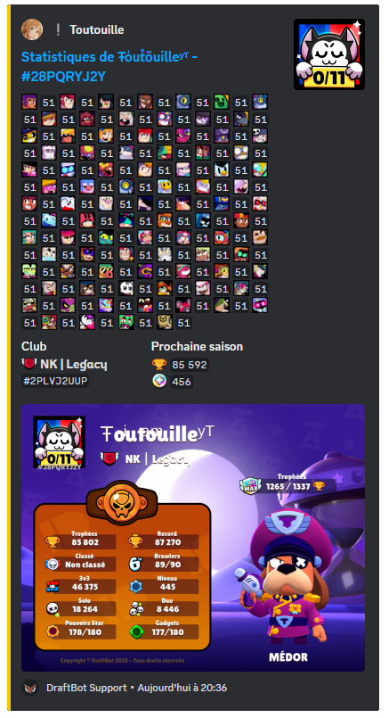

## Relier vos pseudo à DraftBot
Vous avez la possiblité de partager vos pseudos de jeux ainsi de consulter les pseudos des autres utilisateurs et votre profil avec la commande \</profil> puis mettez le pseudo du `membre`.

::tabs
  ::tab{ label="Via la commande /profiljeux" }
    Pour relier votre jeux à votre profil Discord, vous devez exécuter la commande \</profiljeux> puis de sélectionner votre `jeux`, votre `pseudo` ainsi que la `plateforme`.

    
  ::

  ::tab{ label="Via le panel" }
    Pour relier votre jeux à votre profil Discord, vous devez vous rendre sur [draftbot.fr](https://draftbot.fr) puis rendez-vous sur le [panel](https://draftbot.fr/dashboard) et allez dans [profil](/dashboard/user/profil).

    Par la suite, vous descendez vers le bas et vous pourrez lier vos jeux directement.
    
  ::
::

## Les différents type d'identifiant
Certains jeux ne demande pas de pseudo, mais des **identifiant** ou des **TAG**.

- Clash Of Clans : `TAG` (EX : #ABC123)
- Clash Royale : `TAG` (EX : #J8UOYV92C)
- CS:GO : `TAG` (EX : #AHKMX-F8TA)
- Brawl Stars `TAG` (EX : #GYCLLP0PU)
- Valorant `TAG` (EX : ls62#0069)
- Brawlhalla : `ID` (EX : draftman_dev)
    - Le

## Profil de jeux
Vous avez la possiblité de consulter les pseudos des autres utilisateurs et votre profil avec la commande \</profil> puis mettez le pseudo du `membre`.

## Statistiques des jeux

### /stats brawlhalla
Vous avez différents statistiques sur votre profil :
- Votre clan
- Votre Niveau
- Votre Rank
- Temps de jeu
- Parties
- Votre meilleure légendee
- Votre meilleure arme

### /stats brawlstars
Vous avez différents statistiques sur votre profil :
- Tous vos brawleurs
- Votre club
- Le nombre de trophés
- Le nombre de blings

### /stats clashofclans
Vous avez différents statistiqus sur votre profil :
- Le niveau de votre village
- Votre tag
- Votre clan
- Votre Clan
- Votre contributions capitale
- Votre préférence de guerre
- Vos étoiles de guerre
- Vos troupes données
- Vos troupes reçues
- Votre hôtel de Ville
    - Vos trophées
    - Vos meilleurs trophées
    - Vos attaques victorieuses
    - Vos défenses victorieuses
- Vos maisons ouvriers
    - Vos Trophées
    - Meilleurs trophées
- Vos héros
- Vos troupes
- Vos supers Troupes
- Vos troupes de la maison des ouvriers
- Vos sorts

### /stats clashroyale
Vous avez différents statistiqus sur votre profil :

### /stats osu
Vous avez différents statistiqus sur votre profil :
- Le nombre de parties
- Votre score classé
- Votre précision
- PP
- Vos différents count Ranks
- Votre temps de jeu au total 5 minutes
- Votre date d'inscription

### /stats paladins
Vous avez différents statistiqus sur votre profil :

### /stats wolfy
Vous avez différents statistiqus sur votre profil :

