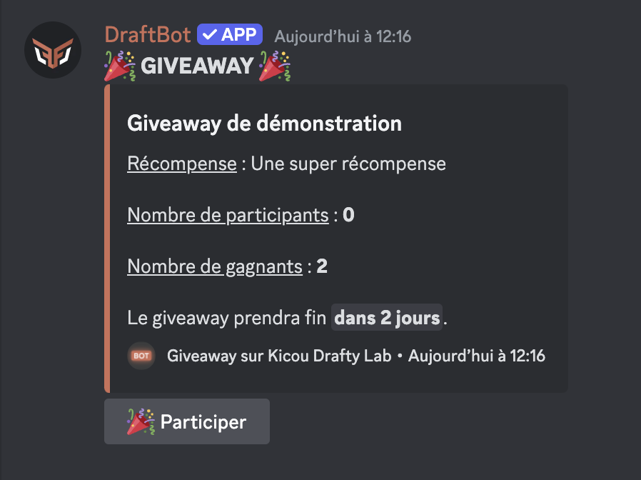

## Créer un giveaway

Vous pouvez créer un giveaway avec les commandes \</concours créer>. Il y a plusieurs types de giveaways en fonction de ce que vous voulez faire gagner :

- </concours créer expérience> ➜ Lancer un giveaway pour faire gagner de l'expérience (pour les [niveaux](https://www.draftbot.fr/docs/modules/niveaux){target=_blank}).
- </concours créer argent> ➜ Lancer un giveaway pour faire gagner de l'argent (voir le système d'[économie](https://www.draftbot.fr/docs/modules/economie){target=_blank}).
- </concours créer item> ➜ Lancer un giveaway pour faire gagner un objet d'inventaire (voir le système d'[inventaire](https://www.draftbot.fr/docs/modules/inventaire){target=_blank}).
- </concours créer rôle> ➜ Lancer un giveaway pour faire gagner un rôle. Option de temps
- </concours créer personnalisé> ➜ Lancer un giveaway pour faire gagner une récompense personnalisée.

::hint{ type="info" }
Dans chaque cas, vous devez définir le **nom** du giveaway, le **nombre de gagnants**, sa **durée** et éventuellement le **salon** où a lieu de giveaway (par défaut le salon où est la commande est faite).
::

## Gérer les giveaways

Une fois que vous avez créé un giveaway, vous pouvez le gérer avec plusieurs commandes :

- </concours participants> ➜ Voir les participants d'un giveaway.
- </concours terminer> ➜ Mettre fin à un giveaway.
- </concours relancer> ➜ Relancer un giveaway terminé pour désigner un nouveau gagnant.
