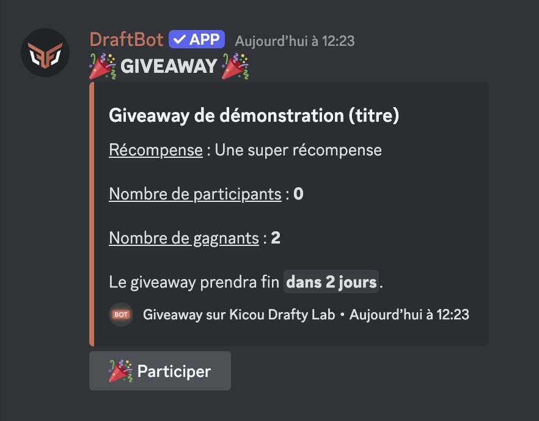

## Créer un giveaway

Vous pouvez créer un giveaway avec les commandes \</concours créer>. Suivant ce que vous voulez faire gagner, les commandes à faire sont :

- </concours créer expérience> ➜ Faire gagner de l'expérience (pour les [niveaux](https://www.draftbot.fr/docs/modules/niveaux){target=_blank}).
- </concours créer argent> ➜ Faire gagner de l'argent (voir le système d'[économie](https://www.draftbot.fr/docs/modules/economie){target=_blank}).
- </concours créer item> ➜ Faire gagner un objet d'inventaire (voir le système d'[inventaire](https://www.draftbot.fr/docs/modules/inventaire){target=_blank}).
- </concours créer rôle> ➜ Faire gagner un rôle. Option de temps
- </concours créer personnalisé> ➜ Faire gagner une récompense personnalisée.

::hint{ type="info" }
Dans chaque cas, vous devez définir le **nom** du giveaway, le **nombre de gagnants**, sa **durée** et éventuellement le **salon** où a lieu de giveaway (par défaut, celui où la commande est faite).
::

::hint{ type="success" }
Une fois le giveaway terminé, le créateur reçoit un message privé de <@DraftBot> l'informant du gagnant et lui rappelant la récompense.
::

## Gérer les giveaways

Une fois que vous avez créé un giveaway, vous pouvez le gérer avec plusieurs commandes :

- </concours participants> ➜ Voir les participants d'un giveaway.
- </concours terminer> ➜ Mettre fin à un giveaway.
- </concours relancer> ➜ Désigner un nouveau gagnant pour un giveaway terminé.

  ::hint{ type="warning" }
Les récompenses gagnées ne sont pas retirées aux anciens gagnants lorsque vous en désignez un nouveau.
::