## Présentation

La fonctionnalité de giveaways vous permet d'organiser des tirages au sort et d'offrir des récompenses aux membres de votre serveur qui y participent.

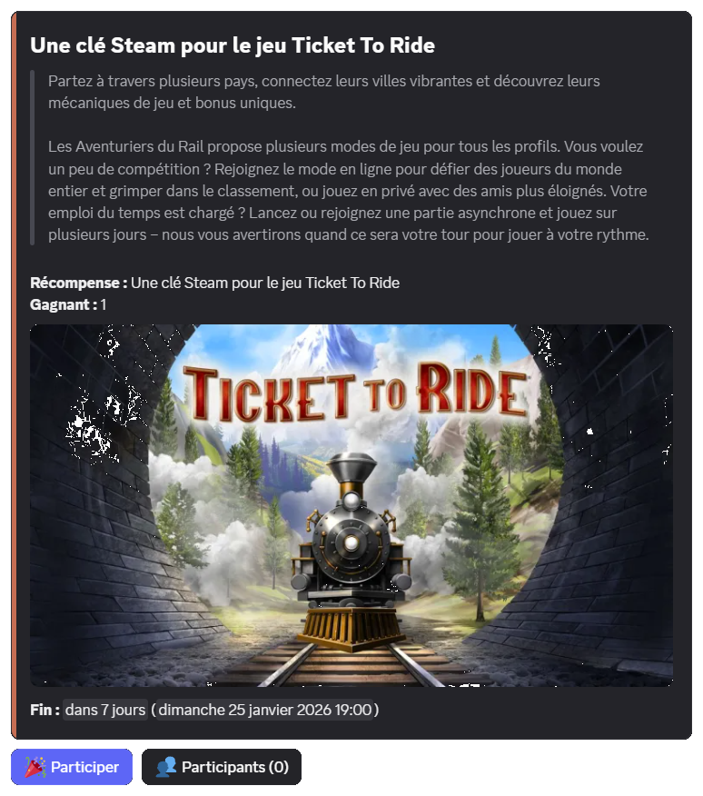

Pour chaque giveaway, vous pourrez offrir l'une de ces récompenses :
- De l'expérience dans le système de [niveaux](/docs/modules/niveaux).
- De l'argent dans le système d'[économie](/docs/modules/economie).
- Un objet provenant du système d'[inventaire](/docs/modules/inventaire).
- Un rôle (temporaire ou non).
- Une récompense personnalisée.

## Interagir avec un giveaway

### Participer

Vous pouvez participer à un giveaway en cours en cliquant sur le bouton "Participer" en dessous des détails de celui-ci.

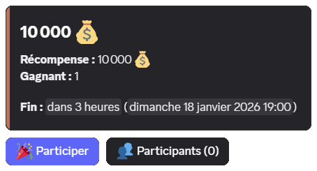

Votre participation est alors prise en compte pour le tirage au sort à la fin du giveaway.

::hint{ type="info" }
  Nous ne proposons pas actuellement de fonctionnalités permettant à un membre de participer plusieurs fois à un giveaway.

  Tous les participants d'un giveaway ont donc les mêmes chances de victoire.
::

### Se désinscrire

Si vous avez décidé de rejoindre un giveaway, mais que vous ne souhaitez plus y participer avant la fin de celui-ci, vous le pouvez en cliquant de nouveau sur le bouton "Participer".

Une confirmation est alors demandée, cliquez sur le bouton "Se désinscrire" pour confirmer.

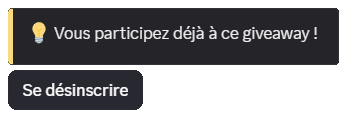

::hint{ type="warning" }
  Si une condition de collecte (rôle, argent ou objet) est définie sur le giveaway et que vous décidez de vous désinscrire, l'élément collecté ne vous sera pas restitué.
::

### Voir les participants

Si le créateur du giveaway l'a autorisé, vous pouvez voir la liste des participants en cliquant sur le bouton "Participants" du giveaway.

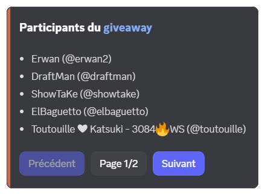

L'interface se découpe en pages suivant le nombre de participants. Vous pouvez alors cliquer sur les boutons "Précédent", "Suivant" ou choisir le numéro de page avec le bouton "Page".

::hint{ type="info" }
  Si vous êtes administrateur, vous avez aussi accès au bouton "Retirer" qui permet de supprimer la participation d'un membre. Plus d'informations dans la [partie dédiée](#retirer-un-participant).
::

## Accès à la commande /giveaway

La commande \</giveaway> nécessite la permission **Administrateur** par défaut.

Néanmoins, il est possible de donner accès à certains rôles ou personnes indépendamment de leurs permissions sur le serveur l'accès à cette commande.

Pour réaliser cela, vous pouvez retrouver plus d'informations sur cette page de la documentation :

::card
---
title: Gestion des permissions de commandes
icon: material-symbols:build
to: /docs/installation#configuration-des-commandes
target: _blank
color: '#cd6e57'
---
  Configurer les permissions des commandes Slash sur votre serveur.
::

## Créer un giveaway

Vous pouvez créer un giveaway en utilisant la commande \</giveaway créer>, en complétant les options de la commande :

| Option | Description | Obligatoire |
|--------|-------------|-------------|
| `récompense` | Le [type de récompense](#présentation). | ✅ Oui |
| `durée` | La durée du giveaway comprise entre une minute et un mois (ex : 2h, 7j) ou une date (ex : demain à 17h). | ✅ Oui |
| `gagnants` | Le nombre de gagnants compris entre 1 et 10 (jusqu'à 50 pour les serveurs [premium](/premium) <:icon_premium_:1096140508625125417>). | ✅ Oui |
| `titre` | Le titre du giveaway. | ❌ Non |
| `salon` | Le salon textuel où sera envoyé le giveaway. | ❌ Non (par défaut le salon de la commande) |

::hint{ type="info" }
  Vous pouvez lancer jusqu'à 3 giveaways en simultané. Les serveurs [premium](/premium) <:icon_premium_:1096140508625125417> n'ont pas de limite.
::

Une fois la commande \</giveaway créer> exécutée, la récompense du giveaway vous est demandée :

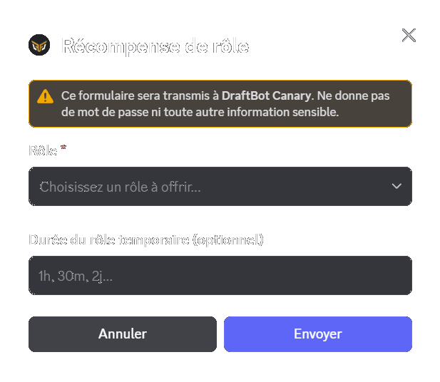

### Prévisualiser

Lorsque la récompense a été définie, une prévisualisation du giveaway vous est affichée. Elle vous permet de le configurer et de le modifier avant sa publication.

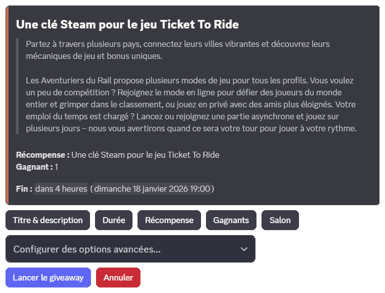

### Configurer les options

Depuis l'interface de prévisualisation, vous pouvez configurer des options à l'aide des boutons présents ainsi que du sélecteur "Configurer des options avancées...".

L'ensemble des options est détaillé dans la [partie dédiée](#options-dun-giveaway).

### Publier le giveaway

Lorsque vous souhaitez le publier, cliquez sur le bouton "Lancer le giveaway".

::hint{ type="info" }
  Une fois le giveaway terminé, le créateur reçoit un message privé de <@DraftBot> l'informant du gagnant et lui rappelant la récompense.
::

## Options d'un giveaway

### Titre et description

Vous pouvez définir un titre qui est utilisé dans le message du giveaway ainsi que dans les messages envoyés aux membres de l'équipe (ex : message de fin, logs, etc.).

::hint{ type="info" }
  Si le titre n'est pas défini, le nom de la récompense est utilisé pour nommer le giveaway.
::

Vous pouvez également définir une description pour décrire votre récompense aux participants.

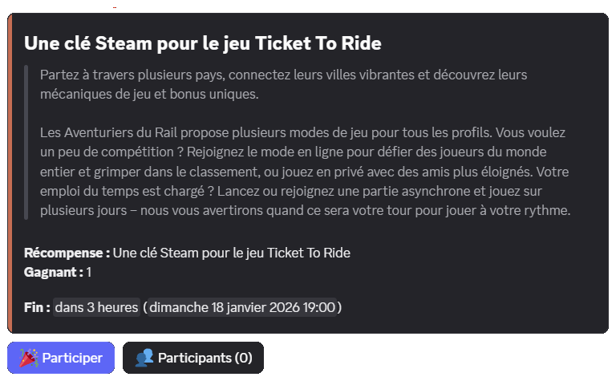

### Durée

La durée correspond au temps alloué aux membres pour participer à un giveaway.

Vous pouvez indiquer :
- soit une durée, comme `1h`, `7 jours` ou encore `2 semaines`
- soit une date, comme `demain à 20h` ou `20/01 à 10h`.

::hint{ type="info" }
  La durée du giveaway doit être comprise entre une minute et un mois.
::

### Récompense

Vous avez la possibilité de sélectionner l'une de ces récompense pour un giveaway :

- De l'expérience dans le système de [niveaux](/docs/modules/niveaux).
- De l'argent dans le système d'[économie](/docs/modules/economie).
- Un objet provenant du système d'[inventaire](/docs/modules/inventaire).
- Un rôle (temporaire ou non).
- Une récompense personnalisée.

### Gagnants

Vous devez définir le nombre de gagnants pour votre récompense.

::hint{ type="info" }
  Vous pouvez choisir jusqu'à 10 gagnants. Les serveurs [premium](/premium) <:icon_premium_:1096140508625125417> peuvent aller jusqu'à 50 gagnants.
::

### Salon

Vous devez définir un salon textuel pour envoyer le giveaway. Vous avez le choix d'utiliser un salon existant ou d'en créer un dédié.

::hint{ type="info" }
  Par défaut, le salon utilisé est celui où est exécutée la commande \</giveaway créer>.
::

#### Sélection d'un salon existant

Vous pouvez sélectionner un salon existant à l'aide du sélecteur de salon.

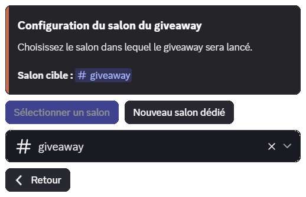

::hint{ type="warning" }
  Le créateur du giveaway et <@DraftBot> doivent disposer des permissions **Envoyer des messages** et **Voir le salon**. <@DraftBot> doit également disposer de la permission **Intégrer des liens**.
::

#### Création d'un salon lors de la publication

::hint{ type="warning" }
  Vous devez disposer de la permission **Gérer les salons** pour créer un salon de cette manière.
::

Vous pouvez demander à <@DraftBot> la création d'un salon dédié lors de la publication en cliquant sur le bouton "Nouveau salon dédié". Vous pouvez alors définir un nom personnalisé et sa catégorie.

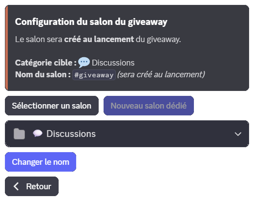

### Organisateur

L'organisateur permet de signaler aux participants quel membre offre la récompense.

::hint{ type="warning" }
  L'organisateur doit être présent sur le serveur au moment de la configuration pour être sélectionné.
::

::hint{ type="info" }
  Le pseudo de l'organisateur est uniquement affiché sur le message et n'a pas d'autre effet sur le giveaway.
::

### Condition

Vous pouvez définir une condition d'accès pour participer au giveaway :

| Condition | Description |
|-----------|-------------|
| [Objet](/docs/modules/inventaire) | Posséder un objet, avec possibilité de le retirer. |
| [Niveau](/docs/modules/niveaux) | Niveau compris entre un seuil minimum ou maximum. |
| [Argent](/docs/modules/economie) | Quantité d'argent minimum ou maximum, avec possibilité de faire payer la somme. |
| Rôles | Posséder (ou non) un ou plusieurs rôle(s), avec possibilité de les retirer. |

::hint{ type="warning" }
  En cas de retrait d'un élément (objet, niveau ou rôles) pour participer, celui-ci ne sera pas restitué en cas de [désinscription](#se-désinscrire) ou si le membre ne gagne pas le giveaway.
::

### Images

Vous pouvez ajouter une vignette ainsi qu'une image principale à votre giveaway pour l'égayer.

### Mentions

Vous pouvez définir des rôles à notifier lors de la publication du giveaway.

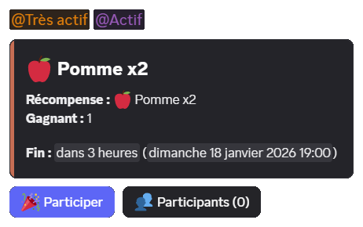

::hint{ type="info" }
  - Vous pouvez définir jusqu'à **10** rôles mentionnés.
  - Sans la permission **Mentionner @everyone, @here et tous les rôles**, vous ne pouvez mentionner que les rôles pouvant être mentionnés par tous les membres.
::

### Couleur

::hint{ type="info" }
  Cette option est réservée aux serveurs [premium](/premium) <:icon_premium_:1096140508625125417>.
::

Vous pouvez configurer la couleur latérale de l'embed pour correspondre à la charte de votre serveur ou de la récompense.

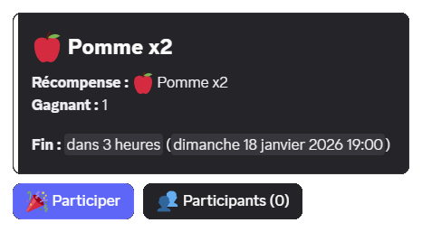

### Bouton Participants

Le bouton "Participants", activé par défaut, permet aux membres de [consulter la liste des participants](#voir-les-participants).

Il est possible de retirer ce bouton. Les membres ne verront alors que le nombre total de participants.

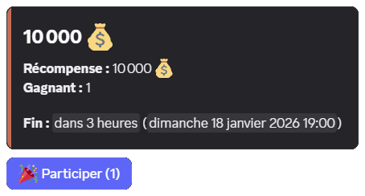

::hint{ type="info" }
  Les administrateurs du serveur pourront toujours voir la liste des participants avec la commande \</giveaway participants>.
::

## Gérer un giveaway existant

### Arrêter un giveaway

Vous pouvez arrêter un giveaway avant sa fin initiale avec la commande \</giveaway terminer>, en indiquant l'[identifiant](/docs/autres/recuperer-un-identifiant#identifiant-dun-message) ou le lien du message.

Le tirage au sort aura alors lieu immédiatement et le ou les gagnants seront annoncés dans le salon du giveaway.

### Relancer un giveaway

Pour désigner un nouveau gagnant sur un giveaway terminé, vous pouvez utilisez la commande \</giveaway relancer>, en indiquant l'[identifiant](/docs/autres/recuperer-un-identifiant#identifiant-dun-message) ou le lien du message du giveaway.

::hint{ type="info" }
  Vous pouvez remplacer un gagnant spécifique en utilisant l'option `gagnant` de la commande.
::

::hint{ type="warning" }
  Les récompenses déjà distribuées ne sont pas retirées automatiquement aux anciens gagnants.
::

### Retirer un participant

Vous pouvez retirer un participant d'un giveaway avec la commande \</giveaway participants> ou le bouton "Participants" (si activé), puis cliquez sur "Retirer un participant".

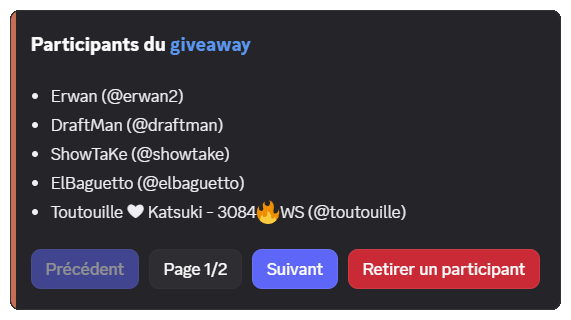

::hint{ type="info" }
  Le membre retiré ne reçoit pas de notification, mais il conserve la possibilité de s'inscrire à nouveau avant la fin du tirage.
::