## Créer un message

Vous pouvez créer un message sur le panel en [**`cliquant ici`**](/dashboard/first/messages).

Le panel vous offre la possibilité de créer et envoyer des messages 100% personnalisables en fonction de vos besoins.

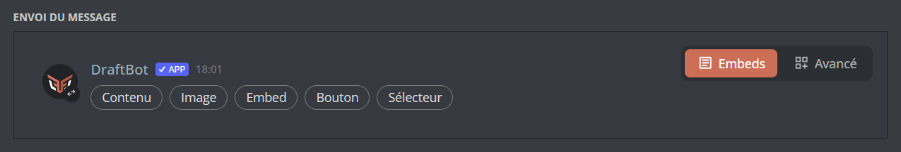

En haut de l'éditeur, vous choisissez d'abord le **format** de votre message :
- **Embeds :** le format classique, décrit ci-dessous. Vous composez votre message avec du contenu, des embeds, des images, des boutons et des sélecteurs.
- **Avancé :** un format plus flexible, basé sur les composants V2 de Discord, détaillé dans la section [Le mode Avancé](#le-mode-avancé).

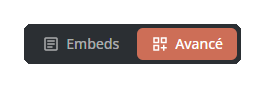

::hint{ type="warning" }
  Changer de format réinitialise le contenu en cours de rédaction. Cette action est irréversible ; une confirmation vous est demandée dès qu'il y a du contenu à perdre.
::

Pour le format **Embeds**, vous intégrez du texte, des images ou du contenu à l'aide des boutons `Contenu`, `Image` et `Embed`.

::hint{ type="info"}
  Les boutons `Bouton` et `Sélecteur` permettent de créer une expérience interactive pour vos membres. Pour en savoir plus sur leur fonctionnement, rendez-vous dans la partie [interactions](#interactions) !
::

### Contenu
En appuyant sur le bouton **Contenu** vous pourrez rédiger un message classique avec **DraftBot**. Vous pouvez y intégrer des émojis natifs ou ceux de votre serveur Discord.

Vous pouvez générer des horaires dynamiques ([timestamp](docs/autres/timestamp)) facilement avec le bouton <:editor_timestamp:1520828760524591154>. Ces horaires s'adapteront automatiquement aux fuseaux horaires des utilisateurs de votre serveur.

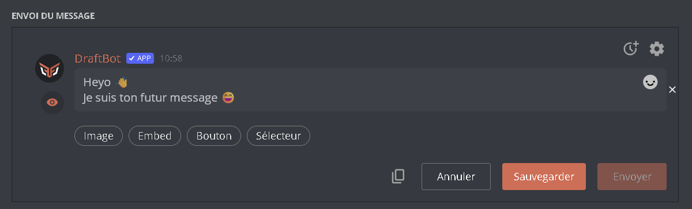

::hint{ type="info" }
  En raison de restrictions imposées par Discord, le contenu est limité à 2000 caractères.
::

### Une auto-complétion plus riche

En tapant un caractère déclencheur dans n'importe quel champ de texte, **DraftBot** vous propose une liste intelligente :
- `#` vos **salons**.
- `@` vos **rôles** et vos **membres**.
- `/` les **commandes** du bot, insérées en mention cliquable.
- `:` les **émojis**, personnalisés du serveur comme natifs.
- `{` les **variables** dynamiques.

::hint{ type="info" }
  L'auto-complétion fonctionne dans tous les champs de texte du panel : Contenu, Embed, Texte.
::

### Ajouter une image

En appuyant sur le bouton **Image** vous pourrez alors ajouter une image directement dans votre message. En cliquant dessus, vous pourrez choisir d'importer une image depuis votre appareil, ou depuis un lien.

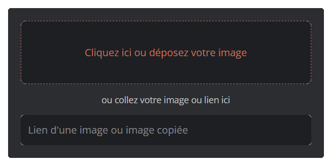

Pour chaque image, deux options sont disponibles :
- **Description (texte alternatif) :** un texte qui décrit l'image. Il améliore l'accessibilité (lecteurs d'écran) et s'affiche si l'image ne peut pas être chargée. La description est limitée à `1024` caractères.
- **Spoiler :** masque l'image derrière un voile. Vos membres devront cliquer dessus pour la révéler.

Vous pouvez aussi regrouper plusieurs images dans une **galerie**, jusqu'à `10` images : Discord les affiche alors côte à côte sous forme de grille.

### Embed

En appuyant sur le bouton **Embed** vous pourrez rédiger un message détaillé regroupant plusieurs informations.

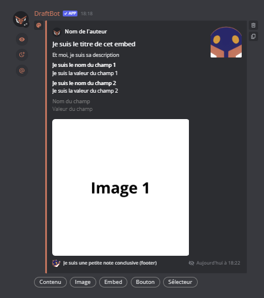

Voici la signification de chaque zone de texte :
- **Nom de l'auteur :** Vous pouvez y insérer du texte pour présenter l'auteur, votre pseudonyme ou le nom de votre serveur.
- **Titre :** Vous pouvez insérer le titre de votre embed. Vous pourrez également ajouter un lien facilement via le bouton <:title_link:1389707183377088572> qui apparaît lorsque vous écrivez.
- **Description :** C'est ici que vous pouvez mettre le corps de votre message. Le [Markdown Discord](docs/autres/markdown) (**gras**, *italique*, etc.) est utilisable dans cette zone.

::hint{ type="info" }
  Vous pouvez mettre jusqu'à `4096` caractères dans la description.
::
- **Champs :** Vous pouvez insérer ici plusieurs zones de texte organisées (titre et contenu). Les blocs "champs" sont séparés les uns des autres par un interligne plus grand.
    - **Nom du champ :** Le texte qui sera dans cette zone apparaîtra en **gras**.
    - **Valeur du champ :** Il s'agit d'une zone de texte, vous pouvez la remplir comme vous le souhaitez.

    ::hint{ type="info" }
      Le nombre de champs est limité à `25` par embed. La partie "Valeur" d'un champ peut contenir jusqu'à `1024` caractères.

      Vous pouvez aussi réorganiser l'ordre de vos champs et l'alignement (verticalement ou horizontalement) en cliquant sur le bouton <:inline:1389707180994990172> qui apparaît lorsque vous remplissez un champ.
    ::
- **Footer :** Vous pouvez rajouter un texte pour conclure votre message. Il s'affichera en tout petit, en bas de votre embed.
- **Horodatage :** en appuyant sur le bouton <:timestamp_eye:1389707185088499712> vous pouvez choisir si l'heure d'envoi du message doit apparaître en bas de l'embed ou non.
- **Images :** Les encadrés oranges sont des zones disponibles pour y insérer une image. En cliquant dessus, vous pourrez choisir d'importer une image depuis votre appareil, ou depuis un lien. Un embed peut afficher jusqu'à `4` images sous forme de galerie.

::hint{ type="danger" }
  Votre message dans sa globalité ne peut pas contenir plus de `6 000` caractères.
::
Plusieurs boutons sont situés à droite et à gauche de l'éditeur d'embed :
- <:editor_color:1520826844495085760> : Vous permet de changer la couleur de la barre à gauche de l'embed. Vous pouvez aussi choisir **Aucune couleur** : dans ce cas, Discord applique automatiquement une couleur adaptée au thème (clair ou sombre) de chaque personne qui lit le message.
- <:editor_duplicate:1520826881530790059> : Vous permet de dupliquer facilement votre embed. Le double ainsi créé s'affichera juste en dessous du premier.
- <:editor_delete:1520826862459420774> : Vous permet de supprimer l'embed associé.

::hint{ type="warning" }
  La suppression d'un embed est irréversible.
::

### Mentions

Lorsque votre message contient des mentions (un membre, un rôle, `@everyone` ou `@here`), le bouton **Mentions** vous permet de contrôler précisément qui sera réellement notifié. C'est pratique pour écrire une mention sans pour autant envoyer une notification à tout le monde.

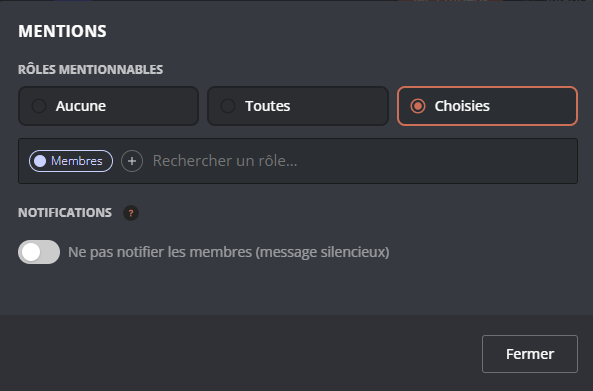

::hint{ type="info" }
  Seules les mentions déjà présentes dans le texte de votre message apparaissent dans ce menu. Ce réglage ne sert pas à ajouter des mentions, mais à décider lesquelles déclenchent une notification.
::

Pour les rôles comme pour les membres, vous avez le choix entre trois modes :
- **Aucune :** la mention est affichée mais ne notifie personne.
- **Toutes :** toutes les mentions de ce type notifient les personnes concernées.
- **Choisies :** vous sélectionnez précisément quels rôles ou quels membres seront notifiés.

Vous disposez également de deux options :
- **Autoriser `@everyone` et `@here` :** à activer si vous souhaitez que ces mentions globales notifient les membres.
- **Message silencieux :** le message est envoyé sans notification (ni son, ni notification push). Les membres voient seulement un badge de message non lu, même s'ils sont mentionnés.

::hint{ type="info" }
  Les mentions placées dans un embed ne déclenchent jamais de notification, quel que soit ce réglage.
::

### Envoyer votre message

Pour envoyer votre message après l'avoir rédigé sur le panel, vous devrez choisir un salon d'envoi en haut de la page puis cliquer sur le bouton `Envoyer`.

Votre message a été envoyé selon vos paramétrages.

::hint{ type="info" }
  Vous pouvez modifier votre message si vous avez oublié un élément.
::

### Récupérer un message

Vous pouvez récupérer un message en appuyant sur le bouton orange `Récupérer un message` situé en haut à droite de la page. Un menu apparaîtra alors pour retrouver le message via l'identifiant du message et son salon d'origine. Vous pouvez également retrouver le message via le lien du message.
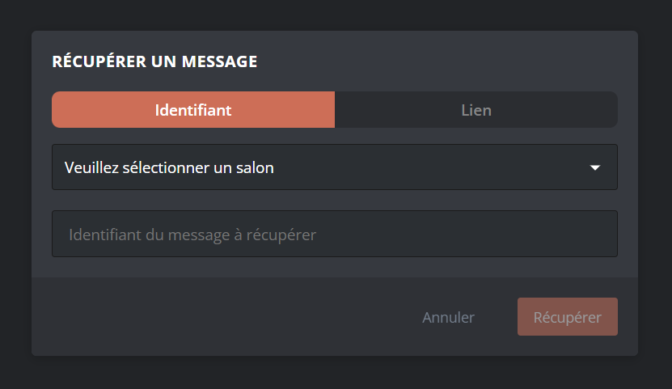

::hint{ type="warning" }
  Vous ne pouvez pas récupérer un message supprimé du salon.
::

Un message envoyé au format **Avancé** se rouvre directement dans l'éditeur **Avancé** : si l'éditeur est en mode Embeds au moment de la récupération, il bascule automatiquement. Vous pourrez le modifier, mais Discord ne permet pas de le reconvertir au format Embeds.

Une fois votre message récupéré, vous pourrez le modifier à votre guise.

## Le mode Avancé

Le mode **Avancé** (basé sur les composants V2 de Discord) est un format de message disponible depuis l'[éditeur du panel](/dashboard/first/messages). Au lieu de la structure figée des embeds, il vous propose un système de **blocs** que vous assemblez et réorganisez librement : vous empilez du texte, des images, des séparateurs, des boutons et des sélecteurs dans l'ordre de votre choix, et vous pouvez les regrouper dans des conteneurs colorés.

Ce format est tout indiqué lorsque le format Embeds vous bride : pour une mise en page libre, plusieurs galeries d'images, ou des blocs associant un texte à une vignette ou à un bouton.

Pour l'activer, utilisez le sélecteur de format en haut de l'éditeur et choisissez **Avancé**.

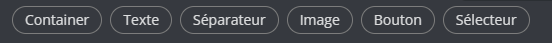

::hint{ type="warning" }
  Basculer entre **Embeds** et **Avancé** réinitialise le contenu en cours : cette action est irréversible. Une confirmation vous est demandée dès qu'il y a du contenu à perdre.
::

::hint{ type="danger" }
  Discord ne permet pas de reconvertir au format classique un message déjà envoyé en mode **Avancé**. Concrètement :
  - un message envoyé en **Embeds** puis modifié en **Avancé** est converti définitivement : vous ne pourrez plus le repasser en Embeds ;
  - un message envoyé en **Avancé** ne peut être modifié qu'en **Avancé**. Si vous repassez l'éditeur en **Embeds**, l'envoi créera un nouveau message au lieu de modifier l'ancien.
::

Comme au format Embeds, le bouton **Mentions** reste disponible en mode Avancé : vous contrôlez qui est notifié et pouvez envoyer un message silencieux (voir [Mentions](#mentions)).

Une barre de boutons vous permet d'ajouter les blocs suivants à votre message :

::hint{ type="info" }
  Tous les blocs se réorganisent par glisser-déposer (y compris dans ou hors d'un conteneur) et peuvent être dupliqués ou supprimés. Un message ne peut pas dépasser `40` composants.
::

### Texte

Un bloc de texte simple. Le [Markdown Discord](docs/autres/markdown) (**gras**, *italique*, etc.), les émojis et les [timestamps](docs/autres/timestamp) y sont utilisables. Vous pouvez ajouter plusieurs blocs de texte dans un même message.

Depuis un bloc de texte, vous pouvez aussi ajouter une **image** (sous forme de vignette) ou un **bouton** à sa droite.

### Images

Ajoute une ou plusieurs images sous forme de **galerie**, disposées automatiquement en grille. Une galerie peut contenir jusqu'à `10` images. Comme dans le mode Embeds, chaque image peut recevoir une **description** (texte alternatif, `1024` caractères maximum) et être marquée comme **spoiler**.

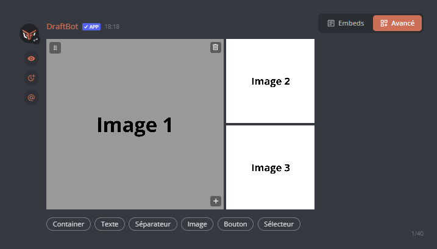

### Séparateur

Insère un espace entre deux blocs pour aérer votre message. Vous pouvez :
- afficher ou masquer le **trait** de séparation ;
- choisir un espacement **large** ou **compact**.

### Conteneur

Le conteneur (bouton **Container**) regroupe plusieurs blocs (texte, images, séparateurs, boutons...) à l'intérieur d'un cadre, à la manière d'un embed. Vous pouvez lui donner une **couleur d'accentuation** (la barre colorée à gauche) ou n'en mettre aucune, et masquer l'ensemble de son contenu derrière un **spoiler**.

::hint{ type="info" }
  Un conteneur ne peut pas en contenir un autre.
::

### Bouton et Sélecteur

Les **boutons** et **sélecteurs** déclenchent les mêmes [actions](#actions-possibles) que dans le mode Embeds. Vous pouvez les disposer en **rangées** : une rangée accepte jusqu'à `5` boutons, tandis qu'un sélecteur occupe une rangée à lui seul.

## Interactions

Vous avez la possibilité de créer des **boutons** et **sélecteurs** que les membres de votre serveur peuvent utiliser. Ces boutons et sélecteurs entraînent des actions que vous aurez préalablement programmées (ajouter des rôles, envoyer un message ou interagir avec des fonctionnalités de **DraftBot**). Vous pouvez également définir des conditions pour certaines interactions. Ils fonctionnent aussi bien dans le format **Embeds** que dans le mode **Avancé**.

::hint{ type="warning" }
  Pour qu'un message comportant une (ou plusieurs) interaction(s) fonctionne, il est **nécessaire** de l'enregistrer sur le panel.
::

::hint{ type="info" }
  Vous pouvez sauvegarder jusqu'à 5 messages sur le panel. Sur les serveurs [premium](/premium) <:icon_premium:1096140508625125417>, cette limite passe à **200**.
::

### Boutons interactifs

DraftBot vous permet de rendre vos messages interactifs grâce à des boutons et des sélecteurs que les membres de votre serveur peuvent utiliser. Ces boutons et sélecteurs permettent de déclencher les actions que vous aurez précédemment définies.

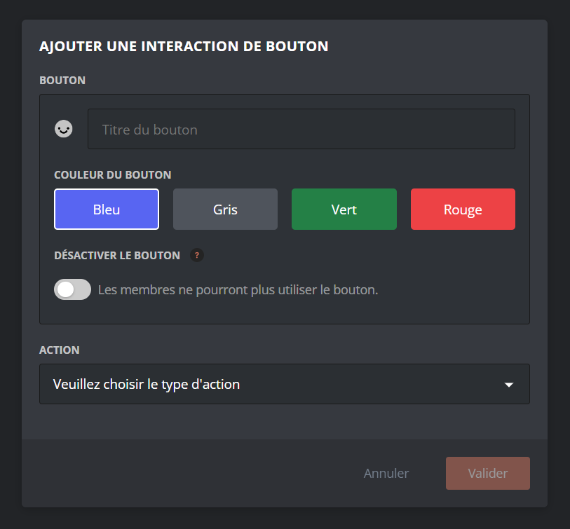

Ce menu vous permet de configurer :
- Le **nom** du bouton (il sera affiché sur le bouton, et visible par tous) ;
- Un **émoji** de votre choix, qui s'affichera sur le bouton, à gauche du nom. Les émojis de votre serveur sont acceptés, y compris les émojis animés !
- La **couleur** du bouton : vous avez le choix entre le bleu, le gris, le vert ou le rouge ;
- L'[**action**](#actions-possibles) qui sera déclenchée lorsqu'un utilisateur cliquera sur le bouton.

### Sélecteurs interactifs
Un sélecteur est un bouton affichant un menu déroulant lorsqu'on clique dessus. Chaque ligne de ce menu peut déclencher une action distincte.

Pour créer un sélecteur interactif, il faut cliquer sur le bouton intitulé `Sélecteur`. Vous pouvez définir le texte qui sera affiché sur votre sélecteur (par défaut : "*Choisissez une option*"). Ensuite, vous avez le choix entre deux modes de sélecteur :
- **Mode simple** : toutes les options du sélecteur déclenchent le même type d'action parmi :
    - Envoi de messages éphémères
    - Ajout et retrait de rôles
    - Ouverture de tickets
    - Achat d'articles de boutique
- **Mode avancé** : vous pouvez configurer un type d'action différent pour chaque option du sélecteur, parmi :
    - Envoyer un nouveau message
    - Envoyer un message sauvegardé
    - Ajouter et retirer des rôles
    - Ouvrir un ticket
    - Acheter un article
    - Proposer une suggestion

    ::hint{ type="info" }
      Le **mode simple** est idéal pour permettre plusieurs choix dans une même action, par exemple *sélectionner un rôle à obtenir parmi une liste*.
      Le **mode avancé** est idéal pour les messages nécessitant de pouvoir faire plusieurs choses différentes depuis le même endroit, par exemple *choisir un rôle OU afficher un message éphémère pour plus d'informations*.
    ::

### Actions possibles

Voici les différentes actions que vous pouvez associer à un bouton ou à une option de sélecteur.

    ::hint{ type="info" }
      La plupart des interactions disponibles peuvent être restreintes pour ne fonctionner que sous certaines conditions. Par exemple, vous pouvez choisir de réserver l'emploi d'une action exclusivement aux membres possédant un certain rôle.
    ::

#### Envoyer un nouveau message
Cette action permet d'envoyer un nouveau message de manière automatique via **DraftBot**.
Dans le menu "Type de cible", vous pouvez choisir la manière dont le message sera envoyé :
- **Réponse cachée au message** : message éphémère visible uniquement par l'utilisateur qui a déclenché l'action.
- **Dans un salon** : DraftBot postera alors le message dans le salon de votre choix. (vous devez choisir le salon cible dans la section "Salon d'envoi du message").
- **Message privé** : DraftBot enverra alors le message directement à l'utilisateur, dans ses messages privés.

Une fois votre choix fait, vous pouvez créer votre message en utilisant l'éditeur inclus directement dans le menu de configuration du sélecteur :
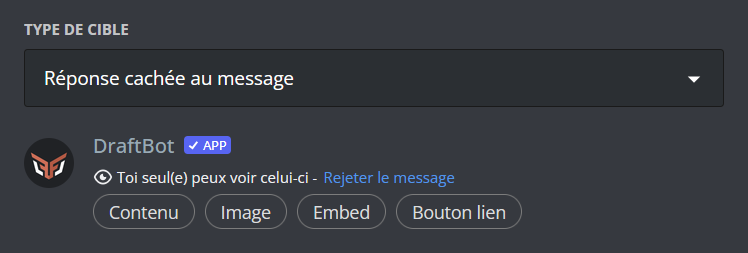

#### Envoyer un message sauvegardé
Si vous avez déjà rédigé et sauvegardé un message, cette action permet de l'envoyer lorsque le bouton est cliqué. Une fois le message sélectionné, vous pouvez définir comment l'envoyer ("réponse cachée", "dans un salon" ou "message privé").

#### Ajouter et retirer des rôles
Avec cette action, vous pouvez permettre aux utilisateurs de s'attribuer ou se retirer des rôles de manière autonome par simple interaction avec le message. DraftBot vous donne le choix entre plusieurs styles de fonctionnement pour cette action :
- **Classique :** Quand l'utilisateur clique sur le bouton, **DraftBot** lui donne le rôle correspondant, ou le lui retire s'il le possède déjà.
- **Fixe :** Quand l'utilisateur clique sur le bouton, DraftBot lui donne le rôle correspondant, mais une fois le rôle obtenu, cliquer de nouveau sur ce bouton ne le retirera pas.

::hint{ type="info" }
  Cette option est particulièrement adaptée pour les situations dans lesquelles vous ne souhaitez pas permettre aux membres de changer d'avis.
::
- **Unique :** L'utilisateur ne peut avoir qu'un seul rôle parmi ceux proposés par le message. S'il choisit un autre bouton qui donne un autre rôle, son précédent rôle lui sera retiré.

Vous devez ensuite définir quels sont les rôles à donner ou retirer (vous devez en définir au moins un). Une case à cocher vous permet de définir si le rôle doit être appliqué temporairement ou non. Si le rôle est temporaire, vous devrez définir la durée pendant laquelle l'utilisateur conservera son rôle avant qu'il lui soit automatiquement retiré.

#### Ouvrir un ticket
Cette action permet aux utilisateurs d'ouvrir un [ticket](/docs/modules/tickets) facilement.

Vous pouvez définir si vous souhaitez que le ticket soit envoyé avec un motif prédéfini par vos soins, ou si vous souhaitez laisser l'utilisateur écrire lui-même le motif d'ouverture.

::hint{ type="success" }
  Si vous utilisez cette action dans un sélecteur, vous pouvez par exemple proposer plusieurs choix prédéfinis de motifs.
::

#### Acheter un article
Cette option a pour effet, lorsqu’elle est déclenchée par le bouton, de faire immédiatement acheter un article de [boutique](/docs/modules/economie#la-boutique) prédéfini à l'utilisateur. Pour cela, vous devez définir l’article à faire acheter. Il sera acheté au prix défini dans le module [Boutique](/docs/modules/economie#la-boutique).

::hint{ type="warning" }
  Lorsqu’un utilisateur clique sur ce bouton, DraftBot exécutera l'achat immédiatement si l'utilisateur possède la somme nécessaire. Aucune confirmation ne sera demandée au préalable.
::

#### Proposer une suggestion
Grâce à cette action, DraftBot vous permet de faciliter l'accès aux [suggestions](docs/modules/suggestions) d'un simple clic sur un bouton. Vous pouvez choisir si l’interaction sur ce bouton ouvre le menu principal des suggestions de l'utilisateur, ou directement le formulaire de création d’une nouvelle suggestion.

#### Rediriger vers un lien
Cette action permet de rediriger l’utilisateur vers l’URL de votre choix lorsqu’il clique sur le bouton.

::hint{ type="info" }
  Vous ne pouvez pas choisir la couleur du bouton. Celui-ci sera obligatoirement de couleur grise.

  Cette action est disponible uniquement sur les boutons.
::

## Profils de messages

Un profil de message est un utilisateur fictif à part entière avec lequel il vous sera possible d'envoyer des messages.

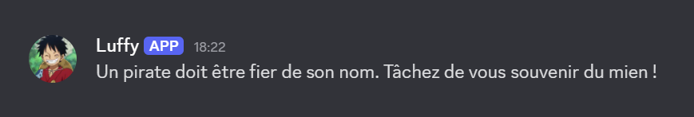

Vous pouvez accéder aux profils en cliquant sur la photo de profil de DraftBot.
Une fois dans le menu, la création de nouveaux profils sera possible depuis le bouton <:edit:1389714236418298017>.
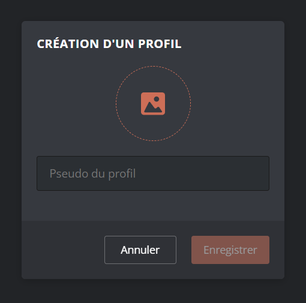
Vous pourrez alors importer une photo de profil ou fournir le lien d'une image. Vous devrez aussi ajouter un pseudo.

Une fois votre profil créé, celui-ci sera utilisable dans la conception de vos messages, que ce soit via le panel ou les commandes \</envoyer> ou \</embed>.

::hint{ type="info" }
  Petite astuce :bulb: : Vous pouvez trouver le lien vers la photo de profil d'un serveur en utilisant la commande \</info serveur> ou \</avatar> pour un membre.
::

## Envoyer via une commande

En plus du panel, deux commandes vous permettent d'envoyer un message directement depuis Discord, sans ouvrir le dashboard. Ces commandes utilisent le format **Embeds** classique.

### La commande /envoyer

Avec cette commande, vous avez la possibilité d'envoyer un message rapidement dans un salon de votre serveur. Pour l'utiliser, vous devez posséder la permission **Administrateur** ou une dérogation d'utilisation de la commande.
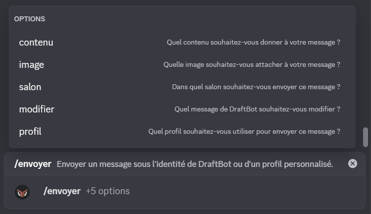
Voici ce que signifient ces paramètres :
- **Contenu** : Le texte à faire dire à DraftBot, sous forme de message classique.
- **Image :** Vous pouvez joindre une image à votre message.
- **Salon :** Dans quel salon **DraftBot** devra-t-il envoyer le message ? Laissez vide si c'est le même salon que celui depuis lequel vous lancez la commande.
- **Modifier :** Si vous souhaitez modifier un message, utilisez ce champ supplémentaire en y incluant le lien du message à modifier.

### La commande /embed

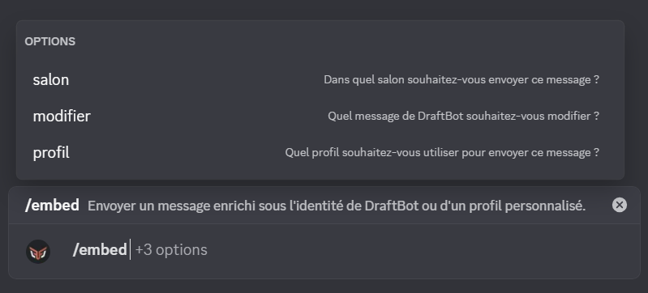
Voici ce que signifient ces paramètres :
- **Salon :** Dans quel salon **DraftBot** devra-t-il envoyer le message ? Laissez vide si c'est le même salon que celui depuis lequel vous lancez la commande.

- **Modifier :** Si vous souhaitez modifier un message, utilisez ce champ supplémentaire en y incluant le lien du message à modifier.
Une fois la commande lancée, un menu va apparaître. C'est dans ce menu que vous allez devoir rédiger votre message.
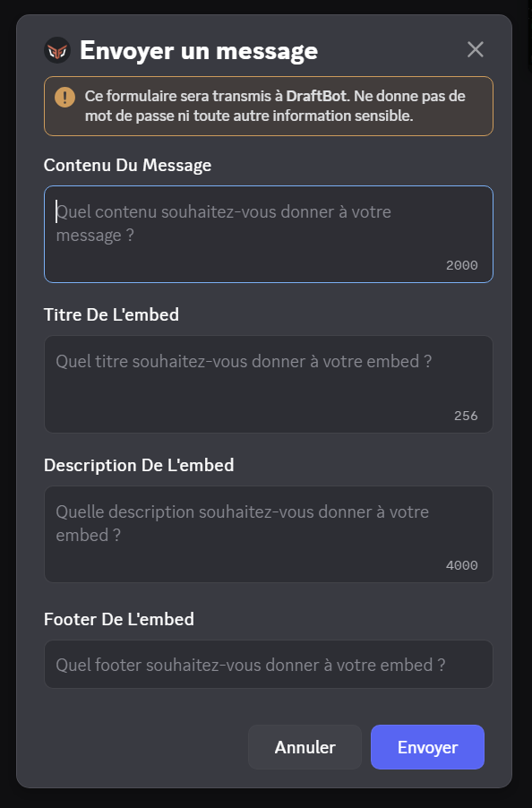
Chaque zone de texte correspond à un type de contenu :
- **Contenu :** Le texte de **DraftBot** apparaîtra sous forme de message classique.
- **Titre de l'embed :** Ce sera le titre de votre embed.
- **Description de l'embed :** Le texte de votre embed devra être placé ici.
- **Footer de l'embed :** Vous pouvez ajouter un petit texte en bas de votre embed.

::hint{ type="info" }
  La plupart des interactions disponibles peuvent être restreintes pour ne fonctionner que sous certaines conditions. Par exemple, vous pouvez choisir de réserver l'emploi d'une action exclusivement aux membres possédant un certain rôle.

  La suppression de l'embed est irréversible : Si vous rappuyez de nouveau sur le bouton `Embed` après suppression, un nouvel embed **vide** apparaîtra.
::
Une fois votre choix fait, vous pouvez créer votre message en utilisant l'éditeur inclus directement dans le menu de configuration du sélecteur.
