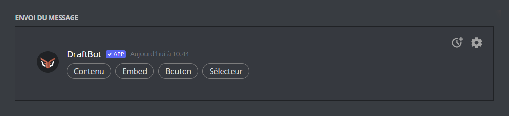
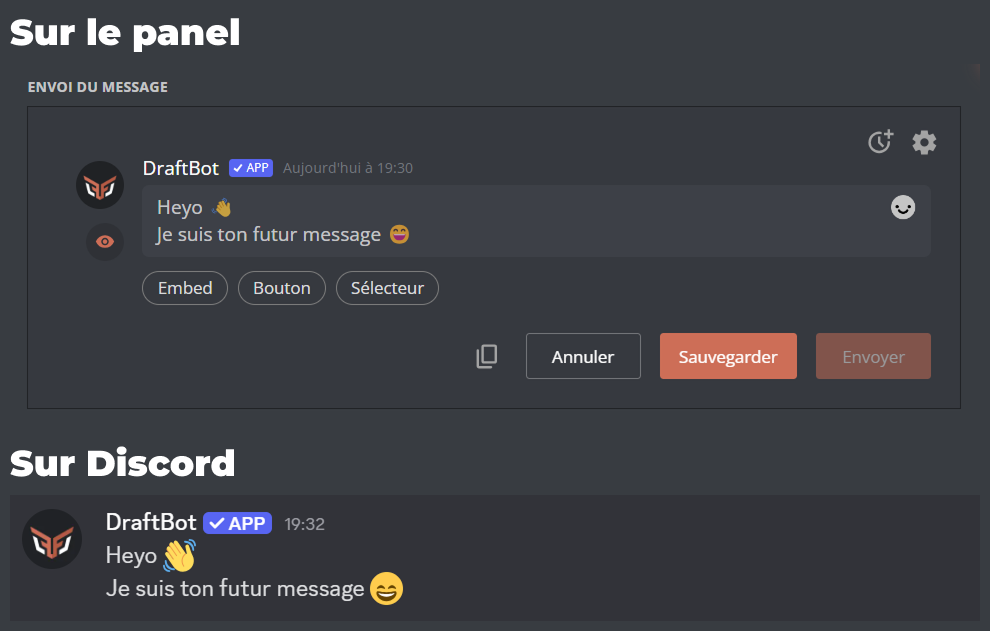
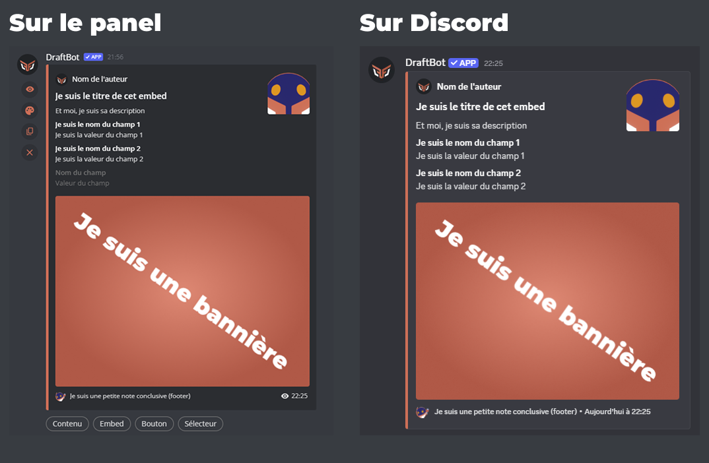
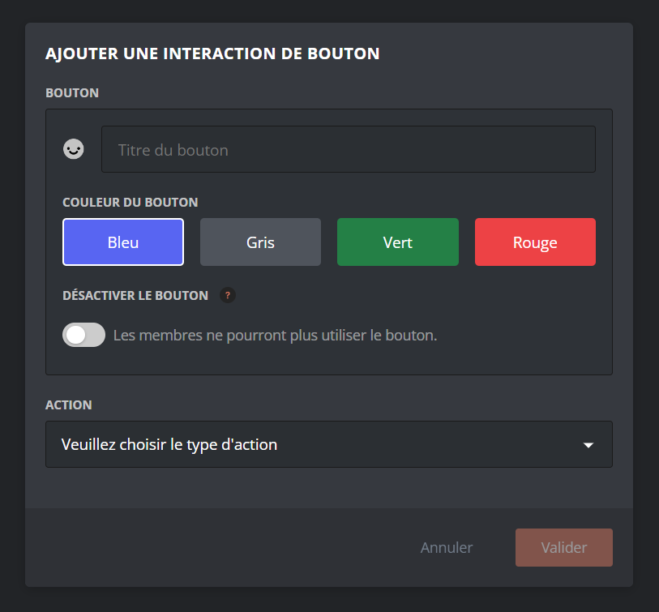
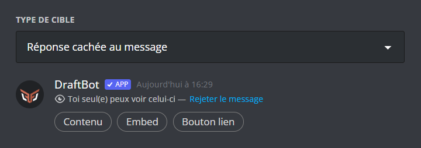
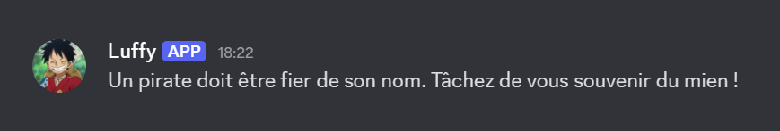
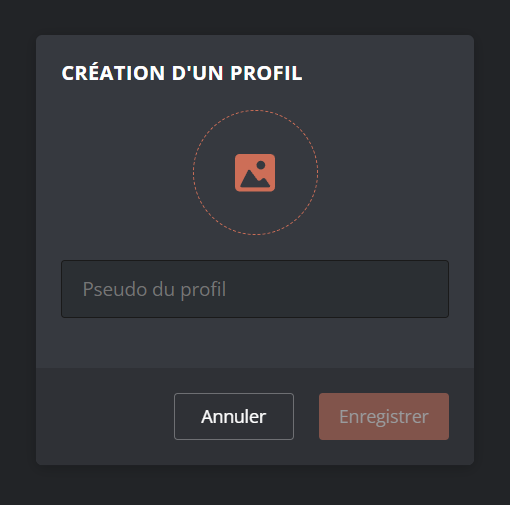

## Envoyer des messages avec le panel

La page [**Messages**](/dashboard/first/messages) du panel vous offre la possibilité de créer et envoyer des messages 100% personnalisables en fonction de vos besoins.

Si vous souhaitez intégrer du texte, des images, du contenu dans votre message, il faut utiliser les boutons `Contenu` et `Embed`.

::hint{ type="info"}
  Les boutons `Bouton` et `Sélecteur` permettent de créer une expérience interactive pour vos membres, pour en savoir plus sur leur fonctionnement, rendez-vous dans la partie [Créer des interactions](#créer-des-interactions) !
::

### Contenu
En appuyant sur le bouton **Contenu** vous pourrez rédiger un message classique avec **DraftBot**. Vous pouvez y intégrer des émojis natifs ou bien ceux de votre serveur Discord.

Vous pouvez génerez du timestamp facilement avec le bouton <:timestamp:1389707186619285634>.

::hint{ type="info" }
  Vous pouvez mettre jusqu'à 2 000 caractères dans votre contenu.
::

### Embed

En appuyant sur le bouton **Embed** vous pourrez rédiger un message détaillé regroupant plusieurs informations.

Voici la signification de chaque zone de texte :
- **Nom de l'auteur :** Vous pouvez y insérer du texte pour présenter l'auteur, votre pseudonyme ou le nom de votre serveur.
- **Titre :** Vous pouvez insérer le titre de votre embed. Vous pourrez également ajouter un lien facilement via le bouton <:link:1389707183377088572> qui apparaît quand vous écrirez.
- **Description :** C'est ici que vous pouvez mettre le corps de votre message. Le [Markdown Discord](docs/autres/markdown) (**gras**, *italique*, etc.) est utilisable dans cette zone.

::hint{ type="info" }
  Vous pouvez mettre jusqu'à `4096` caractères dans la description
::
- **Champs :** Vous pouvez insérer ici plusieurs zones de texte organisées (titre et contenu). Les blocs "champs" sont séparés les uns des autres par un interligne plus grand.
    - **Nom du champ :** Le texte qui sera dans cette zone apparaîtra en **gras**.
    - **Valeur du champ :** Il s'agit d'une zone de texte, vous pouvez la remplir comme vous le souhaitez.

    ::hint{ type="info" }
      Le nombre de champs est limité à `25` par embed. Vous pouvez mettre jusqu'à `1024` caractères dans la valeur du champs.

      Vous pouvez aussi réorganiser l'ordre de vos champs en cliquant sur le bouton <:inline:1389707180994990172> qui apparaît lorsque vous remplissez un champ.
    ::
- **Footer :** Vous pouvez rajouter un texte pour conclure votre message. Il s'affichera en tout petit, en bas de votre embed.
- **Horodatage :** en appuyant sur le bouton <:tiemstamp_eye:1389707185088499712> vous choisir si l'heure d'envoi du message doit apparaître en bas de l'embed ou non.
- **Images :** Les encadrés orange sont des zones disponibles pour y insérer une image. En cliquant dessus, vous pourrez choisir d'importer une image depuis votre appareil, ou depuis un lien URL.

::hint{ type="danger" }
  Votre message dans sa globalité ne peux pas contenir plus de `6 000` caractères.
::
Plusieurs petits boutons orange sont situés à gauche de l'éditeur d'embed :
- <:eye:1389705031397150783> : Ce bouton vous permet de prévisualiser le rendu de votre message sur Discord : Markdown, émojis, liens, mentions, salons… Tout s'affichera exactement comme sur Discord !
- <:color:1389705029765824671> : Ce bouton vous permet de changer la couleur de la barre à gauche de l'embed.
- <:copy:1389705022010560653> : Ce bouton vous permet de dupliquer facilement votre embed. Le double ainsi créé s'affichera juste en dessous du premier.
- <:cross:1389707179543498856> : Ce bouton vous permet de supprimer l'embed associé

::hint{ type="warning" }
  La suppression de l'embed est irréversible.
::

Vous avez la possibilité de créer des **boutons** et **sélecteur** (ajouter des rôles, envoyer un message ou interragir avec des fonctionnalités de **DraftBot**) que les membres de votre serveur peuvent utiliser. Ces boutons et sélecteurs entraînent des actions que vous aurez préalablement programmées. Vous pouvez également définir des conditions pour certaines interactions.

::hint{ type="warning" }
  Pour qu'un message comportant une (ou des) interaction(s) fonctionne, il est **nécessaire** de l'enregistrer sur le panel.
::

::hint{ type="info" }
  Vous pouvez sauvegarder jusqu'à 5 messages sur le panel. Sur les serveurs [premium](/premium) <:icon_premium_:1096140508625125417>, cette limite passe à 100.
::

### Créer un bouton interactif

DraftBot vous permet de rendre vos messages interactifs grâce à des boutons ou sélecteurs que les membres de votre serveur peuvent utiliser. Ces boutons et sélecteurs permettent de déclencher les actions que vous aurez précédemment définies.

Ce menu vous permet de configurer :
- Le **nom** du bouton (il sera affiché sur le bouton, et visible par tous) ;
- Un **émoji** de votre choix, qui s'affichera sur le bouton, à gauche du nom. (Les émojis personnalisés de votre serveur sont acceptés, mais pas les émojis animés) ;
- La **couleur** du bouton : vous avez le choix parmi : bleu, gris, vert ou rouge ;
- L'[**action**](#les-actions) qui sera déclenchée lorsqu'un utilisateur cliquera sur le bouton. Un sélecteur est un bouton qui affiche un menu déroulant lorsqu'on clique dessus. Chaque ligne de ce menu peut déclencher une action distincte.

### Créer un sélecteur interactif
Un sélecteur est un bouton qui affiche un menu déroulant lorsqu'on clique dessus. Chaque ligne de ce menu peut déclencher une action distincte.

Pour créer un sélecteur interactif, il faut cliquer sur le bouton intitulé `Sélecteur`. Vous pouvez définir le texte qui sera affiché sur votre sélecteur (par défaut : "*Choisissez une option*"). Ensuite vous avez le choix entre deux modes de sélecteur :
- **Mode simple** : toutes les option du sélecteur déclenchent le même type d'action parmi :
    - Envoi de messages éphémères
    - Ajout et retrait de rôles
    - Ouverture de tickets
    - Achats d'articles de boutique
- **Mode avancé** : vous pouvez configurer un type d'action différent, pour chaque option du sélecteur, parmi :
    - Envoyer un nouveau message
    - Envoyer un message sauvegardé
    - Ajouter et retirer des rôles
    - Ouvrir un ticket
    - Acheter un article
    - Proposer une suggestion

    ::hint{ type="info" }
      Le **mode simple** est idéal pour permettre plusieurs choix dans une même action, par exemple *sélectionner un rôle à obtenir parmi une liste*.
      Le **mode avancé** est idéal pour les messages nécessitant de pouvoir faire plusieurs choses différentes depuis le même endroit, par exemple *choisir un rôle OU afficher un message éphémère pour plus d'informations*.
    ::

### Les actions

DraftBot vous permet de rendre vos messages interactifs grâce à des boutons ou sélecteurs que les membres de votre serveur peuvent utiliser. Ces boutons et sélecteurs permettent de déclencher les actions que vous aurez préalablement définies.

    ::hint{ type="info" }
      La plupart des interactions disponibles peuvent être restreintes pour ne fonctionner qu'à certaines conditions. Par exemple, vous pouvez choisir de réserver l'emploi d'une action exclusivement aux membres possédant un certain rôle.
    ::

#### Envoyer un nouveau message
Cette action permet d'envoyer un nouveau message de manière automatique via **DraftBot**.
Dans le menu "Type de cible", vous pouvez choisir la manière dont sera envoyé le message :
- **Réponse cachée au message** : message éphémère visible uniquement par l'utilisateur qui a déclenché l'action.
- **Dans un salon** : DraftBot postera alors le message dans le salon de votre choix. (vous devez choisir le salon cible dans la section "Salon d'envoi du message").
- **Message privé** : DraftBot enverra alors le message directement à l'utilisateur, dans ses messages privés.

Une fois votre choix fait, vous pouvez créer votre message en utilisant l'éditeur inclus directement dans le menu de configuration du sélecteur :

#### Envoyer un message sauvegardé
Si vous avez déjà rédigé, et sauvegardé un message, cette action permet de l'envoyer lorsque le bouton est cliqué. Une fois le message sélectionné, vous pouvez définir comment l'envoyer ("réponse cachée", "dans un salon", ou "message privé").

#### Ajouter et retirer des rôles
Avec cette action, vous pouvez permettre aux utilisateurs de s'accorder ou se retirer des rôles de manière autonome par simple interaction avec le message. **DraftBot** vous donne le choix entre plusieurs styles de fonctionnement pour cette action :
- Classique : Quand l'utilisateur clique sur le bouton, **DraftBot** lui donne le rôle correspondant, ou le lui retire s'il le possède déjà.
- Fixe : Quand l'utilisateur clique sur le bouton, **DraftBot** lui donne le rôle correspondant, mais une fois le rôle obtenu, cliquer de nouveau sur le bouton ne le retirera pas.
    - Cette option est particulièrement adaptée pour les situations dans lesquelles vous ne souhaitez pas permettre aux membres de changer d'avis.
- Unique : L'utilisateur ne peut avoir qu'un seul rôle du message. S'il choisit un autre bouton qui donne un autre rôle, son précédent rôle lui sera retiré.

Vous devez ensuite définir quels sont les rôles à donner ou retirer (Vous devez en définir au moins 1). Une case à cocher vous permet de définir si vous souhaitez que le rôle soit appliqué temporairement ou non. Si le rôle est temporaire, vous devrez définir la durée pendant laquelle l'utilisateur conservera son rôle avant qu'il lui soit automatiquement retiré.

#### Ouvrir un ticket
Cette action permet aux utilisateurs d'ouvrir un [ticket](/docs/modules/tickets) facilement.

Vous pouvez définir si vous souhaitez que le ticket soit envoyé avec un motif prédéfini par vos soins, ou si vous souhaitez laisser l'utilisateur écrire lui-même le motif d'ouverture.

::hint{ type="success" }
  Si vous utilisez cette action dans un sélecteur, vous pouvez par exemple proposer plusieurs choix prédéfinis de motifs.
::

#### Acheter un article
Cette option a pour effet, lorsque déclenchée par le bouton, de faire immédiatement acheter un article de [boutique](/docs/modules/economie#la-boutique) prédéfini à l'utilisateur. Vous devez pour cela définir l'article à faire acheter. Il sera acheté **au prix défini dans le module [boutique](/docs/modules/economie#la-boutique).**

::hint{ type="warn" }
  Lors du clic sur ce bouton, **DraftBot exécutera l'achat immédiatement** si l'utilisateur possède la somme nécessaire. **Aucune confirmation ne sera demandée au préalable**.
::

#### Proposer une suggestion
Grâce à cette action, DraftBot vous permet de faciliter l'accès aux [suggestions](docs/modules/suggestions) d'un simple clic sur un bouton. Vous pouvez choisir si vous souhaitez que l'interaction sur ce bouton ouvre le menu principal des suggestions de l'utilisateur, ou directement le formulaire permettant la création d'une nouvelle suggestion <a:db_Wink:1224123256013983774>.

#### Rediriger vers un lien
Cette action permet de rediriger l'utilisateur vers une adresse URL de votre choix, lorsqu'il clique sur le bouton.

::hint{ type="info" }
  Vous ne pouvez pas choisir la couleur du bouton. Celui-ci sera obligatoirement gris.

  Cette action est disponible uniquement sur les boutons.
::

## Profils de messages

Un profil de message est un utilisateur fictif à par entière avec lequel il vous sera possible d'envoyer des messages.

Vous pouvez accéder aux profils en cliquant sur la photo de profil de DraftBot ou depuis le bouton <:settings:1389704339458756638> en haut à droite de votre message.
Une fois dans le menu,  la création de nouveaux profils sera possible depuis le bouton <:edit:1389714236418298017>.

Vous pourrez alors importer une photo de profil ou fournir le lien d'une image. Vous devrez aussi ajouter un pseudo.

Une fois votre profil créé, celui-ci sera utilisable dans la conception de vos message, que ce soit via la panel ou les commandes \</envoyer> ou \</embed>.

::hint{ type="info" }
  Petite astuce :bulb: : Vous pouvez trouver le lien vers la photo de profil d'un serveur en utilisant la commande \</info serveur> ou \</avatar> pour un membre.
::

## Envoyer un message

Pour envoyer votre message après l'avoir rédigé sur le panel, vous devrez choisir un salon d'envoi en haut de la page puis cliquer sur le bouton `Envoyer`.

Votre message a été envoyé selon vos paramétrages.

::hint{ type="success" }
  Vous pouvez modifier votre message si vous avez oublié un élément.
::

## Récupérer un message

Vous pouvez récupérer un message en appuyant sur le bouton orange `Récupérer un message` situé en haut à droite de la page. Un menu apparaîtra alors pour retrouver le message via l'identifiant du message et son salon d'origine. Vous pouvez également retrouver le message via le lien du message.

::hint{ type="warning" }
  Vous ne pouvez pas récupérer un message supprimé du salon.
::

Une fois votre message récupéré, vous pourrez le modifier à votre guise.

## Envoyer des messages avec des commandes

### Commande \</envoyer>
Avec cette commande, vous avez la possibilité d'envoyer un message rapidement dans un salon de votre serveur. Pour l'utiliser, vous devez posséder la permission **Administrateur** ou alors une dérogation d'utilisation de la commande.

Voici la signification des arguments :
- **Contenu :** Le texte à faire dire à **DraftBot**, sous forme de message classique
- **Image :** Vous pouvez joindre une image à votre message
- **Salon :** Dans quel salon **DraftBot** devra-t-il envoyer le message ? laissez vide si le salon est le même salon d'où vous lancez la commande.
- **Modifier :** Si vous souhaitez modifier un message, utilisez cette case supplémentaire en y incluant le lien du message à modifier.

### Commande \</embed>

Voici la signification de ces paramètres :
- **Salon :** Dans quel salon **DraftBot** devra-t-il envoyer le message ? laissez vide si le salon est le même salon d'où vous lancez la commande.
- **Modifier :** Si vous souhaitez modifier un message, utilisez cette case supplémentaire en y incluant le lien du message à modifier.
Une fois la commande lancée, un menu va apparaître. C'est dans ce menu que vous allez devoir rédiger votre message.

Chaque zone de texte correspond à un type de contenu
- **Contenu :** Le texte de **DraftBot** apparaîtra sous forme de message classique
- **Titre de l'embed :** Ce sera le titre de votre embed
- **Description de l'embed :** Le texte de votre embed devra être placé ici.
- **Footer de l'embed :** Vous pouvez rajouter un petit texte en bas de votre embed.

::hint{ type="info" }
  La plupart des interactions disponibles peuvent être restreintes pour ne fonctionner qu'à certaines conditions. Par exemple, vous pouvez choisir de réserver l'emploi d'une action exclusivement aux membres possédant un certain rôle.

  La suppression de l'embed est irréversible : Si vous rappuyez sur le bouton `Embed` après suppression, un nouvel embed **vide** apparaîtra.
::
Une fois votre choix fait, vous pouvez créer votre message en utilisant l'éditeur inclus directement dans le menu de configuration du sélecteur
