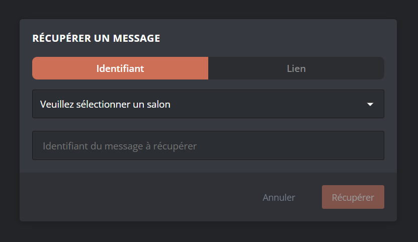
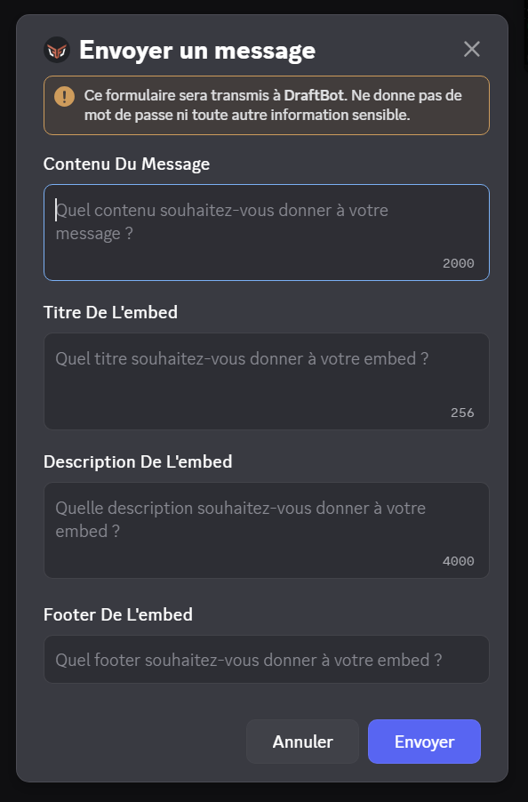

## Envoyer des messages avec le panel

La page [**Messages**](/dashboard/first/messages) du panel vous offre la possibilité de créer et envoyer des messages 100% personnalisables en fonction de vos besoins.

::hint{ type="info" }
  L'accès au panel nécessite un accès **administrateur**.
::

Si vous souhaitez intégrer du texte, des images, du contenu dans votre message, il faut utiliser les boutons `Contenu` et `Embed`.

::hint{ type="info"}
  Les boutons `Bouton` et `Sélecteur` permettent des choses incroyables, pour en savoir plus sur leur fonctionnement, rendez-vous dans la partie [Créer des interactions](#créer-des-interactions) !
::

En appuyant sur le bouton **Contenu** vous pourrez rédiger un message classique avec **DraftBot**. Vous pouvez y intégrer des émojis de votre serveur ou de discord.
| Sur le panel | Sur discord |
|--------------|-------------|
|  | Boulanger |

En appuyant sur le bouton **Embed** vous pourrez rédiger un message détaillé regroupant plusieurs informations.

Voici la signification de chaque zone de texte :
- **Nom de l'auteur :** Vous pouvez y inserez du texte pour présenter l'auteur, votre pseudonyme ou le nom de votre serveur.
- **Titre :** Vous pouvez insérez le titre de votre embed. Vous pouvez également ajouter un lien facilement via le bouton <:lien:1359564100539121946> qui apparaît quand vous écrirez.
- **Description :** Insérez ici un texte. Le markdown discord <:logo_discord:1122414310023512074> est utilisable dans cette zone.
- **Champs :** Insérez ici plusieurs zone de texte avec un titre de manière simple.
    - **Nom du champ :** Le texte qui sera dans cette zone apparaîtra en **gras**.
    - **Valeur du champ :** Insérez ici du texte comme vous le souhaitez.

    ::hint{ type="info" }
      Il n'existe pas de limite de champs. Seul la limite de caractères de `4096` caractères dans l'embed compte.

      Vous pouvez également choisir comment s'enchaîne vos champs en cliquant sur le bouton <:direction:1359468992296784082> qui apparaît lorsque vous remplissez un champ.
    ::
- **Footer :** Vous pouvez rajouter un petit texte pour conclure votre message.
- **Horodatage :** en appuyant sur le bouton <:cache:1359572897429061804> vous pouvez faire apparaître l'heure d'envoi du message.
- **Images :** Vous pouvez intégrez des images en cliquant sur les emplacements orange. Vous pourrez alors importer votre image ou alors coller un lien.

Sur la gauche de l'embed vous verrez différents boutons.
- <:spec:1359820882788356176> : Ce bouton vous permet de voir comment sera afficher votre message sur discord (avec les différentes mentions)
- <:palette:1359820880934469806> : Ce bouton vous permet de changer la couleur de la barre à gauche de l'embed.
- <:copier:1359820877327372350> : Ce bouton vous permet de copier facilement votre embed et de le coller directement à la suite.
- <:fermer:1359820879080460288> : Ce bouton supprime votre embed

::hint{ type="warning" }
  Une fois votre embed supprimé, il n'est pas possible d'annuler cette suppression.
::

## Créer des interactions

Vous avez la possibilité de créer des boutons & sélecteur que les membres de votre serveur peuvent utiliser. Ces boutons & sélecteurs entraîne des actions que vous aurez préalablement programmé. Vous pouvez également définir des conditions pour certaines interactions.

::hint{ type="warning" }
  Pour qu'un message avec une ou plusieurs interraction fonctionne il est **nécessaire** que le message soit enregistré sur le panel.
::

### Créer un bouton interactif

Pour créer un bouton interactif, il faut cliquer sur le bouton intitulé `Bouton`. Vous aurez alors un menu qui apparaîtra.

Vous pouvez ainsi nommer votre bouton (visible par tout les utilisateurs), lui mettre un emoji (de votre serveur ou ceux de discord) et choisir sa couleur.

Vous devrez ensuite sélectionner l'action voulu. Si vous souhaitez créer plusieurs boutons, recommencez l'opération.

### Créer un sélecteur interactif

Pour créer un sélecteur interactif, il faut cliquer sur le bouton intitulé `Sélecteur`. Vous aurez alors un menu qui apparaîtra.

### Les actions

::collapse{ label="Envoyer un nouveau message" }
  Avec cette action vous pouvez envoyer un nouveau message de manière automatique via **DraftBot**. le message pourra être envoyé de plusieurs manières.
  - Via un message éphemère (visible uniquement pas l'utilisateur)
  - Dans un salon défini
  - Dans les messages privé de l'utilisateur

  Vous pourrez ensuite rédiger le message à envoyer.
::

::collapse{ label="Envoyer un message sauvegardé" }
  Avec cette action vous pouvez envoyer un message de manière automatique via **DraftBot**. Vous devrez choisir le message sauvegardé à envoyer, vous pourrez ensuite définir comment l'envoyer.

  le message pourra être envoyé de plusieurs manières.
  - Via un message éphemère (visible uniquement pas l'utilisateur)
  - Dans un salon défini
  - Dans les messages privé de l'utilisateur
::

::collapse{ label="Ajouter ou retirer des rôles" }
  Avec cette action vous pouvez envoyer attribuer ou retirer des rôles de manière automatique et simple. Vous devez d'abord choisir quel est le style de fonctionnement du don ou retrait de rôle.
  - Classique : Quand l'utilisateur clique sur le bouton, **DraftBot** lui donne ou retire ses rôles.
  - Fixe : L'utilisateur ne peut pas changer ou retirer son rôle une fois le bouton sélectionné.
  - Unique : L'utilisateur ne peut avoir qu'un seul rôle du message. S'il choisit un autre bouton qui donne un autre rôle, son précédent rôle lui sera retiré.

  Vous devez ensuite définir quels sont les rôle à donner ou retirer. Vous pouvez également choisir si les rôle donnés sont temporaire ou non. Si le rôle est temporaire, vous devez définir la durée pendant laquelle l'utilisateur conservera son rôle.
::

::collapse{ label="Ouvrir un ticket" }
  Avec cette action vous pouvez faire ouvrir un [ticket](/docs/modules/tickets) facilement.

  Vous devrez paramétrer si le ticket aura un motif commun pour toute personne qui ouvre le ticket ou si vous souhaitez que l'utilisateur remplisse un motif de lui même.
::

::collapse{ label="Acheter un article"}
  Vous pouvez faire acheter via un bouton un article de votre [boutique](/docs/modules/economie#la-boutique). Vous devez ajouter l'article à faire acheter, l'utilisateur l'achètera au **même prix** que celui propsé à la vente.
::

::collapse{ label="Proposer une suggestion"}
  Vous pouvez faciliter les [suggestions](docs/modules/suggestions) sur votre serveur avec un bouton. Vous pouvez choisir entre montrer les différentes suggestions de l'utilisateur ou lui ouvrir le menu pour en proposer une directement <a:db_Wink:1224123256013983774>
::

::collapse{ label="Redirger vers un lien" }
  Vous pouvez rediriger votre utilisateur vers un lien de votre choix.

  ::hint{ type="info" }
    Vous ne pouvez pas choisir la couleur du bouton. Celui-ci sera obligatoirement gris.

    Cette action est disponible uniquement sur les boutons.
  ::
::

#### Mode simple
Le mode simple vous permet de faire quelque actions plus facilement et rapidement.

Le mode simple vous permet de paramétrer les actions suivantes :
- Envoie de message éphemère
- Ajout et retrait des rôles
- Ouverture de tickets
- Achat d'articles de boutique

Une fois choisi, le menu se développera pour vous permettre de configurez l'ensemble des sélecteurs avec cette action. Vous devrez alors à minima nommer votre option, lui ajouter un émoji et régler l'action précise. Vous pouvez également ajouter une description ou personnaliser le nom qui apparait pour l'utilisateur pour les actions ajout & retrait des rôles, d'ouverture de ticket et d'achat d'articles de boutique.

#### Mode avancé

Le mode avancé vous permet de personnalisé chaque option du sélecteur. Vous pouvez ainsi créer un seul sélecteur pour différentes actions.

Pour créer une option il faut cliquer sur le bouton `Ajouter une option` un nouveau menu apparaîtra alors :

Vous devez nommer votre sélecteur et lui ajouter un émoji. Vous pouvez également lui ajouter une description en appuyant sur la flèche orange.

Vous devrez ensuite choisir le type d'action à faire et paramétrer celle-ci comme indiqué dans la section [`Les actions`](#les-actions).

## Créer des profils

Avec le panel vous avez également la possibilité de créer des profils. Le message s'enverra ainsi avec le nom et la photo de profil défini.

Pour ajouter un profil, il faut cliquer sur la photo de profil de draftbot pour faire apparaître un crayon pour en créer un profil. Vous pourrez alors choisir un profil déjà créé ou en créer un nouveau.

Vous pourrez alors importer une photo de profil ou fournir le lien d'une image. Vous devrez aussi ajouter un nom.

::hint{ type="info" }
  Petite astuce :bulb: : Vous pouvez trouver le lien vers la photo de profil d'un serveur en utilisant les commandes \</info serveur> ou \</avatar> pour un membre.
::

## Envoyer un message

Pour envoyer votre message après l'avoir rédigé sur le panel vous devrez choisir un salon d'envoi en haut de la page puis cliquer sur bouton `Envoyer`

:tada: votre message à été envoyé selon vos paramétrages. Si c'est un message sans profil, vous pourrez le modifier sans avoir à la réenvoyer. En revanche si c'est un message avec profil, le message devra être envoyé de nouveau.

## Récupérer un message

Vous pouvez récupérer un message en appuyant sur le bouton orange `Récupérer un message` situé en haut à droite de la page. Un menu apparaîtra alors pour retrouver le message via l'identifiant du message et son salon d'origine. Vous pouvez également retrouver le message via le lien du message.

::hint{ type="warning" }
  Vous ne pouvez pas récupérer un message supprimé du salon.
::

Une fois votre message récupéré, vous pourrez le modifier à votre guise.

## Envoyer des messages avec des commandes

### Avec la commande \</envoyer>
Avec cette commande vous avez la possibilité d'envoyer un message rapidement dans un salon de votre serveur. Pour l'utiliser vous devez posseder la permission **Administrateur** ou alors une dérogation d'utilisation de la commande.

Voici la signification des arguments :
- **Contenu :** Le texte à faire dire à **DraftBot**, sous forme de message classique
- **Image :** Vous pouvez joindre une image à votre message
- **Salon :** Dans quel salon **DraftBot** devra-t-il envoyer le message ? laissez vide si le salon est le même salon d'où vous lancez la commande.
- **Modifier :** Si vous souhaitez modifier un message utilisez cette case supplémentaire en y incluant le lien du message à modifier.

### Avec la commande \</embed>
Avec cette commande vous avez la possibilité d'envoyer un message plus détaillé sous l'identité de **DraftBot**.  Pour l'utiliser vous devez posseder également la permission administrateur ou posseder une dérogation d'utilisation de la commande.

Voici la signification de ces paramètres :
- **Salon :** Dans quel salon **DraftBot** devra-t-il envoyer le message ? laissez vide si le salon est le même salon d'où vous lancez la commande.
- **Modifier :** Si vous souhaitez modifier un message utilisez cette case supplémentaire en y incluant le lien du message à modifier.
Une fois la commande lancée, un menu va apparaître. C'est dans ce menu que vous allez devoir rédiger votre message.

Chaque zone de texte correspond à un type de contenu
- **Contenu :** Le texte de **DraftBot** apparaîtra sous forme de message classique
- **Titre de l'embed :** Ce sera le titre de votre embed
- **Description de l'embed :** Le texte de votre embed devra être placé ici.
- **Footer de l'embed :** Vous pouvez rajouter un petit texte en bas de votre embed.