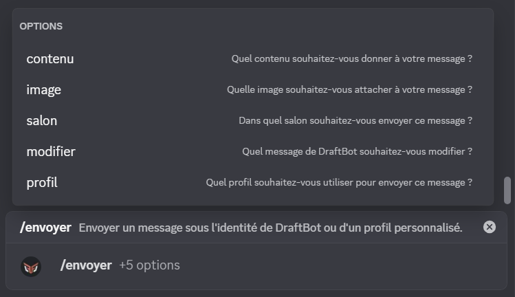
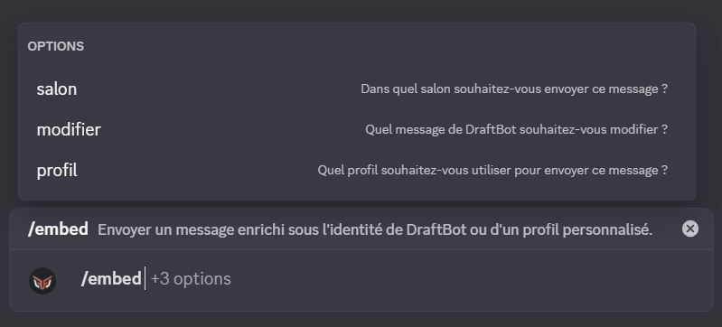

## Rédiger un message
Il existe plusieurs moyen d'envoyer un message avec **DraftBot** <:draftbot:816002768971759636>.

### Avec la commande \</envoyer>
Avec cette commande vous avez la possibilité d'envoyer un message rapidement dans un salon de votre serveur. Pour l'utiliser vous devez posseder la permission **Administrateur** ou alors une dérogation d'utilisation de la commande[^1].

Voici la signification des arguments :
- **Contenu :** Le texte à faire dire à **DraftBot**, sous forme de message classique
- **Image :** Vous pouvez joindre une image à votre message
- **Salon :** Dans quel salon **DraftBot** devra-t-il envoyer le message ? laissez vide si le salon est le même salon d'où vous lancez la commande.
- **Modifier :** Si vous souhaitez modifier un message utilisez cette case supplémentaire en y incluant le lien du message à modifier.

[^1]: Ces dérogations sont configurable dans l'onglet integration de votre serveur discord.

### Avec la commande \</embed>
Avec cette commande vous avez la possibilité d'envoyer un message plus détaillé sous l'identité de **DraftBot**.  Pour l'utiliser vous devez posseder également la permission administrateur ou posseder une dérogation d'utilisation de la commande[^1].

Voici la signification de ces paramètres :
- **Salon :** Dans quel salon **DraftBot** devra-t-il envoyer le message ? laissez vide si le salon est le même salon d'où vous lancez la commande.
- **Modifier :** Si vous souhaitez modifier un message utilisez cette case supplémentaire en y incluant le lien du message à modifier.

Une fois la commande lancée, un menu va apparaître. C'est dans ce menu que vous allez devoir rédiger votre message.

Chaque zone de texte correspond à un type de contenu
- **Contenu :** Le texte de **DraftBot** apparaîtra sous forme de message classique
- **Titre de l'embed :** Ce sera le titre de votre embed
- **Description de l'embed :** Le texte de votre embed devra être placé ici.
- **Footer de l'embed :** Vous pouvez rajouter un petit texte en bas de votre embed.

### Avec le panel
Via la page [message](/dashboard/first/messages) du panel vous avez la possibilité d'envoyer un message 100% personnalisable en fonction de vos besoins.

::hint{ type="info" }
  L'accès au panel nécessite un accès **administrateur**.
::

Dans cette partie nous nous interesserons uniquement aux bouton `Contenue` & `Embed`, le reste sera expliquer dans la partie [Créer des interactions](#créer-des-interactions) de cette page.

En appuyant sur le bouton **Contenu** vous pourrez rédiger un message classique avec **DraftBot**. Vous pouvez y intégrer des émojis de votre serveur ou de discord.

En appuyant sur le bouton **Embed** vous pourrez rédiger un message détaillé regroupant ainsi, plusieurs informations.

Voici la signification de chaque zone de texte :
- **Nom de l'auteur :** Vous pouvez y inserez du texte pour présenter l'auteur, votre pseudonyme ou le nom de votre serveur.
- **Titre :** Vous pouvez insérez le titre de votre embed. Vous pouvez également ajouter un lien facilement via le bouton <:lien:1359564100539121946> qui apparaît quand vous écrirez.
- **Description :** Insérez ici un texte. Le markdown discord <:logo_discord:1122414310023512074> est utilisable dans cette zone.
- **Champs :** Insérez ici plusieurs zone de texte avec un titre de manière simple.
    - **Nom du champ :** Le texte qui sera dans cette zone apparaîtra en **gras**.
    - **Valeur du champ :** Insérez ici du texte comme vous le souhaitez.

    ::hint{ type="info" }
      Il n'existe pas de limite de champs. Seul la limite de caractères de `4096` caractères dans l'embed compte.

      Vous pouvez également choisir comment s'enchaîne vos champs en cliquant sur le bouton <:direction:1359468992296784082> qui apparaît lorsque vous remplissez un champ.
    ::
- **Footer :** Vous pouvez rajouter un petit texte pour conclure votre message.
- **Horodatage :** en appuyant sur le bouton <:cache:1359572897429061804> vous pouvez faire apparaître l'heure d'envoi du message.
- **Images :** Vous pouvez intégrez des images en cliquant sur les emplacements orange. Vous pourrez alors importer votre image ou alors coller un lien.

Sur la gauche de l'embed vous verrez différents boutons.

## Créer des interactions

## Créer des profils

## Envoyer un message

## Récupérer un message
