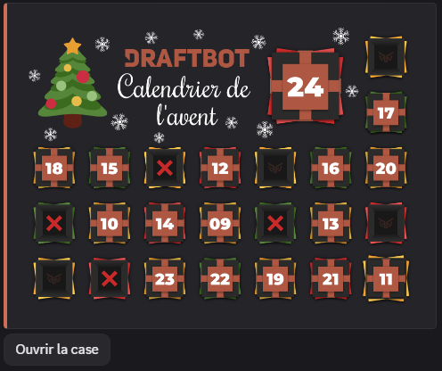

::hint{ type="info" }
  Le calendrier de l'avent est configurable du 25 novembre au 24 décembre.
::

## Ouvrir une case du calendrier

Pour ouvrir votre case quotidienne du calendrier de l'avent, utilisez la commande \</calendrier> pendant le mois de décembre.

::hint{ type="success" }
  Chaque membre peut ouvrir **une case par jour** correspondant à la date du jour. Les cases ouvertes sont laissées ouvertes et les loupées sont marquées d'une croix.
::

## Surprises quotidiennes

Le calendrier de l'avent permet d'offrir différents types de surprises à vos membres :

::tabs
  ::tab{ label="Rôle" }
    Vous pouvez permettre à vos membres d'acquérir des rôles (temporaires ou permanents) lorsqu'ils ouvrent une case du calendrier.

    Choisissez :
    - Le jour du calendrier (1 à 24)
    - Le rôle à attribuer
    - Le mode de cumul : **Cumulatif** ou **Unique**
    - La durée du rôle *(dans le cas d'un rôle temporaire)*

    ::hint{ type="info" }
      **Rôle cumulable :** Les rôles cumulables sont conservés lorsque l'utilisateur reçoit un nouveau rôle.

      **Rôle évolutif** : Les rôles évolutifs se succèdent, remplaçant ainsi le précédent à chaque nouveau rôle.
    ::

    ::hint{ type="warning" }
      **Permissions requises** : Pour attribuer des rôles, DraftBot doit disposer de :
      - La permission **"Gérer les rôles"**
      - Un rôle **plus haut** dans la hiérarchie que les rôles à attribuer

      Le rôle sélectionné doit avoir été créé au préalable sur votre serveur. Si les conditions ne sont pas remplies, le membre sera notifié, mais ne recevra pas le rôle.
    ::
  ::

  ::tab{ label="Expérience" }
    Si le [système de niveaux](/docs/modules/niveaux) est activé, vous pouvez récompenser vos membres avec de l'expérience.

    Choisissez :
    - Le jour du calendrier (1 à 24)
    - La quantité d'expérience à accorder

    ::hint{ type="warning" }
      Le système de niveaux doit être **activé** sur votre serveur pour utiliser ce type de surprise.
    ::

    ::hint{ type="success" }
      Idéal pour booster la progression des membres les plus actifs pendant la période de Noël !
    ::
  ::

  ::tab{ label="Argent" }
    Si le [système d'économie](/docs/modules/economie) est activé, vous pouvez récompenser vos membres avec de l'argent virtuel du serveur.

    Choisissez :
    - Le jour du calendrier (1 à 24)
    - La somme d'argent à accorder

    ::hint{ type="warning" }
      Le système d'économie doit être **activé** sur votre serveur pour utiliser ce type de surprise.
    ::
  ::

  ::tab{ label="Objet Inventaire" }
    Récompensez vos membres avec des [objets d'inventaire](/docs/modules/inventaire) personnalisés et fictifs.

    Choisissez :
    - Le jour du calendrier (1 à 24)
    - L'objet à accorder (parmi ceux existant ou en créer un nouveau)
    - La quantité de cet objet

    ::hint{ type="warning" }
      Les membres ne peuvent pas dépasser la limite de **1 000 000 exemplaires** d'un même objet. Si cette limite est atteinte, l'objet ne sera pas ajouté.
    ::
  ::

  ::tab{ label="Surprise Personnalisée" }
    Offrez des récompenses **en dehors de Discord** : codes promotionnels, clés de jeux, goodies physiques, abonnements, etc.

    Choisissez :
    - Le jour du calendrier (1 à 24)
    - Le nom/description de la surprise

    ::hint{ type="success" }
      **Comment ça fonctionne ?** Lorsqu'un membre obtient cette surprise, **vous recevez une notification par message privé de DraftBot** avec les informations du membre (nom d'utilisateur, ID, serveur). Vous pouvez alors lui remettre la récompense "en main propre" comme vous le souhaitez.
    ::

    ::hint{ type="warning" }
      Assurez-vous que vos messages privés sont ouverts pour recevoir les notifications ! Si vos MP sont fermés ou si vous avez quitté le serveur, la surprise ne pourra pas être remise et le membre ne recevra rien.
    ::

    ::hint{ type="info" }
      Idéal pour des récompenses uniques : accès à un salon privé, session de coaching, goodies personnalisés, etc.
    ::
  ::
::

::hint{ type="success" }
  Vous pouvez ajouter **2 surprises par case**, DraftBot en choisira une **aléatoirement**. Les serveurs [premium](/premium) peuvent en ajouter jusqu'à **5 par case** !
::

## Ouvertures consécutives

Récompensez la régularité de vos membres avec le système d'ouvertures consécutives ! Les membres qui ouvrent leur case chaque jour sans interruption peuvent recevoir des récompenses bonus.

Le calcul de la série est fait de la manière suivante :

- Chaque jour où un membre ouvre sa case **sans interruption**, sa série augmente de 1
- Si un membre **saute un jour**, sa série se réinitialise à 1
- La série peut se poursuivre **d'une année sur l'autre** (la case du 24 décembre suivie de la case du 1er décembre de l'année suivante maintient la série)

**Exemple :**
- Ouverture des cases du 1er, 2, 3, 4 décembre → Série de 4
- Pas d'ouverture le 5 décembre
- Ouverture de la case du 6 décembre → Série de 1 (réinitialisée)

::hint{ type="info" }
  L'annonce du bonus se fait en message caché donc personne ne connait la récompense à l'avance.
::

### Modes de gain

Deux modes de gain sont disponibles pour chaque récompense :

| Mode | Description | Exemple |
|------|-------------|---------|
| **Mode unique** | La récompense est obtenue une seule fois lorsque l'objectif est atteint | Rôle "Fidèle" à 7 ouvertures consécutives |
| **Mode multiple** | La récompense est obtenue à chaque fois que l'objectif est atteint de manière répétée | 100 pièces toutes les 5 ouvertures consécutives |

::hint{ type="info" }
  **Réobtensible** : Pour les récompenses en mode unique, vous pouvez activer l'option "réobtensible" pour permettre aux membres de gagner à nouveau la récompense s'ils cassent leur série puis atteignent de nouveau l'objectif.
::

### Comptabilisation des ouvertures

Vous pouvez choisir la méthode de comptage des ouvertures consécutives :

- **Toutes années confondues** : Les ouvertures des années précédentes sont comptabilisées
- **Année en cours uniquement** : Seules les ouvertures de l'année actuelle comptent (utile pour les objectifs ≤ 24 jours)

::hint{ type="warning" }
  La série d'ouvertures consécutives se réinitialise si un membre **oublie une journée**. Par exemple, s'il ouvre les cases du 1er, 2 et 4 décembre (sans ouvrir celle du 3), sa série redémarre à 1.
::

::hint{ type="success" }
  Les serveurs peuvent créer jusqu'à **3 récompenses** d'ouvertures consécutives. Les serveurs [premium](/premium) peuvent en créer jusqu'à **10** !
::

## Personnalisation

### Message personnalisé

Vous pouvez personnaliser le message affiché lorsqu'un membre ouvre une case du calendrier. Les variables suivantes sont disponibles :

| Variable | Description | Exemple |
|----------|-------------|---------|
| `{calendar.day}` | Numéro du jour de la case ouverte | 15 |

*En plus des [autres variables](docs/annexes/variables) déjà disponibles globalement !*

### Message d'ouvertures consécutives

Un message séparé peut être configuré pour les récompenses d'ouvertures consécutives, avec les variables supplémentaires suivantes :

| Variable | Description | Exemple |
|----------|-------------|---------|
| `{calendar.streak.count}` | Nombre d'ouvertures consécutives actuelles | 7 |
| `{calendar.streak.record}` | Record d'ouvertures consécutives du membre | 15 |
| `{calendar.streak.reward}` | Nom de la récompense obtenue | Rôle "Fidèle" |

*En plus des [autres variables](docs/annexes/variables) déjà disponibles globalement !*

### Image de fond personnalisée

Les serveurs [premium](/premium) peuvent définir une image de fond personnalisée (10Mo maximum).

::hint{ type="success" }
  **Dimensions recommandées** : 1740 x 1260 pixels. Vous pouvez également ajouter un filtre gris semi-transparent pour améliorer la lisibilité.
::

## Configurer le calendrier de l'avent

::tabs
  ::tab{ label="Depuis le panel" }

    [⫸ Accéder au panel de **DraftBot**](/dashboard/first/advent-calendar)

    Pour activer le module, cliquez sur le bouton en haut à droite pour activer le calendrier de l'avent.
  ::

  ::tab{ label="Via la commande /config" }
    Si vous souhaitez effectuer toute la configuration directement depuis Discord, vous pouvez le faire via la commande \</config>, puis en vous rendant dans l'onglet **"Calendrier de l'avent"**.
  ::
::
