## Participer à la Route de l'Infini

La Route de l'Infini est un jeu de comptage collaboratif où les membres de votre serveur comptent ensemble de **1 jusqu'à l'infini**. Le principe est simple : chaque membre envoie le nombre suivant dans le salon dédié.

- **Comptage séquentiel** : Envoyez le nombre qui suit immédiatement le précédent (1, 2, 3, 4...)
- **Alternance obligatoire** : Vous ne pouvez pas envoyer deux nombres consécutifs. Un autre membre doit compter entre vos deux messages
- **Format du message** : Envoyez uniquement le nombre attendu (sauf si les discussions sont autorisées)

::hint{ type="info" }
  Le nombre actuel et les statistiques de la Route de l'Infini sont consultables via la commande \</route-infini>.
::

### Discussions autorisées

Parce que compter c'est bien, si on peut discuter, c'est encore mieux !

Si votre serveur autorise les discussions (activé par défaut), vous pouvez ajouter du texte après le nombre :

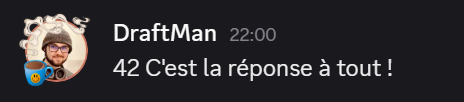

::hint{ type="info" }
  Les discussions peuvent être configurées pour autoriser ou interdire les sauts de ligne dans vos messages. Par défaut, les sauts de ligne sont **interdits**.
::

## Consulter le classement

Pour consulter votre progression et le classement du serveur, utilisez la commande \</route-infini>.

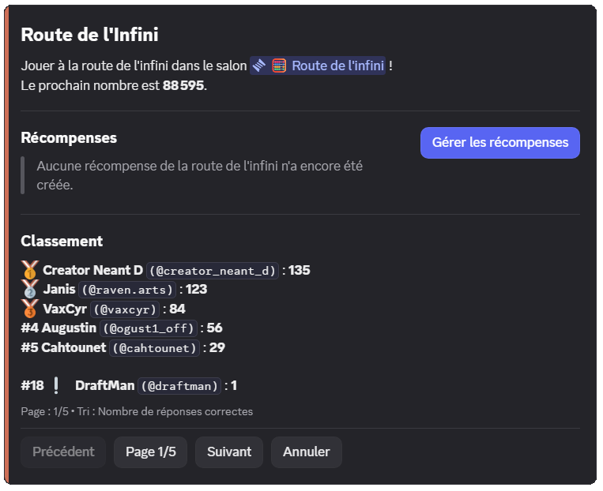

La commande affiche :
- Le prochain nombre à envoyer
- Les récompenses disponibles (si configurées)
- Le classement des meilleurs participants
- Votre position et

::hint{ type="success" }
  Vous pouvez trier le classement par **nombre de réponses correctes** ou **nombre d'erreurs** en utilisant l'option `tri` de la commande.
::

## Récompenses

Motivez vos membres en leur offrant des récompenses lorsqu'ils atteignent certains nombres ! Les récompenses sont visibles dans la commande \</route-infini>.

- **Nombre spécifique** : La récompense est donnée une seule fois à un nombre précis (exemple : au nombre 1000)
- **Multiple** : La récompense est donnée à chaque multiple d'un nombre (exemple : tous les 100, donc aux nombres 100, 200, 300, etc.)

| Type | Description | Exemple |
|------|-------------|---------|
| **Rôle permanent** | Attribution d'un rôle Discord définitif | Rôle "Compteur Expert" au nombre 1000 |
| **Rôle temporaire** | Attribution d'un rôle pour une durée limitée | Rôle "Champion temporaire" au multiple de 500 |
| **Argent** | De l'argent du [système d'économie](/docs/modules/economie) | 5000 pièces au nombre 100 |
| **Expérience** | Points d'XP du [système de niveaux](/docs/modules/niveaux) | 1000 XP au nombre 250 |
| **Objet d'inventaire** | Un ou plusieurs [objets d'inventaire](/docs/modules/inventaire) | 3x "Badge d'honneur" au nombre 500 |
| **Récompense personnalisée** | Une récompense que vous remettez manuellement | Code promo, mention spéciale, etc. |

::hint{ type="info" }
  Lorsqu'une récompense est basée sur [l'argent du système d'économie](/docs/modules/inventaire) du serveur, celle-ci peut provenir :
  - **De la création** : L'argent est créé pour l'occasion
  - **De la banque du serveur** : L'argent provient de l'argent collecté via les erreurs (voir [Gestion des erreurs](#gestion-des-erreurs))
::

::hint{ type="info" }
  Vous pouvez créer jusqu'à **3 récompenses**. Les serveurs [premium](/premium) peuvent créer jusqu'à **10 récompenses** !
::

## Déclencheurs

Les déclencheurs permettent d'automatiser des actions spéciales lorsque certains nombres sont atteints. Contrairement aux récompenses, les déclencheurs ne donnent rien aux membres mais créent des événements dans le salon.

| Action | Description |
|--------|-------------|
| **Message temporaire** | Envoie un message personnalisable qui sera automatiquement supprimé après 8 secondes |
| **Réaction** | Ajoute automatiquement une réaction au message du nombre |
| **Épinglage** | Épingle automatiquement le message dans le salon |

::hint{ type="info" }
  Vous pouvez créer jusqu'à **3 déclencheurs** gratuitement. Les serveurs [premium](/premium) peuvent créer jusqu'à **10 déclencheurs** !
::

## Rôles animateurs

Les animateurs disposent de permissions spéciales pour gérer la Route de l'Infini sans pénalités :

- **Messages invalides tolérés** : Peuvent envoyer des messages ne contenant pas de nombres sans déclencher d'erreur
- **Modification du nombre** : Peuvent corriger le nombre actuel en cas d'erreur via des boutons interactifs
- **Gestion des récompenses** : Accès direct à la configuration des récompenses via \</route-infini>

::hint{ type="info" }
  Les membres ayant la permission **Administrateur** disposent automatiquement de tous ces privilèges sans avoir besoin d'un rôle animateur.
::

### Boutons interactifs pour animateurs

Lorsqu'un animateur fait une erreur, des boutons apparaissent pour gérer la situation :

- **"Je me suis trompé"** : Applique les pénalités normales comme si c'était un membre lambda
- **"Modifier le nombre actuel"** : Change le nombre en cours pour celui que vous avez envoyé
- **"Supprimer ce message"** : Supprime simplement votre message d'erreur

## Actions d'erreurs

Le système détecte automatiquement trois types d'erreurs, pouvez ensuite choisir pour **quels types d'erreurs** appliquer des actions supplémentaires (réinitialisation, retrait d'argent, rôle temporaire).

| Erreur ciblée | Description |
|---------------|-------------|
| **Nombre invalide** | Le membre envoie un nombre incorrect (par exemple 43 au lieu de 42) |
| **Message invalide** | Le message ne contient aucun nombre, ou ne respecte pas les règles de discussion |
| **Messages consécutifs** | Le membre envoie deux nombres d'affilée sans qu'un autre membre compte entre temps |

### Réinitialisation du compteur

Si activée, le compteur repart de **1** et un message explique qui a causé la réinitialisation.

::hint{ type="info" }
  Par défaut, la réinitialisation en cas d'erreur est **désactivée**. Même si vous l'activez, elle ne s'appliquera que pour les types d'erreurs que vous aurez sélectionnés dans la configuration.
::

### Retrait d'argent

Si le [système d'économie](/docs/modules/economie) est activé, vous pouvez retirer de l'argent aux membres qui font certaines erreurs (désactivé par défaut). Deux modes sont disponibles :

- **Définitif** : L'argent est détruit et disparaît définitivement (mode par défaut)
- **Collecte** : L'argent est transféré dans la **banque du serveur** (argent de DraftBot) et peut être redistribué via les récompenses

::hint{ type="info" }
  Par défaut, si vous activez cette option, **200 pièces** seront retirées de façon **définitive**. Le retrait ne s'appliquera que pour les types d'erreurs que vous aurez sélectionnés.
::

::hint{ type="warning" }
  Si le système d'économie est désactivé alors que le retrait d'argent est activé, cette option sera automatiquement désactivée et vous recevrez une notification.
::

### Rôle temporaire de sanction

Vous pouvez attribuer automatiquement un rôle temporaire aux membres qui font certaines erreurs (par exemple un rôle "Au coin" pendant 10 minutes). Comme pour les autres actions, le rôle ne sera attribué que pour les types d'erreurs que vous aurez sélectionnés.

## Modes d'affichage

La Route de l'Infini propose trois modes pour afficher les messages dans le salon dédié :

| Mode | Fonctionnement | Avantages |
|------|----------------|-----------|
| **Classique** | Le message du membre reste tel quel | Authenticité, possibilité d'ajouter une réaction de validation |
| **DraftBot** | Le message est supprimé puis renvoyé par DraftBot | Empêche l'édition a posteriori, format uniforme |
| **Webhook** | Le message est supprimé puis renvoyé avec l'identité du membre | Empêche l'édition a posteriori, conserve l'identité visuelle du membre |

::hint{ type="info" }
  Les modes **DraftBot** et **Webhook** empêchent les membres de modifier leur message après l'avoir envoyé, garantissant l'intégrité du comptage.
::

### Formats de message

Lorsque vous utilisez les modes **DraftBot** ou **Webhook**, deux formats d'affichage sont disponibles :

- **Message** (défaut) : Affichage en texte brut, personnalisable avec des variables
- **Embed** : Affichage dans un embed Discord avec sous sans couleur et personnalisable avec des variables

#### Format

Le format des messages est entièrement personnalisable avec des variables dynamiques :

- `{number}` : Le nombre actuel
- `{discussion}` : Le texte de discussion (si autorisé)

**Format par défaut** : `{user} : {number} {discussion}`

::hint{ type="info" }
  La couleur par défaut des embeds est **#CD6E57** (orange). Les serveurs premium peuvent personnaliser cette couleur ou retirer la couleur.
::

::hint{ type="info" }
  La personnalisation du format et de la couleur des embeds est réservée aux serveurs [premium](/premium) <:icon_premium:1096140508625125417>.
::

### Réaction de validation

En mode **Classique**, vous pouvez configurer une réaction qui sera automatiquement ajoutée à chaque message contenant un nombre valide (désactivé par défaut). Utilisez un emoji standard (✅, ⭐) ou un emoji personnalisé de votre serveur.

::hint{ type="warning" }
  Si l'emoji configuré est supprimé ou inaccessible, la réaction sera automatiquement désactivée et vous recevrez une notification.
::

## Discussions

Vous pouvez autoriser les membres à ajouter du texte après le nombre :

- **Autoriser les discussions** : Active ou désactive la possibilité d'écrire après le nombre (activé par défaut)
- **Autoriser les sauts de ligne** : Permet d'utiliser des retours à la ligne dans les discussions (désactivé par défaut)
- **Ignorer les messages sans nombres** : Si activé, les messages ne contenant aucun nombre sont simplement ignorés au lieu de déclencher une erreur (désactivé par défaut)

## Configurer la Route de l'Infini

::tabs
  ::tab{ label="Depuis le panel" }

    [⫸ Accéder au panel de **DraftBot**](/dashboard/first/infinite-road)

    Pour activer le module, la première étape est de cliquer sur "Configurer en quelques secondes" et faire la configuration rapide :

    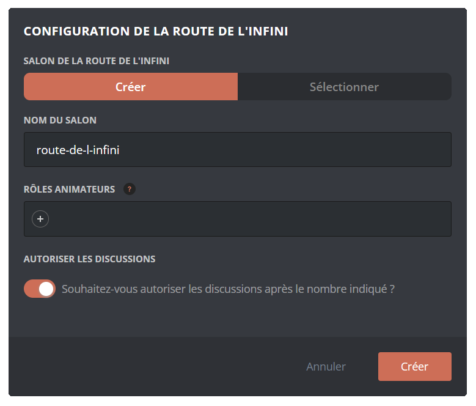

    Un assistant de configuration vous guide ensuite à travers les étapes de mise en place :

    1. **Choix du salon** : Créer un nouveau salon ou utiliser un existant
    2. **Rôles animateurs** : Définir les rôles ayant des permissions spéciales (optionnel)
    3. **Mode d'affichage** : Choisir entre Classique, DraftBot ou Webhook
    4. **Format** : Sélectionner Message ou Embed

    Une fois configuré, l'ensemble des fonctionnalités apparaît :

    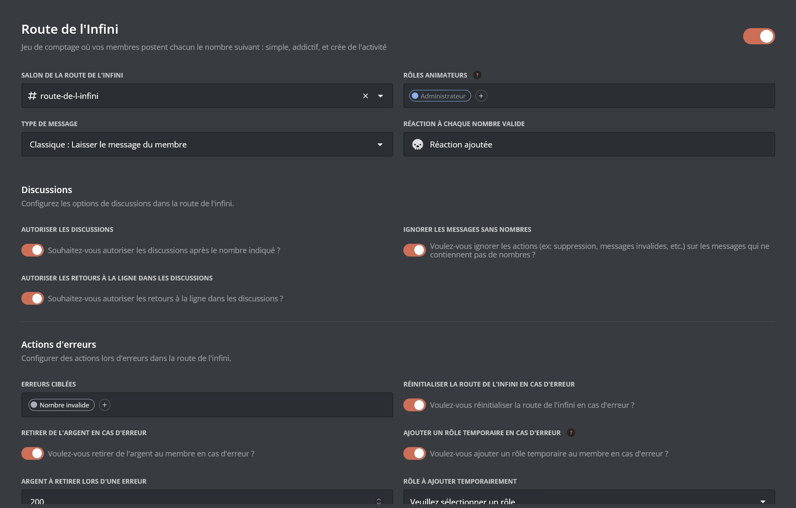

    ::hint{type="warning"}
      Une fois vos modifications terminées, n'oubliez pas d'enregistrer vos modifications avec le bouton "Enregistrer" situé en bas de page !
    ::
  ::

  ::tab{ label="Via la commande /config" }

    Si vous souhaitez effectuer toute la configuration directement depuis Discord, vous pouvez le faire via la commande \</config>, puis en vous rendant dans l'onglet "Route de l'Infini". Le menu ressemble alors à ceci :

    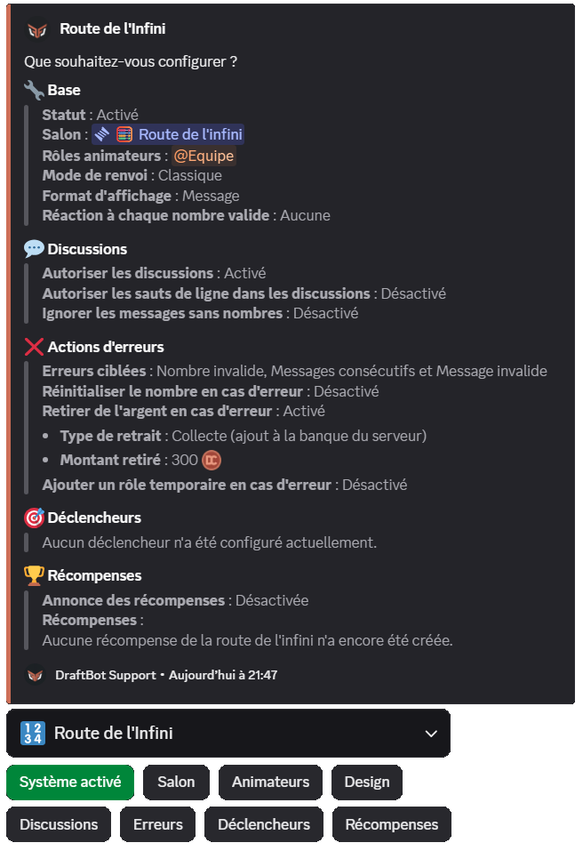

    Le corps du **message** vous permet de consulter en un coup d'œil l'**état actuel** de votre Route de l'Infini, tandis que les **boutons** situés au-dessous vous permettent d'en **modifier la configuration**.

    ::collapse{ label="Animateurs" }
      Configurez les rôles ayant des permissions spéciales pour gérer la Route de l'Infini. Les membres avec ces rôles peuvent :
      - Modifier le nombre en cours.
      - Gérer les récompenses (rôles, argent, objets, etc.).
      - Possibilité d'envoyer des messages invalides sans être impacté par la suppression du message ou un malus.
    ::

    ::collapse{ label="Discussions" }
      Gérez les options relatives aux discussions :
      - Autoriser/interdire les discussions après le nombre
      - Autoriser/interdire les retours à la ligne dans les discussions
      - Ignorer ou sanctionner les messages sans nombres

      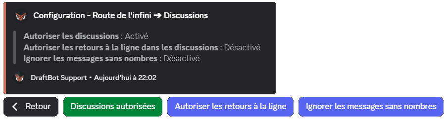
    ::

    ::collapse{ label="Erreurs" }
      Configurez la gestion des erreurs :
      - **Types d'erreurs** : Choisissez quelles erreurs déclencher des actions
      - **Réinitialisation** : Remettre le compteur à 1 en cas d'erreur
      - **Retrait d'argent** : Retirer de l'argent aux membres fautifs
          - Type de retrait : Définitif ou Collecte
          - Montant retiré par erreur
      - **Rôle temporaire** : Attribuer un rôle de sanction temporaire

      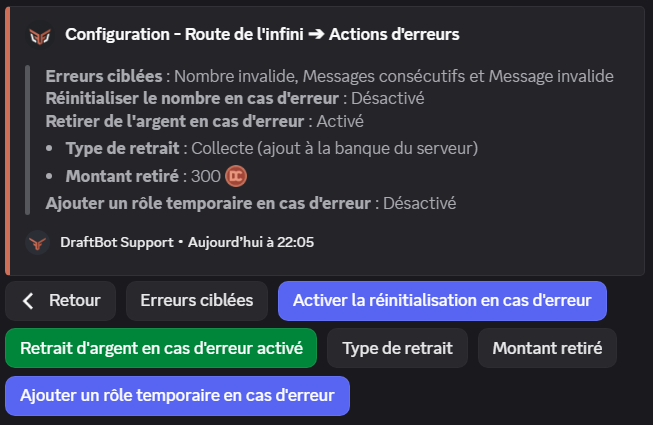
    ::

    ::collapse{ label="Déclencheurs" }
      Créez, modifiez ou supprimez des déclencheurs :
      - Définir une condition (nombre spécifique ou multiple)
      - Choisir les actions (message temporaire, réaction, épinglage)
      - Personnaliser le message avec des variables

      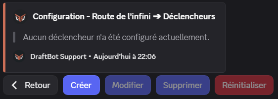
    ::

    ::collapse{ label="Récompenses" }
      Gérez les récompenses de la Route de l'Infini :
      - Créer, modifier ou supprimer des récompenses
      - Configurer les annonces de récompenses
      - Personnaliser le message d'annonce

      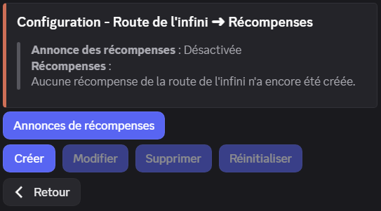
    ::

    ::hint{ type="info" }
      Les fonctionnalités accompagnées du symbole <:icon_premium:1096140508625125417> sont réservées aux serveurs [premium](/premium) !
    ::
  ::
::

### Annonces de récompenses

Configurez où et comment annoncer l'obtention d'une récompense (désactivé par défaut) :

- **Salon dédié** : Choisissez un salon spécifique pour les annonces
- **Message personnalisé** : Personnalisez le message d'annonce avec les [variables disponibles](#variables-de-personnalisation), ainsi que `{reward}` pour afficher la récompense obtenue

**Message par défaut** : `{user}, voici votre récompense pour avoir envoyé le nombre **{number}** dans la Route de l'Infini !`

::hint{ type="info" }
  Par défaut, les annonces de récompenses sont **désactivées**. N'oubliez pas de les activer et de choisir un salon pour que vos membres soient notifiés !
::

::hint{ type="warning" }
  **Permissions requises** : Pour envoyer les annonces, DraftBot doit disposer des permissions suivantes dans le salon choisi : **Voir le salon**, **Envoyer des messages**, **Intégrer des liens** et **Joindre des fichiers**. Si ces permissions sont retirées, les annonces seront automatiquement désactivées.
::

### Créer une récompense

1. **Type d'objectif** : Nombre spécifique ou multiple
2. **Valeur de l'objectif** : Le nombre ou multiple déclencheur
3. **Type de récompense** : Rôle, argent, XP, objet, ou personnalisée
4. **Paramètres spécifiques** selon le type choisi

::tabs
  ::tab{ label="Depuis le panel" }

    [⫸ Accéder au panel de **DraftBot**](/dashboard/first/infinite-road)

    Dans la section "Récompenses", cliquez sur **"Créer une récompense"** :

    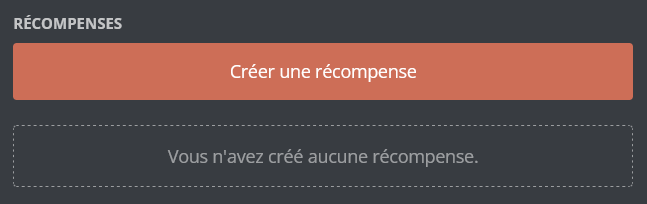
  ::

  ::tab{ label="Via la commande /config" }
    Via la commande \</config>, accédez au menu "Route de l'Infini" > "Récompenses" > "Créer une récompense", puis suivez les étapes de configuration.

    
  ::
::

::tabs
  ::tab{ label="Rôle" }
    Attribuez un rôle permanent ou temporaire au membre qui atteint l'objectif.

    **Paramètres :**
    - Le rôle à attribuer
    - Durée (pour rôle temporaire uniquement)

    ::hint{ type="warning" }
      Le rôle sélectionné doit avoir été créé au préalable et être accessible à DraftBot (ne pas être situé plus haut que le rôle le plus élevé de DraftBot).
    ::

    ::hint{ type="info" }
      Contrairement aux récompenses de niveau, les rôles ne sont **jamais retirés** automatiquement si le compteur est réinitialisé.
    ::
  ::

  ::tab{ label="Argent" }
    Donnez de l'argent du [système d'économie](/docs/modules/economie) au membre.

    **Paramètres :**
    - Montant à donner
    - Source : création ou banque du serveur

    **Banque du serveur :**
    Si vous choisissez la banque du serveur, l'argent proviendra de l'argent de DraftBot (collecté via les erreurs). Si la banque n'a pas assez d'argent, le montant maximum disponible sera donné.

    ::hint{ type="warning" }
      Le système d'économie doit être **activé** sur votre serveur pour utiliser ce type de récompense.
    ::
  ::

  ::tab{ label="Expérience" }
    Donnez des points d'expérience du [système de niveaux](/docs/modules/niveaux).

    **Paramètres :**
    - Quantité d'XP à donner

    ::hint{ type="warning" }
      Le système de niveaux doit être **activé** sur votre serveur pour utiliser ce type de récompense.
    ::

    ::hint{ type="success" }
      Si le gain d'XP fait monter le membre de niveau, il recevra automatiquement les récompenses de niveau et une annonce sera envoyée (si configurée).
    ::
  ::

  ::tab{ label="Objet d'inventaire" }
    Donnez un ou plusieurs [objets d'inventaire](/docs/modules/inventaire) au membre.

    **Paramètres :**
    - L'objet à donner
    - La quantité (jusqu'à 1 million)

    ::hint{ type="info" }
      Si vous n'avez pas encore créé d'objets, vous devrez d'abord [configurer votre inventaire](/docs/modules/inventaire) depuis le module Inventaire du panel.
    ::
  ::

  ::tab{ label="Récompense personnalisée" }
    Offrez une récompense **en dehors de Discord** : codes promotionnels, goodies physiques, mentions spéciales, etc.

    **Paramètres :**
    - Nom/description de la récompense (jusqu'à 250 caractères)

    ::hint{ type="success" }
      **Comment ça fonctionne ?** Lorsqu'un membre obtient cette récompense, **vous recevez une notification par message privé de DraftBot** avec les informations du membre. Vous pouvez alors lui remettre la récompense manuellement.
    ::

    ::hint{ type="warning" }
      Assurez-vous que vos messages privés sont ouverts pour recevoir les notifications !
    ::
  ::
::

## Migration depuis Countr

Si vous utilisiez déjà la Route de l'Infini via Countr, vous pouvez importer les données de comptage de vos membres vers DraftBot !

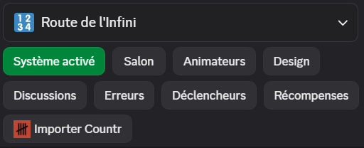

1. Sur votre serveur Discord, utilisez la commande Countr : \</data export scores>
2. Countr vous enverra un fichier JSON contenant toutes les données
3. Dans DraftBot, cliquez sur **"Importer Countr"** via \</config> ou le panel
4. Envoyez le fichier JSON reçu de Countr
5. Confirmez l'importation

::hint{ type="warning" }
  **Important** : Les données existantes dans la Route de l'Infini seront **remplacées** par les données importées. Cette action est irréversible.
::

::hint{ type="info" }
  Assurez-vous que CountR est toujours présent sur votre serveur au moment de l'exportation des données.
::

