## Introduction
Le module d'économie DraftBot comprend deux parties :
- Le système d'économie
- La boutique

Ces deux systèmes peuvent être configurés depuis le [**panel** de DraftBot](/dashboard/first/economie), ou depuis Discord via la commande \</config>.

## Configuration du module

::tabs
  ::tab{ label="Depuis le panel" }
    [⫸ Accéder au panel de **DraftBot**](/dashboard/first/economie)

    La première étape pour activer le système est de cliquer sur ce bouton.

    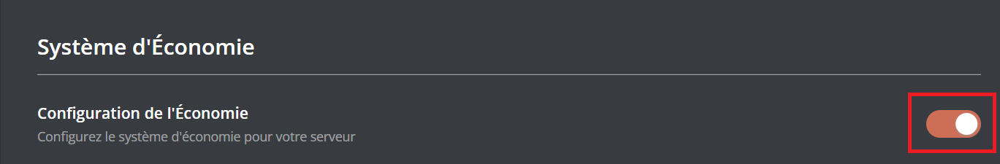

    Ensuite, l'ensemble des [fonctionnalités](#fonctionnalites-disponibles) apparaît :
    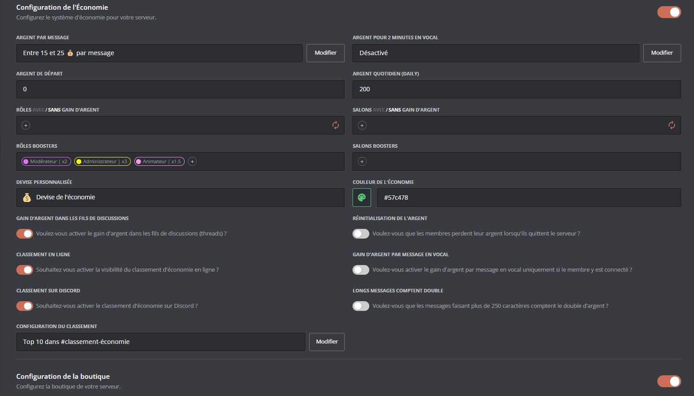

    ::hint{type="warning"}
      Une fois vos modifications terminées, n'oubliez pas d'enregistrer vos modifications avec le bouton "Enregistrer" situé en bas de page !
    ::

  ::
  ::tab{ label="Via la commande /config" }

    Si vous souhaitez effectuer toute la configuration directement depuis [Discord](https://discord.com/), vous pouvez le faire via la commande \</config>, puis en vous rendant dans l'onglet "Économie". Le menu ressemble alors à ceci :
    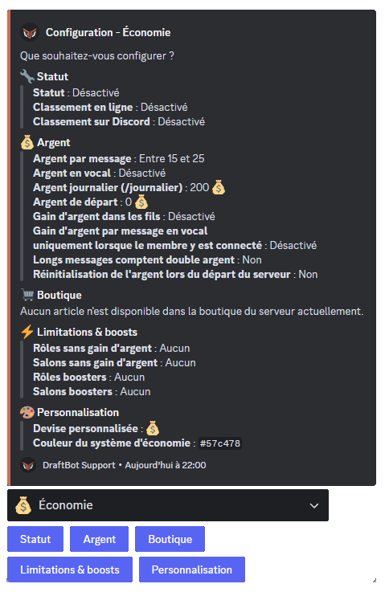
    Le corps du **message** vous permet de consulter en un coup d'oeil l'**état actuel** de votre système économique, tandis que les **boutons** situés au dessous vous permettent d'en **modifier la configuration**.\
    Voici le détail de chaque bouton :
    
    ::collapse{ label="Statut" }
      Ce menu vous permet de :
      * Activer / Désactiver le système d'économie
      * Activer / Désactiver le classement en ligne
      * Activer / Désactiver le classement sur Discord (<:icon_premium:1096140508625125417>)

      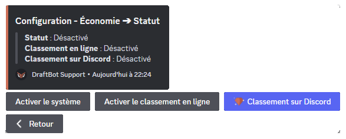
    ::
    ::collapse{ label="Argent" }
      Ce menu vous permet de :
      * Activer / Désactiver / Régler la somme reçue à chaque message
      * Activer / Désactiver / Régler la somme reçue en vocal (<:icon_premium:1096140508625125417>)
      * Configurer la somme réclamable quotidiennement via la commande \</daily> (ou \</journalier>)
      * Activer / Désactiver le gain d'argent dans les fils
      * Activer / Désactiver le gain d'argent par message en vocal
      * Activer / Désactiver/ Régler les gains x2 pour les messages longs
      * Choisir si l'argent des membres quittant le serveur est remis à 0

      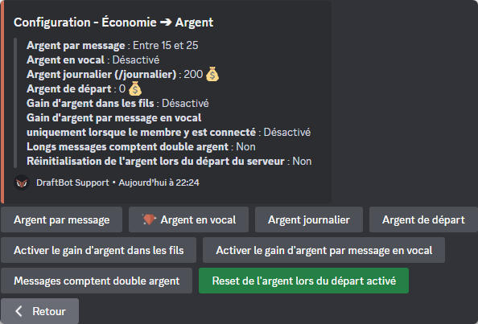
    ::
    ::collapse{ label="Boutique" }
      Ce menu vous permet de configurer la boutique de votre serveur, vous pouvez ainsi :
      * Créer / Modifier / Supprimer un article de boutique
      * Modifier le type de boutique
      * Réinitialiser la boutique

      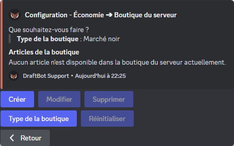
    ::
    ::collapse{ label="Limitations & Boosts" }
      Ce menu sert à configurer des gains différents en fonction du rôle d'un membre, ou du salon dans lequel il poste un message. Vous pouvez :
      * Définir quels rôles ne sont pas autorisés à gagner d'argent
      * Définir quels salons ne sont pas autorisés à gagner d'argent
      * Définir à quels rôle appliquer un multiplicateur (de x1.5 à x3)
      * Définir à quels salons appliquer un multiplicateur (de x1.5 à x3)

      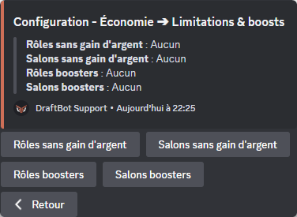
    ::
    ::collapse{ label="Personnalisation" }
      Ce menu propose des personnalisations exclusives réservées aux abonnés [<:icon_premium:1096140508625125417>DraftBot premium](https://www.draftbot.fr/premium) :
      * Personnaliser l'emoji de votre monnaie
      * Personnaliser la couleur de l'interface d'économie (vert par défaut)

      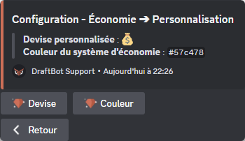
      ::hint{ type="success" }
        Lorsque vous personnalisez la devise, vous pouvez même utiliser les emojis personnalisés de votre serveur !
        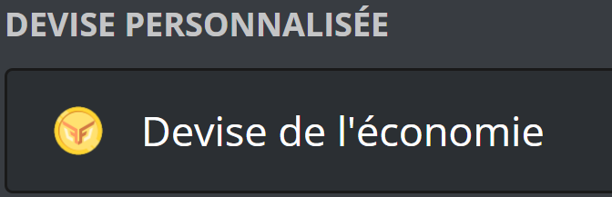
      ::
    ::
    ::hint{ type="info" }
      Les fonctionnalités accompagnées du symbole <:icon_premium:1096140508625125417> sont réservées aux abonnés <:icon_premium:1096140508625125417>[DraftBot premium](https://www.draftbot.fr/premium)

    ::
  ::
::
## Fonctionnalités disponibles

Avec DraftBot, vous êtes aux commandes ! Le système d'économie permet un très grand niveau de personnalisation pour s'adapter à vos besoins. Voici les options disponibles :

::collapse{ label="Afficher / masquer la liste de fonctionnalités" }

  |     **NOM**    | **EXPLICATION** |
  |------------|-------------|
  |**Argent par message**                                           |Modifier ou désactiver la somme gagnée à chaque message envoyé |
  |**Argent de départ**                                             |Modifier la somme de base reçue en rejoignant le serveur |
  |**Rôles avec/sans gain d'argent**                                |Restreindre le gain d'argent à certains rôles |
  |**Rôles boosters**                                               |Régler des multiplicateurs de gains pour certains rôles|
  |**<:icon_premium:1096140508625125417> Devise personnalisée**     |Personnaliser le nom et l'icône de votre devise|
  |**<:icon_premium:1096140508625125417> Argent pour 2 minutes  en vocal**|Définir la somme gagnée toutes les deux minutes en vocal|
  |**Argent quotidien**                                             |Régler la somme que les membres peuvent réclamer chaque jour via \</daily> |
  |**Salons avec/sans gain d'argent**                               | Restreindre le gain d'argent à certains salons |
  |**Salons boosters**                                              | Régler des multiplicateurs de gains pour certains salons |
  |**<:icon_premium:1096140508625125417> Couleur de l'économie**    |Personnaliser la couleur de l'interface économie|
::

En plus de ces fonctionnalités, 6 options à activer/désactiver vous permettent d'aller encore plus loin dans la configuration de votre économie :

::collapse{ label="Afficher / masquer la liste des options" }

  |     **NOM**    | **EXPLICATION** |
  |------------|-------------|
  |**Gain d'argent dans les fils de discussions**| EXPLICATION |
  |**Argent de départ**| EXPLICATION |
  |**Rôles avec/sans gain d'argent**| EXPLICATION |
  |**Rôles boosters**| EXPLICATION |
  |**Rôles boosters**| EXPLICATION |
  |**Rôles boosters**| EXPLICATION |

::

::hint{ type="info" }
  Les fonctionnalités ou options accompagnées de l'icône <:icon_premium:1096140508625125417> sont exclusives, et réservées aux abonnés [✨DraftBot premium](https://www.draftbot.fr/premium). 
::

## Configuration de la boutique

::tabs
  ::tab{ label="Via la commande /config" }
    Rendez-vous d'abord dans la catégorie "💰 Économie" de la commande \</config> puis appuyez sur "Configuration de la boutique".

    ### Créer un article dans votre boutique

    Après avoir cliqué sur le bouton "Créer", un menu va s'ouvrir :

    - "Rôle" ➜ Vos membres pourront acheter un rôle prédéfini.
    - "Rôle temporaire" ➜ Vos membres pourront acheter un rôle prédéfini qu'ils garderont durant une durée choisie.
    - "Expérience" ➜ Vos membres pourront acheter de l'[expérience](/docs/modules/niveaux).
    - "Personnaliser"➜ Créer une récompense personnalisée (quelque chose que **DraftBot** ne peut pas offrir).

    ::hint{ type="info" }
      Un message privé sera envoyé au créateur du serveur pour qu'il vous donne la récompense.
    ::

    - "Objet" ➜ Créer un item qui sera affiché dans votre \</inventaire>.

    ::hint{ type="info" }
      **Conseil :** si vous voulez illustrer vos objets d'inventaire et ne pas avoir que du texte, vous pouvez ajouter des émojis.
      _Exemple : "🍒 Cerises"_
    ::

    

    ### Modifier un article dans votre boutique

    Si vous vous rendez compte qu'une erreur s'est glissée dans un de vos articles, vous pouvez le modifier, en cliquant sur le bouton "Modifier"" :

    - "Article" ➜ Modifier le nom de l'article.
    - "Description" ➜ Modifier la description de l'article.
    - "Prix" ➜ Modifier le prix de l'article.
    - "Stock" ➜ Modifier la quantité d'articles disponible dans la boutique. **_([✨ premium](/premium))_**

    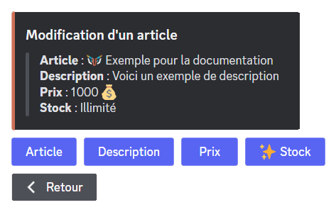

    ### Supprimer un article dans votre boutique

    Si vous souhaitez supprimer un article dans votre boutique, cliquez sur le bouton "Supprimer" puis choisissez l'article à retirer.

    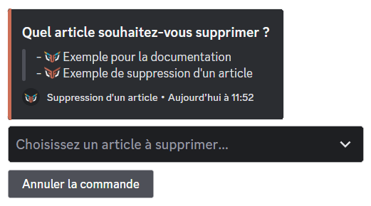

    ### Réinitialiser votre boutique

    Si vous souhaitez réinitialiser votre boutique, cliquez sur le bouton "Réinitialiser".
    
    ::hint{ type="warning" }
      Une fois la boutique réinitialisée, il vous sera impossible de récupérer ce que vous aviez fait.
    ::

    ### Type de la boutique

    Si vous souhaitez modifier le type de la boutique, cliquez sur le bouton "Type de la boutique".

    - "Normal" ➜ Le message de la boutique est conservé.
    - "Noir" ➜ Le message de la boutique est supprimé automatiquement après 60 secondes d'inactivité.
  ::

  ::tab{ label="Depuis le panel" }
    [Accéder au panel de **DraftBot**](/dashboard/first/economy)

    Une fois sur le panel de **DraftBot**, rendez-vous en bas de la page "Économie".

    ### Créer un article dans votre boutique

    Pour créer un article, cliquez sur le bouton "`Créer un article`".

    

    Un pop-up s'ouvrira dans laquel vous pourrez configurer votre article.

    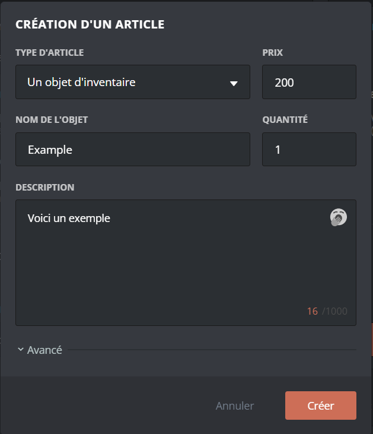

    Pour créer un article, cliquez sur le bouton "`Créer un article`". Les options de configuration sont les mêmes que sur la commande \</config>. Vous pouvez donc vous rendre dans l'onglet `(Via la commande /config)` pour les comparer.
    ㅤ
    ::hint{ type="info" }
      Si vous souhaitez mettre des émojis sur vos items, vous devrez récupérer l'affichage de l'émoji avec son [__identifiant__](/docs/autres/recuperer-un-identifiant#identifiant-dun-emoji) (en mettant un antislash (\\) devant celui-ci).
    ::
    ㅤ

    ### Modifier un article dans votre boutique

    Si vous vous rendez compte qu'une erreur s'est glissée dans un de vos articles, vous pouvez le modifier en cliquant sur le bouton nommé ci-dessus dans la liste de vos articles.

    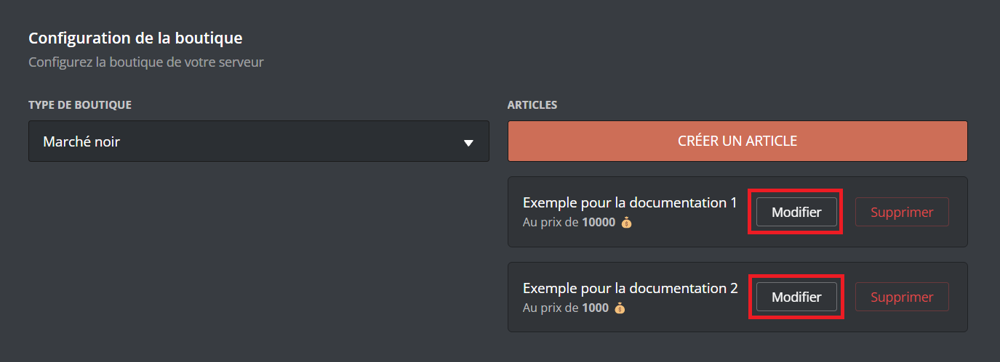

    ### Supprimer un article dans votre boutique

    Si vous souhaitez supprimer un article, cliquez sur le bouton "Supprimer".

    

    ### Type de la boutique

    Pour modifier le type de la boutique, rendez vous sur le sélecteur (voir image) puis sélectionnez le modèle voulu.

    - "Normal" ➜ Le message de la boutique est conservé.
    - "Noir" ➜ Le message de la boutique est supprimé automatiquement après 60 secondes d'inactivité.

    

    ::hint{type="warning"}
      Une fois fini, n'oubliez pas d'enregistrer vos modifications avec le bouton "Enregistrer" en bas de la page.
    ::
  ::
::

## Votre Argent

Vous pouvez voir votre somme d'argent, ainsi que celle des autres membres en indiquant leur pseudo dans l'argument "Membre" avec \</argent>.

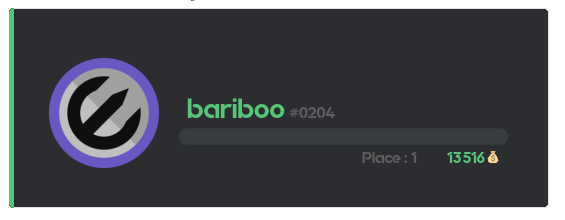

- \</journalier> ➜ Commande journalière permettant de gagner un montant défini au préalable par les administrateurs.
- \</payer> ➜ Donner de l'argent à un membre de votre choix.

::hint{ type="info" }
  Pour pouvoir obtenir de l'argent, il vous faut [__configurer__](#configuration) le système d'économie.
::

## Classement

Grâce à la commande \</topargent>, vous avez accès au classement économique du serveur. Vous y verrez les cinq premiers membres ainsi que votre position. Pour voir l'ensemble du classement, cliquez sur le bouton __"Voir l'ensemble du classement"__ situé sous le message de __DraftBot__.

## Boutique

Vous pouvez dans la boutique acheter des rôles (temporaires ou non), de l'expérience, des objets d'inventaire ou des articles personnalisés.
Elle est accessible avec la commande \</boutique>\.

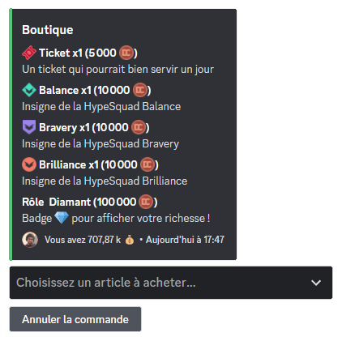

::hint{ type="info" }
  Le marché noir un style de boutique consistant à se supprimer au bout de 60 secondes d'inactivité, ni vu ni connu !
  Le type de boutique est configurable depuis la commande \</config> ou en vous rendant dans la partie Boutique de [la page "Économie"](/dashboard/first/economie) du panel.

  

::

## Objets d'inventaire

Vous avez la possibilité avec __DraftBot__ de pouvoir animer la vie de votre serveur avec des objets d'inventaire. Une fois achetés dans la __[boutique](#boutique)__ ou gagnés, vous pouvez exécuter des commandes qui vous permettront __d'effectuer des échanges__ entre membres et __la gestion des inventaires__ !

Pour plus d'informations, rendez-vous sur la page des [inventaires](/docs/modules/inventaire).

## Modifier l'argent des utilisateurs

Plusieurs commandes sont disponibles pour gérer l'argent de vos membres :

- </adminargent ajouter> ➜ Ajouter de l'argent à un membre en plus de son montant actuel.
- </adminargent définir> ➜ Définir l'argent d'un membre en ne tenant pas compte de son montant actuel.
- </adminargent retirer> ➜ Retirer de l'argent à un membre en se basant sur le montant actuel.
- </adminargent réinitialiser serveur> ➜ Remettre à zéro l'argent de tout le serveur.
- \</dropargent> ➜ Créer un message qui offre de l'argent au premier qui clique sur le bouton.

## Migration

Si vous utilisiez UnbelievaBoat auparavant, il est possible d'importer l'économie de vos membres directement sur DraftBot afin qu'ils ne perdent pas leur progression.

::hint{ type="info" }
  Il faut impérativement que le bot UnbelievaBoat soit sur votre serveur lors de la migration.
::

Pour migrer vers le système de DraftBot, utiliser la commande \</config>.

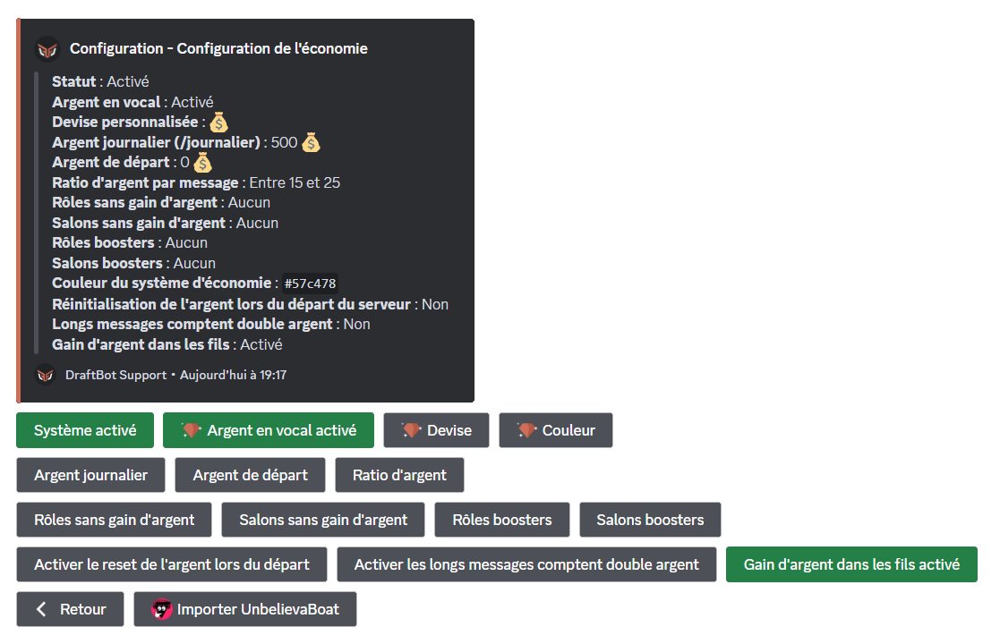
