## Consulter votre argent

Pour consulter votre solde personnel, utilisez la commande \</argent>.

::hint{ type="info" }
  Pour consulter le solde d'un autre membre, ajoutez simplement sa mention en argument de la commande \</argent>.
::

## Commandes

Il existe plusieurs commandes pratiques pour rendre l'intégration du système d'économie aussi fluide que possible pour vous.

| Commande | Description |
|----------|-------------|
| \</journalier> (ou \</daily>) | Permet de récolter sa somme quotidienne. |
| \</dropargent> | Crée un message qui offre une somme d'argent au premier qui clique sur le bouton. |
| \</argent> | Permet d'afficher la quantité d'argent que vous, ou un autre membre, possédez. |
| \</payer> | Permet de donner de son argent au membre ciblé. |
| \</boutique> | Permet d'afficher la [boutique du serveur](#les-boutiques). |
| \</topargent> | Permet d'afficher le [classement](#classement) des membres. |

::hint{ type="info" }
  Lors de l'utilisation de \</dropargent>, vous pouvez définir la durée du drop (maximum 10 minutes) !

  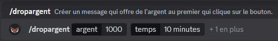
::

## Boutique

La boutique accessible depuis le \</boutique> permet à vos membres d'acheter des articles mis en place par vos soins !

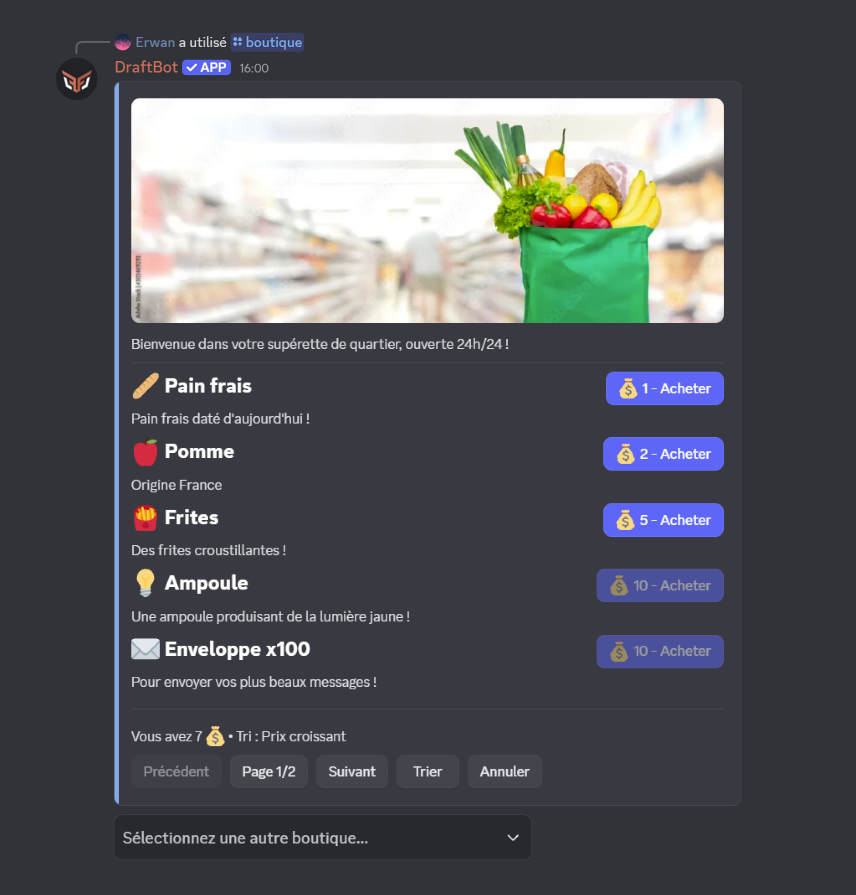

- **Pagination** : Les articles sont affichés par page de 5 articles maximum
- **Tri des articles** : 6 options de tri disponibles (date de création, prix croissant/décroissant, nom alphabétique, type)
- **Sélection de boutique** : Si plusieurs boutiques existent, un menu de sélection s'affiche automatiquement
- **Achat sécurisé** : Confirmation requise avant chaque achat

| Type | Description | Exemple |
|------|-------------|---------|
| **Rôle** | Attribution d'un rôle Discord | Rôle "VIP" pour 5000 💰 |
| **Rôle temporaire** | Attribution d'un rôle pour une durée limitée | Rôle "Boost 7 jours" pour 2000 💰 |
| **Expérience** | Points d'XP du [système de niveaux](/docs/modules/niveaux) | 1000 XP pour 500 💰 |
| **Objet d'inventaire** | Un ou plusieurs [objets d'inventaire](/docs/modules/inventaire) | 3x "Potion de chance" pour 1500 💰 |
| **Article personnalisé** | Une récompense que vous remettez manuellement | Code promo, goodies physiques, etc. |

::hint{ type="info" }
  Vous pouvez créer jusqu'à **10 articles**. Les serveurs [premium](/premium) n'ont pas de limite et peuvent créer jusqu'à **5 boutiques** !
::

::hint{ type="success" }
  Si vous avez configuré plusieurs boutiques, vos membres peuvent facilement basculer entre elles via le menu déroulant en bas de l'interface !
::

## Gain d'argent

L'argent peut être gagné de diverses manières sur votre serveur. Vous contrôlez entièrement comment et où vos membres accumulent leur richesse.

### Argent par message

La méthode principale pour gagner de l'argent est la **participation écrite** dans le serveur. Chaque message rapporte une quantité d'argent **aléatoire** comprise entre deux valeurs que vous configurez (par défaut entre **15 et 25 💰**).

::hint{ type="info" }
  Un **cooldown de 30 secondes** s'applique entre chaque gain d'argent pour un même membre. Cela évite le spam et encourage les conversations de qualité.
::

### Argent en vocal

Les serveurs [premium](/premium) peuvent activer le gain d'argent en fonction de l'**activité vocale**. Chaque membre actif en vocal gagne une quantité d'argent aléatoire (15 à 25 💰 par défaut, configurable) **toutes les 2 minutes**.

::hint{ type="info" }
  **Conditions requises** pour gagner de l'argent en vocal :
  - L'utilisateur ne doit **pas être muet** ou **en sourdine** (ni auto-sourdine, ni sourdine serveur).
  - Le salon ne doit **pas être un salon de conférence** (stage) ou configuré comme **salon AFK** (dans les paramètres Discord).
  - **Au moins 2 membres humains** doivent être présents et actifs (non muets/sourdine) dans le même salon.

  Si ces conditions ne sont plus remplies, le membre cesse de gagner de l'argent jusqu'à ce qu'elles soient à nouveau respectées.
::

::hint{ type="info" }
  Cette fonctionnalité est réservée aux serveurs [premium](/premium) <:icon_premium:1096140508625125417>.
::

### Autres gains d'argent

Grâce à l'**écosystème** de DraftBot, vous pouvez offrir de l'argent via d'autres fonctionnalités :
- **Giveaways** : Offrez de l'argent en récompense
- **Argent de départ** : Définissez une somme donnée aux nouveaux membres
- **Daily/Journalier** : Récompense quotidienne réclamable via \</daily>
- **Cadeaux d'anniversaires** : Offrez de l'argent automatiquement
- **Drop d'argent** (\</dropargent>) : Créez des événements interactifs où le premier à cliquer gagne
- **Calendrier de l'avent** : Récompenses quotidiennes en décembre
- **Commandes personnalisées** : Créez toutes sortes de commandes en lien avec l'économie

### Fils de discussion et forums

Le système d'économie distingue deux types d'espaces de discussion :

- **Les fils de discussion (threads)** : créés dans les salons textuels ou d'annonces. Leur gain d'argent peut être activé/désactivé via l'option **"Gain d'argent dans les fils de discussions"**.
- **Les posts de forums** : messages publiés dans les salons de type Forum. Leur gain d'argent est contrôlé par l'option **"Gain d'argent dans les posts"**.

::hint{ type="info" }
  Les fils de discussion et posts de forums **héritent automatiquement** des paramètres de leur salon parent concernant les listes blanches/noires et les multiplicateurs.
::

### Listes blanches et noires

Les listes de **rôles** et **salons** vous permettent de contrôler finement qui peut gagner de l'argent et où :

- **Mode "avec" (whitelist)** : Seuls les membres/salons listés peuvent gagner de l'argent. Pour les rôles, il suffit qu'un membre possède **au moins un** rôle autorisé pour gagner de l'argent, même s'il possède d'autres rôles non listés.
- **Mode "sans" (blacklist)** : Les membres/salons listés ne peuvent **pas** gagner d'argent. Si un membre possède au moins un rôle interdit, il ne gagnera pas d'argent.

### Multiplicateurs d'argent

Vous pouvez appliquer des **multiplicateurs** (x1.5, x2, x2.5, x3) à certains rôles ou salons pour booster le gain d'argent.

::hint{ type="info" }
  **Important** : Si un membre cumule plusieurs sources de multiplicateurs (par exemple un rôle x2 et un salon x1.5), **seul le multiplicateur le plus élevé** est appliqué (ici x2, pas x3).
::

### Options supplémentaires

D'autres options avancées sont disponibles pour affiner le système :

| Option | Description |
|--------|-------------|
| **Gain d'argent par message en vocal** | Lorsque cette option est activée, les messages textuels envoyés dans les salons vocaux rapportent de l'argent **uniquement si le membre est connecté en vocal** dans ce même salon. Si elle est désactivée, aucun message textuel dans les salons vocaux ne rapporte d'argent |
| **Longs messages comptent double** | Les messages de 250+ caractères (configurable 100-1500) donnent le double d'argent |
| **Voir l'argent des autres utilisateurs** | Si désactivé, les membres ne voient que leur propre solde via \</argent>. Dans ce cas, la commande devient éphémère (visible uniquement par l'utilisateur qui l'utilise). Les administrateurs peuvent toujours consulter l'argent de tous les membres |
| **Réinitialiser l'argent au départ du serveur** | Si activé, les membres qui quittent le serveur perdent définitivement leur argent. S'ils reviennent, ils repartent de zéro |
| **Réinitialiser l'argent au bannissement** | Si activé, les membres bannis perdent définitivement leur argent |
| **Argent de départ** | Définissez une somme d'argent donnée automatiquement aux nouveaux membres rejoignant le serveur |
| **Argent quotidien (Daily)** | Configurez la somme réclamable quotidiennement via la commande \</daily> ou \</journalier> |
| **Personnalisation de la devise** | Changez l'emoji de votre monnaie (option premium <:icon_premium:1096140508625125417>) |
| **Personnalisation de la couleur** | Changez la couleur des embeds et cartes d'économie (option premium <:icon_premium:1096140508625125417>) |

## Classement

Vous pouvez afficher le classement des membres, du plus riche au moins riche, de trois façons :

### Commande /topargent

Vous pouvez afficher le classement via la commande \</topargent>.

::hint{ type="success" }
  Si vous souhaitez afficher un nombre spécifique de lignes (seulement le top 3 par exemple), vous pouvez ajouter ce nombre en argument de la commande \</topargent>.
::

::hint{ type="info" }
  Si l'option **"Voir l'argent des autres utilisateurs"** est désactivée, les membres ne peuvent consulter que leur propre solde avec \</argent>, mais les classements (\</topargent> et le classement en ligne) **restent accessibles** à tous.
::

### Classement en ligne

Si vous avez activé le [**classement en ligne**](#options-disponibles), vous pouvez le consulter depuis le bouton **"Voir l'ensemble du classement"** de la commande \</topargent>.

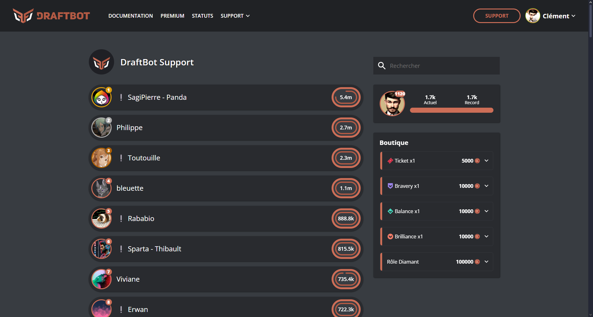

::hint{ type="info" }
  Si vous êtes administrateur du serveur, vous pouvez également y accéder depuis le [**panel**](/dashboard/first/economy) dans le module **Économie** via le bouton **"Accéder au classement"**.
::

### Classement en temps réel

Pour les serveurs [premium](/premium), il est possible de mettre en place dans un salon dédié un classement des membres en temps réel et mis à jour automatiquement.

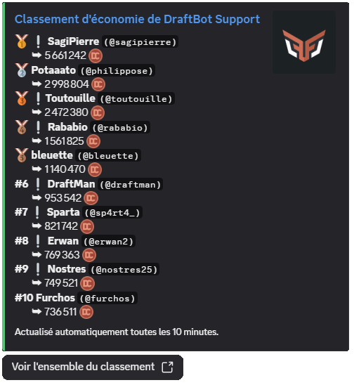

::hint{ type="success" }
  L'avantage de cette fonctionnalité est que le message affichant le classement peut afficher jusqu'à 25 membres et sera réactualisé toutes les 10 minutes automatiquement, sauf s'il n'y a pas de changements !
::

## Gérer l'argent des membres

En tant qu'administrateur, vous disposez de plusieurs commandes pour gérer l'argent des membres :

| Commande | Description |
|----------|-------------|
| \</dropargent> | Crée un message avec un bouton : le **premier membre** à cliquer gagne l'argent. Vous pouvez définir une durée limite (maximum **10 minutes**). |
| \</adminargent ajouter> | Ajouter de l'argent à un membre spécifique. |
| \</adminargent retirer> | Retirer de l'argent à un membre. |
| \</adminargent définir> | Définir exactement le montant d'argent d'un membre (remplace son argent actuel). |
| \</adminargent transférer> | Transférer de l'argent d'un membre à un autre (le donneur perd l'argent transféré). |
| \</adminargent réinitialiser> | **Réinitialiser tout l'argent du serveur**. Cette action est irréversible ! |

::hint{ type="info" }
  Les commandes admin ne peuvent être utilisées que par les membres de votre serveur possédant la **permission administrateur**.
::

## Configurer le système d'économie

::tabs
  ::tab{ label="Depuis le panel" }

    [⫸ Accéder au panel de **DraftBot**](/dashboard/first/economy)

    Pour activer le module, la première étape est de cliquer sur le bouton en haut à droite :

    

    Ensuite, l'ensemble des fonctionnalités apparaît :

    

    ::hint{type="warning"}
      Une fois vos modifications terminées, n'oubliez pas de les enregistrer avec le bouton "Enregistrer" situé en bas de page !
    ::
  ::

  ::tab{ label="Via la commande /config" }

    Si vous souhaitez effectuer toute la configuration directement depuis Discord, vous pouvez le faire via la commande \</config>, puis en vous rendant dans l'onglet "Économie". Le menu ressemble alors à ceci :

    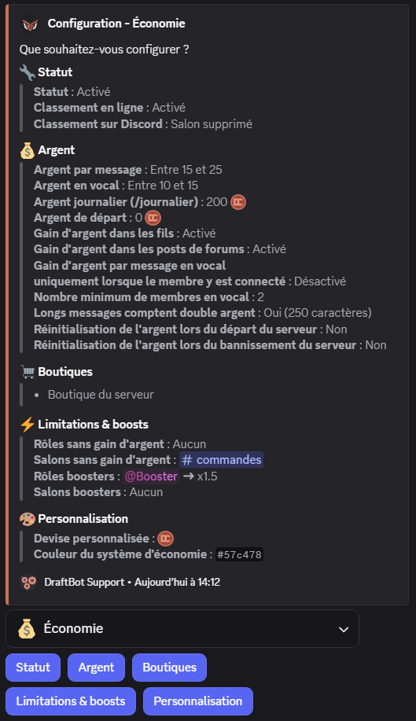

    Le corps du **message** vous permet de consulter en un coup d'œil l'**état actuel** de votre système économique, tandis que les **boutons** situés au-dessous vous permettent d'en **modifier la configuration**.

    ::collapse{ label="Statut" }
      Ce menu vous permet de :
      - Activer / Désactiver le système d'économie
      - Activer / Désactiver le classement en ligne
      - Activer / Désactiver le classement sur Discord (<:icon_premium:1096140508625125417>)

      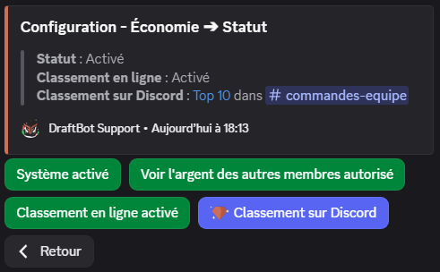

      ::hint{ type="success" }
        Lorsque vous activez le classement sur Discord, vous avez le choix entre utiliser un salon existant ou laisser DraftBot en créer un pour vous. Vous pouvez même définir le nombre de lignes du classement à afficher !
      ::
    ::

    ::collapse{ label="Argent" }
      Ce menu vous permet de :
      - Activer / Désactiver / Régler la somme reçue à chaque message
      - Activer / Désactiver / Régler la somme reçue en vocal (<:icon_premium:1096140508625125417>)
      - Configurer la somme réclamable quotidiennement via la commande \</daily> (ou \</journalier>)
      - Configurer l'argent de départ donné aux nouveaux membres
      - Activer / Désactiver le gain d'argent dans les fils
      - Activer / Désactiver le gain d'argent dans les posts de forums
      - Activer / Désactiver le gain d'argent par message en vocal
      - Activer / Désactiver / Régler les gains x2 pour les messages longs
      - Choisir si l'argent des membres quittant le serveur est remis à 0
      - Choisir si l'argent des membres bannis est remis à 0

      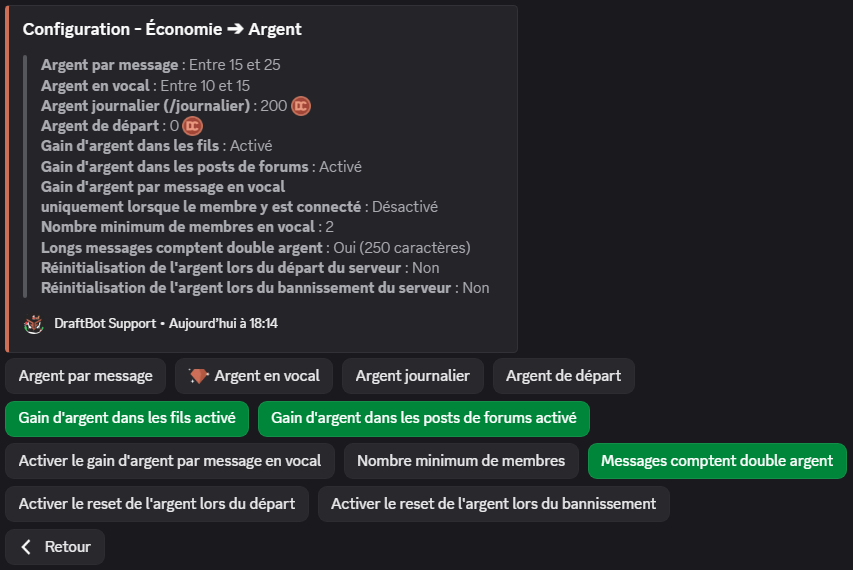
    ::

    ::collapse{ label="Limitations & Boosts" }
      Ce menu sert à configurer des gains différents en fonction du rôle d'un membre ou du salon dans lequel il poste un message. Vous pouvez définir :
      - Pour quels rôles activer/désactiver le gain d'argent,
      - dans quels salons activer/désactiver le gain d'argent,
      - à quels rôles appliquer un multiplicateur (de x1.5 à x3),
      - à quels salons appliquer un multiplicateur (de x1.5 à x3).

      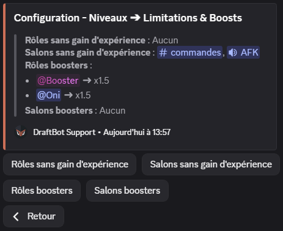
    ::

    ::collapse{ label="Personnalisation" }
      Ce menu propose des personnalisations exclusives réservées aux serveurs [<:icon_premium:1096140508625125417> Premium](/premium) :
      - Personnaliser l'émoji de votre monnaie
      - Personnaliser la couleur de l'interface d'économie (vert par défaut)

      

      ::hint{ type="success" }
        Lorsque vous personnalisez la devise, vous pouvez même utiliser les émojis personnalisés de votre serveur !
        
      ::
    ::

    ::hint{ type="info" }
      Les fonctionnalités accompagnées du symbole <:icon_premium:1096140508625125417> sont réservées aux <:icon_premium:1096140508625125417>[serveurs premium](/premium) !
    ::
  ::
::

## Configurer les boutiques

### Créer une boutique

::tabs
  ::tab{ label="Depuis le panel" }

    [⫸ Accéder au panel de **DraftBot**](/dashboard/first/economy)

    Pour créer une boutique depuis le [**Panel**](/dashboard/first/economy), cliquez sur le bouton **"Créer une boutique"** dans la section "Configuration des boutiques" :

    

    Une fenêtre s'ouvre pour configurer votre nouvelle boutique :

    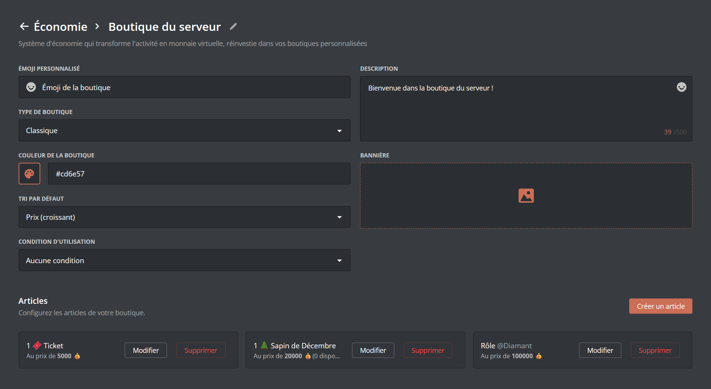

    **Paramètres de la boutique :**
    - **Nom** : Le nom de votre boutique (50 caractères maximum)
    - **Description** : Une description de la boutique (500 caractères maximum)
    - **Style** : Choisissez entre "Classique" ou "Marché noir"

    ::hint{ type="info" }
      Si votre serveur possède déjà des boutiques, elles apparaîtront en bas de l'écran, et vous pourrez les modifier / supprimer.
    ::
  ::

  ::tab{ label="Via la commande /config" }
    Via la commande \</config>, accédez au menu "Économie" puis "Boutique". Vous pourrez alors créer, modifier ou supprimer des boutiques.

    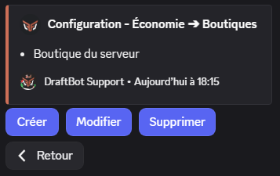

    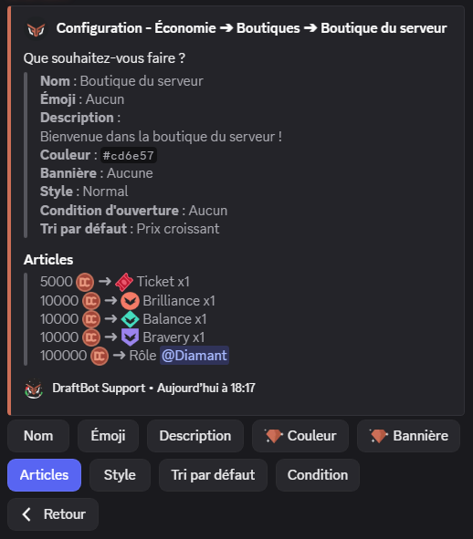
  ::
::

::hint{ type="info" }
  Les serveurs [premium](/premium) peuvent créer jusqu'à 5 boutiques.
::

### Personnaliser votre boutique

Une fois votre boutique créée, vous pouvez la personnaliser davantage :

| Paramètre | Description | Premium |
|-----------|-------------|---------|
| **Emoji** | Ajoutez un emoji qui s'affichera à côté du nom de la boutique |  |
| **Description** | Choisissez une description pour créer l'histoire de votre boutique |  |
| **Style** | Choisissez entre "Classique" ou "Marché noir" |  |
| **Tri par défaut** | Définissez l'ordre de tri par défaut des articles |  |
| **Conditions d'accès** | Restreignez l'accès à la boutique selon des conditions (rôles, niveaux, etc.) |  |
| **Couleur** | Personnalisez la couleur de l'interface de la boutique | <:icon_premium:1096140508625125417> |
| **Bannière** | Ajoutez une image de bannière en haut de la boutique (800x137px recommandé) (10Mo max) | <:icon_premium:1096140508625125417> |

### Créer un article de boutique

Pour ajouter des articles à votre boutique :

::tabs
  ::tab{ label="Depuis le panel" }

    [⫸ Accéder au panel de **DraftBot**](/dashboard/first/economy)

    1. Cliquez sur le bouton **"Modifier"** de la boutique concernée
    2. Cliquez sur **"Créer un article"**
    3. Remplissez les informations de l'article

    
  ::

  ::tab{ label="Via la commande /config" }
    Via la commande \</config>, accédez au menu "Économie" > "Boutique" > "Créer / Modifier / Supprimer un article".

    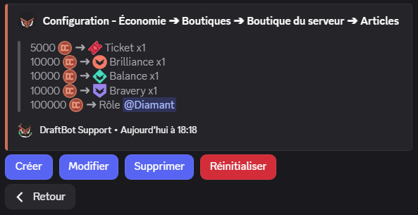
  ::
::

**Informations communes à tous les types d'articles :**
- **Type** : Le type d'article (rôle, rôle temporaire, expérience, objet, personnalisé)
- **Prix** : Le coût de l'article en argent du serveur
- **Description** : Une description de l'article (1000 caractères maximum)
- **Stock** : Quantité disponible (voir la section [Stock d'un article](#stock-dun-article))

::tabs
  ::tab{ label="Rôle" }
    Vous pouvez permettre à vos membres d'acquérir des rôles (temporaires ou permanents) en échange de devises. Pour ajouter un rôle à la boutique, sélectionnez le type d'article **"rôle"** ou **"rôle temporaire"** dans le menu de création d'article.

    Choisissez ensuite :
    - Le prix de l'article
    - Le rôle à attribuer
    - La description de l'article
    - La durée du rôle *(dans le cas d'un rôle temporaire)*

    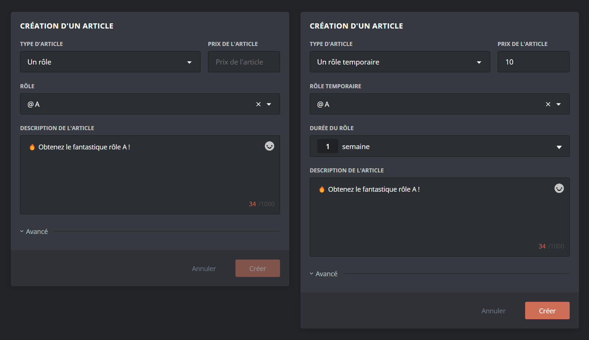

    ::hint{ type="warning" }
      Le rôle sélectionné doit avoir été créé au préalable sur votre serveur, et être accessible à DraftBot (donc ne pas être situé plus haut que le rôle le plus élevé de DraftBot).
    ::

    ::hint{ type="info" }
      Si un membre tente d'acheter un rôle qu'il possède déjà, l'achat sera refusé avec un message d'erreur explicite.
    ::
  ::

  ::tab{ label="Expérience" }
    Si le [système de niveaux](/docs/modules/niveaux) est activé, vous pouvez permettre à vos membres d'acheter des points d'expérience en échange de devises. Pour ajouter une somme d'XP à la boutique, sélectionnez le type d'article **"De l'expérience"** dans le menu de création d'article.

    Choisissez ensuite :
    - Le prix de l'article
    - La quantité d'expérience à attribuer
    - La description de l'article

    

    ::hint{ type="warning" }
      Le système de niveaux doit être **activé** sur votre serveur pour utiliser ce type d'article. Si vous le désactivez, un avertissement s'affichera lors de l'achat.
    ::

    **Comportements particuliers :**

    - **Montée de niveau** : Si l'achat d'XP fait monter le membre de niveau, il recevra automatiquement les récompenses de niveau configurées et une annonce sera envoyée (si activée).
    - **Limite de niveau** : Si un niveau maximum est défini (serveurs premium), les membres ayant atteint ce niveau ne pourront plus acheter d'XP.
  ::

  ::tab{ label="Objet Inventaire" }
    Vous pouvez créer des objets fictifs à ajouter à l'inventaire. Pour proposer des objets d'inventaire à la vente dans votre boutique, sélectionnez le type d'article **"Un objet d'inventaire"** dans le menu de création d'article.

    Choisissez ensuite :
    - Le prix de l'article
    - L'objet à vendre
    - Le nombre d'objets à attribuer par achat
    - La description de l'article

    

    ::hint{ type="info" }
      Si vous n'avez pas encore créé d'objets, vous devrez d'abord [configurer votre inventaire](/docs/modules/inventaire) depuis le module Inventaire du panel.
    ::
  ::

  ::tab{ label="Article Personnalisé" }
    Si vous souhaitez permettre à vos membres d'acheter d'autres articles, comme par exemple des codes promotionnels, des clés d'activation, ou bien des objets "réels", DraftBot a la solution !

    Pour ajouter un article personnalisé à la boutique, sélectionnez le type d'article **"Un article personnalisé"** dans le menu de création d'article.

    Choisissez ensuite :
    - Le prix de l'article
    - Le nom de l'article
    - La description de l'article

    

    ::hint{ type="success" }
      **Comment ça fonctionne ?** Lorsqu'un membre achète cet article, **vous recevez une notification par message privé de DraftBot** avec les informations du membre. Vous pouvez alors lui remettre la récompense "en main propre" comme vous le souhaitez.
    ::

    ::hint{ type="warning" }
      Assurez-vous que vos messages privés sont ouverts pour recevoir les notifications d'achat ! Si vos MP sont fermés, le membre recevra un message d'erreur lors de l'achat.
    ::
  ::
::

### Stock d'un article

Un article est par défaut en quantité illimité. Les serveurs [premium](/premium) peuvent définir un **stock limité** pour chaque article. Une fois épuisé, l'article ne peut plus être acheté jusqu'à ce que vous réapprovisionniez le stock manuellement.

::hint{ type="info" }
  Le stock est géré article par article. Vous pouvez avoir certains articles en stock illimité et d'autres en quantité limitée dans la même boutique.
::

## Migration depuis UnbelievaBoat

Si vous utilisiez déjà un système d'économie via UnbelievaBoat, vous avez la possibilité d'importer l'argent de vos membres dans le système d'économie de DraftBot !

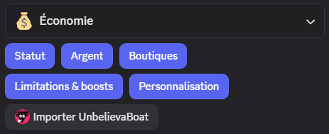

Après avoir cliqué sur **Importer UnbelievaBoat**, et confirmé que vous souhaitez procéder à l'importation, DraftBot récupèrera automatiquement toutes les informations d'argent des membres.

::hint{ type="warning" }
  Assurez-vous que UnbelievaBoat est présent sur votre serveur au moment de l'importation !
::

