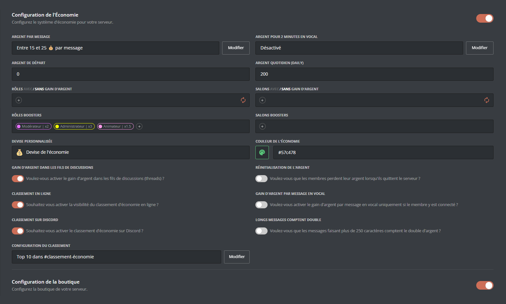

## Introduction
Le module d'économie DraftBot comprend deux parties :
- Le système d'économie
- La boutique

Ces deux systèmes peuvent être configurés depuis le [**panel** de DraftBot](/dashboard/first/economie), ou depuis Discord via la commande \</config>.

## Configuration du module

::tabs
  ::tab{ label="Depuis le panel" }
    [⫸ Accéder au panel de **DraftBot**](/dashboard/first/economie)

    La première étape pour activer le système est de cliquer sur ce bouton.

    

    Ensuite, l'ensemble des [fonctionnalités](#fonctionnalites-disponibles) apparaît :
    

    ::hint{type="warning"}
      Une fois vos modifications terminées, n'oubliez pas d'enregistrer vos modifications avec le bouton "Enregistrer" situé en bas de page !
    ::

  ::
  ::tab{ label="Via la commande /config" }

    Si vous souhaitez effectuer toute la configuration directement depuis [Discord](https://discord.com/), vous pouvez le faire via la commande \</config>, puis en vous rendant dans l'onglet "Économie". Le menu ressemble alors à ceci :
    
    Le corps du **message** vous permet de consulter en un coup d'oeil l'**état actuel** de votre système économique, tandis que les **boutons** situés au dessous vous permettent d'en **modifier la configuration**.\
    Voici le détail de chaque bouton :

    ::collapse{ label="Statut" }
      Ce menu vous permet de :
      - Activer / Désactiver le système d'économie
      - Activer / Désactiver le classement en ligne
      - Activer / Désactiver le classement sur Discord (<:icon_premium:1096140508625125417>)

      
    ::

    ::collapse{ label="Argent" }
      Ce menu vous permet de :
      - Activer / Désactiver / Régler la somme reçue à chaque message
      - Activer / Désactiver / Régler la somme reçue en vocal (<:icon_premium:1096140508625125417>)
      - Configurer la somme réclamable quotidiennement via la commande \</daily> (ou \</journalier>)
      - Activer / Désactiver le gain d'argent dans les fils
      - Activer / Désactiver le gain d'argent par message en vocal
      - Activer / Désactiver/ Régler les gains x2 pour les messages longs
      - Choisir si l'argent des membres quittant le serveur est remis à 0

      
    ::
    ::collapse{ label="Boutique" }
      Ce menu vous permet de configurer la boutique de votre serveur, vous pouvez ainsi :
      - Créer / Modifier / Supprimer un article de boutique
      - Modifier le type de boutique
      - Réinitialiser la boutique

      
    ::
    ::collapse{ label="Limitations & Boosts" }
      Ce menu sert à configurer des gains différents en fonction du rôle d'un membre, ou du salon dans lequel il poste un message. Vous pouvez :
      - Définir quels rôles ne sont pas autorisés à gagner d'argent
      - Définir quels salons ne sont pas autorisés à gagner d'argent
      - Définir à quels rôle appliquer un multiplicateur (de x1.5 à x3)
      - Définir à quels salons appliquer un multiplicateur (de x1.5 à x3)

      
    ::
    ::collapse{ label="Personnalisation" }
      Ce menu propose des personnalisations exclusives réservées aux abonnés [<:icon_premium:1096140508625125417>DraftBot premium](https://www.draftbot.fr/premium) :
      - Personnaliser l'emoji de votre monnaie
      - Personnaliser la couleur de l'interface d'économie (vert par défaut)

      
      ::hint{ type="success" }
        Lorsque vous personnalisez la devise, vous pouvez même utiliser les emojis personnalisés de votre serveur !
        
      ::
    ::
    ::hint{ type="info" }
      Les fonctionnalités accompagnées du symbole <:icon_premium:1096140508625125417> sont réservées aux abonnés <:icon_premium:1096140508625125417>[DraftBot premium](https://www.draftbot.fr/premium)

    ::
  ::
::

::hint{ type="success" }
  Pour consulter votre solde personnel, utilisez la commande \</argent>. Pour consulter le solde d'un autre membre, ajoutez simplement sa mention en argument de la fonction \</argent>.

  ::collapse{ label="Afficher l'exemple :" }
    
  ::

::

## Fonctionnalités disponibles

Avec DraftBot, vous êtes aux commandes ! Le système d'économie permet un très grand niveau de personnalisation pour s'adapter à vos besoins. Voici les fonctionnalités configurables :

::collapse{ label="Afficher / masquer la liste de fonctionnalités" }

  |     **NOM**    | **EXPLICATION** ||
  |------------|-------------|-|
  |**Argent par message**|Modifier ou désactiver la somme gagnée à chaque message envoyé||
  |**Argent de départ**|Modifier la somme de base reçue en rejoignant le serveur ||
  |**Rôles avec/sans gain d'argent**|Restreindre le gain d'argent à certains rôles||
  |**Rôles boosters**|Régler des multiplicateurs de gains pour certains rôles||
  |**Devise personnalisée**|Personnaliser le nom et l'icône de votre devise|<:icon_premium:1096140508625125417>|
  |**Argent pour 2 minutes  en vocal**|Définir la somme gagnée en vocal|<:icon_premium:1096140508625125417>|
  |**Argent quotidien**|Régler la somme que les membres peuvent réclamer chaque jour via \</daily>|
  |**Salons avec/sans gain d'argent**|Restreindre le gain d'argent à certains salons|
  |**Salons boosters**|Régler des multiplicateurs de gains pour certains salons|
  |**Couleur de l'économie**|Personnaliser la couleur de l'interface économie|<:icon_premium:1096140508625125417>|
::

En plus de ces fonctionnalités, 6 options à activer/désactiver vous permettent d'aller encore plus loin dans la configuration de votre économie :

::collapse{ label="Afficher / masquer la liste des options" }

  |     **NOM**    | **EXPLICATION** ||
  |------------|-------------|-|
  |**Gain d'argent dans les fils de discussions**|Autoriser ou non les membres à gagner de l'argent dans les fils||
  |**Classement en ligne**|Activer ou non l'affichage du classement sur le web||
  |**Classement sur Discord**|Activer ou non l'affichage dynamique du classement sur le serveur|<:icon_premium:1096140508625125417>|
  |**Réinitialisation argent**|Définir si les membres perdent leur argent en quittant le serveur||
  |**Gain d'argent par message en vocal**|Définir si les messages textuels envoyés dans les salons vocaux rapportent de l'argent ou non||
  |**Longs messages comptent double**|Définir si les longs messages donnent le double de points||

  ::hint{ type="success" }
    Pour la configuration "Longs messages comptent double", vous pouvez même spécifier à partir de combien de caractères un message est considéré comme "long" (250 par défaut) !
  ::

  ::hint{ type="info" }
    Lorsque vous activez le Classement sur Discord, vous avez le choix entre utilisé un salon existant ou laisser DraftBot en créer un pour vous. Vous pouvez aussi choisir combien de lignes du classement doivent être affichées (10 par défaut).
  ::

::

::hint{ type="info" }
  Les fonctionnalités ou options accompagnées de l'icône <:icon_premium:1096140508625125417> sont exclusives, et réservées aux abonnés [<:icon_premium:1096140508625125417>DraftBot premium](https://www.draftbot.fr/premium).
::

## La boutique
Une fois configurée, la boutique permettra aux membres de votre serveur d'échanger leurs devises contre des items de votre choix. Il peut s'agir de rôles (temporaires ou non), de points d'expérience, d'objets d'inventaire, et même d'articles personnalisés !

### Configurer la boutique
La configuration de base de la boutique se fait comme ceci :

::tabs
  ::tab{ label="Depuis le panel" }

    [⫸ Accéder au panel de **DraftBot**](/dashboard/first/economie)

    Pour activer la boutique depuis le [**Panel**](/dashboard/first/economie), il faut tout d'abord activer l'interrupteur situé en face de "Configuration de la boutique" :
    <!-- ajouter screenshot -->
    

    Ensuite, deux options s'offrent à vous :

    - Créer un [article](#items-de-la-boutique)
    - Configurer le [type de boutique](#type-de-boutique)

    ::hint{ type="info" }
      Si votre boutique comporte déjà des articles, ils apparaîtront en bas de l'écran, et vous pourrez les modifier / supprimer.
    ::

  ::

  ::tab{ label="Via la commande /config" }
    Via la commande \</config>, un menu permettant de configurer la boutique s'affiche, il permet de  :

    - Créer / Modifier / Supprimer un [article de boutique](#items-de-la-boutique)
    - Modifier le [type de boutique](#type-de-boutique)
    - Réinitialiser la boutique

    

  ::
::
### Items de la boutique
DraftBot vous permet d'intégrer à votre boutique des items de types variables :

::tabs
  ::tab{ label="Rôle" }
    Vous pouvez permettre à vos membres d'acquérir des rôles (temporaires ou permanents) en échange de  devises. Pour ajouter un rôle à la boutique, sélectionnez le type d'article **"rôle"** ou **"rôle temporaire"** dans le menu de création d'article.\
    Choisissez ensuite :
    - Le prix de l'article
    - Le rôle à attribuer
    - La description de l'article
    - la durée du rôle *(dans le cas d'un rôle temporaire)*

    ::hint{ type="warning" }
      Le rôle sélectionné doit avoir été créé au préalable sur votre serveur, et être accessible à DraftBot (donc ne pas être situé plus haut que le rôle le plus élevé de DraftBot).
    ::
  ::

  ::tab{ label="Expérience" }
    Si le [système de niveaux]() est activé, vous pouvez permettre à vos membre d'acheter des points d'expérience en échange de devises. Pour ajouter une somme d'xp à la boutique, sélectionnez le type d'article **"De l'expérience"** dans le menu de création d'article.\
    Choisissez ensuite :
    - Le prix de l'article
    - La quantité d'expérience à attribuer
    - La description de l'article
  ::

  ::tab{ label="Objet Inventaire" }
    Vous pouvez créer des objets fictifs à ajouter à l'inventaire. Pour proposer des objets d'inventaire à la vente dans votre boutique, sélectionnez le type d'article **"Un objet d'inventaire"** dans le menu de création d'article.\
    Choisissez ensuite :
    - Le prix de l'article
    - L'objet à vendre
    - Le nombre d'objets à attribuer par achat
    - La description de l'article

    ::hint{ type="info" }
      Si vous n'avez pas encore d'objets en boutique, vous pouvez en [créer directement](#creer-des-objets-d-inventaire) :
      <!-- ajouter screenshot -->
      
    ::
  ::

  ::tab{ label="Article Personnalisé" }
    Si vous souhaitez permettre à vos membres d'acheter d'autres articles, comme par exemple des codes promotionnels, des clés d'activation, ou bien des objets "réels", DraftBot a la solution !\
    Pour ajouter unun article personnalisé à la boutique, sélectionnez le type d'article **"Un article personnalisé"** dans le menu de création d'article.\
    Choisissez ensuite :
    - Le prix de l'article
    - Le nom de l'article
    - La description de l'article

    Lorsqu'un membre achètera cet item, vous serez notifié par DraftBot dans vos messages privés, et vous pourrez ainsi le remettre "en main propre" au membre qui l'a acheté.
  ::

::
::hint{ type="info" }
  En déroulant le menu "avancé" lors de la création d'un article de boutique, l'option "stock" apparaît.\
  - Par défaut, le stock est réglé sur "Illimité"
  - Si vous êtes abonné [<:icon_premium:1096140508625125417>DraftBot premium](https://www.draftbot.fr/premium), vous pouvez le modifier, pour créer des articles en quantité limitée !
::
### Créer des objets d'inventaire
Il est possible de créer des objets d'inventaire depuis le menu de création d'article. Pour cela, il faut :
- Cliquer sur "Créer un objet" dans le menu de sélection d'objet.
- Entrer le nom de l'objet

::hint{ type="success" }
  Vous pouvez intégrer des emojis Discord au nom de votre objet !
::
### Type de boutique
DraftBot vous permet de choisir entre deux modes pour votre boutique :

1. **Marché noir**  : Le message d'accès à la boutique disparaît après 60 secondes.
2. **Classique**    : Le message d'accès à la boutique ne disparaît pas.

- \</journalier> ➜ Commande journalière permettant de gagner un montant défini au préalable par les administrateurs.
- \</payer> ➜ Donner de l'argent à un membre de votre choix.

## Classement

Vous pouvez afficher le classement des membres, du plus riche au moins riche, de trois façons :

::collapse{ label="En entrant la commande /topargent sur discord" }

  

::

::collapse{ label="En ligne, depuis le Panel" }
  Si vous avez [activé le classement en ligne](#fonctionnalites-disponibles), vous pouvez le consulter en vous rendant sur le [**panel**](/dashboard/first/economie) et en cliquant sur le bouton **"Accéder au classement"**.

  

::

::collapse{ label="Via un salon dédié (premium)" }
  Si vous avez [activé le classement sur Discord](#fonctionnalites-disponibles), vous pouvez le consulter en vous rendant dans le salon dédié sur votre serveur.

  

::

## Migration

Si vous utilisiez UnbelievaBoat auparavant, il est possible d'importer l'économie de vos membres directement sur DraftBot afin qu'ils ne perdent pas leur progression.

::hint{ type="info" }
  Il faut impérativement que le bot UnbelievaBoat soit sur votre serveur lors de la migration.
::

Pour migrer vers le système de DraftBot, utiliser la commande \</config>.

