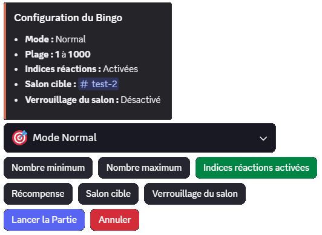

## Qu'est-ce que le Bingo ?

Le **Bingo** est un jeu de devinette compétitif où les joueurs doivent trouver un **nombre secret** choisi par DraftBot. Chaque tentative vous rapproche du nombre mystère grâce aux indices donnés par le bot !

::hint{ type="success" }
  Soyez le **premier à deviner** le nombre secret pour remporter la victoire et apparaître dans les statistiques de la partie !
::

### Rejoindre une partie

Lorsqu'une partie de bingo est lancée dans un salon, vous verrez apparaître un message d'annonce avec :
- La **plage de nombres** dans laquelle se trouve le nombre secret
- Le **mode de jeu** (Normal ou Chrono)
- La **durée** (si mode Chrono)
- Une **récompense** potentielle (optionnel)

### Faire une tentative

Pour participer, **envoyez simplement un nombre** dans le salon où la partie se déroule.

::hint{ type="info" }
  Le Bingo est un **jeu de déduction** ! Le bot ne vous dit **PAS** si votre tentative est trop haute ou trop basse. Vous devez déduire le nombre secret en observant les tentatives des autres joueurs et les indices donnés.
::

::hint{ type="info" }
  Chaque tentative est enregistrée et utilisée pour calculer vos **statistiques de performance** : nombre d'essais, temps écoulé, efficacité, et proximité du nombre.
::

### Réactions de proximité

Si les **indices réactions** sont activés, DraftBot peut réagir avec des emojis lorsque vous êtes **très proche** du nombre secret :

| Emoji | Signification | Proximité |
|-------|---------------|-----------|
| 🔥 | **Brûlant !** | Vous êtes extrêmement proche (≤0,5% de la plage) |
| ♨️ | **Très chaud !** | Vous êtes très proche (≤1,5% de la plage) |
| 🌡️ | **Chaud !** | Vous êtes proche (≤5% de la plage) |
| ❄️ | **Tiède** | Vous êtes dans la zone (≤10% de la plage) |

::hint{ type="warning" }
  Les réactions de proximité n'apparaissent que si **au moins 30 secondes** se sont écoulées depuis la dernière réaction. Elles ne sont pas données à chaque tentative !
::

### Gagner la partie

Le **premier joueur à deviner** le nombre secret remporte la partie ! Un message de victoire célèbre votre réussite.

::hint{ type="warning" }
  Les personnes ayant accès au **tableau de bord admin** (créateur et administrateurs) ne peuvent **pas participer** à la partie après avoir vu le nombre secret.
::

## Indices dynamiques

Pendant la partie, des **indices** peuvent être donnés **manuellement par l'organisateur** via le tableau de bord admin pour aider les joueurs à se rapprocher du nombre secret.

| Type d'indice | Description | Exemple |
|---------------|-------------|---------|
| **Parité** | Indique si le nombre est pair ou impair | "Le nombre est **pair**" |
| **Comparaison médiane** | Compare le nombre à la médiane de la plage | "Le nombre est **inférieur à 500**" |
| **Nombre de chiffres** | Révèle combien de chiffres composent le nombre | "Le nombre a **3 chiffres**" |
| **Plage de valeurs** | Donne une plage restreinte | "Le nombre est entre **400 et 600**" |
| **Somme des chiffres** | Révèle la somme de tous les chiffres | "La somme des chiffres est **15**" |
| **Chiffre contenu** | Révèle un ou plusieurs chiffres présents | "Le nombre contient le chiffre **7**" |
| **Divisibilité** | Indique par quels nombres il est divisible | "Le nombre est divisible par **5**" |
| **Joueur le plus proche** | Montre qui s'est le plus approché | "@Joueur s'est le plus approché avec **523**" |
| **Position d'un chiffre** | Révèle la position d'un chiffre spécifique | "Le chiffre **5** est en position **2**" |
| **Chiffres répétés** | Indique si des chiffres se répètent | "Tous les chiffres sont **différents**" |
| **Sagesse collective** | Analyse des tentatives autour de la médiane | "**70%** des joueurs ont tenté au-dessus de 500 - ils avaient raison !" |

::hint{ type="info" }
  Les indices sont envoyés sous forme de **messages dans le salon** par l'organisateur. Ils sont visibles par tous les joueurs et les aident collectivement à se rapprocher du nombre secret.
::

## Modes de jeu

Le Bingo propose deux modes de jeu adaptés à vos envies :

### Mode Normal

La partie continue jusqu'à ce qu'un joueur trouve le nombre ou qu'il n'y ait **plus d'activité pendant 5 minutes**.

**Caractéristiques :**
- ⏰ Durée illimitée (tant qu'il y a de l'activité)
- 🔄 Le compteur d'inactivité se réinitialise à chaque tentative
- 🎯 Idéal pour les parties détendues

### Mode Chrono ⏱️

Les joueurs ont un **temps limité** (configurable de 1 à 120 minutes) pour trouver le nombre.

**Caractéristiques :**
- ⏳ Compte à rebours visible
- 🏃 Pression du temps pour créer du suspense
- 🎲 Stratégie requise pour optimiser ses tentatives

::hint{ type="success" }
  Le **mode Chrono** est parfait pour créer de l'urgence et dynamiser la partie !
::

## Statistiques de fin de partie

À la fin de chaque partie, des statistiques détaillées sont affichées pour tous les joueurs :

## Organiser une partie

Pour organiser une partie de bingo sur votre serveur, utilisez la commande \</bingo>.

::hint{ type="warning" }
  Le Bingo n'est **pas compatible** avec la **Route de l'infini**. Vous ne pouvez pas lancer une partie de bingo dans un salon utilisé pour la [Route de l'infini](/docs/modules/route-infini).
::

::hint{ type="info" }
  Un serveur ne peut organiser qu'une seule partie à la fois. Les serveurs [premium](/premium) <:icon_premium:1096140508625125417> peuvent lancer jusqu'à 5 parties en même temps.
::

### Plage de nombres

Définissez le **nombre minimum** et le **nombre maximum** entre lesquels le nombre secret sera choisi.

::hint{ type="info" }
  - **Plage autorisée** : de **-10 000 000** à **10 000 000**
  - Le nombre minimum doit être inférieur au nombre maximum
  - Les **nombres négatifs** sont acceptés !
::

::hint{ type="success" }
  Pour une partie rapide et accessible, utilisez une plage de **1 à 100**. Pour un défi plus complexe, augmentez jusqu'à **1 à 1000** ou plus !
::

### Mode de jeu

Choisissez entre :
- **Mode Normal** : Partie illimitée avec arrêt après 5 minutes d'inactivité
- **Mode Chrono** : Temps limité configurable (1 à 120 minutes)

### Réactions de proximité

Activez les **réactions de proximité** pour que DraftBot réagisse avec des emojis de température sur les messages des joueurs lorsqu'ils sont proches du nombre secret.

::hint{ type="info" }
  Les réactions de proximité (🔥 ♨️ 🌡️ ❄️) aident les joueurs à savoir quand ils sont dans la bonne zone, sans révéler directement le nombre ! Elles n'apparaissent que si le joueur est à moins de 10% de la plage et au maximum toutes les 30 secondes.
::

### Récompense

Définissez une récompense optionnelle pour motiver vos membres ! Cette récompense sera affichée dans le message de lancement.

::hint{ type="warning" }
  La récompense est purement **informative** et doit être distribuée **manuellement** par vous-même. Elle peut être n'importe quoi : un rôle spécial, de l'argent DraftBot, un cadeau IRL, etc.
::

### Salon cible

Choisissez où votre partie se déroulera :

**Option 1 : Sélectionner un salon existant**
- La partie sera lancée dans un salon de votre choix
- Vous devez avoir les permissions nécessaires dans ce salon

**Option 2 : Nouveau salon dédié**
- DraftBot créera automatiquement un nouveau salon
- Choisissez la catégorie et personnalisez le nom
- Le salon est créé au moment du lancement

::hint{ type="info" }
  Pour créer un nouveau salon, vous devez posséder la permission **Gérer les salons**.
::

::hint{ type="success" }
  Si vous choisissez une catégorie, DraftBot suggérera automatiquement un nom de salon intelligent basé sur les noms des salons existants dans cette catégorie !
::

### Verrouillage du salon

Pour les serveurs très actifs, activez le **verrouillage du salon** qui se déclenchera automatiquement à la fin de la partie :

**Fonctionnalités :**
- 🔒 **Verrouillage automatique** : Le salon est verrouillé pour empêcher de nouveaux messages
- ⏱️ **Délai de déverrouillage** : Configurez entre **5 et 300 secondes** (20s par défaut)
- 💬 **Création d'un fil** : Un fil de discussion est automatiquement créé pour continuer les échanges

::hint{ type="info" }
  Le **verrouillage du salon** nécessite la permission **Gérer les permissions** dans le salon cible. Le créateur de la partie conservera toujours la possibilité d'écrire dans le salon verrouillé.
::

## Tableau de bord admin

Le créateur de la partie et les administrateurs du serveur ont accès à un **tableau de bord admin** en utilisant \</bingo> pendant qu'une partie est en cours.

::hint{ type="info" }
  Si une partie est déjà en cours dans le salon actuel et que vous en êtes le créateur ou que vous avez la permission **Administrateur**, vous accéderez directement au **tableau de bord admin**.
::

### Informations affichées

Le tableau de bord affiche en **temps réel** :
- 🔐 Le **nombre secret**
- ⏱️ Le **temps écoulé**
- 👥 Nombre de participants
- 🎲 Nombre de tentatives
- 📊 Tentatives par joueur
- 💡 Indices donnés
- ⚡ Rythme d'activité

::hint{ type="info" }
  Le tableau de bord se **rafraîchit automatiquement toutes les 3 secondes** pour afficher des données en temps réel.
::

### Actions disponibles

| Action | Description |
|--------|-------------|
| **Donner un indice** | Choisissez manuellement un indice à révéler aux joueurs dans le salon |
| **Activer/Désactiver les réactions de proximité** | Active ou désactive les réactions emoji (🔥 ♨️ 🌡️ ❄️) sur les tentatives proches |
| **Arrêter la partie** | Met fin à la partie immédiatement |
| **Déverrouiller le salon** | Déverrouille manuellement le salon si le verrouillage est actif |
| **Nombre et stats avancées** | Révèle le nombre secret et les statistiques détaillées aux administrateurs (bloqué si une récompense est définie) |

### Statistiques avancées

Les administrateurs peuvent accéder à des statistiques encore plus détaillées via le bouton **"Nombre et stats avancées"** :

**Engagement des joueurs :**
- Joueurs actifs récemment (5 minutes avant la partie)
- Joueurs actifs au lancement
- Taux d'engagement global
- Efficacité des indices donnés
- Nombre de joueurs en progression

**Proximité du nombre secret :**
- Joueurs très proches (≤10 de différence)
- Joueurs avec excellente précision (80%+)
- Joueurs avec bonne précision (50-80%)
- Joueurs en difficulté (<50%)

**Records de performance :**
- Joueur le plus proche du nombre
- Joueur le plus actif
- Meilleur ratio efficacité
- Plus longue série d'améliorations

::hint{ type="warning" }
  Cette fonctionnalité est **désactivée si une récompense est définie** pour éviter toute tricherie. Seuls les **administrateurs du serveur** peuvent y accéder.
::
