## À quoi sert-il ?

Les rôles sécurisés sont un système de protection avancée qui ajoute une couche de sécurité supplémentaire aux permissions sensibles de votre serveur Discord. Il permet de rendre les rôles à haut risque (administrateur, modérateur…) utilisables uniquement après une authentification forte (A2F – Authentification à Deux Facteurs) ou clé de sécurité.

### Le problème

Discord permet déjà d'activer le A2F sur les comptes, mais cela ne protège pas votre serveur contre :

- Le **vol de token** (token grab)
- Le **phishing** (pages de connexion falsifiées)
- Les **malwares** qui récupèrent les sessions

### La solution

Avec les rôles sécurisés, les permissions sensibles ne sont **attribuées que temporairement** après une authentification A2F ou clé de sécurité (Face ID, Touch ID, clé physique ou clé d'accès).

Même si un attaquant vole un compte Discord, il ne peut pas utiliser les permissions destructives du serveur.

### Cas d'utilisation principaux
- **Protection anti-hack** : Les comptes staff piratés ne peuvent pas détruire le serveur
- **Accès en temps voulu** : Évite les erreurs accidentelles de modération
- **Salons privés protégés** : L'accès aux informations sensibles nécessite une connexion

### Rôles visuels et les rôles à permissions

- `🛡️ Admin` (couleur, sans permissions, affichage dans la hiérarchie)
- `Admin Perms` (caché, vraies permissions)

Le staff conserve son rôle & badge visible au prêt de la communauté, mais les permissions réelles nécessitent une connexion.

## Authentification A2F

Pour configurer un compte A2F à **DraftBot**, vous devez vous rendre dans le [panel de **DraftBot**](/dashboard/user/security), puis dans la section "**Sécurité**" de votre compte.

En haut de la page, vous trouverez la section dédiée à cet effet.

Vous pourrez configurer un compte en appuyant sur "**Configurer**".

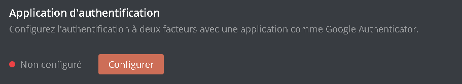

## Configuration

Voici les différentes sections que vous retrouverez.

### Rôles à risque

Les rôles à risque permettent d'identifier puis de sécuriser les rôles ayant des permissions sensibles.

::tabs
  ::tab{ label="Via le panel" }
    [⫸ Accéder au panel de **DraftBot**](/dashboard/first/permguard)

    Lorsqu'un rôle détient des permissions dangereuses pour des membres n'étant pas modérateur, alors le rôle en question sera affiché dans l'encadré ci-dessous.

    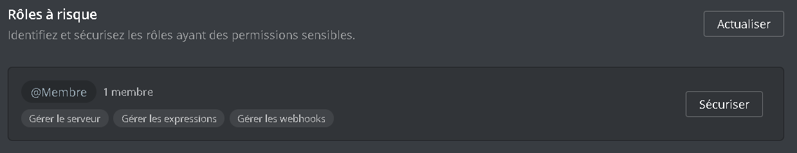

    Pour **sécuriser** ce rôle, vous devrez alors appuyer sur le bouton "**Sécuriser**" qui apparaît à la droite de la section.

    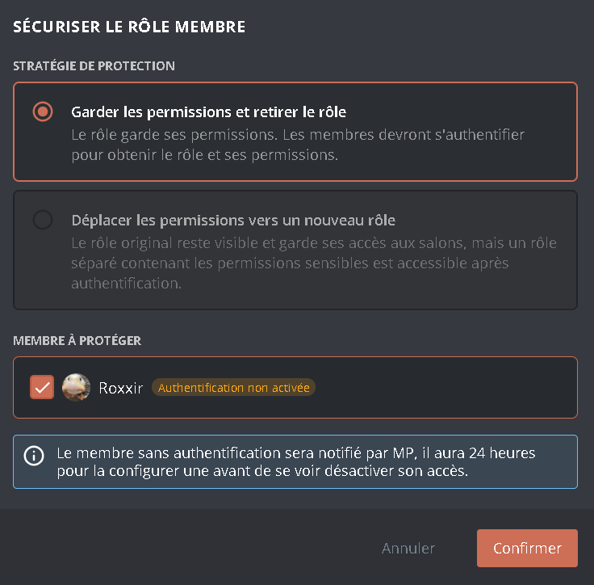

    **2 options** s'offrent à vous :
    1. **Garder les permissions et retirer le rôle :** Les membres ayant ce rôle devront s'authentifier afin d'avoir accès à ce rôle.
    2. **Déplacer les permissions vers un nouveau rôle :** Le rôle perdra ces permissions sensibles, et un nouveau se fera créer.

    ::hint{ type="info" }
      **DraftBot** vous demandera le nouveau nom du rôle de permissions si vous souhaitez déplacer les permissions vers un nouveau rôle.
    ::

    Les utilisateurs à protéger **non authentifié** auront **24 heures** pour s'authentifier via un MP envoyé par **DraftBot**, sans quoi ils perdront l'accès à leurs permissions.

    Après avoir cliqué sur "**Confirmer**", alors vous pourrez répéter l'action jusqu'à ce que votre serveur soit complètement sécurisé.

    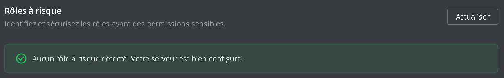

    ::hint{ type="success" }
      🎉 Félicitations, vous n'avez plus aucun rôle à risque !
    ::
  ::

  ::tab{ label="Via la commande /config" }
    Vous pouvez configurer les rôles à risque avec la commande \</config>, en vous rendant ensuite dans l'onglet "Rôles sécurisés" du sélecteur.

    Lorsqu'un rôle détient des permissions dangereuses pour des membres n'étant pas modérateur, alors le rôle en question sera affiché dans la section "**Rôles à risque**" ci-dessous.

    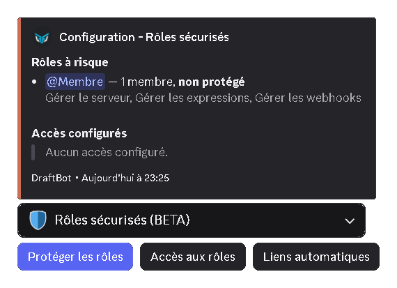

    Pour **sécuriser** ce rôle, vous devrez alors appuyer sur le bouton "**Protéger les rôles**" qui apparaît à la gauche des boutons en bleu.

    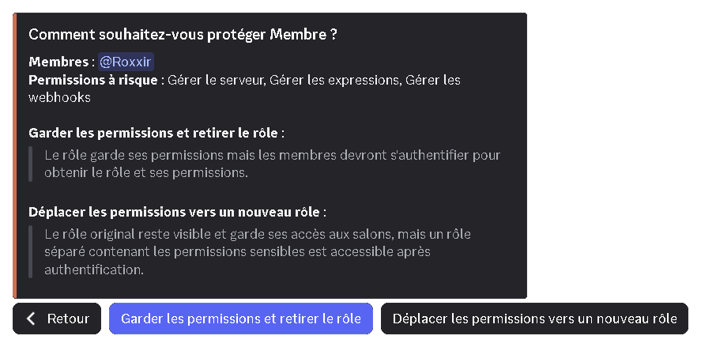

    **2 options** s'offrent à vous :
    1. **Garder les permissions et retirer le rôle :** Les membres ayant ce rôle devront s'authentifier afin d'avoir accès à ce rôle.
    2. **Déplacer les permissions vers un nouveau rôle :** Le rôle perdra ces permissions sensibles, et un nouveau se fera créer.

    ::hint{ type="info" }
      **DraftBot** vous demandera le nouveau nom du rôle de permissions si vous souhaitez déplacer les permissions vers un nouveau rôle.
    ::

    Les utilisateurs à protéger **non authentifié** auront **24 heures** pour s'authentifier via un MP envoyé par **DraftBot**, sans quoi ils perdront l'accès à leurs permissions.

    Après avoir cliqué sur "**Confirmer**", alors vous pourrez répéter l'action jusqu'à ce que votre serveur soit complètement sécurisé.

    

    ::hint{ type="success" }
      🎉 Félicitations, vous n'avez plus aucun rôle à risque !
    ::
  ::
::

### Accès aux rôles

L'accès aux rôles permet de gérer les membres ayant accès aux rôles sécurisés.

::tabs
  ::tab{ label="Via le panel" }
    [⫸ Accéder au panel de **DraftBot**](/dashboard/first/permguard)

    Pour ajouter un accès, vous devrez appuyer sur le bouton "**Ajouter un accès**" de la section ci-dessous.

    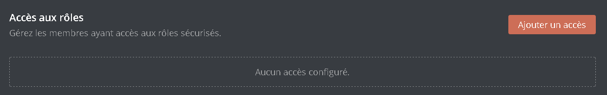

    Ensuite, 3 options s'offriront à vous.

    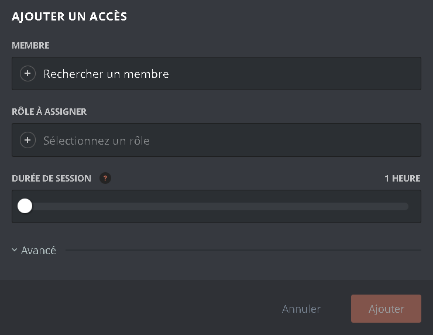

    1. **Membre :** Le membre à qui donner l'accès
    2. **Rôle à assigner :** Le rôle de permissions qui lui sera assigné et retiré après chaque session
    3. **Durée de session :** La durée pendant laquelle le membre peut garder son rôle après connexion à condition qu'il ne se déconnecte pas

    ::collapse{ label="Avancé" }
      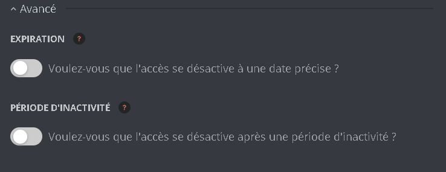

      1. **Expiration :** Date à laquelle le membre perdra ses rôles d'accès
      2. **Période d'inactivité :** Le membre perdra ses rôles d'accès s'il ne se connecte pas durant une durée précise, configurable en jours, semaines ou mois.
    ::
  ::

  ::tab{ label="Via la commande /config" }
    Vous pouvez ajouter des accès aux rôles avec la commande \</config>, en vous rendant ensuite dans l'onglet "Rôles sécurisés" du sélecteur.

    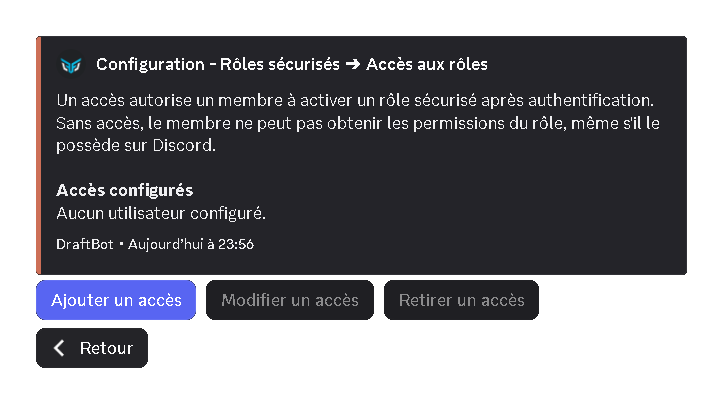

    Afin d'ajouter, modifier ou retirer un accès, tout se passe via ce menu de configuration.

    Lorsque vous appuyez sur "**Ajouter un accès**", 3 options s'offriront à vous :

    1. **Membre :** Le membre à qui donner l'accès
    2. **Rôle à assigner :** Le rôle de permissions qui lui sera assigné et retiré après chaque session
    3. **Durée de session :** La durée pendant laquelle le membre peut garder son rôle après connexion à condition qu'il ne se déconnecte pas

    ::collapse{ label="Avancé" }
      1. **Expiration :** Date à laquelle le membre perdra ses rôles d'accès
      2. **Période d'inactivité :** Le membre perdra ses rôles d'accès s'il ne se connecte pas durant une durée précise, configurable en jours, semaines ou mois.
    ::
  ::
::

### Liens automatiques

Les liens automatiques permettent de relier un rôle d'affichage à un rôle de permissions pour automatiser les accès au rôle.

::tabs
  ::tab{ label="Via le panel" }
    [⫸ Accéder au panel de **DraftBot**](/dashboard/first/permguard)

    Pour ajouter des liens automatiques, vous devrez appuyer sur le bouton "**Ajouter un lien**" de la section ci-dessous.

    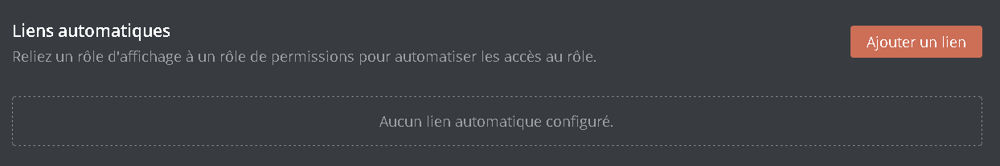

    Ensuite, 3 options s'offriront à vous.

    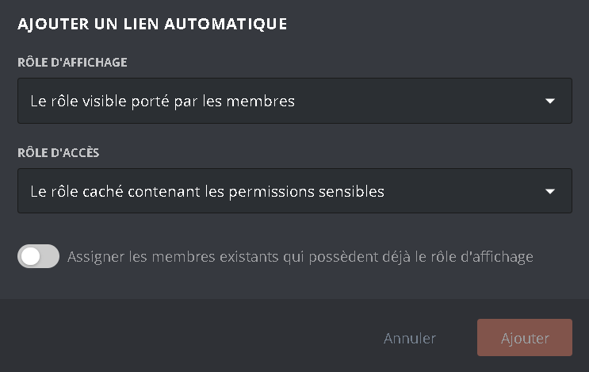

    1. **Rôle d'affichage :** Le rôle auquel le membre doit être rattaché pour bénéficier des permissions
    2. **Rôle d'accès :** Le rôle de permissions qui lui sera assigné et retiré après chaque session
    3. **Assigner les membres existants qui possèdent déjà le rôle d'affichage :** Tous les membres ayant déjà le rôle d'affichage pourront bénéficier des rôles d'accès
  ::

  ::tab{ label="Via la commande /config" }
    Vous pouvez ajouter des liens automatiques avec la commande \</config>, en vous rendant ensuite dans l'onglet "Rôles sécurisés" du sélecteur.

    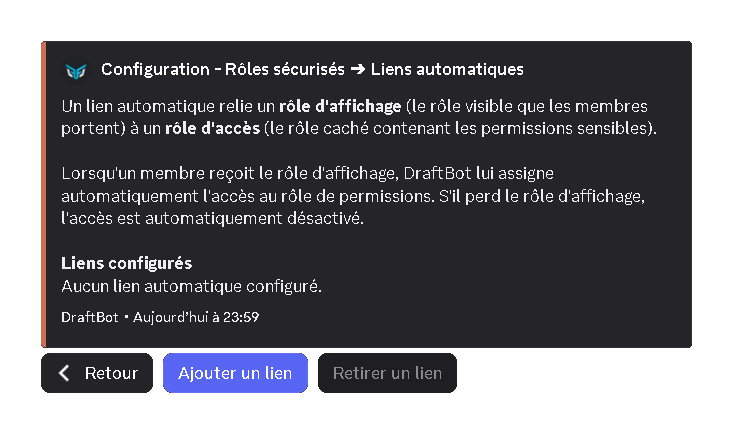

    Afin d'ajouter, modifier ou retirer un accès, tout se passe via ce menu de configuration.

    Lorsque vous ajouterez un lien automatique, voici les différentes options qui s'offriront à vous, modifiable à tout moment :

    1. **Rôle d'affichage :** Le rôle auquel le membre doit être rattaché pour bénéficier des permissions
    2. **Rôle d'accès :** Le rôle de permissions qui lui sera assigné et retiré après chaque session
    3. **Assigner les membres existants qui possèdent déjà le rôle d'affichage :** Tous les membres ayant déjà le rôle d'affichage pourront bénéficier des rôles d'accès
  ::
::

## /secure-roles

### Première configuration

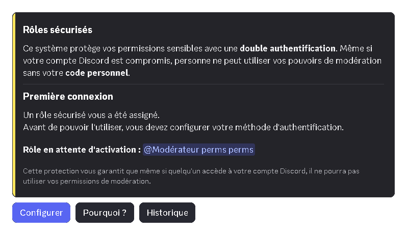

Lors de votre première configuration, vous verrez ce menu. Vous pourrez alors intéragir avec ces **3** options :

- **Configurer :** Permet de [configurer l'A2F](#configuration-1)
- **Pourquoi :**  Permet d'avoir une [explication de ce système](#à-quoi-sert-il)
- **Historique :** Permet de voir l'historique de l'activité durant la période de connexion dont les [giveaways](/docs/modules/giveaways), les [actions de modération](/docs/modules/moderation), et bien d'autres...

### Configuration

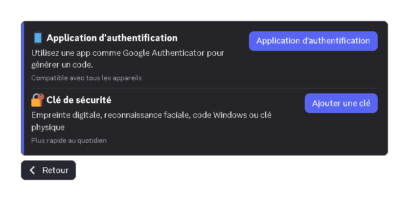

Lors de votre première connexion, vous pourrez choisir entre :

- **Application d'authentification :** Permet d'utiliser une app comme Google Authenticator pour générer un code. Il est configurable aussi via le [panel](/dashboard/user/security)
- **Clé de sécurité :** Permet d'utiliser l'empreinte digitale, reconnaissance faciale, code Windows ou clé physique.

