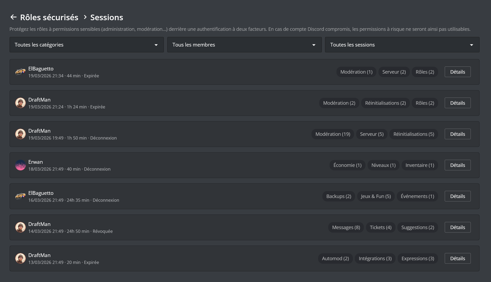

## Le principe

Sur Discord, un rôle est un trousseau de clés que votre staff porte en permanence. Qui tient le compte tient les clés : un lien piégé, une extension de navigateur malveillante, une session volée, et l'attaquant hérite instantanément de tout ce que le membre pouvait faire.

Les rôles sécurisés déplacent ce trousseau dans un coffre. Vos modérateurs gardent leur badge et leur couleur, mais les permissions elles-mêmes ne sont posées sur leur compte **que pendant une session**, et seulement après une authentification supplémentaire (empreinte, reconnaissance faciale, code A2F). La session terminée, les permissions repartent au coffre.

::hint{ type="success" }
  La différence est brutale sur un gros serveur : sans ce système, un compte staff compromis peut supprimer des salons *(l'historique est perdu définitivement)* ou lancer une vague de bannissements. Avec, le compte volé ne porte tout simplement plus les permissions à voler.
::

Ce système ne remplace pas l'A2F Discord, il la complète. L'A2F Discord protège **la connexion au compte**. Les rôles sécurisés protègent **l'usage des permissions**, y compris quand la connexion est déjà compromise.

## Les pièces du système

Quatre notions différentes, souvent confondues. Les distinguer évite 90 % des erreurs de configuration.

| Élément | Ce que c'est | Où le retrouver |
|---------|--------------|-----------------|
| **Rôle d'affichage** | Le rôle visible : nom, couleur, position dans la liste des membres. Aucune permission sensible. | Sur le membre, **en permanence** |
| **Rôle de permissions** | Le rôle discret qui contient réellement les permissions sensibles. | Sur le membre, **uniquement pendant une session** |
| **Accès** | Le droit d'un membre donné à réclamer un rôle de permissions. C'est ce qui s'active, se désactive et expire. | Section **Accès des membres** |
| **Session** | La période pendant laquelle les permissions sont réellement actives, après authentification. | Section **Sessions** |

::hint{ type="info" }
  Un membre peut avoir un accès **sans** rôle d'affichage : c'est le cas quand vous accordez un accès individuel à quelqu'un qui ne fait pas partie de l'équipe habituelle. Inversement, porter le rôle d'affichage ne donne aucune permission tant qu'un accès n'existe pas.
::

Une seule session peut être active à la fois par membre et par serveur. Se réauthentifier ferme automatiquement la précédente.

## Protéger un rôle

**DraftBot** analyse vos rôles et signale ceux qui détiennent des permissions dangereuses : c'est la section **Rôles à risque**. De là, un bouton **Sécuriser** lance la configuration, aussi bien depuis le [panel](/dashboard/first/permguard) que via \</config>.

Un rôle est jugé à risque dès qu'il porte **au moins une** de ces 13 permissions :

||
|||
| **Administrateur** | Gérer les rôles |
| Gérer le serveur | Gérer les salons |
| Gérer les messages | Gérer les webhooks |
| Bannir des membres | Expulser des membres |
| Exclure temporairement des membres | Mentionner @everyone, @here et tous les rôles |
| Gérer les expressions | Gérer les événements |
| Créer des événements |  |
|----------------------|--|

::hint{ type="info" }
  Les rôles gérés par une intégration *(rôle d'un bot, rôle de boost, rôle lié à un abonnement)* ne sont jamais proposés : Discord en garde le contrôle et **DraftBot** ne peut pas y toucher. Si un bot de votre serveur détient des permissions sensibles, il faut le traiter séparément.
::

Vous pouvez sécuriser **2 rôles**, ou **10** sur les serveurs [premium](/premium) <:icon_premium:1096140508625125417>. Un rôle qui n'apparaît pas dans les rôles à risque *(parce qu'il ne porte encore aucune permission sensible)* peut aussi être préparé à la main depuis **Configuration manuelle**, dans la section **Rôles configurés**. Les deux voies partagent le même quota.

::tabs
  ::tab{ label="Depuis le panel" }
    [⫸ Accéder au panel de **DraftBot**](/dashboard/first/permguard)

    
  ::

  ::tab{ label="Via la commande /config" }
    
  ::
::

::hint{ type="warning" }
  Un rôle porté par plus de **10 membres** (25 sur les serveurs [premium](/premium) <:icon_premium:1096140508625125417>) ne peut pas être sécurisé. Ce n'est pas une limite technique mais un choix : ce système est conçu pour un cercle restreint qui détient des pouvoirs lourds, pas pour un rôle communautaire. Les bots et le propriétaire ne comptent pas dans ce total.
::

La première question posée est la plus importante de toute la configuration, et c'est aussi celle qui a le plus de conséquences invisibles.

### Déplacer les permissions

Sous le nom **Déplacer les permissions vers un nouveau rôle**, **DraftBot** crée un rôle discret, y transfère les permissions sensibles, et laisse le rôle d'origine intact : même nom, même couleur, même position. Votre staff ne voit aucune différence au quotidien.

C'est la stratégie recommandée, et la seule qui débloque le reste du système.

### Garder les permissions

Sous le nom **Garder les permissions et retirer le rôle**, aucun nouveau rôle n'est créé. Le rôle d'origine **est** le rôle de permissions : il est retiré aux membres et ne revient que le temps d'une session.

::hint{ type="danger" }
  Si ce rôle sert aussi à ouvrir des salons privés, vos membres en **perdent l'accès à chaque fin de session** et le récupèrent à la connexion suivante. Sur un serveur actif, cela signifie un salon staff qui apparaît et disparaît plusieurs fois par jour. Ne choisissez cette option que si vos salons privés sont ouverts par d'autres rôles.
::

Ce que chaque stratégie autorise :

|  | Déplacer les permissions | Garder les permissions |
| --- | :---: | :---: |
| Badge et couleur conservés hors session | Oui | Non |
| Salons privés accessibles hors session | Oui | Non |
| [Authentification à l'usage](#le-quotidien-de-votre-staff) | Oui | **Non** |
| Rattrapage des salons devenus invisibles | Oui | Non |
| Réinscription dans les systèmes **DraftBot** | Oui | Non |
| Ajuster les permissions protégées après coup | Oui | Non |

::hint{ type="warning" }
  Vous pouvez changer de stratégie plus tard, mais passer en **Garder les permissions** désactive l'authentification à l'usage sur ce rôle. **DraftBot** vous indique combien de membres sont concernés avant d'appliquer.
::

Deux étapes complémentaires apparaissent ensuite selon le rôle traité, et méritent d'être comprises plutôt que validées machinalement :

- **Salons devenus invisibles.** La permission *Administrateur* fait voir **tous** les salons, y compris ceux où le rôle n'a explicitement aucun droit. En la déplaçant, ces salons disparaissent pour vos membres. **DraftBot** les détecte et y pose explicitement le droit de voir, écrire et rejoindre le vocal. Les permissions sensibles, elles, restent au coffre.
- **Systèmes DraftBot.** Plusieurs fonctionnalités reconnaissaient votre staff via *Administrateur* : staff des tickets, signalements, animateurs de la route infinie, modérateurs des salons privés, exemptions d'automodération. **DraftBot** propose de réinscrire le rôle d'affichage dans leurs listes d'autorisation, pour que le quotidien continue sans session ouverte.

::hint{ type="info" }
  Ces deux rattrapages sont aussi proposés après coup pour les rôles déjà configurés : bouton **Améliorations récentes** via \</config>, bandeau **Corriger ou mettre à jour** sur le [panel](/dashboard/first/permguard). Chaque proposition peut être appliquée ou ignorée indépendamment.
::

Vient enfin la **sélection des membres**. Tous ceux qui portent le rôle sont proposés, avec l'indication de qui a déjà configuré une méthode d'authentification.

::hint{ type="danger" }
  **Décocher un membre n'est pas neutre : il perd le rôle.** Selon la stratégie choisie, il conserve le rôle d'affichage sans les permissions, ou perd le rôle purement et simplement. Ne décochez que les membres dont vous voulez réellement retirer les pouvoirs.
::

## Le quotidien de votre staff

Il existe deux façons pour un membre d'activer ses permissions, et le choix change beaucoup le ressenti au quotidien.

**Se connecter à l'avance** avec \</secure-roles>. Le membre s'authentifie, ses permissions s'activent pour la durée de la session, il travaille, puis se déconnecte. Tant qu'il n'est pas connecté, les commandes protégées **n'apparaissent même pas** dans sa liste.

**L'authentification à l'usage.** Les commandes restent visibles, et **DraftBot** demande l'authentification au moment exact où le membre lance une commande sensible, par exemple \</ban>. Il valide, la commande s'exécute. Le niveau de sécurité est identique, mais il n'y a plus d'étape préalable à penser.

::hint{ type="danger" }
  **L'authentification à l'usage ne couvre que les commandes DraftBot.** Pour agir directement via l'interface Discord *(glisser un rôle sur un membre, supprimer un salon, bannir depuis le clic droit)*, le membre doit d'abord ouvrir une session avec \</secure-roles>. C'est la nuance la plus souvent mal comprise du système.
::

Pour rendre les commandes visibles sans donner les permissions, **DraftBot** a besoin d'une autorisation Discord dédiée, limitée au serveur concerné et à la seule gestion de la visibilité des commandes. Elle n'est demandée qu'une fois, dans une fenêtre qui s'ouvre au moment de l'activation.

::hint{ type="warning" }
  Dans cette fenêtre, **laissez la case du serveur cochée** et validez avec le bon compte Discord : ce sont les deux causes d'échec les plus fréquentes. Elle reste valable 10 minutes et se referme toute seule une fois l'autorisation accordée.
::

::hint{ type="info" }
  L'activation exige que **vous** disposiez de *Gérer le serveur* et *Gérer les rôles*, et que votre rôle le plus haut soit au dessus du rôle d'affichage concerné. C'est votre autorisation que Discord vérifie, pas seulement celle de **DraftBot**.
::

Vous pouvez désactiver l'authentification à l'usage à tout moment, et la réactiver ensuite. La désactivation n'est pas anodine : les membres actuellement connectés sont **déconnectés**, les commandes protégées redeviennent **invisibles**, et tout le monde repasse par \</secure-roles> avant d'agir. **DraftBot** vous indique combien de sessions seront coupées avant de confirmer.

## Choisir sa méthode

Chaque membre configure sa méthode **une seule fois**, depuis \</secure-roles> ou l'espace [Sécurité](/dashboard/user/security) du panel. Elle est ensuite valable sur tous les serveurs où il a un accès.

| Méthode | Niveau | En pratique |
|---------|--------|-------------|
| **Clé d'accès** | Sécurisée | Empreinte, reconnaissance faciale, code Windows ou clé physique. Validation instantanée, rien à saisir. Le meilleur choix pour un usage quotidien. |
| **Application d'authentification** | Sécurisée | Code à 6 chiffres via Google Authenticator, Authy, Dashlane. Fonctionne partout. |
| **Code PIN** | Alternative | 6 à 8 chiffres. Vulnérable au vol par dessus l'épaule et aux tentatives répétées. |
| **Mot de passe** | Alternative | 10 caractères minimum, majuscules, minuscules et chiffres. |

::hint{ type="info" }
  Les administrateurs peuvent n'autoriser que les méthodes sécurisées sur un rôle donné. Si votre serveur protège des permissions lourdes, c'est le réglage à privilégier : une clé d'accès est à la fois plus sûre **et** plus rapide qu'un code PIN.
::

::tabs
  ::tab{ label="Clé d'accès" }
    

    Vous pouvez enregistrer **plusieurs clés**, par exemple une sur votre téléphone et une sur votre ordinateur. Chacune se renomme et se supprime individuellement.
  ::

  ::tab{ label="Application d'authentification" }
    

    Un QR code vous est présenté, ainsi qu'un code de saisie manuelle si votre application ne peut pas scanner ou n'est pas sur votre téléphone.
  ::

  ::tab{ label="Code PIN" }
    

    Les codes trop prévisibles *(123456, 000000)* sont refusés.
  ::

  ::tab{ label="Mot de passe" }
    
  ::
::

::hint{ type="warning" }
  Modifier ou ajouter une méthode exige de valider avec une méthode déjà configurée. En revanche, **supprimer** une méthode n'exige jamais de validation : c'est volontaire, pour que personne ne reste enfermé dehors. Supprimer sa **dernière** méthode révoque en revanche tous ses accès sécurisés, sur tous les serveurs.
::

## Ce qui n'est pas protégé

Aucun système de sécurité n'est absolu. Connaître ses angles morts vaut mieux que les découvrir.

**Le propriétaire du serveur.** Discord lui accorde tous les droits sans condition, indépendamment des rôles. Configurer une authentification sur ce compte ne le protège pas. C'est le point faible structurel de tout serveur Discord.

::hint{ type="danger" }
  Si votre serveur est important, faites du compte propriétaire un compte de coffre-fort : il ne sert qu'aux actions qui exigent réellement la propriété *(transfert du serveur, suppression)*. Le travail quotidien se fait depuis un compte administrateur secondaire, lui couvert par les rôles sécurisés. Si vous êtes actuellement seul à administrer, créez d'abord ce compte secondaire **avant** d'envisager un transfert de propriété.
::

**Un membre qui détient la même permission ailleurs.** Si un modérateur obtient *Expulser des membres* via un second rôle non sécurisé, la protection ne s'applique plus à lui : Discord lui accorde déjà la permission, il n'y a rien à débloquer. Sur un gros serveur avec des dizaines de rôles empilés, c'est la fuite la plus fréquente. **DraftBot** surveille les rôles d'affichage et vous alerte si une permission sensible y réapparaît.

**Les permissions posées salon par salon.** Un droit accordé directement dans les paramètres d'un salon ne passe pas par les rôles, donc pas par ce système.

**Les bots.** Un bot compromis agit avec ses propres permissions. Auditez-les séparément.

## Bien régler les accès

Les réglages sont expliqués directement dans l'interface. Voici plutôt comment arbitrer.

**Durée de session.** 15 minutes par défaut, réglable de 5 minutes à 8 heures. Une durée courte réduit la fenêtre d'exploitation d'un compte volé, mais multiplie les authentifications. En pratique : court pour l'administration, plus long pour une équipe de modération en pleine vague de raid. Une clé d'accès rend les reconnexions quasi indolores, ce qui permet de rester sur des durées courtes.

**Accès automatique.** Attribuer le rôle d'affichage à quelqu'un lui crée son accès tout seul, et le lui retirer le révoque. Recommandé dès que votre staff bouge régulièrement : sans cela, chaque recrutement demande une action manuelle en plus, et chaque départ en laisse une derrière soi.

**Expiration et inactivité** <:icon_premium:1096140508625125417>. Deux filets de sécurité pour les gros serveurs : une date de fin pour un renfort temporaire, et une révocation automatique pour un membre qui ne se connecte plus. C'est ce qui empêche l'accumulation silencieuse d'accès dormants, cible privilégiée d'une compromission.

**Consultation des sessions.** Permet à un rôle de lire le journal des sessions en lecture seule, sans lui donner *Gérer le serveur*. Utile pour une équipe de supervision ou d'anciens administrateurs qui gardent un droit de regard.

La section **Accès des membres** sert aux cas particuliers : accorder une permission à quelqu'un sans lui donner le rôle d'affichage, ou traiter un membre différemment du reste de l'équipe. Chaque accès hérite des réglages du rôle et peut les **surcharger** : un badge signale alors la valeur modifiée, et un bouton remet celle du rôle. Comptez jusqu'à **10 accès par rôle**, ou **25** en [premium](/premium) <:icon_premium:1096140508625125417>.

::hint{ type="info" }
  Un membre à qui vous donnez un accès sans qu'il ait configuré d'authentification reçoit un message privé et dispose de **24 heures** pour s'en occuper. Passé ce délai, son accès est désactivé et devra être réactivé manuellement.
::

## Revenir en arrière

Rien n'est définitif : un rôle sécurisé se supprime depuis **Rôles configurés**. Deux options vous sont alors proposées, et elles répondent à des intentions opposées.

- **Transférer les permissions vers le rôle d'affichage.** Les permissions sensibles sont rendues au rôle visible, que vos membres portent en permanence. Vous retrouvez la situation d'avant la protection : les pouvoirs redeviennent actifs en continu, sans authentification.
- **Supprimer le rôle de permissions.** Le rôle discret disparaît du serveur avec les permissions qu'il contenait.

Les deux options sont indépendantes et se combinent. Dans tous les cas, les accès sont supprimés et le rôle de permissions est retiré à ceux qui le portaient.

::hint{ type="warning" }
  Si vous ne cochez **ni l'une ni l'autre**, le rôle de permissions reste sur votre serveur avec ses permissions intactes, mais **DraftBot** ne le gère plus. Il devient un rôle ordinaire que n'importe quel administrateur peut attribuer, sans aucune authentification. Plus personne ne le porte à cet instant, mais pensez à le supprimer ou à le vider si vous ne comptez pas le réutiliser.
::

## Surveiller et réagir

**DraftBot** ne se contente pas de bloquer, il vous prévient. Les alertes des rôles sécurisés partent dans vos **logs d'urgence**, indépendamment du module de logs classique, et mentionnent vos administrateurs.

Le **journal des sessions** répond à la question qui compte après coup : qui a fait quoi, quand, et avec quelle permission. Chaque session liste ses actions horodatées, leur cible, leur raison, les changements de pseudonyme, et un niveau de risque coloré. Vous pouvez filtrer par membre, période, catégorie d'action, méthode d'authentification ou rôle.

Sur une session en cours, **Terminer la session** retire immédiatement les permissions du membre et le force à se réauthentifier. Utile face à un comportement suspect en direct.

::hint{ type="info" }
  Le nombre de messages supprimés se stabilise après quelques minutes. Discord regroupe les suppressions successives d'un même modérateur avant de communiquer le total réel, **DraftBot** attend donc la fin du regroupement pour afficher le bon chiffre.
::

::hint{ type="warning" }
  Vous ne pouvez pas terminer votre propre session, ni celle d'un membre dont le rôle sécurisé est au dessus ou au même niveau que le vôtre. La règle de hiérarchie s'applique aussi à la configuration : vous ne gérez que les rôles situés **strictement en dessous** de votre rôle le plus haut.
::
