## À quoi sert-il ?

Les rôles sécurisés sont un système de protection avancée qui ajoute une couche de sécurité supplémentaire aux permissions sensibles de votre serveur Discord. Il permet de rendre les rôles à haut risque (administrateur, modérateur…) utilisables uniquement après une authentification forte (A2F - Authentification à Deux Facteurs) ou une clé d'accès.

### Le problème

Discord permet déjà d'activer l'A2F sur les comptes, mais cela ne protège pas votre serveur contre :

- Le **vol de token** (token grab)
- Le **phishing** (pages de connexion falsifiées)
- Les **malwares** qui récupèrent les sessions

### La solution

Avec les rôles sécurisés, les permissions sensibles ne sont **attribuées temporairement** qu'après une authentification via une application d'authentification ou une clé d'accès (empreinte digitale, reconnaissance faciale, code de session Windows ou clé physique).

Même si un attaquant vole un compte Discord, il ne peut pas utiliser les permissions destructives du serveur.

### Cas d'utilisation principaux

- **Protection anti-hack** : Les comptes staff piratés ne peuvent pas détruire le serveur
- **Accès en temps voulu** : Évite les erreurs accidentelles de modération
- **Salons privés protégés** : L'accès aux informations sensibles nécessite une connexion

### Rôles visuels et rôles à permissions

- `🛡️ Admin` (couleur, sans permissions, affichage dans la hiérarchie)
- `Admin Perms` (caché, vraies permissions)

Le staff conserve son rôle et son badge visibles auprès de la communauté, mais les permissions réelles nécessitent une connexion.

## Sécurité

Pour configurer une méthode d'authentification pour votre compte via **DraftBot**, vous devez vous rendre dans le [panel de **DraftBot**](/dashboard/user/security), puis dans la section "**Sécurité**" de votre compte.

Vous aurez le choix parmi **4** méthodes de sécurité :

- Par [application d'authentification](#application-dauthentification) *(méthode sécurisée)*
- Par [clé d'accès](#clé-daccès) *(méthode sécurisée)*
- Par [code PIN](#code-pin) *(méthode alternative)*
- Par [mot de passe](#mot-de-passe) *(méthode alternative)*

::hint{ type="info" }
  Les méthodes **application d'authentification** et **clé d'accès** sont considérées comme sécurisées. Les méthodes **code PIN** et **mot de passe** sont des alternatives moins sécurisées qui peuvent être restreintes par les administrateurs du serveur.
::

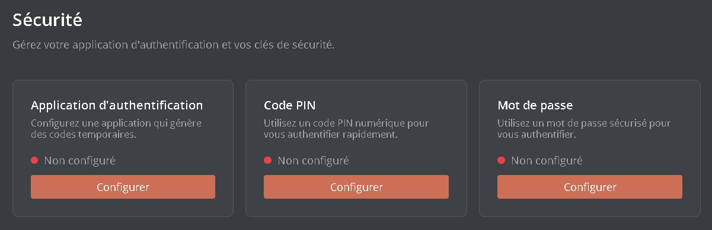

### Application d'authentification

En haut de la page, vous trouverez la section dédiée à cet effet.

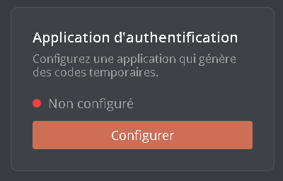

Vous pourrez configurer un code A2F en appuyant sur "**Configurer**". Un QR code vous sera présenté à scanner avec votre application (Google Authenticator, Authy, Dashlane…). Un code de saisie manuelle est également disponible.

### Clé d'accès

Les clés d'accès (WebAuthn) permettent d'utiliser l'empreinte digitale, la reconnaissance faciale, le code de session Windows ou une clé physique pour s'authentifier.

Vous pourrez ajouter une clé d'accès en appuyant sur "**Ajouter une clé d'accès**" et en suivant les instructions de votre navigateur.

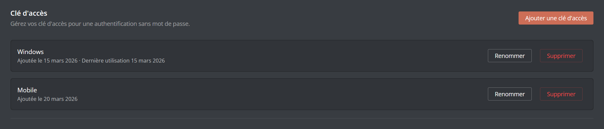

::hint{ type="info" }
  Vous pouvez enregistrer **plusieurs clés d'accès** (par exemple, une pour votre téléphone et une pour votre ordinateur). Chaque clé peut être renommée ou supprimée individuellement.
::

### Code PIN

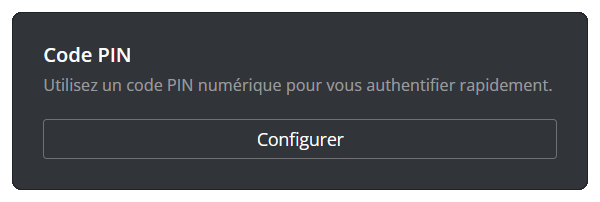

Vous pourrez configurer un code PIN de **6 à 8 chiffres** en appuyant sur "**Configurer**".

::hint{ type="warning" }
  Les codes PIN trop simples (séquences comme 123456, répétitions comme 000000) sont refusés.
::

### Mot de passe

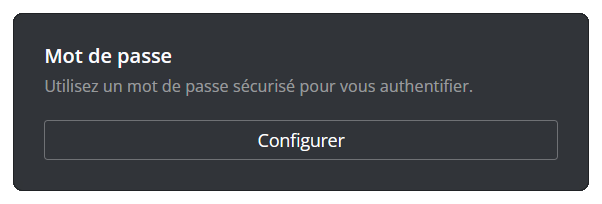

Vous pourrez configurer un mot de passe en appuyant sur "**Configurer**". Le mot de passe doit contenir au minimum **10 caractères** avec des majuscules, des minuscules et des chiffres.

::hint{ type="info" }
  Toute modification de vos méthodes d'authentification nécessite une **vérification d'identité** préalable via l'une de vos méthodes déjà configurées.
::

## Configuration

Voici les différentes sections de configuration disponibles via le panel et la commande \</config>.

### Rôles à risque

Les rôles à risque permettent d'identifier puis de sécuriser les rôles ayant des permissions sensibles (Administrateur, Gérer le serveur, Gérer les rôles, Gérer les salons, Bannir des membres, Expulser des membres, etc.).

Lorsqu'un rôle détient des permissions dangereuses pour des membres n'étant pas modérateurs, il sera affiché comme rôle à risque. Chaque rôle affiche ses membres et les permissions à risque détectées.

::tabs
  ::tab{ label="Via le panel" }
    [⫸ Accéder au panel de **DraftBot**](/dashboard/first/permguard)

    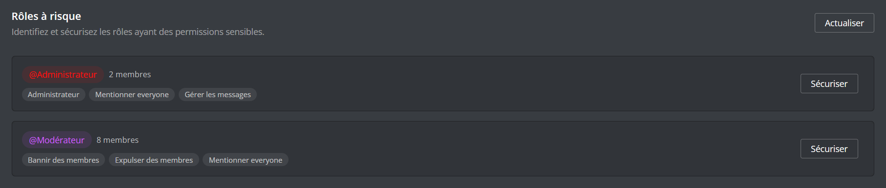

    Pour **sécuriser** ce rôle, appuyez sur le bouton "**Sécuriser**" qui apparaît à la droite de la section.

    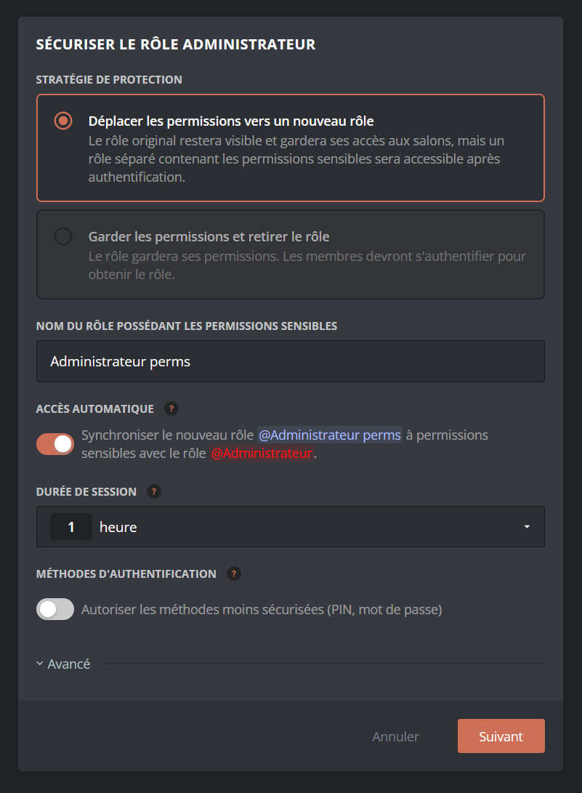
  ::

  ::tab{ label="Via la commande /config" }
    Rendez-vous dans la commande \</config>, puis dans l'onglet "Rôles sécurisés" du sélecteur.

    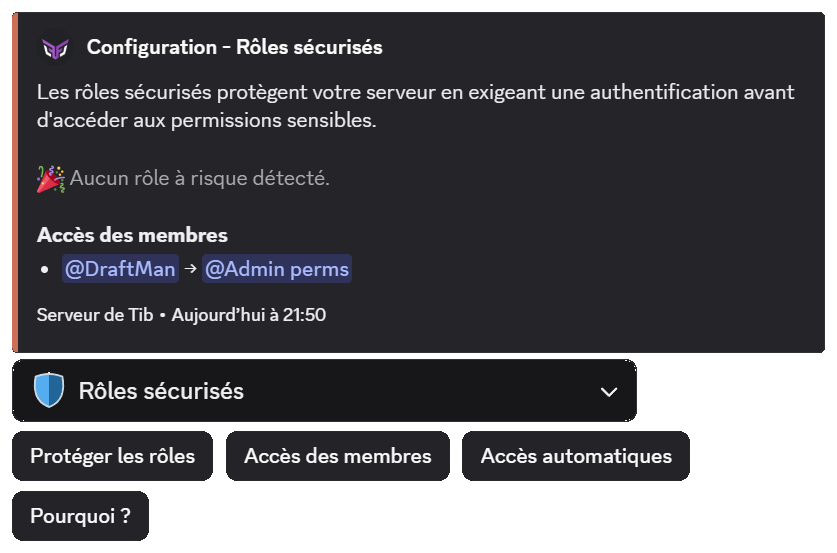

    Pour **sécuriser** ce rôle, appuyez sur le bouton "**Protéger les rôles**".

    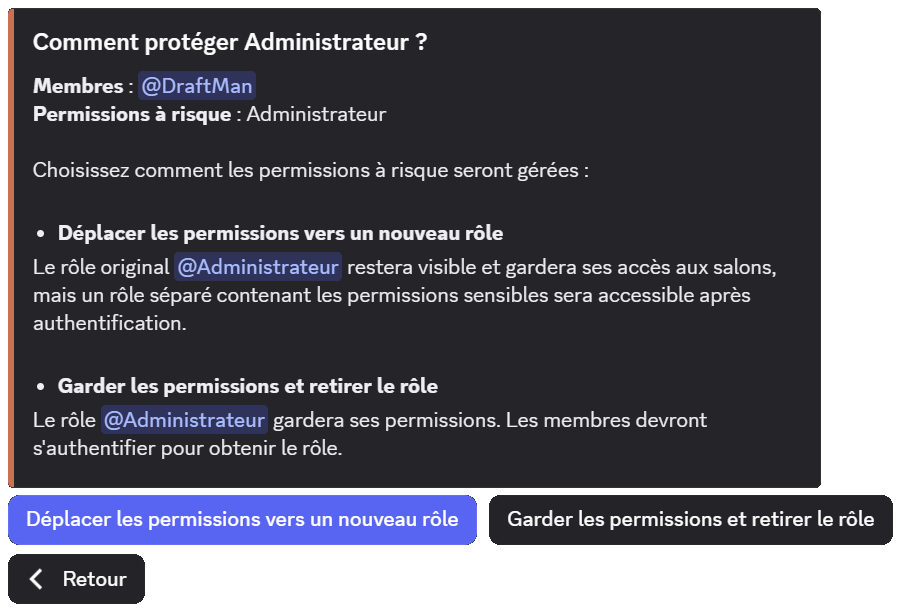
  ::
::

**2 stratégies de protection** s'offrent à vous :
1. **Déplacer les permissions vers un nouveau rôle :** Le rôle original garde sa couleur et son affichage, mais les permissions sensibles sont déplacées vers un nouveau rôle caché.
2. **Garder les permissions et retirer le rôle :** Les membres ayant ce rôle devront s'authentifier afin d'en conserver l'accès.

::hint{ type="info" }
  **DraftBot** vous demandera le nouveau nom du rôle de permissions si vous souhaitez déplacer les permissions vers un nouveau rôle.
::

::hint{ type="warning" }
  Si vous choisissez de garder les permissions, les membres n'auront accès à leurs salons privés que temporairement et seulement une fois authentifiés. N'utilisez cette option que si les accès aux salons sont configurés via d'autres rôles.
::

Vous pourrez configurer les **réglages** suivants :
- **Durée de session :** Durée pendant laquelle le rôle reste actif après connexion (entre 5 minutes et 8 heures)
- **Accès automatique :** Lien automatique entre le rôle d'affichage et le rôle de permissions
- **Méthodes de connexion :** Autoriser uniquement les méthodes sécurisées (A2F et clé d'accès) ou également les méthodes alternatives (code PIN et mot de passe)
- **Désactivation planifiée :** L'accès se désactive automatiquement après un délai fixe (entre 1 jour et 1 an)
- **Période d'inactivité :** L'accès se désactive si le membre ne se connecte pas pendant une durée configurable (entre 1 jour et 1 an)

Ensuite, vous pourrez **sélectionner les membres** à protéger et **exclure** des membres si nécessaire. Les membres non sélectionnés perdront le rôle. Le statut d'authentification de chaque membre est affiché (authentification configurée ou non).

Les membres sélectionnés recevront un MP envoyé par **DraftBot** leur expliquant le fonctionnement des rôles sécurisés.
Ceux qui n'auront pas **d'authentification configurée** auront **24 heures** pour en configurer une, sans quoi leur accès aux permissions leurs seront désactivés.

Après confirmation, vous pourrez répéter l'action jusqu'à ce que votre serveur soit complètement sécurisé.

::tabs
  ::tab{ label="Via le panel" }
    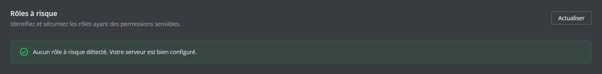
  ::

  ::tab{ label="Via la commande /config" }
    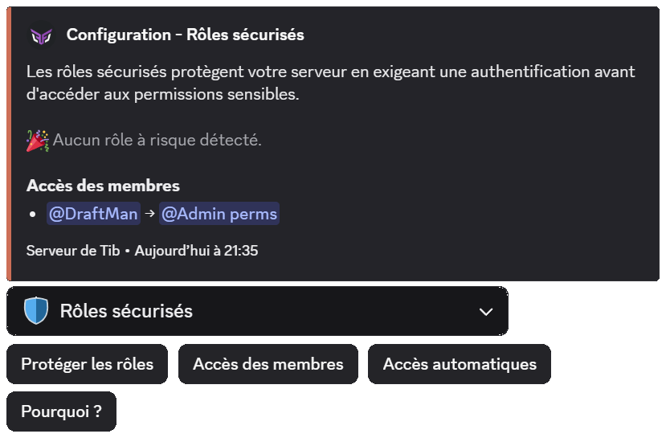
  ::
::

::hint{ type="success" }
  Félicitations, vous n'avez plus aucun rôle à risque !
::

### Accès aux rôles

L'accès aux rôles permet de gérer les membres ayant accès aux rôles sécurisés.

::tabs
  ::tab{ label="Via le panel" }
    [⫸ Accéder au panel de **DraftBot**](/dashboard/first/permguard)

    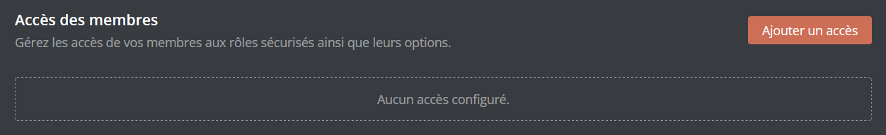

    Pour ajouter un accès, appuyez sur le bouton "**Ajouter un accès**".

    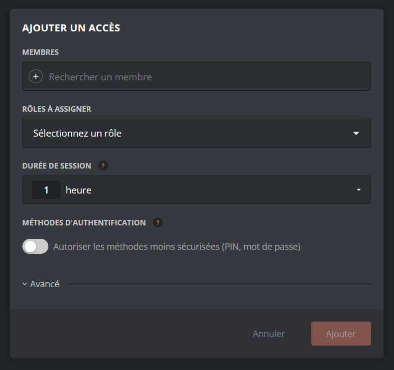
  ::

  ::tab{ label="Via la commande /config" }
    Rendez-vous dans la commande \</config>, puis dans l'onglet "Rôles sécurisés" du sélecteur.

    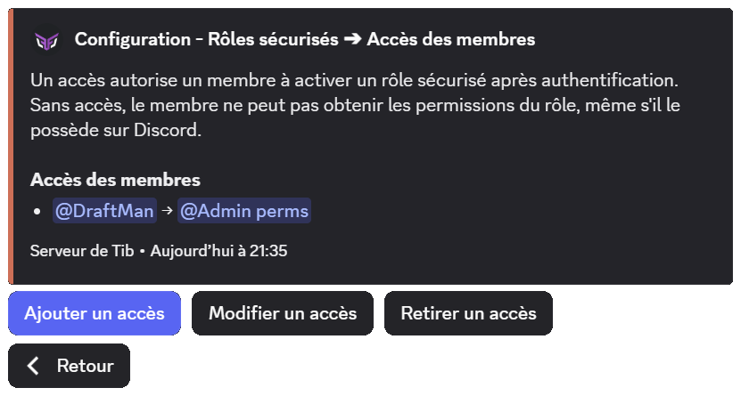

    Pour ajouter, modifier ou retirer un accès, appuyez sur "**Ajouter un accès**".
  ::
::

Les options suivantes s'offriront à vous :

1. **Membre(s) :** Le ou les membres à qui donner l'accès (ajout en masse possible via le panel)
2. **Rôle à assigner :** Le rôle de permissions qui lui sera assigné et retiré après chaque session
3. **Durée de session :** La durée pendant laquelle le membre peut garder son rôle après connexion (entre 5 minutes et 8 heures)
4. **Méthodes de connexion :** Autoriser uniquement les méthodes sécurisées ou également les méthodes alternatives (code PIN et mot de passe)

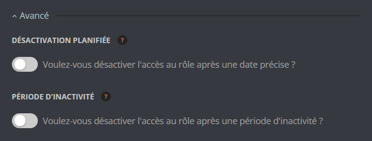

1. **Désactivation planifiée :** Date et heure à laquelle le membre perdra ses rôles d'accès
2. **Période d'inactivité :** Le membre perdra ses rôles d'accès s'il ne se connecte pas durant une durée précise, configurable en jours, semaines ou mois.

Chaque accès peut être **activé/désactivé**, **modifié** ou **supprimé** individuellement.

Les raisons de désactivation possibles sont :
- **Expiré** : L'accès a atteint sa date de désactivation planifiée
- **Inactivité** : Le membre ne s'est pas connecté depuis trop longtemps
- **Auth. non configurée** : Le membre n'a pas configuré d'authentification dans les 24 heures
- **Auth. retirée** : Le membre a supprimé ses méthodes d'authentification
- **Rôle d'affichage retiré** : Le rôle d'affichage lié a été retiré
- **Manuel** : Un administrateur a désactivé l'accès manuellement

### Accès automatiques

Les accès automatiques permettent de relier un rôle d'affichage à un rôle de permissions pour automatiser les accès au rôle. Lorsqu'un membre reçoit le rôle d'affichage, il obtient automatiquement un accès sécurisé au rôle de permissions (et inversement, le retrait du rôle d'affichage désactive l'accès).

::tabs
  ::tab{ label="Via le panel" }
    [⫸ Accéder au panel de **DraftBot**](/dashboard/first/permguard)

    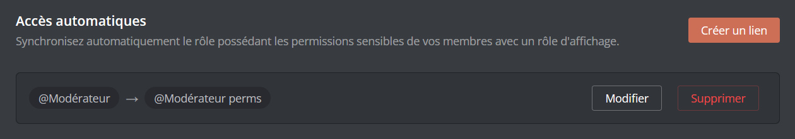

    Pour ajouter un accès automatique, appuyez sur le bouton "**Ajouter un lien**".

    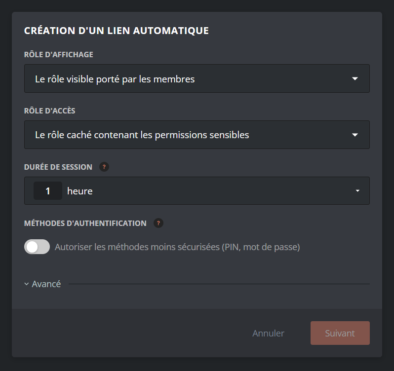
  ::

  ::tab{ label="Via la commande /config" }
    Rendez-vous dans la commande \</config>, puis dans l'onglet "Rôles sécurisés" du sélecteur.

    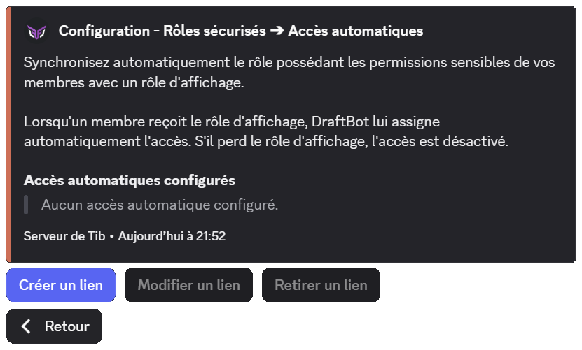

    Pour ajouter, modifier ou retirer un accès automatique, appuyez sur les options correspondantes dans ce menu.
  ::
::

Les options suivantes s'offriront à vous, modifiables à tout moment :

1. **Rôle d'affichage :** Le rôle auquel le membre doit être rattaché pour bénéficier des permissions
2. **Rôle d'accès :** Le rôle de permissions qui lui sera assigné et retiré après chaque session
3. **Durée de session :** La durée pendant laquelle le membre peut garder son rôle après connexion (entre 5 minutes et 8 heures)
4. **Méthodes de connexion :** Autoriser uniquement les méthodes sécurisées ou également les méthodes alternatives (code PIN et mot de passe)

Si des membres possèdent déjà le rôle d'affichage, une étape de **sélection des membres** sera proposée. Les membres sélectionnés se verront assigner automatiquement l'accès au rôle de permissions.

1. **Désactivation planifiée :** L'accès se désactive automatiquement après un délai fixe (entre 1 jour et 1 an)
2. **Période d'inactivité :** L'accès se désactive si le membre ne se connecte pas pendant une durée configurable (entre 1 jour et 1 an)

## /secure-roles

### Première configuration

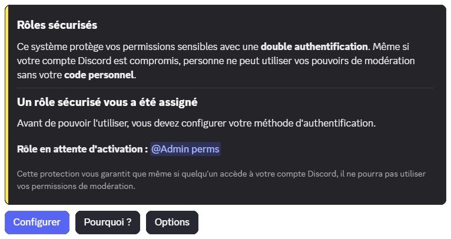

Lors de votre première configuration, vous verrez ce menu. Vous pourrez alors interagir avec ces options :

- **Configurer :** Permet de [configurer une méthode d'authentification](#configuration-de-lauthentification)
- **Pourquoi :** Permet d'avoir une [explication de ce système](#à-quoi-sert-il)

### Configuration de l'authentification

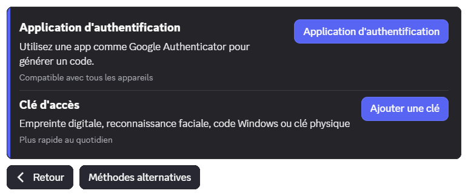

Lors de votre première connexion, vous pourrez choisir entre les méthodes sécurisées suivantes :

- **Application d'authentification :** Permet d'utiliser une application comme Google Authenticator, Authy ou Dashlane pour générer un code. Cette méthode est aussi configurable via le [panel](/dashboard/user/security).
- **Clé d'accès :** Permet d'utiliser l'empreinte digitale, la reconnaissance faciale, le code de session Windows ou une clé physique. Un lien s'ouvrira dans votre navigateur pour enregistrer votre clé.

Des méthodes alternatives sont également disponibles (si autorisées par l'administrateur du serveur) :

- **Code PIN :** Un code de 6 à 8 chiffres.
- **Mot de passe :** Un mot de passe d'au moins 10 caractères avec majuscules, minuscules et chiffres.

::hint{ type="info" }
  L'administrateur du serveur peut restreindre les méthodes de connexion autorisées pour chaque rôle. Si une méthode n'est pas autorisée pour vos rôles sur un serveur, elle sera indiquée comme indisponible.
::

### Connexion

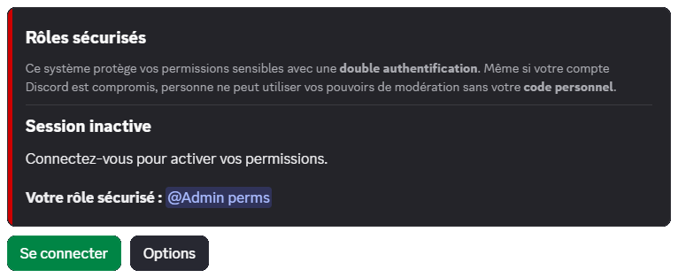

Pour vous connecter, vous trouverez les boutons suivants :

- **Se connecter :** Afin de vous connecter et activer vos permissions
- **Options :** Les [différentes options](#les-différentes-options)

Si vous possédez **plusieurs rôles sécurisés**, vous pourrez sélectionner les rôles spécifiques à activer pour votre session.

Si vous possédez **plusieurs méthodes d'authentification**, vous pourrez choisir laquelle utiliser pour vous connecter.

Après avoir renseigné votre code d'authentification, vous serez alors **connecté**. Vos permissions seront actives pendant la durée de la session configurée par l'administrateur.

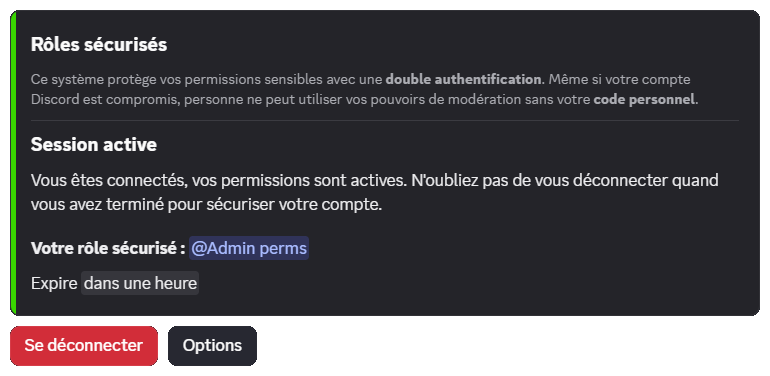

::hint{ type="info" }
  Lorsque votre session expire, vos rôles de permissions sont automatiquement retirés et vous êtes notifié par MP.
::

### Les différentes options

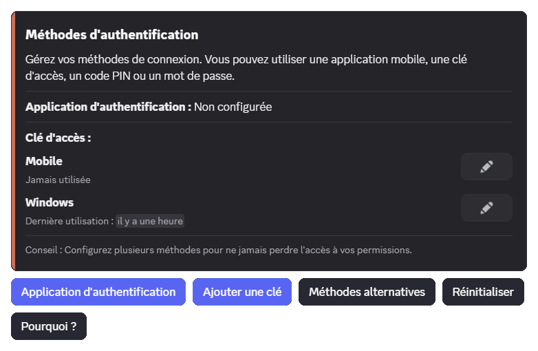

- **Retirer l'application d'authentification :** Permet de supprimer votre configuration A2F actuelle.

::hint{ type="warning" }
  **Attention :** Après avoir retiré l'A2F, vous devrez la [reconfigurer](#configuration-de-lauthentification). Si vous retirez toutes vos méthodes d'authentification, vos accès sécurisés seront révoqués sur tous les serveurs.
::
- **Ajouter une clé d'accès :** Permet d'ajouter une clé d'accès (empreinte digitale, reconnaissance faciale, code de session Windows ou clé physique). Vous pouvez en enregistrer plusieurs.
- **Ajouter un code PIN :** Permet de configurer un code PIN de 6 à 8 chiffres.
- **Ajouter un mot de passe :** Permet de configurer un mot de passe.
- **Réinitialiser :** Permet de réinitialiser l'ensemble de votre configuration d'authentification.

::hint{ type="warning" }
  La réinitialisation supprime **toutes** vos méthodes d'authentification et **révoque** vos accès sécurisés sur tous les serveurs.
::

### L'historique

Permet de voir l'historique de l'activité durant les sessions de connexion comme les [giveaways](/docs/modules/giveaways), les [actions de modération](/docs/modules/moderation), et bien d'autres...

L'historique est accessible via le bouton "**Historique**" sur le menu principal, ou via la [page dédiée du panel](/dashboard/first/permguard/sessions).

::hint{ type="info" }
  **Vous ne voyez pas l'historique de votre session ?** Ne vous inquiétez pas, c'est normal ! Vous devez vous **déconnecter** afin de pouvoir ensuite voir l'historique de toutes vos sessions passées.
::

::tabs
  ::tab{ label="Via le panel" }
    [⫸ Accéder aux sessions du panel de **DraftBot**](/dashboard/first/permguard/sessions)

    La page des sessions affiche la liste paginée de toutes les sessions du serveur. Pour chaque session, vous retrouverez :

    - **Membre** : Le membre concerné
    - **Date et durée** : Quand la session a débuté et combien de temps elle a duré
    - **Statut** : Active, Déconnexion, Expirée, Auth. retirée ou Révoquée
    - **Résumé des actions** : Un aperçu catégorisé des actions effectuées, avec un code couleur selon le niveau de risque (rouge pour les actions à haut risque comme la modération, orange pour le risque moyen, gris pour le risque faible)

    Vous pouvez **filtrer** les sessions par :
    - **Raison de fin** : Active, Déconnexion, Expirée, Auth. retirée, Révoquée
    - **Catégorie d'action** : Modération, Rôles, Rôles sécurisés, Salons, Messages, Serveur, Onboarding, Automod, Intégrations, Expressions, Événements, Économie, Niveaux, Inventaire, Jeux, Tickets, Suggestions, Réinitialisations, Règles, Backups, Restrictions d'emoji, Interserveur
    - **Membre** : Un membre spécifique

    En cliquant sur "**Détails**" d'une session, vous pourrez voir :
    - La méthode d'authentification utilisée (A2F, clé d'accès, PIN ou mot de passe)
    - Les rôles accordés pendant la session
    - La liste détaillée de toutes les actions effectuées avec horodatage, cible, raison et modifications apportées
  ::

  ::tab{ label="Via la commande /config" }
    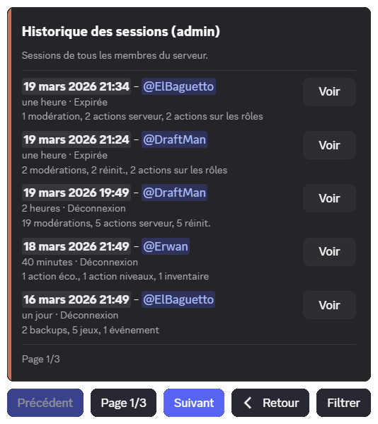

    Lorsque vous êtes sur le menu de l'historique des sessions, **2** options s'offrent à vous :

    - **Voir** une session précise et trouver davantage d'informations dessus.
    - **Filtrer** les sessions pour en voir des précises.
  ::
::

### Voir une session

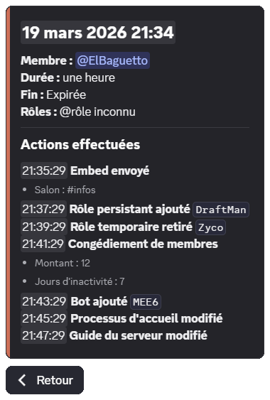

- **Membre :** Le membre concerné par la session
- **Durée :** La durée de la session
- **Fin :** Raison de la fin de session selon les raisons suivantes : **Déconnexion**/**Expirée**/**Authentification retirée**/**Révoquée**.
- **Rôles :** Les permissions de l'utilisateur
- **Actions effectuées :** Les actions que l'utilisateur a effectuées grâce à ces permissions

### Filtrer l'historique

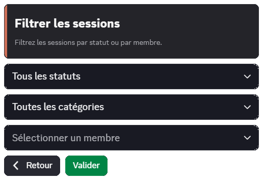

**Les différentes raisons :**
1. **Toutes les raisons :** Affiche toutes les sessions.
2. **Active :** Affiche les sessions actuellement en cours.
3. **Déconnexion :** Affiche les sessions où l'utilisateur s'est **déconnecté**.
4. **Expirée :** Affiche les sessions ayant atteint la limite de **durée de session** des [accès aux rôles](#accès-aux-rôles).
5. **Auth. retirée :** Affiche les sessions où l'utilisateur a **retiré** son authentification.
6. **Révoquée :** Affiche les sessions où un **administrateur** a **révoqué** l'accès.

**Filtrer par catégorie :** Permet de filtrer les sessions par type d'action effectuée (Modération, Rôles, Salons, etc.).

**Sélectionner un membre :** Permet de sélectionner l'un des membres qui apparaît dans les historiques.

- **Valider :** Permet de confirmer et d'appliquer le filtrage que vous avez paramétré.
- **Retirer les filtres :** Cette option apparaît lorsqu'un filtre est actif. Elle permet de supprimer l'ensemble des filtres que vous avez précédemment configurés.

