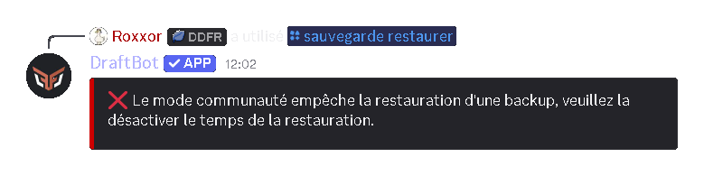

## Qu'est-ce que le module de sauvegardes ?

Le module **Sauvegardes** permet de créer une **copie complète de la structure de votre serveur** afin de pouvoir la restaurer ultérieurement en cas d'erreur ou de refonte.

Une sauvegarde inclut :

- Les **informations générales** du serveur
- Les **catégories et salons** (textuels et vocaux)
- Les **rôles du serveur**
- Les **rôles des membres**

::hint{ type="warning" }
  Pour fonctionner correctement, DraftBot doit être placé **tout en haut de la hiérarchie des rôles** et disposer de la permission **Administrateur**.
::

## Créer une sauvegarde

La commande \</sauvegarde créer> vous permet de créer une sauvegarde.

Vous aurez à disposition l'option `nom` qui permettra de définir un nom personnalisé pour identifier la sauvegarde.

::hint{ type="info" }
  Les noms de sauvegardes ne peuvent dépasser **30** caractères.
::

## Lister les sauvegardes

La commande \</sauvegarde lister> vous permet d'afficher toutes les sauvegardes existantes.

La liste affiche :

- Le **nom**
- La **date de création**

## Restaurer une sauvegarde

La commande \</sauvegarde restaurer> permettra de restaurer une sauvegarde existante.

Vous aurez à disposition l'option `sauvegarde` qui permettra de sélectionner la sauvegarde à restaurer.

::hint{ type="warning" }
  **Attention :** Lorsque vous demandez une restauration de votre serveur, vous devrez obligatoirement avoir **désactivé** l'option communautaire de votre serveur si ce n'est déjà fait.
::

## Supprimer une sauvegarde

La commande \</sauvegarde retirer> permet de supprimer une sauvegarde spécifique. Elle dispose de l'option `sauvegarde` qui permet de sélectionner la sauvegarde à supprimer.

::hint{ type="info" }
  Lorsque vous faites la commande, une confirmation est demandée avant suppression.
::

## Réinitialiser toutes les sauvegardes

La commande \</sauvegarde réinitialiser> permet de supprimer l'ensemble des sauvegardes du serveur.

::hint{ type="danger" }
  Cette action est **irréversible**.
::