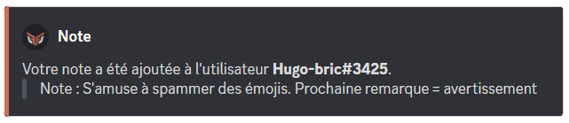
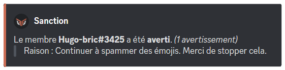
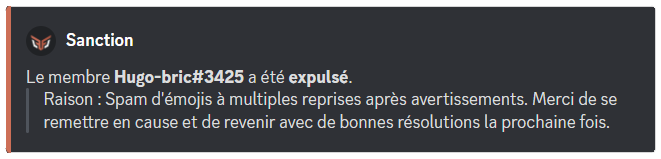
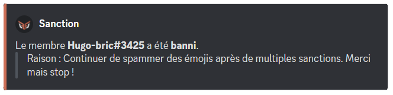
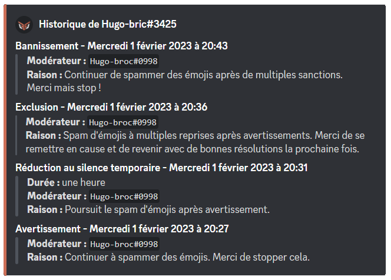
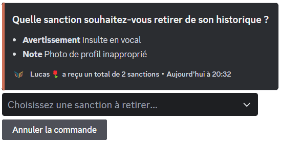
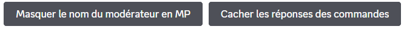
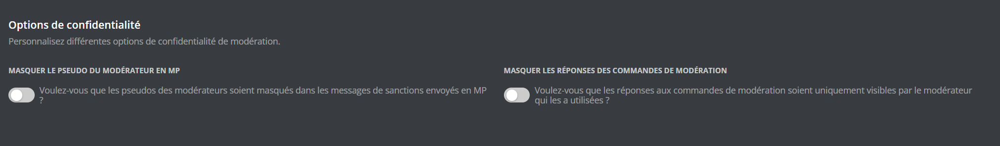
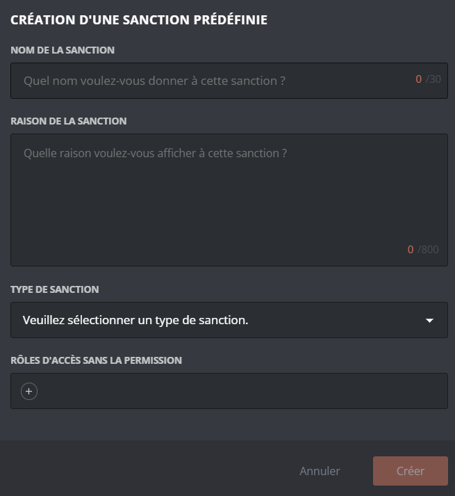

Les systèmes de modération de **DraftBot** sont là pour vous aider dans la gestion de votre serveur. Ici, vous trouverez toutes les informations nécessaires à leur utilisation. Des simples commandes modération aux sanctions prédéfinies !

## Sanctions

### Note

**Vous pouvez ajouter une note à un membre dans son historique de sanctions** avec \</note>.
Cela permet d'ajouter un commentaire à un membre, visible par les modérateurs, sans avertir le membre en message privé.

::hint{ type="danger" }
  **DraftBot** peut donner une note à un membre uniquement si vous disposez de la permission **`"Gérer les messages"`** ou que l'un de vos rôles peut utiliser la commande \</note> sur votre serveur.

  ::hint{ type="warning" }
    **DraftBot** doit dans tout les cas, sur le serveur, avoir la permission **`"Gérer les messages"`**.
  ::
::

### Avertissement

**Vous pouvez avertir un membre** avec la commande \</avertir>. Le membre recevra alors un message privé avec le motif de son avertissement. Si vous souhaitez que seulement les modérateurs puissent voir l'avertisement, consultez la **`note`** dans le sommaire.

::hint{ type="warning" }
  Le membre recevra son avertissement par message privé uniquement s'il accepte les messages privés venant du serveur.
::

::hint{ type="danger" }
  **DraftBot** peut donner un avertissement à un membre uniquement si vous disposez de la permission **`"Gérer les messages"`** ou que l'un de vos rôles peut utiliser la commande \</avertir> sur votre serveur.

  ::hint{ type="warning" }
    **DraftBot** doit dans tout les cas avoir la permission **`"Gérer les messages"`**.
  ::
::

### Mute

**Vous pouvez réduire au silence un membre** avec la commande \</mute>.

::hint{ type="info" }
  Vous pourrez, si vous le souhaitez, acquitter un membre de sa réduction au silence avec la commande \</demute>.
::

::hint{ type="danger" }
  - **DraftBot** peut donner un mute à un membre uniquement si vous disposez de la permission **`"Exclure temporairement des membres"`** ou que l'un de vos rôles peut utiliser la commande \</mute> sur votre serveur.

  - **DraftBot** doit avoir son rôle au-dessus des autres rôles pour rendre muet un membre.

  ::hint{ type="warning" }
    - **DraftBot** doit dans tout les cas avoir la permission **`"Exclure temporairement des membres"`**.

    - La durée d'un mute ne peut pas dépasser **28 jours**.
  ::
::

### Expulsion

Le fait d'expulser un membre fera quitter le membre du serveur, mais il pourra toujours revenir avec une autre invitation. Si vous souhaitez qu'il ne puisse pas revenir, consultez le [bannissement](#bannissement).

**Vous pouvez expulser un membre** de votre serveur avec la commande \</expulser>.

::hint{ type="danger" }
  - **DraftBot** peut expulser un membre uniquement si vous disposez de la permission **`"Expulser des membres"`** ou que l'un de vos rôles peut utiliser la commande \</expulser> sur votre serveur.

  - **DraftBot** doit avoir son rôle au-dessus des autres rôles pour expulser un membre.

  ::hint{ type="warning" }
    **DraftBot** doit dans tout les cas avoir la permission **`"Expulser des membres"`**.
  ::
::

### Bannissement

Le fait de bannir un membre lui fera quitter le serveur sans possibilité de revenir sans une levée de la sanction. Vous pouvez également bannir temporairement le membre en question. Si vous souhaitez qu'il puisse revenir sur votre serveur, consultez l'[expulsion](#expulsion).

Vous pouvez bannir un membre via la commande \</ban>.

Après avoir choisit l'utilisateur et donné une raison, deux options facultatives supplémentaires s'offrent à vous :

- `[temps]` pour définir une durée de bannissement
- `[messages_supprimés]` pour savoir depuis combien de temps les messages du membre doivent être supprimés (maximum 7 jours).

Si vous souhaitez révoquer le bannissement d'un membre, vous pouvez le débannir avec la commande \</deban> ou bien depuis l'onglet **`"Bannissement"`** de votre serveur Discord.

::hint{ type="danger" }
  - **DraftBot** peut bannir un membre uniquement si vous disposez de la permission **`"Bannir des membres"`** ou que l'un de vos rôles peut utiliser la commande \</ban> sur votre serveur.

  - **DraftBot** doit avoir son rôle au-dessus des autres rôles pour bannir un membre.

  ::hint{ type="warning" }
    **DraftBot** doit dans tout les cas avoir la permission **`"Bannir des membres"`**.
  ::
::

## Gestion des sanctions

### Historique des sanctions

- **Vous pouvez voir toutes les sanctions** de votre serveur avec \</sanctions lister>.

Dans la même optique, vous pouvez retrouver la liste de toutes les sanctions d'un membre avec \</sanctions lister>.

### Retirer des sanctions

- Vous pouvez **enlever une sanction à un membre** de votre serveur avec la commande \</sanctions retirer>.

- Il est également possible de réinitialiser toutes les sanctions à un membre d'un coup via \</adminreinitialiser sanctions membre>.

::hint{ type="info" }
  De même, si vous souhaitez retirer toutes les sanctions de tous les membres de votre serveur, vous pouvez utiliser \</adminreinitialiser sanctions serveur>.
::

::hint{ type="warning" }
  Notez que les commandes \</adminreinitialiser sanctions membre> et \</adminreinitialiser sanctionsserveur> sont irréversibles.
::

## Options de Confidentialité

Grâce aux options de confidentialité, **vous pourrez décider de masquer le nom du modérateur ou les réponses aux commandes de modération**.

::tabs
  ::tab{ label="Via la commande /config" }
    Rendez-vous d'abord dans la catégorie `"🔨 Modération"` de la commande \</config> puis appuyez sur les boutons voulus.

    

    - **Masquer le nom du modérateur en MP ➜** Le nom du modérateur ne sera pas visible par le membre dans le message reçu en message privés.
    - **Cacher les réponses des commandes ➜** Lorsqu'un modérateur effectuera une commande de modération *(voir les commandes ci-dessus)*, le message indiquant cette sanction sera uniquement visible par le modérateur et non par l'ensemble des membres.
  ::

  ::tab{ label="Via le panel" }
    [⫸ Accéder au panel de **DraftBot**](/dashboard/first/moderation)

    Une fois sur le panel de **DraftBot**, rendez-vous dans la rubrique modération et dans les options de confidentialité. Vous n'aurez plus qu'à activer les options voulues !

    

    ::hint{ type="warning" }
      Une fois fini, n'oubliez pas d'enregistrer vos modifications avec le bouton `"Sauvegarder"` en bas de la page.
    ::
  ::
::

## Sanctions prédéfinies

Une sanction prédéfinie est **une sanction préconfigurée servant à centraliser différents actes de modération en une seule commande : \</mod>**. Vous pourrez y décider de la sanction à appliquer ainsi que de la raison de celle-ci. Cela facilitera et réglementera les sanctions applicables par vos modérateurs.

::tabs
  ::tab{ label="Via la commande /config" }
    Rendez-vous d'abord dans la catégorie `"🔨 Modération"` de la commande \</config> puis appuyez sur **`"Sanctions prédéfinies"`**.

    

    #### Création d'une sanction prédéfinie

    Pour créer une sanction prédéfinie, cliquez sur `"Créer"`. Vous pourrez ensuite choisir la sanction à appliquer ainsi que la raison indiquée lors de l'utilisation de cette dernière. Vous aurez également la possibilité de définir un nom lors de la sélection de la sanction prédéfinie dans la commande

    ::hint{ type="info" }
      Vous avez également la possibilité de déterminer un rôle qui pourra appliquer cette sanction sans nécessairement avoir la permission pour. Exemple : le rôle A peut appliquer l'expulsion pour publicité sans qu'il  n'ait la permission d'expulser des membres.
    ::

    #### Gestion d'une sanction prédéfinie existante

    Pour supprimer une sanction prédéfinie, cliquez sur `"Supprimer"`, **DraftBot** vous demandera par la suite de sélectionner la sanction à retirer.

    ::hint{ type="info" }
      Vous aurez également la possibilitée de retirer toutes les sanctions prédéfinies en cliquant sur `"réinitialiser"`.
    ::

    ::hint{ type="warning" }
      Notez que ces actions sont irréversibles, une fois effectuées, il vous sera impossible de revenir en arrière.
    ::
  ::

  ::tab{ label="Via le panel" }
    [⫸ Accéder au panel de **DraftBot**](/dashboard/first/moderation)

    1. Cliquer sur **`"Créer une sanction prédéfinie"`**. Vous pourrez ensuite choisir la sanction à appliquer ainsi que la raison indiquée lors de l'utilisation de cette dernière. Vous aurez également la possibilité de définir un nom lors de la sélection de la sanction prédéfinie dans la commande \</mod>.

    2. Vous pouvez également choisir quels rôles peuvent accéder à cette sanction sans avoir la permission requise

    Exemple : le rôle A peut appliquer l'expulsion pour publicité sans qu'il  n'ait la permission d'expulser des membres.

    3. Vous n'avez ensuite qu'à sauvegarder votre sanction et le tour est joué !

    

    ::hint{ type="warning" }
      Une fois fini, n'oubliez pas d'enregistrer vos modifications avec le bouton `"Sauvegarder"` en bas de la page.
    ::
  ::
::

Bravo ! Vous avez configuré vos sanctions prédéfinies ! Vous pouvez ajouter le système de **signalements** pour les utiliser de manière plus efficace !

::card
---
  title: Signalements
  icon: twemoji:police-car-light
  to: docs/modules/signalements
  target: _blank
  color: '#ff4e28'
---
  Configurez les signalements et leurs gestion via cette page.
::
