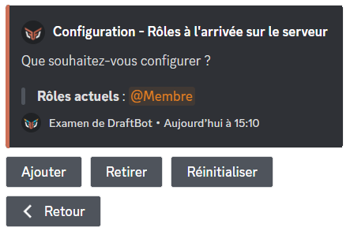
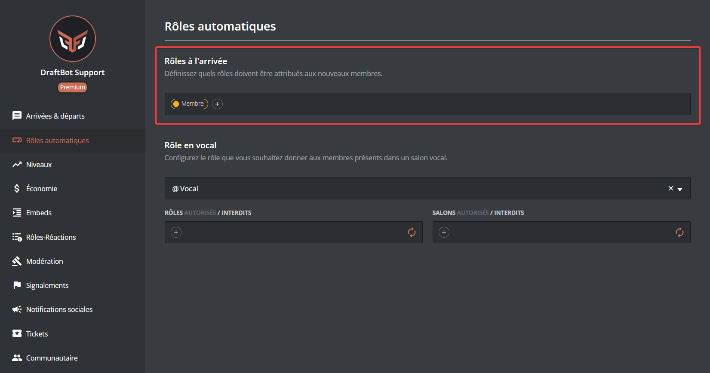
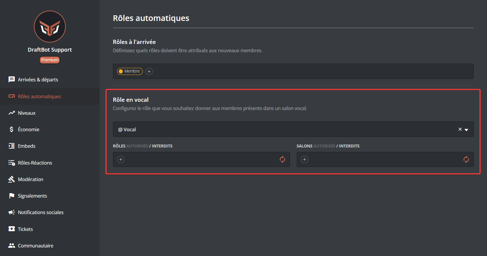

## Rôles automatiques

### A l'arrivée
Vous avez la possiblité de mettre en place un rôle qui est distribué automatiquement lorsqu'un utilisateur rejoint le serveur.

::tabs
  ::tab{ label="Via la commande /config" }
    Veuillez d'abord vous rendre dans \</config> ➜ 🏷️ Rôles automatiques ➜ "À l'arrivée".

    Pour ajouter un rôle automatique lorsqu'un membre rejoint votre serveur, cliquez sur "Ajouter".

    Si vous souhaitez retirer un rôle de cette liste, cliquez sur "Retirer".

    Pour retirer **tous** les rôles automatiques, cliquez sur "Réinitialiser".

    ::hint{ type="info" }
      La limite des rôles automatiques est de 3 pour les serveurs non-premiums et de 10 pour les serveurs premiums.
    ::

    
  ::

  ::tab{ label="Via le panel" }
    [⫸ Accéder au panel de **DraftBot**](/dashboard/first/nomDuModule)

    Sélectionnez ensuite le rôle que vous souhaitez rendre automatique à l'arrivée d'un nouveau membre.

    ::hint{ type="warning" }
      Certains rôles peuvent apparaitre en rouge pour l'une des raisons suivantes :

      ➜ DraftBot n'a pas les permissions de gérer les rôles.

      ➜ Le rôle de DraftBot est en dessous des rôles que vous souhaitez attribuer.

      ➜ Le rôle de l'utilisateur est en dessous des rôles qu'il souhaite attribuer.

      ➜ Le rôle est géré par un bot ou par Discord.
    ::

    
  ::
::

::hint{ type="warning" }
  Si vous avez mis en place un **Processus d'accueil** ou un **Règlement Discord**, l'utilisateur doit remplir les conditions qui ont été mis en place afin que DraftBot attribue le rôle.
::

### En vocal

::tabs
  ::tab{ label="Via la commande /config" }
    Veuillez d'abord vous rendre dans \</config> ➜ 🏷️ Rôles Automatiques ➜ "En vocal".

    Pour ajouter un rôle automatique à un membre en vocal, vous pouvez cliquer sur **"Configurer"**.

    ::hint{ type="info" }
      Vous avez la possibilité de sélectionner un rôle déjà existant ou d'en créer un directement.
    ::

    Pour retirer un rôle automatique à l'arrivée d'un membre, vous pouvez cliquer sur **"Modifier"**.

    ::hint{ type="info" }
      Vous avez la possibilité de supprimer le rôle du serveur une fois le système désactivé.
    ::

    ### Restreindre des salons aux membres en vocal

    Pour restreindre des salons aux membres en vocal, cliquez sur **"Restreindre des salons aux membres en vocal"** puis sélectionnez le salon en question. Seuls les membres possédant ce rôle pourront le voir.

    
  ::

  ::tab{ label="Via le panel" }
    [⫸ Accéder au panel de **DraftBot**](/dashboard/first/nomDuModule)

    Sélectionnez ensuite le rôle que vous souhaitez rendre automatique lorsqu'un membre rejoint un salon vocal.

    ::hint{ type="warning" }
      Certains rôles peuvent apparaitre en rouge pour l'une des raisons suivantes :

      ➜ DraftBot n'a pas les permissions de gérer les rôles.

      ➜ Le rôle de DraftBot est en dessous des rôles que vous souhaitez attribuer.

      ➜ Le rôle de l'utilisateur est en dessous des rôles qu'il souhaite attribuer.

      ➜ Le rôle est géré par un bot ou par Discord.
    ::

    
  ::
::

## Attribution de rôles temporaires
Vous avez la possibilité d'attribuer un rôle temporaire sur une durée souhaitée, permettant à vos membres de profiter de ce rôle sur une durée déterminée.

### /role-temporaire
La commande \</role-temporaire> permet de distribuer à un membre un rôle sur une durée souhaité

Il suffit de sélectionner un **membre**, de sélectionner le **rôle** concerné puis de définir une durée.

## Attribution de rôles en masse
Il est possible d'attribuer des rôles à des membres en masse afin de faciliter la tâche sur la distribution des rôles.

### /role tous
La commande \</role tous> permet de distribuer ou de retirer à l'ensemble des membres du serveur un rôle spécifié.

Il suffit de choisir l'action à faire (**ajouter** ou **retirer**) puis de sélectionner le rôle concerné. Vous devez également choisir si l'ensemble des membres sont concernés (**Humain** + **Bots**) ou uniquement un des deux.

Une fois la commande lancée l'attribution des rôles s'effectuera, un message vous informera de la progression de la commande.

### /role pour
La commande \</role pour> permet de distribuer ou de retirer un rôle en masse, mais en permettant de créer une condition pour ajouter voir retirer le rôle souhaité.

Il suffit de choisir l'action à faire (**ajouter** ou **retirer**), sélectionner le rôle qui déterminera l'ajout du rôle, puis de sélectionner le rôle que vous souhaitez ajouter.

Vous devez également choisir si l'ensemble des membres sont concernés (**Humain** + **Bots**) ou uniquement un des deux.

> Ici, le `Rôle A` sera donné à l'ensemble des membres ayant le `Rôle B`.

Une fois la commande lancée l'attribution des rôles s'effectuera, un message vous informera de la progression de la commmande.

### /role status
La commande \</role status> permet de connaître l'état de l'attribution et le retrait des rôles des utilisateurs et des bots en masse.

### /role annuler
La commande \</role annuler> permet d'annuler les opérations de l'attribution et le retrait des rôles des utilisateurs et des bots en masse.

