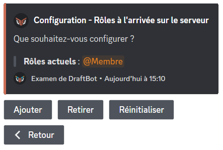
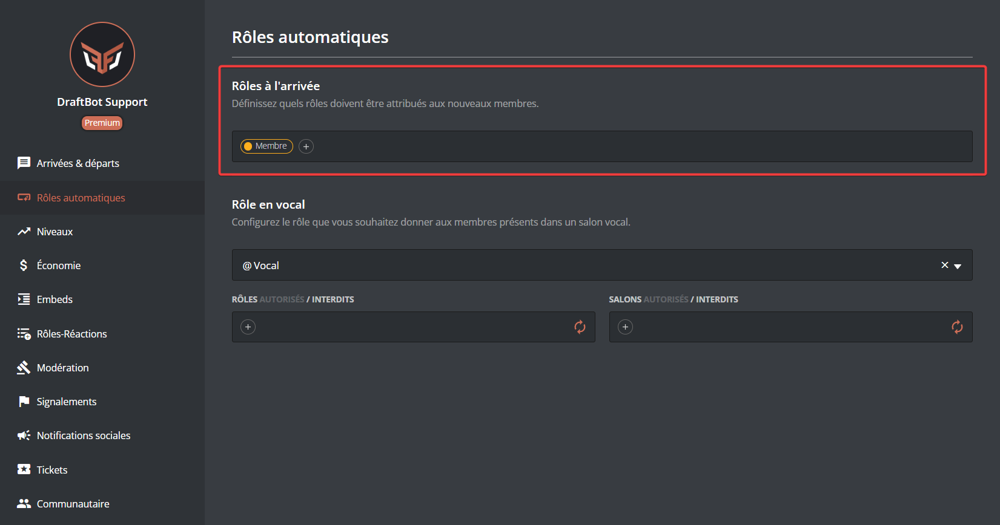
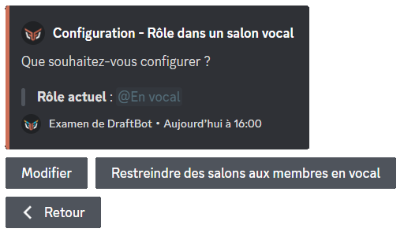
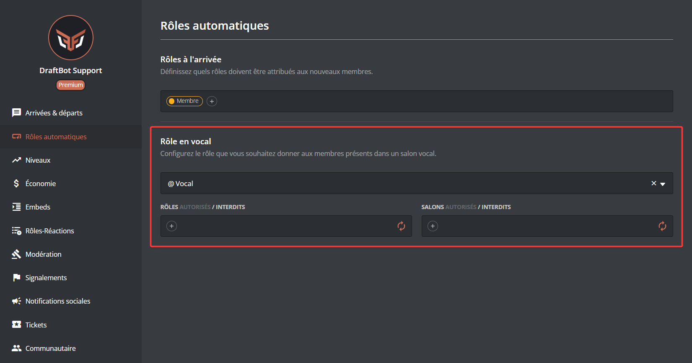
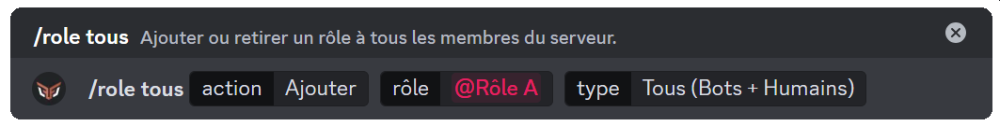
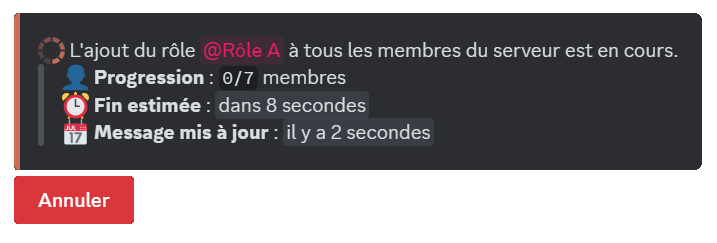
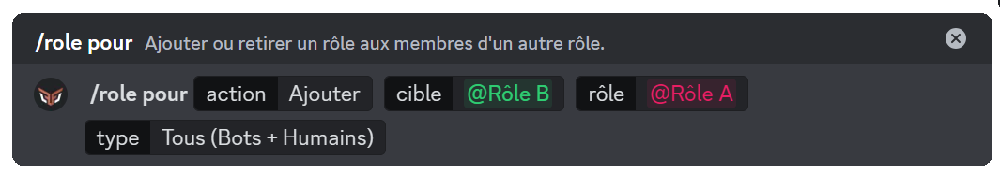

## Rôles automatiques

### A l'arrivée

::tabs
  ::tab{ label="Via la commande /config" }
    Veuillez d'abord vous rendre dans \</config> ➜ 🏷️ Rôles automatiques ➜ "À l'arrivée".

    Pour ajouter un rôle automatique lorsqu'un membre rejoint votre serveur, cliquez sur "Ajouter".

    Si vous souhaitez retirer un rôle de cette liste, cliquez sur "Retirer".

    Pour retirer **tous** les rôles automatiques, cliquez sur "Réinitialiser".

    ::hint{ type="info" }
      Vous pouvez créer jusqu'à 3 rôles automatiques. Les serveurs [premium](/premium) <:icon_premium_:1096140508625125417> ont le droit d'en créer jusqu'à 10.
    ::

    
  ::

  ::tab{ label="Via le panel" }
    [⫸ Accéder au panel de **DraftBot**](/dashboard/first/autoroles)

    Sélectionnez ensuite le rôle que vous souhaitez rendre automatique à l'arrivée d'un nouveau membre.

    ::hint{ type="warning" }
      Certains rôles peuvent apparaître en rouge pour l'une des raisons suivantes :

      ➜ DraftBot n'a pas les permissions de gérer les rôles.

      ➜ Le rôle de DraftBot est en dessous des rôles que vous souhaitez attribuer.

      ➜ Le rôle de l'utilisateur est en dessous des rôles qu'il souhaite attribuer.

      ➜ Le rôle est géré par un bot ou par Discord.
    ::

    
  ::
::

### En vocal

::tabs
  ::tab{ label="Via la commande /config" }
    Veuillez d'abord vous rendre dans \</config> ➜ 🏷️ Rôles Automatiques ➜ "En vocal".

    Pour ajouter un rôle automatique à un membre en vocal, vous pouvez cliquer sur **"Configurer"**.

    ::hint{ type="info" }
      Vous avez la possibilité de sélectionner un rôle déjà existant ou d'en créer un directement.
    ::

    Pour retirer un rôle automatique en vocal, vous pouvez cliquer sur **"Modifier"**.

    ::hint{ type="info" }
      Vous avez la possibilité de supprimer le rôle du serveur une fois le système désactivé.
    ::

    ### Restreindre des salons aux membres en vocal

    Pour restreindre des salons aux membres en vocal, cliquez sur **"Restreindre des salons aux membres en vocal"** puis sélectionnez le salon en question. Seuls les membres possédant ce rôle pourront le voir.

    
  ::

  ::tab{ label="Via le panel" }
    [⫸ Accéder au panel de **DraftBot**](/dashboard/first/autoroles)

    Sélectionnez ensuite le rôle que vous souhaitez rendre automatique lorsqu'un membre rejoint un salon vocal.

    ::hint{ type="warning" }
      Certains rôles peuvent apparaitre en rouge pour l'une des raisons suivantes :

      ➜ DraftBot n'a pas les permissions de gérer les rôles.

      ➜ Le rôle de DraftBot est en dessous des rôles que vous souhaitez attribuer.

      ➜ Le rôle de l'utilisateur est en dessous des rôles qu'il souhaite attribuer.

      ➜ Le rôle est géré par un bot ou par Discord.
    ::

    
  ::
::

## Attribution de rôles en masse

::tabs
  ::tab{ label="/role tous" }
    La commande \</role tous> permet de distribuer à l'ensemble des membres du serveur un rôle spécifié.
    
    Il suffit de choisir l'action à faire (ajouter ou retirer) puis de sélectionner le rôle concerné. Vous devez également choisir si l'ensemble des membres est concerné (Humain + Bots) ou uniquement un des deux.

    Une fois la commande lancée, l'attribution des rôles s'effectuera et un message vous informera de la progression de la commande[^1].
    
    [^1]:Plus les membres sont nombreux, plus la tâche est longue.
  ::

  ::tab{ label="/role pour" }
    La commande \</role pour> permet d'ajouter un rôle en masse, mais en permettant de créer une condition pour ajouter le rôle souhaité.

    Il suffit de choisir l'action à faire (ajouter ou retirer), sélectionner le rôle qui déterminera l'ajout du rôle, puis de sélectionner le rôle que vous souhaitez ajouter. Vous devez également choisir si l'ensemble des membres est concerné (Humain + Bots) ou uniquement un des deux.
    
    Ici, le rôle A sera donné à l'ensemble des membres ayant le rôle B.

    Une fois la commande lancée l'attribution des rôles s'effectuera, un message vous informera de la progression de la commande[^1].
    
  ::
::
