## Utilisation

### Menu des suggestions

Pour accéder au menu des suggestions, vous devez entrer la commande \</suggestion>.

Un menu s'ouvre alors. Il vous permet de :
- soumettre de nouvelles suggestions,
- commenter une de vos suggestions,
- accéder à une de vos suggestions (en cliquant sur son titre) ou encore,
- consulter l'état de vos suggestions (nombre de votes, statut).

Vous pourrez également décider de vous faire notifier ou non en cas d'un changement de [statut](#gerer-les-suggestions) sur l'une de vos suggestions (si l'option "Notification lors du changement de statut" est [activée](#mod%C3%A9ration)).

::hint{ type="info" }
  Pour ne pas surcharger vos salons, la commande s'effectue en toute discrétion : le message d'envoi de la commande est supprimé immédiatement, et la réponse de DraftBot est visible uniquement par l'utilisateur de la commande !
::

### Soumettre une suggestion

Pour soumettre une suggestion, il faut vous rendre dans le [menu des suggestions](#menu-des-suggestions) (\</suggestion>) puis cliquer sur le bouton "Envoyer une nouvelle suggestion".

**DraftBot** vous ouvrira ensuite un pop-up où vous pourrez renseigner :

- Titre ➜ Le titre à donner à votre suggestion. Il permettra aussi de la référencer dans le [menu des suggestions](#menu-des-suggestions).
- Description ➜ La description de votre suggestion, où vous pourrez détailler votre suggestion pour mieux l'expliquer aux autres membres.

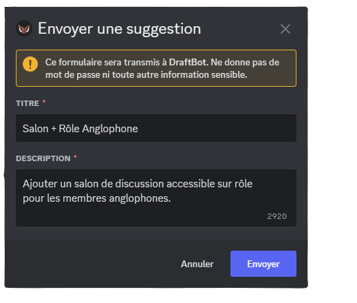

::hint{ type="info" }
  Une fois votre suggestion terminée, DraftBot vous affichera un message de confirmation. À ce moment-là, vous pourrez modifier votre envoi, y [ajouter une image](#ajouter-une-image), le valider, ou bien l'annuler :

  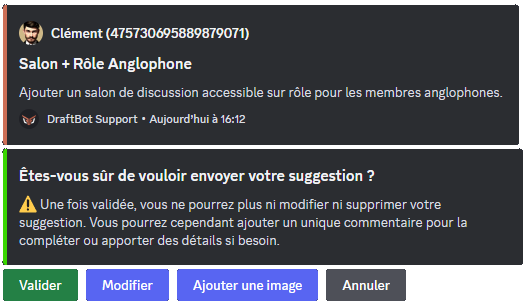
::

### Ajouter une image

Si vous souhaitez ajouter une image à votre suggestion, il faut cliquer sur le bouton "`Ajouter une image`" situé sous le message de confirmation de DraftBot (image ci-dessus).

Immédiatement, vous recevrez un message privé de la part de **DraftBot** vous invitant à lui transmettre l'image que vous souhaitez intégrer à votre suggestion.

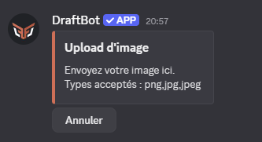

Ensuite, il vous suffit d'envoyer votre image à DraftBot comme vous le feriez dans une conversation normale ! L'upload ne prendra que quelques instants, puis vous recevrez un message de confirmation.

### Commenter une suggestion

Vous avez oublié quelque chose lors de l'envoi de votre suggestion ?

**DraftBot** vous permet de commenter vos suggestions en cliquant sur "Ajouter un commentaire sur l'une de ces suggestions" dans le [menu des suggestions](#menu-des-suggestions).

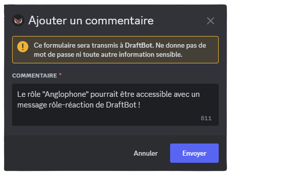

Une fois le commentaire ajouté, il apparaît en bas de votre message de suggestion :

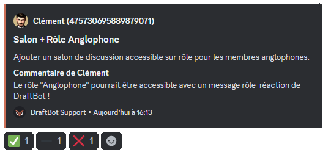

### Gérer les suggestions

Vous pouvez donc créer et modifier des suggestions, mais ça ne s'arrête pas là :

**DraftBot** vous permet d'**accepter**, de **refuser** ou de **prévoir** une suggestion, et tout ça en seulement deux clics (ou une commande) !

::hint{ type="warning" }
  Vous avez besoin de la permission "Gérer les messages" pour pouvoir accepter, refuser ou prévoir une suggestion.
::

::collapse{ label="Accepter une suggestion"}
  Une suggestion a reçu suffisamment de votes, et/ou vous a tapé dans l'œil ? Vous pouvez l'accepter, ce qui aura pour effet d'interrompre le vote, et de valider la suggestion. Pour ce faire, deux moyens sont à votre disposition :

  ::tabs
    ::tab{ label="Clic" }
      Sur ordinateur, faites un clic droit (sur mobile, appuyez longtemps) sur la suggestion que vous souhaitez accepter, ouvrez ensuite la ligne "Applications". Vous aurez alors la possibilité d'accepter la suggestion.

      
    ::

    ::tab{ label="Commande" }
      La commande \</suggestmod accepter> vous permet également d'accepter une suggestion. Vous devrez pour cela saisir l'[identifiant](/docs/autres/recuperer-un-identifiant#identifiant-dun-message) du message de la suggestion à accepter. Finalement, vous aurez la possibilité de donner une raison d'acceptation.
    ::
  ::
  Peu importe la méthode utilisée, lorsque vous acceptez une suggestion ; vous aurez la possibilité de donner une raison d'acceptation, si vous le souhaitez.

  ::hint{ type="info" }
    Si vous avez activé l'option "fil de tri pour les suggestions acceptées", la suggestion sera automatiquement déplacée dans le fil défini.
  ::
::

::collapse{ label="Refuser une suggestion"}
  Une suggestion a reçu beaucoup de votes négatifs, ou n'est tout simplement pas réalisable ? Vous pouvez la refuser, ce qui aura pour effet d'interrompre le vote, et d'invalider la suggestion. Pour ce faire, deux moyens sont à votre disposition :

  ::tabs
    ::tab{ label="Clic" }
      Sur ordinateur, faites un clic droit (sur mobile, appuyez longtemps) sur la suggestion que vous souhaitez refuser, ouvrez ensuite la ligne "Applications". Vous aurez alors la possibilité de refuser la suggestion.

      
    ::

    ::tab{ label="Commande" }
      La commande \</suggestmod refuser> vous permet également de refuser une suggestion. Vous devrez pour cela saisir l'[identifiant](/docs/autres/recuperer-un-identifiant#identifiant-dun-message) du message de la suggestion à refuser.
    ::
  ::
  Peu importe la méthode utilisée, lorsque vous refusez une suggestion : vous devrez nécessairement indiquer une raison, pour valider le refus.

  ::hint{ type="info" }
    Si vous avez activé l'option "fil de tri pour les suggestions refusées", la suggestion sera automatiquement déplacée dans le fil défini.
  ::
::

::collapse{ label="Prévoir une suggestion"}
  Une suggestion a reçu beaucoup de votes positifs, et ça y est : vous avez prévu sa mise en œuvre ? Vous pouvez la marquer comme "prévue", ce qui aura pour effet d'interrompre le vote. Vous pouvez donner ce statut directement à une suggestion en cours, ou bien à une suggestion qui était déjà acceptée. Dans tous les cas, deux moyens sont à votre disposition :

  ::tabs
    ::tab{ label="Clic" }
      Sur ordinateur, faites un clic droit (sur mobile, appuyez longtemps) sur la suggestion que vous souhaitez prévoir, ouvrez ensuite la ligne "Applications". Vous aurez alors la possibilité de marquer la suggestion comme "prévue".

      
    ::

    ::tab{ label="Commande" }
      La commande \</suggestmod prevue> vous permet également de refuser une suggestion. Vous devrez pour cela saisir l'[identifiant](/docs/autres/recuperer-un-identifiant#identifiant-dun-message) du message de la suggestion prévue. Finalement, vous aurez la possibilité de donner une raison pour expliquer ce choix, ou donner détails dessus.
    ::
  ::

  ::hint{ type="info" }
    Si vous avez activé l'option "fil de tri pour les suggestions refusées", la suggestion sera automatiquement déplacée dans le fil défini.
  ::
::

::hint{ type="info" }
  Vous vous rendez compte que vous avez été un peu trop vite ? Vous pouvez toujours repasser une suggestion en attente via la commande \</suggestmod attente> ! Le vote reprendra alors.
::

::hint{ type="info" }
  À tout moment, vous pouvez modifier le statut d'une suggestion, par un clic droit, ou par une commande, même si celle-ci a déjà été traitée.
::

::hint{ type="success" }
  À chaque changement d'état d'une suggestion, le membre qui l'a envoyée sera notifié par DraftBot via messages privés, s'il a [activé les notifications](#menu-des-suggestions) de suggestions.
::

## Configuration

### Vue globale

::tabs
  ::tab{ label="Via la commande /config" }
    ::hint{ type="info" }
      Pour accéder directement à la configuration de ce module, sans passer par le menu principal, vous pouvez saisir la commande \</config Suggestions> !
    ::
    Une fois la commande exécutée, DraftBot affiche un message comportant :
    - Des informations sur l'état actuel du module ;
    - Des boutons d'action (nous y reviendrons dans le [paragraphe suivant](#activation-du-module)).

    ::collapse{ label="Afficher le détail des informations sur le module"}

      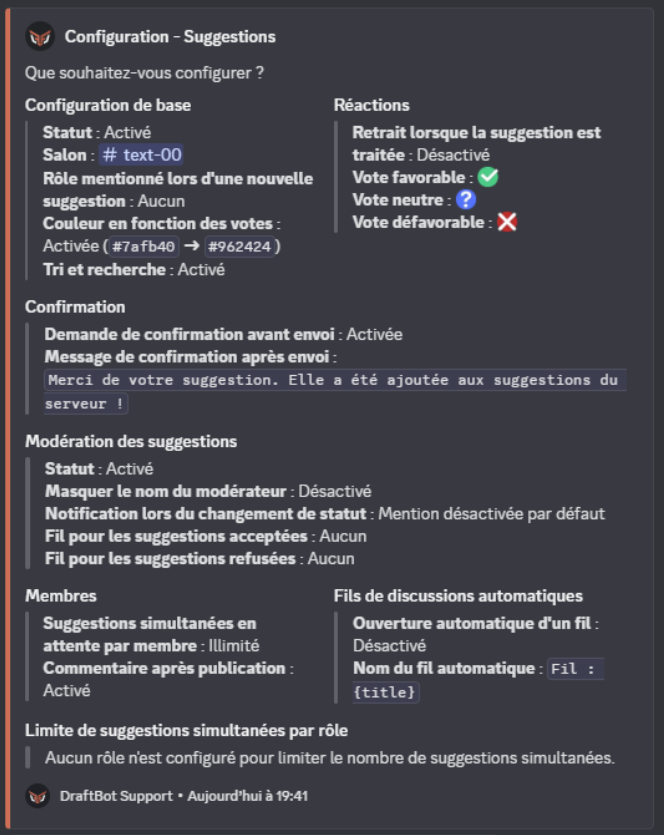

      Le corps du message comporte plusieurs sections, reflétant chacune l'état d'une partie du système :

      ::collapse{ label="Configuration de base"}

        | Nom | Description |
        |-----|-------------|
        | **Statut** | État d'activation du module |
        | **Salon** | Salon où apparaissent les suggestions |
        | **Rôle mentionné** | Le rôle que DraftBot mentionnera à chaque nouvelle suggestion |
        | **Couleur en fonction des votes** | Plage de couleurs sur laquelle le message évoluera en fonction des votes |
        | **Tri et recherche** | État d'activation du système de tri et recherches |
      ::

      ::collapse{ label="Réactions"}

        | Nom | Description |
        |-----|-------------|
        | **Retrait lorsque suggestion traitée** | Définit si les réactions seront supprimées une fois la suggestion traitée |
        | **Vote favorable** | L'émoji à cliquer pour voter POUR. |
        | **Vote neutre** | L'émoji à cliquer pour voter NEUTRE. |
        | **Vote défavorable** | L'émoji à cliquer pour voter CONTRE. |
      ::

      ::collapse{ label="Confirmation"}

        | Nom | Description |
        |-----|-------------|
        | **Demande de confirmation avant envoi** | Définit si le membre devra confirmer sa suggestion avant envoi. |
        | **Message de confirmation après envoi** | Le message envoyé au membre par DraftBot après l'envoi d'une suggestion. |
      ::

      ::collapse{ label="Modération des suggestions"}

        | Nom | Description |
        |-----|-------------|
        | **Statut** | Définit si les suggestions pourront être acceptées/refusées. |
        | **Masquer le nom du modérateur** | Définit si le modérateur qui traite une suggestion doit être anonymisé. |
        | **Notification lors du changement de statut** | Définit si le membre qui a posté une suggestion peut être notifié lors d'un changement de statut. |
        | **Fil pour les suggestions acceptées** | Si activé, définit le fil dans lequel les suggestions acceptées sont déplacées. |
        | **Fil pour les suggestions refusées** | Si activé, définit le fil dans lequel les suggestions refusées sont déplacées. |
      ::

      ::collapse{ label="Membres"}

        | Nom | Description |
        |-----|-------------|
        | **Suggestions simultanées en attente par membre** | Nombre de suggestions non traitées qu'un membre peut proposer dans le même temps. |
        | **Commentaire après publication** | Définit si l'auteur d'une suggestion peut y ajouter un commentaire après l'avoir postée. |
      ::

      ::collapse{ label="Fils de discussions automatiques"}

        ::hint{ type="info" }
          Il s'agit d'une [fonctionnalité ✨ premium](/premium).
        ::

        | Nom | Description |
        |-----|-------------|
        | **Ouverture automatique d'un fil** | Définit si un fil de discussion sera automatiquement ouvert par DraftBot pour chaque suggestion. |
        | **Nom du fil automatique** | Définit le nom du fil automatiquement ouvert. |
      ::

      ::collapse{ label="Limite de suggestions simultanées par rôle"}

        ::hint{ type="info" }
          Il s'agit d'une [fonctionnalité ✨ premium](/premium). Si ce système est activé, il permet de configurer des limites spécifiques en fonction des rôles.
        ::
      ::
    ::

    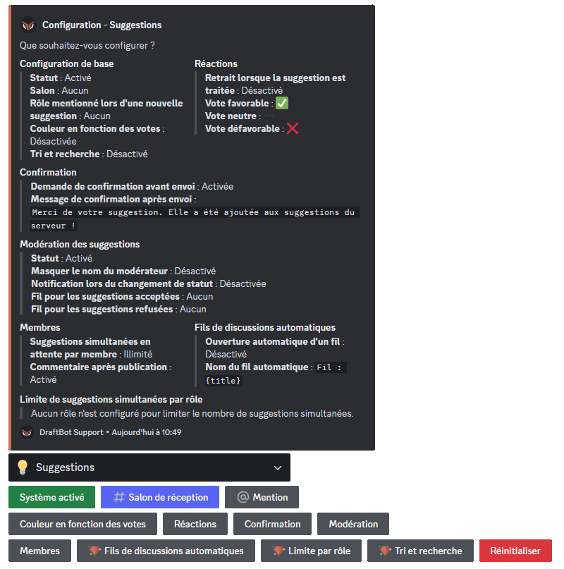
  ::

  ::tab{ label="Via le Panel"}
    [⫸ Accéder au panel de **DraftBot**](/dashboard/first/suggestions)

    Depuis le panel DraftBot, vous pouvez également accéder à toutes les options de configuration du module, accessibles en quelques clics.

    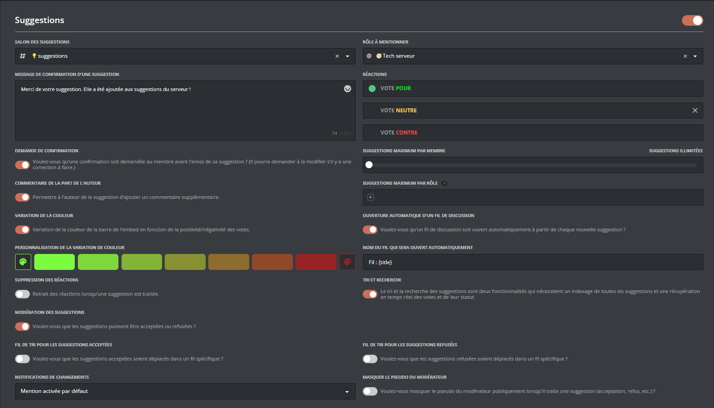
  ::
::

### Activation du module

::tabs
  ::tab{ label="Via la commande /config" }
    Ce bouton permet d'activer/désactiver le module de suggestions.
    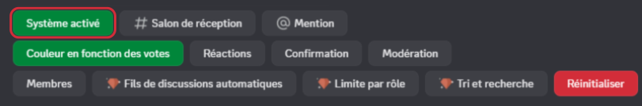
  ::

  ::tab{ label="Via le Panel" }
    [⫸ Accéder au panel de **DraftBot**](/dashboard/first/suggestions)

    Depuis le Panel DraftBot, vous pouvez activer ou désactiver le module d'un simple clic sur le bouton affiché à côté du nom du module.
    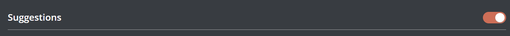
  ::
::

::hint{ type="success" }
  Si vous désactivez le module, et décidez de le réactiver plus tard, DraftBot se rappellera des réglages que vous aviez faits, et les restaurera !
::

### Salon de réception

::tabs
  ::tab{ label="Via la commande /config" }
    Ce bouton permet de renseigner le salon dans lequel vous souhaitez que les suggestions soient envoyées. Pour le modifier, cliquez sur le bouton, puis renseignez le \<#salon> désiré :
    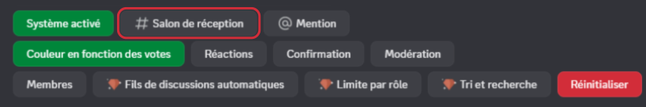
  ::

  ::tab{ label="Via le Panel" }
    [⫸ Accéder au panel de **DraftBot**](/dashboard/first/suggestions)

    Pour modifier le \<#salon> dans lequel les suggestions envoyées par les membres devront être postées, il vous suffit de le choisir dans le sélecteur sur le panel.

    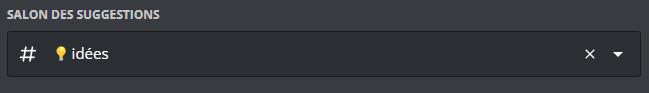

    ::hint{ type="info" }
      Si vous ne trouvez pas le salon dans la liste, pensez à réactualiser la page !
    ::
  ::
::

::hint{ type="info" }
  Vous pouvez régler ce salon en lecture seule, pour que les suggestions restent toujours facilement accessibles !
::

### Mention

::tabs
  ::tab{ label="Via la commande /config" }
    Ce bouton vous permet de définir un rôle à mentionner lorsque des suggestions sont envoyées. Si vous configurez cette option, le rôle sélectionné recevra une notification à chaque nouvelle suggestion postée.

    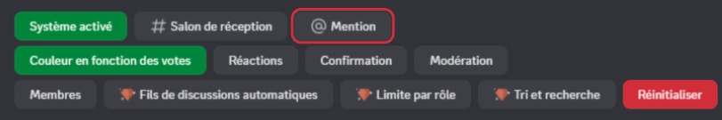
  ::

  ::tab{ label="Via le Panel" }
    [⫸ Accéder au panel de **DraftBot**](/dashboard/first/suggestions)

    Depuis le Panel, il est très facile de sélectionner le rôle à mentionner lors de la publication d'une nouvelle suggestion.

    
  ::
::

### Couleur en fonction des votes

::tabs
  ::tab{ label="Via la commande /config" }
    Ce bouton permet d'ouvrir le menu de gestion des couleurs.

    

    En interagissant avec, vous pouvez :
    - Activer / Désactiver le dégradé automatique des suggestions
    - Modifier les couleurs ([Fonctionnalité ✨ premium ](/premium)).

    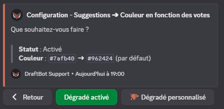
  ::

  ::tab{ label="Via le Panel" }
    [⫸ Accéder au panel de **DraftBot**](/dashboard/first/suggestions)

    **DraftBot** permet de faire varier automatiquement la couleur d'une suggestion en fonction du ratio votes positifs / votes neutres / votes négatifs.

    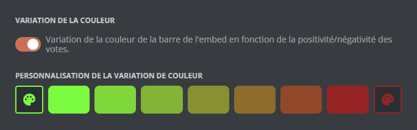

    ::hint{ type="info" }
      Si [DraftBot ✨ premium ](/premium) est activé sur votre serveur, vous aurez la possibilité de modifier les couleurs entre lesquels la variation aura lieu !
    ::
  ::
::

::hint{ type="info" }
  Par défaut, DraftBot fera varier progressivement la couleur de la suggestion, du rouge (plus de votes négatifs que positifs) au vert (plus de votes positifs que négatifs), en fonction de l'écart entre les votes.
::

### Réactions

::tabs
  ::tab{ label="Via la commande /config" }
    Ce bouton permet d'ouvrir le menu de configuration des réactions.

    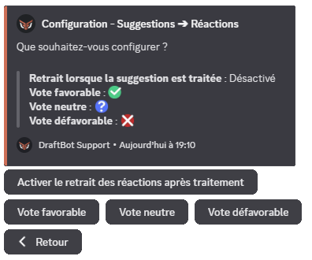

    En interagissant avec ce menu, vous pouvez :
    - Activer / Désactiver la suppression des réactions après traitement.
    - Définir les émojis à utiliser pour les votes favorables, neutres et défavorables.

    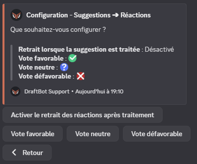
  ::

  ::tab{ label="Via le Panel" }
    [⫸ Accéder au panel de **DraftBot**](/dashboard/first/suggestions)
    Avec DraftBot, vous êtes libres : choisissez vous-même les Emojis qui représenteront les votes des membres.

    

    Vous pouvez également décider de masquer les réactions de la suggestion une fois qu'elle est traitée.

    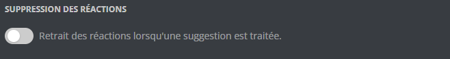
  ::
::

::hint{ type="success" }
  En plus des émojis Discord, vous pouvez utiliser les Emojis personnalisés de votre serveur, et même ses émojis animés, si vous en avez [configuré](https://support.discord.com/hc/fr/articles/360041139231-Ajout-d-Emojis) !
::

### Confirmation

::tabs
  ::tab{ label="Via la commande /config" }
    Ce bouton permet d'ouvrir le menu de configuration des confirmations.

    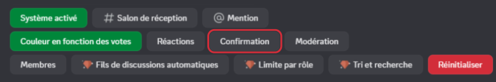

    En interagissant avec ce menu, vous pouvez :
    - Choisir si l'auteur d'une suggestion doit la confirmer *avant* envoi ;
    - Personnaliser le message de confirmation envoyé au membre *après* la publication de sa suggestion.

    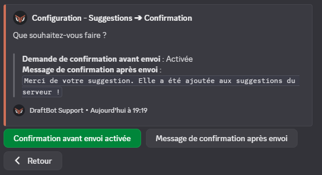
  ::

  ::tab{ label="Via le Panel" }
    [⫸ Accéder au panel de **DraftBot**](/dashboard/first/suggestions)

    Avec **DraftBot**, vous pouvez :
    - Choisir si l'auteur d'une suggestion doit ou non la confirmer *avant* envoi ;
    - Personnaliser le message de confirmation envoyé au membre *après* la publication de sa suggestion.

    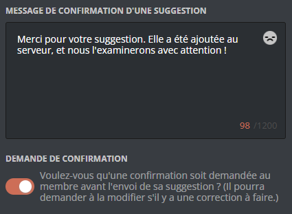
  ::
::

### Modération

::tabs
  ::tab{ label="Via la commande /config" }
    Ce bouton permet d'ouvrir le menu de configuration de la modération des suggestions.

    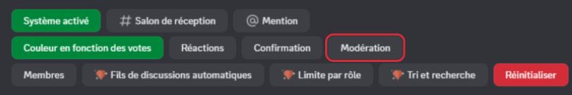

    En interagissant avec ce menu, vous pouvez :
    - Définir si les suggestions pourront être traitées. (Tri des suggestions) ;

    ::hint{ type="warning" }
      Si vous désactivez cette option, **vous ne pourrez plus accepter/refuser/prévoir les suggestions**.
    ::

    - Définir si le modérateur qui modifie le statut d'une suggestion doit être anonymisé ou non ;
    - Définir l'état par défaut des notifications, ou les désactiver globalement ;

    ::hint{ type="info" }
      Vous aurez le choix entre : notifications désactivées par défaut, activées par défaut, ou totalement désactivées.
    ::

    - Définir un fil où ranger toutes les suggestions acceptées ;
    - Définir un fil où ranger toutes les suggestions refusées.

    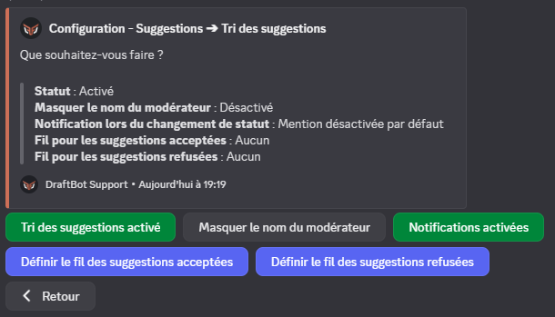
  ::

  ::tab{ label="Via le Panel" }
    [⫸ Accéder au panel de **DraftBot**](/dashboard/first/suggestions)
    Cette partie du panel vous permet de :
    - Définir si les suggestions pourront être traitées (Tri des suggestions) ;

    ::hint{ type="warning" }
      Si vous désactivez cette option, **vous ne pourrez plus accepter/refuser/prévoir les suggestions**.
    ::

    - Définir si le modérateur qui modifie le statut d'une suggestion doit être anonymisé ou non ;
    - Définir l'état par défaut des notifications, ou les désactiver globalement ;

    ::hint{ type="info" }
      Vous aurez le choix entre : notifications désactivées par défaut, activées par défaut, ou totalement désactivées.
    ::

    - Définir un fil où ranger toutes les suggestions acceptées ;
    - Définir un fil où ranger toutes les suggestions refusées.

    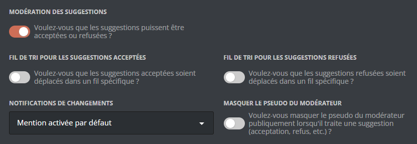
  ::
::

### Membres

::tabs
  ::tab{ label="Via la commande /config" }
    Ce bouton permet d'ouvrir le menu de configuration des restrictions éventuelles à appliquer aux membres.

    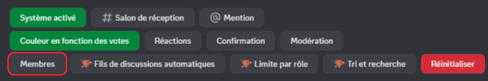

    En effet, vous pouvez :

    - Choisir le nombre de suggestions en attente simultanément pour chaque membre ;
        - <:icon_arrows:1120818258883383307> Illimité par défaut !
    - Définir si l'auteur d'une suggestion aura la possibilité d'y ajouter un [commentaire](#commenter-une-suggestion).

    
  ::

  ::tab{ label="Via le Panel" }
    [⫸ Accéder au panel de **DraftBot**](/dashboard/first/suggestions)

    Vous pouvez choisir d'autoriser ou non l'auteur d'une suggestion à y ajouter un [commentaire](#commenter-une-suggestion) après sa publication.

    En outre, vous avez la possibilité de restreindre le nombre de suggestions en attente simultanément par membre. Vous pouvez régler la limite désirée en faisant varier la jauge :

    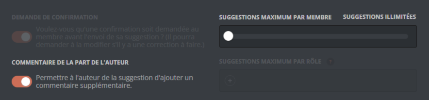

    ::hint{ type="success" }
      Par défaut, le nombre de suggestions en attente simultanément par membre est illimité !
    ::
  ::
::

### Fils de discussions automatiques

::tabs
  ::tab{ label="Via la commande /config" }

    ::hint{ type="info" }
      Fonctionnalité réservée aux serveurs sur lesquels [DraftBot ✨ Premium](/premium) est activé.
    ::

    DraftBot peut créer automatiquement un fil de discussion attaché à chaque suggestion, permettant à l'auteur de la suggestion et aux modérateurs d'interagir ensemble.

    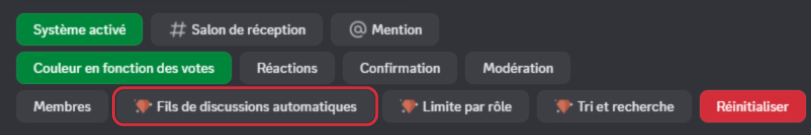

    Dans ce menu, vous pouvez :

    - Activer / désactiver cette fonctionnalité,
    - Personnaliser la façon dont les fils seront nommés.

    ::hint{ type="success" }
      Vous pouvez personnaliser la nomenclature des fils en utilisant une des nombreuses [variables](#variables) à votre disposition !
    ::

    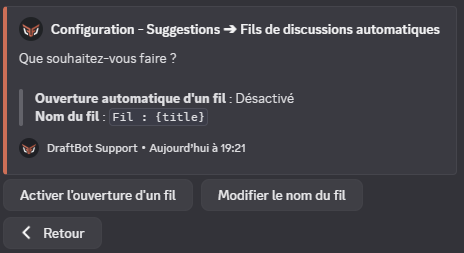
  ::

  ::tab{ label="Via le Panel" }
    [⫸ Accéder au panel de **DraftBot**](/dashboard/first/suggestions)

    ::hint{ type="info" }
      Fonctionnalité réservée aux serveurs sur lesquels [DraftBot ✨ Premium](/premium) est activé.
    ::

    DraftBot peut créer automatiquement un fil de discussion attaché à chaque suggestion, permettant à l'auteur de la suggestion et aux modérateurs d'interagir ensemble.

    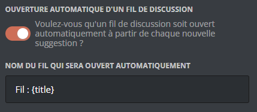
  ::
::

### Limite par rôle

::tabs
  ::tab{ label="Via la commande /config" }

    ::hint{ type="info" }
      Fonctionnalité réservée aux serveurs sur lesquels [DraftBot ✨ Premium](/premium) est activé.
    ::

    Cette fonction vous permet de restreindre les limites de suggestions en attente simultanées en fonction des rôles.

    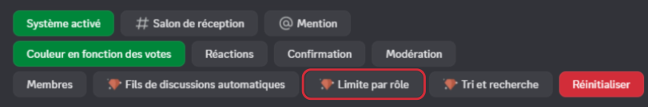

    ::hint{ type="success" }
      Pour favoriser vos membres les plus actifs, n'hésitez pas à utiliser cette option en binôme avec des rôles octroyés par le [système de niveaux](/docs/modules/niveaux#cr%C3%A9er-une-r%C3%A9compense) 😉
    ::

    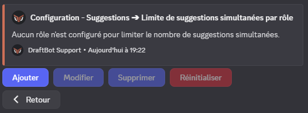
  ::

  ::tab{ label="Via le Panel" }
    [⫸ Accéder au panel de **DraftBot**](/dashboard/first/suggestions)

    ::hint{ type="info" }
      Fonctionnalité réservée aux serveurs sur lesquels [DraftBot ✨ Premium](/premium) est activé.
    ::

    Cette fonctionnalité vous permet de restreindre les limites de suggestions en attente simultanément, en fonction des rôles possédés par les utilisateurs.

    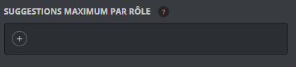

    ::hint{ type="success" }
      Pour favoriser vos membres les plus actifs, n'hésitez pas à utiliser cette option en binôme avec des rôles octroyés par le [système de niveaux](/docs/modules/niveaux#cr%C3%A9er-une-r%C3%A9compense) 😉
    ::
  ::
::

## Classement des suggestions
La commande \</suggestmod classement> ([✨ premium](/premium)) vous permet d’afficher un classement des suggestions, selon les critères suivants :

- Ordre par :
    - nombre de votes positifs
    - nombre de votes négatifs
    - ratio (rapport entre les votes positifs et négatifs)

- Filtre : Permet de trier les suggestions par un mot-clé.

## Recherche par mots-clés

La commande \</suggestmod rechercher> vous permet de rechercher des suggestions à partir de leur titre. ([✨ premium](/premium))

## Variables

::collapse{ label="Afficher les variables disponibles" }
  Les variables sont des bouts de texte qui évoluent suivant la personne, le serveur, le salon ou encore le temps. Voici celles utilisables dans le nom des fils automatiquement ouverts par DraftBot.

  - `{user}` ➜ Mention du membre
  - `{user.id}` ➜ Identifiant du membre
  - `{user.username}` ➜ Pseudo du membre
  - `{user.nickname}` ➜ Surnom ou pseudo du membre
  - `{server}` ➜ Nom du serveur
  - `{server.id}` ➜ Identifiant du serveur
  - `{server.name}` ➜ Nom du serveur
  - `{server.membercount}` ➜ Nombre de membres sur le serveur
  - `{date}` ➜ Date actuelle (JJ/MM/AAAA)
  - `{time}` ➜ Heure actuelle (HH:MM)
  - `{timestamp}` ➜ Timestamp actuel en secondes
::

