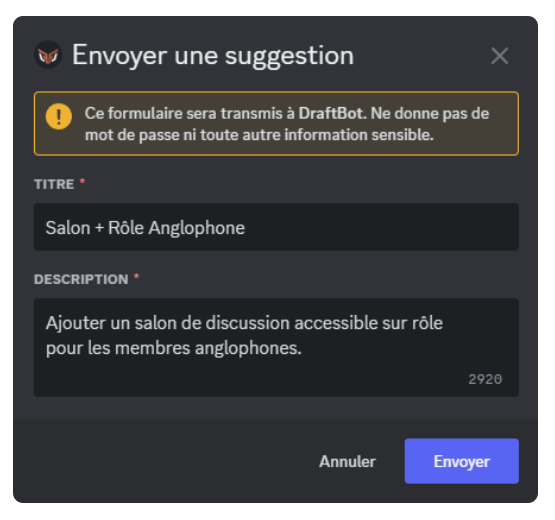

## Utilisation

### Menu des suggestions

Pour accéder au menu des suggestions, vous devez entrer la commande \</suggestion>.

Un menu s'ouvre alors. Il vous permet de :
- soumettre de nouvelles suggestions,
- commenter une de vos suggestions,
- accéder à une de vos suggestions (en cliquant sur son titre) ou encore,
- consulter l'état de vos suggestions (nombre de vote, statut).

Vous pourrez également décider de vous faire notifier ou non en cas d'un changement de [statut](#gerer-une-suggestion) sur l'une de vos suggestions (si l'option "Notification lors du changement de statut" est [activée](#tri-des-suggestions)).

::hint{ type="info" }
  Pour ne pas surcharger vos salons, la commande s'effectue en toute discrétion : le message d'envoi de la commande est supprimé immédiatement, et la réponse de DraftBot est visible uniquement par l'utilisateur de la commande !
::

### Soumettre une suggestion

Pour soumettre une suggestion, il faut vous rendre dans le [menu des suggestions](#menu-des-suggestions) (\</suggestion>) puis cliquer sur le bouton "Envoyer une nouvelle suggestion".

**DraftBot** vous ouvrira ensuite un pop-up où vous pourrez renseigner :

- Titre ➜ Le titre à donner à votre suggestion. Il permettra aussi de la référencer dans le [menu des suggestions](#menu-des-suggestions).
- Description ➜ La description de votre suggestion, où vous pourrez détailler votre suggestion pour mieux l'expliquer aux autres membres.

::hint{ type="info" }
  Une fois votre suggestion terminée, DraftBot vous affichera un message de confirmation. À ce moment là, vous pourrez modifier votre envoi, y [ajouter une image](#ajouter-une-image), le valider, ou bien l'annuler :

  
::

### Ajouter une image

Si vous souhaitez ajouter une image à votre suggestion, il faut cliquer sur le bouton "`Ajouter une image`" situé sous le message de confirmation de DraftBot (image ci-dessus).

Immédiatement, vous recevrez un message privé de la part de **DraftBot** vous invitant à lui transmettre l'image que vous souhaitez intégrer à votre suggestion.

Ensuite, il vous suffit d'envoyer votre image à DraftBot comme vous le feriez dans une conversation normale ! L'upload ne prendra que quelques instants, puis vous recevrez un message de confirmation.

### Commenter une suggestion

Vous avez oublié quelque chose lors de l'envoi de votre suggestion ?

**DraftBot** vous permet de commenter vos suggestions en cliquant sur "Ajouter un commentaire sur l'une de ces suggestions" dans le [menu des suggestions](#menu-des-suggestions).

Une fois le commentaire ajouté, il apparaît en bas de votre message de suggestion :

### Gérer les suggestions

Vous pouvez donc créer et modifier des suggestions, mais ça ne s'arrête pas là :

**DraftBot** vous permet d'**accepter**, de **refuser** ou de **prévoir** une suggestion, et tout ça en seulement deux clics (ou une commande) !

::hint{ type="warning" }
  Vous avez besoin de la permission "Gérer les messages" pour pouvoir accepter, refuser ou prévoir une suggestion.
::

::collapse{ label="Accepter une suggestion"}
  Une suggestion a reçu suffisamment de votes, et/ou vous a tapé dans l'œil ? Vous pouvez l'accepter, ce qui aura pour effet d'interrompre le vote,  et de valider la suggestion. Pour ce faire, deux moyens sont à votre disposition :

  ::tabs
    ::tab{ label="clic" }
      Sur ordinateur, faites un clic droit (sur mobile, appuyez longtemps) sur la suggestion que vous souhaitez accepter, ouvrez ensuite la ligne "Applications". Vous aurez alors la possibilité d'accepter la suggestion.

      
    ::

    ::tab{ label="commande" }
      La commande \</suggestmod accepter> vous permet également d'accepter une suggestion. Vous devrez pour cela saisir l'[identifiant](/docs/autres/recuperer-un-identifiant#identifiant-dun-message) du message de la suggestion à accepter. Finalement, vous aurez la possibilité de donner une raison d'acceptation.
    ::
  ::
  Peu importe la méthode utilisée, lorsque vous acceptez une suggestion; vous aurez la possibilité de donner une raison d'acceptation, si vous le souhaitez.

  ::hint{ type="info" }
    Si vous avez activé activé l'option "fil de tri pour les  suggestions acceptées", la suggestion sera automatiquement déplacée dans le fil défini.
  ::
::

::collapse{ label="Refuser une suggestion"}
  Une suggestion a reçu beaucoup de votes négatifs, ou n'est tout simplement pas réalisable ? Vous pouvez la refuser, ce qui aura pour effet d'interrompre le vote,  et d'invalider la suggestion. Pour ce faire, deux moyens sont à votre disposition :

  ::tabs
    ::tab{ label="clic" }
      Sur ordinateur, faites un clic droit (sur mobile, appuyez longtemps) sur la suggestion que vous souhaitez refuser, ouvrez ensuite la ligne "Applications". Vous aurez alors la possibilité de refuser la suggestion.

      
    ::

    ::tab{ label="commande" }
      La commande \</suggestmod refuser> vous permet également de refuser une suggestion. Vous devrez pour cela saisir l'[identifiant](/docs/autres/recuperer-un-identifiant#identifiant-dun-message) du message de la suggestion à refuser.
    ::
  ::
  Peu importe la méthode utilisée, lorsque vous refusez une suggestion; vous devrez nécessairement indiquer une raison, pour valider le refus.

  ::hint{ type="info" }
    Si vous avez activé activé l'option "fil de tri pour les  suggestions refusées", la suggestion sera automatiquement déplacée dans le fil défini.
  ::
::

::collapse{ label="Prévoir une suggestion"}
  Une suggestion a reçu beaucoup de votes positifs, et ça y est : vous avez prévu sa mise en œuvre ? Vous pouvez la marquer comme "prévue", ce qui aura pour effet d'interrompre le vote. Vous pouvez donner ce statut directement à une suggestion en cours, ou bien à une suggestion qui était déjà acceptée. Dans tous les cas, deux moyens sont à votre disposition :

  ::tabs
    ::tab{ label="clic" }
      Sur ordinateur, faites un clic droit (sur mobile, appuyez longtemps) sur la suggestion que vous souhaitez prévoir, ouvrez ensuite la ligne "Applications". Vous aurez alors la possibilité de marquer la suggestion comme "prévue".

      
    ::

    ::tab{ label="commande" }
      La commande \</suggestmod prevue> vous permet également de refuser une suggestion. Vous devrez pour cela saisir l'[identifiant](/docs/autres/recuperer-un-identifiant#identifiant-dun-message) du message de la suggestion prévue. Finalement, vous aurez la possibilité de donner une raison pour expliquer ce choix, ou donner détails dessus.
    ::
  ::

  ::hint{ type="info" }
    Si vous avez activé activé l'option "fil de tri pour les  suggestions refusées", la suggestion sera automatiquement déplacée dans le fil défini.
  ::
::

::hint{ type="info" }
  Vous vous rendez compte que vous avez été un peu trop vite ? Vous pouvez toujours repasser une suggestion en attente via la commande \</suggestmod attente> ! Le vote reprendra alors.
::

::hint{ type="info" }
  À tout moment, vous pouvez modifier le statut d'une suggestion, par un clic droit, ou par une commande, même si celle-ci a déjà été traitée.
::

::hint{ type="success" }
  À chaque changement d'état d'une suggestion, le membre qui l'a envoyée sera notifié par DraftNot en messages privés, s'il a [activé les notifications](#menu-des-suggestions) de suggestion.
::

## Configuration

### Configuration de base

::tabs
  ::tab{ label="Via la commande /config" }
    ::hint{ type="info" }
      Pour accéder directement à la configuration de ce module, sans passer par le menu principal, vous pouvez saisir la commande \</config Suggestions> !
    ::
    Une fois la commande exécutée, DraftBot affiche un message comportant :

    ::collapse{ label="L'état actuel du module"}
      Le corps du message comporte plusieurs sections, reflétant chacune l'état d'une partie du système :

      ::collapse{ label="Configuration de base"}

        | Nom | Description |
        |-----|-------------|
        | **Statut** | État d'activation du module |
        | **Salon** | Salon où apparaissent les suggestions |
        | **Rôle mentionné** | Le rôle que DraftBot mentionnera à chaque nouvelle suggestion |
        | **Couleur en fonction des votes** | Plage de couleurs sur laquelle le message évoluera en fonction des votes |
        | **Tri et recherche** | État d'activation du système de tri et recherches |
      ::

      ::collapse{ label="Réactions"}

        | Nom | Description |
        |-----|-------------|
        | **Retrait lorsque suggestion traitée** | Définit si les réactions seront supprimées une fois la suggestion traitée |
        | **Vote favorable** | L'émoji à cliquer pour voter POUR. |
        | **Vote neutre** | L'émoji à cliquer pour voter NEUTRE. |
        | **Vote défavorable** | L'émoji à cliquer pour voter CONTRE. |
      ::

      ::collapse{ label="Confirmation"}

        | Nom | Description |
        |-----|-------------|
        | **Demande de confirmation avant envoi** | Définit si le membre devra confirmer sa suggestion avant envoi. |
        | **Message de confirmation après envoi** | Le message envoyé au membre par DraftBot après l'envoi d'une suggestion. |
      ::

      ::collapse{ label="Modération des suggestions"}

        | Nom | Description |
        |-----|-------------|
        | **Statut** | Définit si les suggestions pourront être acceptées/refusées. |
        | **Masquer le nom du modérateur** | Définit si le modérateur qui traite une suggestion doit être anonymisé. |
        | **Notification lors du changement de statut** | Définit si le membre qui a posté une suggestion peut être notifié lors d'un changement de statut. |
        | **Fil pour les suggestions acceptées** | Si activé, définit le fil dans lequel les suggestions acceptées sont déplacées. |
        | **Fil pour les suggestions refusées** | Si activé, définit le fil dans lequel les suggestions refusées sont déplacées. |
      ::

      ::collapse{ label="Membres"}

        | Nom | Description |
        |-----|-------------|
        | **Suggestions simultanées en attente par membre** | Nombre de suggestions non traitées qu'un membre peut proposer dans le même temps. |
        | **Commentaire après publication** | Définit si l'auteur d'une suggestion peut y ajouter un commentaire après l'avoir postée. |
      ::

      ::collapse{ label="Fils de discussions automatiques"}

        ::hint{ type="info" }
          Il s'agit d'une [fonctionnalité ✨ premium](/premium).
        ::

        | Nom | Description |
        |-----|-------------|
        | **Ouverture automatique d'un fil** | Définit si un fil de discussion sera automatiquement ouvert par DraftBot pour chaque suggestion. |
        | **Nom du fil automatique** | Définit le nom du fil automatiquement ouvert. |
      ::

      ::collapse{ label="Limite de suggestions simultanées par rôle"}

        ::hint{ type="info" }
          Il s'agit d'une [fonctionnalité ✨ premium](/premium). Si ce système est activé, il permet de configurer des limites spécifiques en fonction des rôles.
        ::
      ::
    ::

    ::collapse{ label="Des boutons d'action"}
      Sous le message, 11 boutons vous permettent d'agir sur différents paramètres pour configurer le module en profondeur.

      ::collapse{ label="Système activé"}
        Ce bouton permet d'activer/désactiver le module de suggestions.

        ::hint{ type="success" }
          Si vous désactivez le module, et décidez de le réactiver plus tard, Draftbot se rappelera des réglages que vous aviez fait, et les restaurera !
        ::
      ::

      ::collapse{ label="Salon de réception"}
        Ce bouton permet de renseigner le salon dans lequel vous souhaitez que les suggestions soient envoyées.

        ::hint{ type="info" }
          Vous pouvez régler ce salon en lecture seule, pour que les suggestions restent toujours facilement accessibles !
        ::
      ::

      ::collapse{ label="Mention"}
        Ce bouton permet de renseigner le rôle à mentionner lorsque des suggestions sont envoyées. Vous n'êtes cependant pas obligé d'activer cette option.
      ::

      ::collapse{ label="Couleur en fonction des votes"}
        Ce bouton permet d'ouvrir le menu de gestions des couleurs. Vous pouvez :
        - Activer / Désactiver le dégradé
        - Modifier les couleurs (si [DraftBot premium](/premium) est activé sur le serveur).

        

        ::hint{ type="info" }
          Par défaut, DraftBot fera varier la couleur de la suggestion du rouge (plus de votes négatifs que positifs) au vert (plus de votes positifs que négatifs), en fonction de l'écart entre les deux.
        ::
      ::

      ::collapse{ label="Réactions"}
        Ce bouton permet d'ouvrir le menu de configuration des réactions. Dedans, vous pouvez :
        - Activer / Désactiver la suppression des réactions après traitement.
        - Définir les émojis à utiliser pour les votes favorables, neutres, et défavorables.

        ::hint{ type="info" }
          En plus des émojis Discord, vous pouvez utiliser les emojis personnalisés de votre serveur, et même ses émojis animés, si vous en avez !
        ::
      ::
    ::

    - "Salon de réception" ➜ Sert à définir le salon où seront envoyées les suggestions.
    - "Mention" ➜ Paramétrer un rôle qui sera mentionné lors de l'envoi d'une nouvelle suggestion.
    - "Couleur en fonction des votes" ➜ Une fois cette option activée, **DraftBot** changera la couleur de l'embed en fonction du pourcentage de vote pour ou contre.

    ::hint{ type="info" }
      Si vous êtes souscrit à un abonnement [premium](/premium), vous pourrez choisir les couleurs du dégradé, en cliquant sur "✨ Dégradé personnalisé".
    ::
  ::

  ::tab{ label="Via le Panel"}
  ::
::

### Réactions

::tabs
  ::tab{ label="Via la commande /config" }

    En cliquant sur le bouton "Réactions", vous aurez accès à ce menu :

    - "Activer le retrait des réactions après traitement" ➜ Une fois la suggestion [traitée](#gerer-les-suggestions), **DraftBot** retirera les réactions sous la suggestion.
    - "Vote favorable" ➜ Définir l'émoji sous la suggestion pour donner un avis positif.
    - "Vote neutre" ➜ Paramétrer l'émoji sous la suggestion pour donner un avis neutre.

    ::hint{ type="info" }
      Vous pouvez également ne pas définir de vote neutre en cliquant sur "Vote neutre" puis "Non".
    ::

    - "Vote défavorable" ➜ Permet de définir l'émoji sous la suggestion pour de donner un avis négatif.

    
  ::

  ::tab{ label="Via le Panel"}
  ::
::

### Confirmation

::tabs
  ::tab{ label="Via la commande /config" }
    En cliquant sur le bouton "Confirmation", vous aurez accès à ce menu :

    - "Activer la confirmation avant envoi" ➜ Cette option sert à ce que le membre puisse modifier sa suggestion s'il se rend compte qu'il a fait une erreur ou à ajouter une image avant de l'envoyer.

    ::hint{ type="warning" }
      Si cette option n'est pas activée, il vous sera impossible d'ajouter une image à vos suggestions.
    ::

    

    - "Message de confirmation après envoi" ➜ Vous pouvez définir un message personnalisé qui sera envoyé lorsqu'un membre enverra une nouvelle suggestion.

    ::hint{ type="info" }
      Cette option n'est pas désactivable, si vous décidez de ne pas la personnaliser, voici le message qui sera envoyé :
      > Merci de votre suggestion. Elle a été ajoutée aux suggestions du serveur !
    ::

    
  ::

  ::tab{ label="Via le Panel"}
  ::
::

### Tri des suggestions

::tabs
  ::tab{ label="Via la commande /config" }
    En cliquant sur le bouton "Tri des suggestions", vous aurez accès à ce menu :

    - "Activer le tri des suggestions" ➜ Sert à activer / désactiver le tri des suggestions.
    - "Masquer le nom du modérateur" ➜ Cette option sert à masquer le nom de la personne qui aura [géré la suggestion](#gerer-une-suggestion).
    - "Activer les notifications" ➜ Une fois cette option activée le membre qui aura fait la suggestion pourra, ou non être notifié lorsque sa suggestion changera de [statut](#gerer-une-suggestion).

    

    - "Désactiver" ➜ Désactiver le système de notifications lors du changement de statut.
    - "Mention activée par défaut" ➜ Une fois cette option activée, les membres seront notifié lors du changement de statut.
    - "Mention désactivée par défaut" ➜ Une fois cette option activée, les membres ne seront pas notifiés lors du changement de statut.

    ::hint{ type="info" }
      Pour les deux dernières options citées ci-dessus, il sera possible pour vos membres de modifier le paramètre par défaut en passant par "\</suggestion>" puis "Me notifier en cas de changement de statut".
    ::

    - "Définir le fil des suggestions acceptées" ➜ Une fois le fil défini, toutes les suggestions acceptées se rendront automatiquement dans ce fil.
    - "Définir le fil des suggestions refusées" ➜ Une fois le fil défini, toutes les suggestions refusées se rendront automatiquement dans ce fil.

    
  ::

  ::tab{ label="Via le Panel"}
  ::
::

### Membres

::tabs
  ::tab{ label="Via la commande /config" }
    En cliquant sur le bouton "Membres", vous aurez accès à ce menu :

    - "Limiter les suggestions en attente" ➜ Grâce à ce bouton, vous pouvez décider de limiter le nombre de suggestion que vos membres pourront envoyer.

    ::hint{ type="info" }
      Le nombre de suggestions en simultané peut être compris de **1** à **10**.

      Une fois la suggestion [traitée](#gerer-une-suggestion), elle ne sera plus comptabilisée dans le nombre de suggestions simultanées par membre.

      - "Activer le commentaire après publication" ➜ Une fois cette option activée, si un de vos membres oublie un détail important sur sa suggestion, il pourra après coup ajouter un commentaire sous sa suggestion en passant par \</suggestion>.

      
    ::

    ::tab{ label="Via le Panel"}
    ::
  ::

  ### ✨ Fils de discussions automatiques

  ::tabs
    ::tab{ label="Via la commande /config" }
      En cliquant sur le bouton "✨ Fils de discussions automatiques", vous aurez accès à ce menu :

      - "Activer l'ouverture d'un fil" ➜ Une fois cette option activée, **DraftBot** ouvrira un fil sous chaque suggestion soumise.
      - "Modifier le nom du fil" ➜ Vous pourrez modifier le nom du fil qui s'ouvrira sous chaque suggestion.

      ::hint{ type="info" }
        Vous pouvez mettre différentes variables dans le nom du fil :

        ::collapse{ title="Variables" }
          Les variables sont des bouts de texte qui évoluent suivant la personne, le serveur, le salon ou encore le temps. Voici celles utilisables dans le nom des fils automatiquement ouverts par DraftBot.

          - `{user}` ➜ Mention du membre
          - `{user.id}` ➜ Identifiant du membre
          - `{user.username}` ➜ Pseudo du membre
          - `{user.nickname}` ➜ Surnom ou pseudo du membre
          - `{server}` ➜ Nom du serveur
          - `{server.id}` ➜ Identifiant du serveur
          - `{server.name}` ➜ Nom du serveur
          - `{server.membercount}` ➜ Nombre de membres sur le serveur
          - `{date}` ➜ Date actuelle (JJ/MM/AAAA)
          - `{time}` ➜ Heure actuelle (HH:MM)
          - `{timestamp}` ➜ Timestamp actuel en secondes
        ::
      ::

      
    ::
  ::

  ::tab{ label="Via le Panel"}
  ::
::

## Classement des suggestions
La commande \</suggestmod classement> ([✨ premium](/premium)) vous permet d’afficher un classement des suggestions, selon les critères suivants :

- Ordre par :
    - nombre de votes positifs
    - nombre de votes négatifs
    - ratio (rapport entre les votes positifs et négatifs)

- Filtre : Permet de trier les suggestion par un mot-clé.

## Recherche par mots-clés

La commande \</suggestmod rechercher> vous permet de rechercher des suggestions à partir de leur titre. ([✨ premium](/premium))

