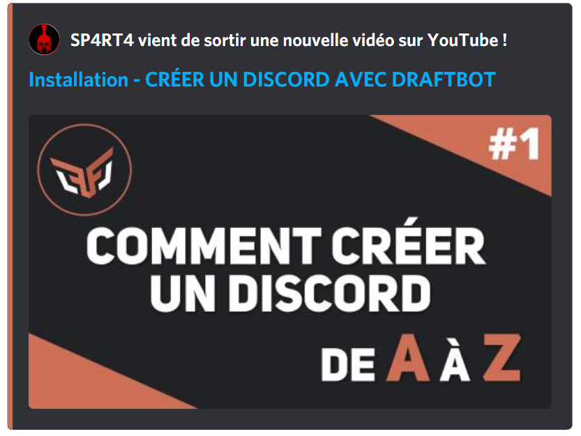
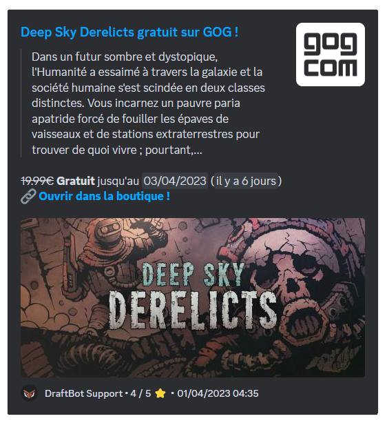

## Modules

### YouTube

Ce module permet **d'afficher** un message lors de la **publication d'une vidéo [`YouTube`](https://www.youtube.com/).**

L'annonce est entièrement **personnalisable**. Cela permet donc aux administrateurs de configurer **un rôle notifié**, activer **la publication sur d'autres serveurs**, choisir la **couleur** de l'embed d'annonce (réservé aux [serveurs premiums ✨](/premium)), ainsi que d'autres éléments visuels.

Il peut y avoir **une seule chaîne [YouTube](https://www.youtube.com/) différente** pour les serveurs **non-premiums** contrairement aux serveurs premiums qui peuvent avoir jusqu'à 5 chaînes YouTube différentes actuellement.

Vous avez la possibilité de sélectionner les **types de vidéos** qui seront publiées, dans la configuration de la chaîne YouTube. Ainsi, vous pouvez ajouter les vidéos, les shorts et les lives.

Vous pouvez personnaliser le message d'annonce avec différentes variables :

| Variable | Description | Exemple |
|----------|-------------|---------|
| `{video.author}` | Nom de la chaîne | DraftBot |
| `{video.title}` | Titre de la vidéo | Comment utiliser DraftBot |
| `{video.url}` | Lien de la vidéo | https://youtube.com/... |

*En plus des [autres variables](docs/annexes/variables) déjà disponibles globalement !*

### Twitch

::hint{ type="warning" }
  Les annonces [Twitch](https://www.twitch.tv/) sont limitées aux [serveurs premiums ✨](/premium).
::

**Les notifications sociales Twitch** permettent d'envoyer un message **personnalisable** lors du **lancement d'un live**. Il peut y avoir au maximum **5 notifications sociales Twitch différentes** par serveur.

::hint{ type="info" }
  Afin d'éviter un spam d'embed, un délai de 30 minutes a été mis en place entre deux annonces de la même personne.
::

Vous pouvez personnaliser le message d'annonce avec différentes variables :

| Variable | Description | Exemple |
|----------|-------------|---------|
| `{stream.author}` | Nom de la chaîne | StreamerName |
| `{stream.title}` | Titre du live | Live de développement |
| `{stream.game}` | Jeu en live | Just Chatting |
| `{stream.url}` | Lien du live | https://twitch.tv/... |
| `{stream.start_at}` | Date de début | il y a 2 heures |
| `{stream.tags}` | Tags du live | français, développement |

*En plus des [autres variables](docs/annexes/variables) déjà disponibles globalement !*

### Reddit

Ce module permet d'afficher une notification lors d'une publication dans un **subreddit**. Comme pour les autres modules de notifications sociales, le message envoyé est entièrement customisable : il pourra donc être envoyé sous forme de **message classique ou sous forme d'embed.**

Il ne peut y avoir qu'**une seule notification [Reddit](https://www.reddit.com/) maximum** pour les serveurs **non-premiums**, contrairement aux serveurs premiums qui pourront avoir jusqu'à 10 notifications sociales Reddit.

Voici un exemple de message de notification :

::hint{ type="info" }
  Dans le but de rendre opérationnelle l'option **Upvotes minimum** pour l'ensemble des serveurs, un délai minimal de **15** minutes entre la publication sur Reddit et l'annonce par DraftBot a été instauré.
::

Vous pouvez personnaliser le message d'annonce avec différentes variables :

| Variable | Description | Exemple |
|----------|-------------|---------|
| `{post.subreddit}` | Nom du subreddit | r/discord |
| `{post.title}` | Titre du post | Question sur DraftBot |
| `{post.description}` | Description du post | Comment configurer... |
| `{post.url}` | Lien du post | https://reddit.com/... |

*En plus des [autres variables](docs/annexes/variables) déjà disponibles globalement !*

### Epic Games

Ce module permet d'envoyer une annonce lorsqu'un jeu gratuit est disponible sur l'[Epic Games Store](https://store.epicgames.com/fr/).

::hint{ type="info" }
  Le rôle mentionné, la couleur de l'annonce ainsi que le salon d'envoi peuvent être configurés par l'administrateur.
::

### Steam

Ce module permet d'envoyer une annonce lorsqu'un jeu gratuit est disponible sur [Steam](https://store.steampowered.com/?l=french).

::hint{ type="info" }
  Le rôle mentionné, la couleur de l'annonce ainsi que le salon d'envoi peuvent être configurés par l'administrateur.
::

### GOG

Ce module permet d'envoyer une annonce lorsqu'un jeu gratuit est disponible sur [GOG](https://www.gog.com/).

::hint{ type="info" }
  Le rôle mentionné, la couleur de l'annonce ainsi que le salon d'envoi peuvent être configurés par l'administrateur.
::

### Dealabs

Ce module permet d'envoyer une notification lorsqu'une réduction devient "hot" (brûlante). Il s'agit du stade où la promotion est jugée intéressante par les utilisateurs du site. Il faut aussi noter que l'administrateur peut configurer le module [Dealabs](https://www.dealabs.com/) uniquement pour certaines catégories (exemples : High-Tech, Mode, etc...).

::hint{ type="info" }
  Le rôle mentionné, la couleur de l'annonce ainsi que le salon d'envoi peuvent être configurés par l'administrateur.
::

### Flux RSS
Ce module permet d'envoyer des informations qui proviennent de sites internet. Pour trouver le flux RSS, il y a plusieurs moyens.

1. **Trouvez l'icône RSS :**
    Certains sites vous informent directement que vous pouvez intégrer un flux via ce logo <:flux_rss:1402873518705868800>. L’icône RSS est souvent dans l’en-tête, le pied de page, la barre latérale ou le menu d’un site web. Cliquez dessus pour accéder au flux RSS.

2. **Obtenez le flux à l'aide d'un lien :**
    Si l’icône RSS n’est pas visible sur le site web, essayez d’ajouter le lien RSS à l’URL. Certains sites incluent ce lien dans l’URL, que vous pouvez copier et coller dans votre lecteur RSS.
Les liens RSS les plus courants sont les suivants :
`/feed/`
`/rss/`
`/rss.xml`.

3. **Utilisez RSS. app :**
    Pour les sites web sans icône ou flux RSS, utilisez rss.app. Collez l’URL du site dans le générateur de flux RSS et cliquez sur "générer". C’est aussi simple que cela !

    ::hint{ type="info" }
      Afin d'éviter les spams, un délai de 10 minutes a été mis en place par annonce.
    ::

Vous pouvez personnaliser le message d'annonce avec différentes variables :

| Variable | Description | Exemple |
|----------|-------------|---------|
| `{feed.name}` | Nom du flux | Blog DraftBot |
| `{feed.url}` | Lien du flux | https://draftbot.fr/... |

*En plus des [autres variables](docs/annexes/variables) déjà disponibles globalement !*

## Configuration

Vous pouvez activer séparément tous les types de notifications sociales.

    ::tabs
      ::tab{ label="Configuration via le /config" }
        Pour ajouter une annonce lors d'un évènement (publication de vidéo, post, notification de stream, etc...), il vous suffit d'effectuer la commande </config système:Notifications Sociales>. Vous aurez alors accès à l'onglet ci-dessous.

        

        Sélectionnez la plateforme de votre choix et configurez-la à partir de la sélection guidée.
      ::

      ::tab{ label="Configuration via le panel" }
        [⫸ Accéder au panel de **DraftBot**](/dashboard/first/social-notifs)

        Dans cette page, vous pouvez activer et désactiver à votre guise les notifications sociales. Il existe deux types de notifications sociales :
        - Les onglets, qui peuvent être configurés pour plusieurs chaines/forums.
        - Les modules, qui vous permettent d'activer des notifications qui nécessitent peu de configuration.

        
      ::
    ::

## Informations Complémentaires

Vous retrouverez le nombre maximum d'annonces par plateformes sur [le comparatif de DraftBot Premium](/premium#diff) dans la partie **Notifications sociales**.

