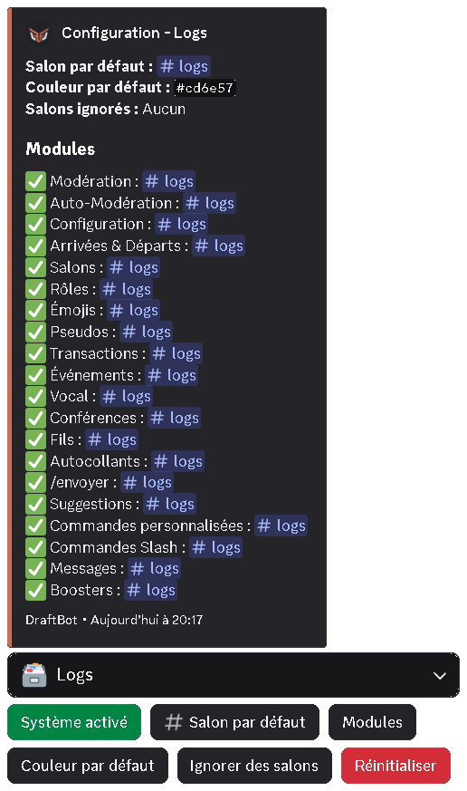
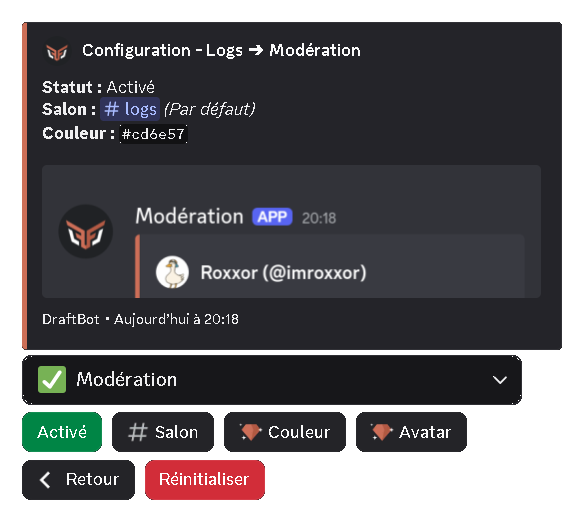
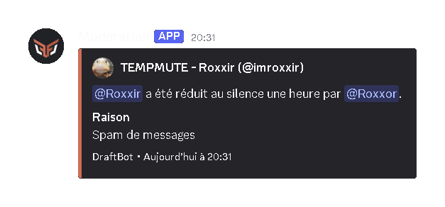
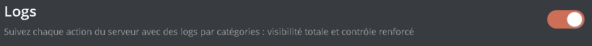
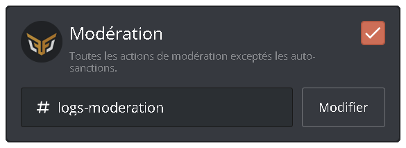

## Qu'est-ce que c'est ?

Les logs sont un historique des actions faites sur votre serveur. Ils vous permettent de pouvoir retrouver une action qui vous intrigue ou bien de voir qui a fait quelle action.

Les logs sont des embeds qui sont envoyés non pas par **DraftBot**, mais par des webhooks. Un webhook vous permet d'envoyer un message avec une photo de profil, un nom et un contenu personnalisé.
> ***DraftBot** gère ses propres webhooks et l'envoi des messages avec ses derniers. Si vous supprimez son webhook de logs, il le recréera automatiquement lors de l'envoi du prochain log.*

## Configuration générale

::tabs
  ::tab{ label="Via la commande /config" }
    Vous pouvez configurer les logs avec la commande \</config>, en vous rendant ensuite dans l'onglet "Logs" du sélecteur.

    **DraftBot** vous affichera alors la configuration actuelle :
    - *Salon par défaut* ➜ Salon dans lequel les logs seront envoyés si le salon n'a pas été paramétré individuellement pour chaque log.
    - *Couleur par défaut* ➜ Couleur des logs si la couleur n'a pas été paramétrée individuellement pour chaque log.
    - *Salons ignorés* ➜ Salons qui sont ignorés par les logs : vous n'aurez aucun log des actions qui sont faites dedans.

    La catégorie "*Modules*" résume la configuration de chaque log.

    Ici sera affiché, pour chaque module :
    - Log activé (✅) ou non (❌).
    - Salon d'envoi.
    - Couleur.

    Sous ce message, retrouvez les boutons permettant de configurer les logs :
    - ***Activer le système*** / ***Système activé*** ➜ Pour activer ou désactiver le système de logs.
    - ***Salon par défaut*** ➜ Salon dans lequel les logs seront envoyés si le salon n'a pas été paramétré individuellement pour chaque log.
    - ***Modules*** ➜ Pour configurer individuellement chaque log.
    - ***Couleur par défaut*** ➜ Pour configurer la couleur des logs si la couleur n'a pas été paramétrée individuellement pour chaque log.
    - ***Ignorer des salons*** ➜ Pour configurer les salons qui seront ignorés par les logs : vous n'aurez aucun log des actions qui sont faites dedans.
    - ***Réinitialiser*** ➜ Pour réinitialiser toute la configuration des logs.

    ::hint{ type="warning" }
      Le bouton "Réinitialiser" est irréversible : impossible d'annuler l'action et de recréer votre configuration des logs de votre serveur.
    ::

    ::hint{ type="info" }
      Les boutons bleus signifient que leur configuration doit être entièrement réalisée pour que le système de logs soit opérationnel, lors de la première configuration.
    ::

    
  ::

  ::tab{ label="Depuis le panel" }
    [⫸ Accéder au panel de **DraftBot**](/dashboard/first/logs)

    Pour configurer les logs de **DraftBot**, rendez-vous dans la catégorie "Logs" du panel.

    En haut de la page, vous trouverez la configuration des logs globaux par défaut.

    Vous pouvez configurer la couleur par défaut des logs avec la palette de peinture, le salon par défaut avec le menu déroulant et les salons ignorés en appuyant sur "+".

    
  ::
::

## Configuration par module

::tabs
  ::tab{ label="Via la commande /config" }
    Vous pouvez configurer les logs individuellement avec la commande \</config>, en vous rendant ensuite dans l'onglet "Logs" du sélecteur.

    Dans les boutons en dessous du message, sélectionnez "Modules".

    

    Une fois le module sélectionné, laissez-vous guider par **DraftBot** pour terminer la configuration du module !
    - Pour changer le salon d'envoi : Indiquez la mention ou l'identifiant du salon voulu.
    - Pour changer la photo de profil du log, lors de l'envoi : Envoyez une image respectant les normes indiquées dans la description de la question correspondante. (<:icon_premium:1096140508625125417>)
    - Pour changer la couleur du log, lors de l'envoi : Indiquez un code couleur au format hexadécimal (<:icon_premium:1096140508625125417>)

    ::hint{ type="info" }
      Les fonctionnalités accompagnées du symbole <:icon_premium:1096140508625125417> sont réservées aux serveurs [premium](/premium) <:icon_premium_:1096140508625125417>.
    ::

    ::hint{ type="success" }
      La configuration du module est faite ! Vous aurez désormais accès aux logs de ce module dans le salon défini.
    ::

    Exemple de log de modération reçu sur le serveur :

    
  ::

  ::tab{ label="Depuis le panel" }
    [⫸ Accéder au panel de **DraftBot**](/dashboard/first/logs)

    Pour configurer les modules des logs de **DraftBot**, rendez-vous dans la catégorie "Logs" du panel, puis activez les modules.

    Lors de la première configuration, tous les logs sont grisés (cela signifie qu'ils sont désactivés).

    Activez alors individuellement les logs que vous souhaitez mettre en place pour accéder à leur configuration.

    

    Vous aurez alors la possibilité de configurer votre module :
    - Pour changer le salon d'envoi : ouvrez le menu déroulant et sélectionnez le salon voulu.
    - Pour changer la photo de profil du log, lors de l'envoi : cliquez sur le logo de **DraftBot**. (<:icon_premium_:1096140508625125417>)
    - Pour changer la couleur du log, lors de l'envoi : cliquez sur la palette de peinture et sélectionnez la couleur voulue. (<:icon_premium_:1096140508625125417>)

    ::hint{ type="info" }
      Les fonctionnalités accompagnées du symbole <:icon_premium:1096140508625125417> sont réservées aux serveurs [premium](/premium) <:icon_premium_:1096140508625125417>.
    ::

    

    Exemple de log de modération reçu sur le serveur :

    
  ::
::

### Modules disponibles

Chaque module a une utilité différente. Choisissez ceux qui correspondent à vos besoins pour mieux gérer votre serveur et vous retrouver plus facilement dans vos logs.

N'oubliez pas qu'on vous conseille que les logs de votre serveur doivent être seulement à la vue de votre modération.

### Configurations
- **Configuration** : Configuration des systèmes de votre serveur de Draftbot. (panel compris)
- **Arrivées et départs** : Logs d’arrivée ou de départ de membres de votre serveur.
- **Salons** : Création, modification ou suppression de salons sur votre serveur.
- **Rôles** : Création, modification ou suppression de rôles sur votre serveur.
- **Émojis** : Création, modification ou suppression d’émojis sur votre serveur.
- **Autocollants** : Création, modification ou suppression de stickers sur votre serveur.

### Utilisateurs
- **Pseudos** : Modification des pseudonymes de vos membres sur votre serveur.
- **Transactions** : Transactions dans le système d’économie ou échanges d'items par vos membres.
- **Évènements** : Messages lors d’évènements ou jeux communautaires sur votre serveur.
- **Vocal** : Messages lorsqu’un membre quitte, rejoint ou se déplace dans un salon vocal.
- **Conférences** : Messages lors du lancement, la modification ou la fin d'une conférence.
- **Fils** : Création, modification ou suppression de threads sur votre serveur.
- **/envoyer**  : Utilisation de la commande /envoyer ou /embed de DraftBot.
- **Suggestions** : Envoi et tri des suggestions envoyées sur le serveur via DraftBot.
- **Commandes personnalisées** : Exécution de commandes personnalisées sur votre serveur.
- **Commandes Slash**: Exécution de commandes Slash de DraftBot sur votre serveur. (DraftBot uniquement)
- **Messages** : Modification ou suppression de messages sur votre serveur. (<:icon_premium_:1096140508625125417>)
- **Boosts** : Boosts reçus et perdus du serveur. (<:icon_premium_:1096140508625125417>)

::hint{ type="info" }
  Les fonctionnalités accompagnées du symbole <:icon_premium:1096140508625125417> sont réservées aux serveurs [premium](/premium) <:icon_premium_:1096140508625125417>.
::