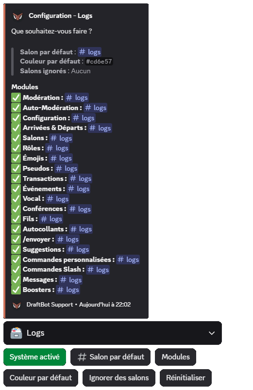
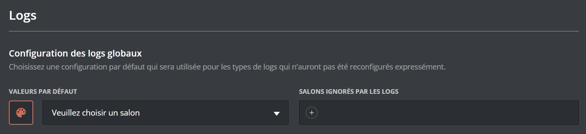

Les logs sont un historique des actions faites sur votre serveur. Ils vous permettent de pouvoir retrouver une action qui vous intrigue ou bien de voir qui a fait quelle action.

Les logs sont des embeds qui sont envoyés non pas par **DraftBot**, mais par des webhooks. Un webhook vous permet d'envoyer un message avec une photo de profil, un nom et un contenu personnalisé.
> ***DraftBot** gère ses propres webhooks et l'envoi des messages avec ses derniers. Si vous supprimez son webhook de logs, il le recréera automatiquement lors de l'envoi du prochain log.*

## Différents modules

DraftBot propose divers modules de logs pour vous permettre de suivre une action qui suscite votre curiosité ou de savoir qui a réalisé telle ou telle action.

### Modérations
- **Modération** : Toutes les actions de modération exceptés les auto-sanctions.
- **Auto-Modération** : Infractions de l’auto-modération par les membres de votre serveur.

### Configurations
- **Configuration** : Configuration des systèmes de votre serveur. (panel compris)
- **Arrivées** et départs : Logs d’arrivée ou de départ de membres de votre serveur.
- **Salons** : Création, modification ou suppression de salons sur votre serveur.
- **Rôles** : Création, modification ou suppression de rôles sur votre serveur.
- **Émojis** : Création, modification ou suppression d’émojis sur votre serveur.
- **Autocollants** : Création, modification ou suppression de stickers sur votre serveur.

### Utilisateurs
- **Pseudos** : Modification des pseudonymes de vos membres sur votre serveur.
- **Transactions** : Transactions dans le système d’économie ou échanges d'items par vos membres.
- **Évènements** : Messages lors d’évènements ou jeux communautaires sur votre serveur.
- **Vocal** : Messages lorsqu’un membre quitte, rejoint ou se déplace dans un salon vocal.
- **Conférences** : Messages lors du lancement, la modification ou la fin d'une conférence.
- **Fils** : Création, modification ou suppression de threads sur votre serveur.
- **/envoyer**  : Utilisation de la commande /envoyer ou /embed de DraftBot.
- **Suggestions** : Envoi et tri des suggestions envoyées sur le serveur via DraftBot.
- **Commandes personnalisées** : Exécution de commandes personnalisées sur votre serveur.
- **Commandes Slash**: Exécution de commandes Slash de DraftBot sur votre serveur. (DraftBot uniquement)
- **Messages** : Modification ou suppression de messages sur votre serveur. ([**Premium**](/premium)<:icon_premium_:1096140508625125417>)
- **Boosts** : Boosts reçus et perdus du serveur. ([**Premium**](/premium)<:icon_premium_:1096140508625125417>)

## Configuration générale
Lors de la configuration, vous avez la possibilité de mettre en place les différentes options avant l'activation des différents modules.

::tabs
  ::tab{ label="Via la commande /config" }
    Vous pouvez configurer les logs avec la commande \</config>, en vous rendant ensuite dans l'onglet "Logs" du sélecteur.

    Sous ce message, retrouvez les boutons permettant de configurer les logs :
    - ***Activer le système*** / ***Système activé*** ➜ Pour activer ou désactiver le système de logs.
    - ***Salon par défaut*** ➜ Salon dans lequel les logs seront envoyés si le salon n'a pas été paramétré individuellement pour chaque log.
    - ***Modules*** ➜ Pour configurer individuellement chaque log.
    - ***Couleur par défaut*** ➜ Pour configurer la couleur des logs si la couleur n'a pas été paramétrée individuellement pour chaque log.
    - ***Ignorer des salons*** ➜ Pour configurer les salons qui seront ignorés par les logs : vous n'aurez aucun log des actions qui sont faites dedans.
    - ***Réinitialiser*** ➜ Pour réinitialiser toute la configuration des logs.

    ::hint{ type="danger" }
      Le bouton "**Réinitialiser**" est irréversible : impossible d'annuler l'action et de recréer votre configuration des logs de votre serveur.
    ::

    
  ::

  ::tab{ label="Depuis le panel" }
    [⫸ Accéder au panel de **DraftBot**](/dashboard/first/logs)

    Pour configurer les logs de **DraftBot**, rendez-vous dans la catégorie "Logs" du panel.

    En haut de la page, vous trouverez la configuration des logs globaux par défaut.

    Vous pouvez configurer la couleur par défaut des logs avec la palette de peinture, le salon par défaut avec le menu déroulant et les salons ignorés en appuyant sur "+".

    Vous retrouverez l'ensemble des modules ci-dessous.

    
  ::
::

::hint{ type="info" }
  La personnalisation de la photo de profil ainsi que de la couleur de l'embed lors de la configuration du module est réservée aux serveurs [premium](/premium) <:icon_premium_:1096140508625125417>.
::
