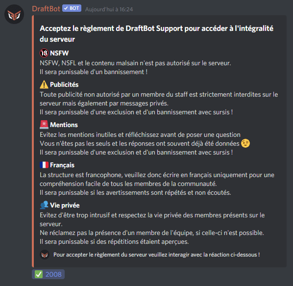
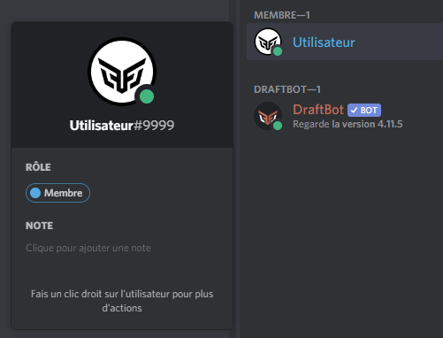
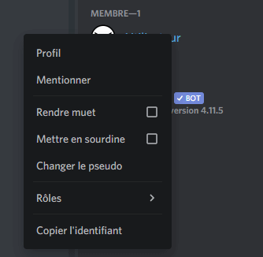
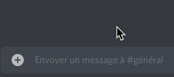
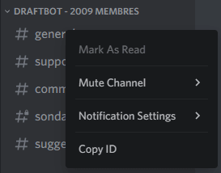
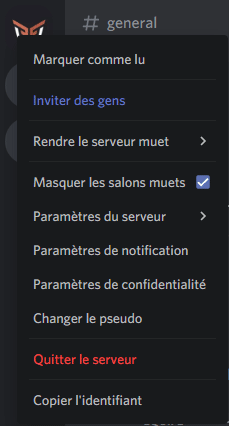

## Identifiant d'un message

::hint{ type="warning" }
  Il vous faut au préalable activer le `mode développeur` pour récupérer des identifiants.

  Pour ce faire, il vous suffit d'aller dans les paramètres utilisateurs, Apparence (iOS), Comportement (Android) ou Avancés (ordinateur) puis d'activer le mode développeur.
::

Pour récupérer l'identifiant d'un message, vous devez :&#x20;

- Laisser appuyer ou cliquer droit sur un message
- Puis appuyer sur **Copier l'identifiant.**

## Identifiant d'un rôle

::hint{ type="warning" }
  Il vous faut au préalable activer le `mode développeur` pour récupérer des identifiants.
  
  Pour ce faire, il vous suffit d'aller dans les paramètres utilisateurs, Apparence (iOS), Comportement (Android) ou Avancés (ordinateur) puis d'activer le mode développeur.
::

Afin de récupérer l'identifiant d'un rôle, vous devez :

- Appuyer ou cliquer sur un membre qui possède le rôle dont vous souhaitez récupérer l'identifiant
- Puis appuyer longtemps sur le rôle (smartphone) ou bien cliquer droit sur le rôle et sur **Copier l'identifiant** (ordinateur).

Si vous avez besoin de mentionner un rôle (ex: panel web), il vous suffit de faire `<@&[ID-Role]>`.

## Identifiant d'un membre

::hint{ type="warning" }
  Il vous faut au préalable activer le `mode développeur` pour récupérer des identifiants.
  
  Pour ce faire, il vous suffit d'aller dans les paramètres utilisateurs, Apparence (iOS), Comportement (Android) ou Avancés (ordinateur) puis d'activer le mode développeur.
::

Pour récupérer l'identifiant d'un membre, vous devez :

- Faire clic droit/cliquer sur la personne dont vous souhaitez récupérer l'identifiant
    - Si vous êtes sur smartphone, cliquez sur les trois petits points en haut à droite
- Puis appuyez sur **Copier l'identifiant**.

Si vous avez besoin de mentionner un membre (ex: panel web), vous pouvez écrire `<@[ID-Membre]>`.

## Identifiant d'un émoji

Pour obtenir l'identifiant d'un émoji, il vous suffit :&#x20;

- D'écrire votre émoji dans un salon textuel
- Avant l’émoji, mettez un antislash
- Puis envoyez votre message.

::hint{ type="info" }
  Si vous êtes sur **Android**, pour récupérer l'identifiant d'un émoji :&#x20;

  - Envoyez `:LeNomDeVotreEmoji:` dans un salon textuel
  - Puis copiez le résultat étant l'identifiant de l’émoji
::

## Identifiant d'un salon

::hint{ type="warning" }
  Il vous faut au préalable activer le `mode développeur` pour récupérer des identifiants.
  
  Pour ce faire, il vous suffit d'aller dans les paramètres utilisateurs, Apparence (iOS), Comportement (Android) ou Avancés (ordinateur) puis d'activer le mode développeur.
::

Pour obtenir l'identifiant d'un salon, vous pouvez :&#x20;

- Appuyer ou faire clic droit sur le nom d'un salon
- Puis d'appuyer sur **Copier l'identifiant**.

Si vous avez besoin de mentionner un salon (ex: panel web), vous devez mettre <#ID-Salon>

## Identifiant d'un serveur

::hint{ type="warning" }
  Il vous faut au préalable activer le `mode développeur` pour récupérer des identifiants. Vous pouvez voir comment l'activer en [**`cliquant ici`**](#identifiant-dun-message).
::

Si vous souhaitez récupérer l'identifiant d'un serveur, il vous suffit :

- De faire un clic droit ou appuyer sur l'image/nom du serveur
- Puis d'appuyer sur **Copier l'identifiant**.

