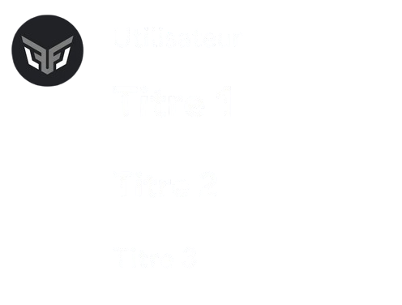

## Markdown basique

| **Aperçu** | **Markdown** |
|------------|--------------|
| *Italique* | `*Texte*` ou `_Texte_` |
| **Gras** | `**Texte**` |
| ~~Barré~~ | `~~Texte~~` |
| Souligné | `__Texte__` |

::hint{ type="info" }
  Vous pouvez cumuler plusieurs Markdown pour ajouter des formatages : avoir ***Gras italique*** avec `***Texte***`.
::

## Formatages avancés

### Titre

Pour créer un titre, il vous suffit d'inclure une quantité spécifique de caractères dièse `#` comme premier(s) terme(s) d'une nouvelle ligne.
Plus vous utilisez de `#` (maximum 3) pour faire un titre, plus le titre est petit.

**Markdown :**
```
# Titre 1
## Titre 2
### Titre 3
```


::hint{ type="info" }
  N'oubliez pas de mettre un espace entre votre titre et le code.
::

### Sous-texte

Vous pouvez mettre du texte en sous-texte pour qu'il soit affiché plus petit que le texte normal en ajoutant `-#` au début de la ligne.

**Markdown :**
```
-# Texte
```


::hint{ type="info" }
  N'oubliez pas de mettre un espace entre votre texte et le code.
::

### Lien masqué

Vous pouvez intégrer un lien hypertexte masqué, cliquable, dans un texte.

**Markdown :**
```
[Texte](lien hypertexte)
```


### Liste

Vous pouvez créer une liste à puces à l'aide de `-` ou `*` au début de chaque ligne.
Vous pouvez également faire un alinéa dans votre liste en ajoutant un espace avant `-` ou `*` au début de chaque ligne.

**Markdown :**
```
- Ligne 1
- Ligne 2
...
```


::hint{ type="info" }
  N'oubliez pas de mettre un espace entre votre texte et le code.
::

### Citation

**Markdown :**
```
> Texte sur une seule ligne
ou
>>> Texte
sur
plusieurs lignes
```


### Spoiler

Vous pouvez masquer votre texte, pour qu'il ne soit visible qu'en cliquant dessus, grâce aux spoilers.

**Markdown :**
```
||Texte||
```


### Code en bloc

**Markdown :**
```
```Texte
Texte
Texte```
```


#### Code d'ajout / suppression

**Markdown :**
```
```diff
+ ajout
- suppression```
```


#### Code python
**Markdown :**
```
```python
def markdown_python():
return "Ceci est un code python"```
```


#### Code HTML
**Markdown :**
```
```HTML
def markdown_python():
return "Ceci est un code python"```
```


### Code en ligne
**Markdown :**
```
`Texte`
ou
``Texte``
```
