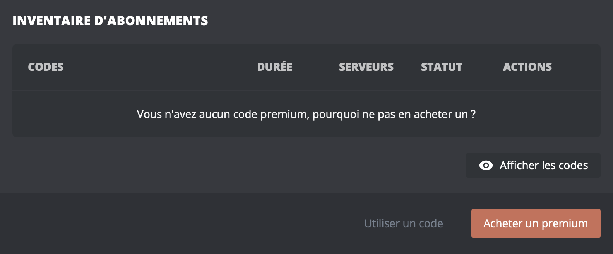

## Votre abonnement

Depuis le [panel](/dashboard/user/premium), vous pourrez retrouver toutes les informations de votre premium :

- Crédit ou abonnement
- Statut du renouvellement
- Date de début et date de fin
- L'historique des paiements
- Vos serveurs activés

- **Gérer l'abonnement** : vous permet de gérer le renouvellement de votre abonnement et de consulter vos factures d'achat.

- **Inventaire** : vous permet d'afficher, partager et d'activer vos codes premium.

::hint{ type="info" }
  Le bouton "Gérer l'abonnement" n'est pas disponible lorsque le premium a été activé depuis un [code premium](#codes-premium).
::

## Activer un serveur

Lors de l'achat du premium, il est directement associé à votre compte Discord. Pour profiter de ses avantages, vous devez l’activer sur l'un de vos serveurs. Il y a deux façons de l'activer :

::tabs
  ::tab{ label="Via une commande" }
    Pour activer le premium sur votre serveur, exécutez simplement la commande \</premium activer> pour l'activer sur votre serveur.

    
  ::

  ::tab{ label="Via le panel" }
    [⫸ Accéder au panel de **DraftBot**](/dashboard/user/premium)

    Pour activer le premium sur un serveur, cliquez sur l’icône du serveur souhaité, puis validez.

    
  ::
::

::hint{ type="info" }
  Vous devez disposer de la permission **Administrateur** sur le serveur pour cette action.
::

## Codes premium

Si vous avez reçu un code premium d’un tiers ou que vous l'avez acheté depuis le bouton **"Acheter un premium"**, vous pouvez l’activer pour qu’il soit associé à votre compte Discord et en profiter.

Rendez-vous sur le **[panel](/dashboard/user/premium)**, accédez à la rubrique **"inventaire"** puis sélectionnez **"Utilisez un code"** et entrez le code. Le code se trouve dans votre inventaire. Vous pouvez le garder ou l’activer immédiatement afin de bénéficier des avantages.

::hint{ type="info" }
  Il n'est pas nécessaire d'être sur le serveur ni de disposer d'une permission particulière.
::

## Commandes disponibles

En souscrivant à un abonnement premium, vous avez plusieurs commandes essentielles pour gérer votre abonnement.

| Commandes | Descriptions |
|-----------|--------------|
| \</premium infos>   | Connaître l’état de son abonnement premium.
| \</premium activer>   | Activer son abonnement Premium sur un serveur.
| \</premium désactiver>   | Désactiver son abonnement premium sur un serveur.
| \</premium codes>   | Afficher son inventaire de code premium.

## Accumulation du premium

Si vous souscrivez à un premium en ayant déjà un abonnement actif, ce nouvel achat se convertira en [code premium](#codes-premium). Vous pourrez le cumuler avec l'actuel selon vos préférences.

- **Cumuler avec l'actuel :**
    En choisissant cette option, vous pouvez accumuler **uniquement** des serveurs, ce qui vous permettra d'activer le Premium sur davantage de serveurs.

- **L'activer à la fin de l'actuel :**
    Avec cette option, vous pouvez prolonger votre abonnement Premium sur la durée.

## Désactivation du premium

Vous avez la possibilité de désactiver les avantages premium sur un serveur où vous l'avez activé. Pour ce faire, vous avez deux possibilités.

    ::tabs
      ::tab{ label="Via une commande" }
        Pour désactiver le premium sur un serveur, exécutez simplement la commande \</premium désactiver>, en précisant le nom ou l'identifiant du serveur concerné.
      ::

      ::tab{ label="Via le panel" }
        [⫸ Accéder au panel de **DraftBot**](/dashboard/user/premium)

        Pour désactiver un premium sur un serveur, cliquez sur l’icône du serveur souhaité puis validez.
      ::
    ::

