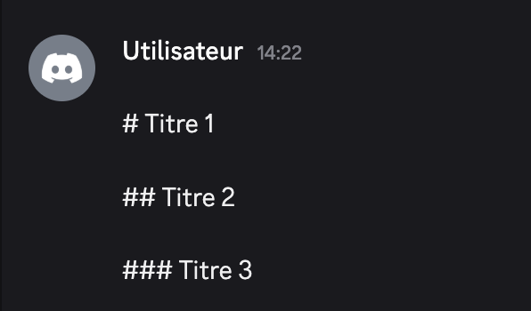

Discord permet d'utiliser le markdown pour facilement formater du texte et le mettre en valeur votre texte

## Markdown basique (formatage)

| **Aperçu** | **Markdown** |
|------------|--------------|
| *Italique* | ``*texte*`` ou ``_texte_`` |
| **Gras** | ```**Texte**``` |
| ~~Barré~~ | ``~~texte~~`` |
| Souligné | ``__texte__`` |

::hint{ type="info" }
  Vous pouvez cumuler plusieurs markdowns pour cumuler des formatages : avoir ***Gras italique*** avec ``***Texte***``.
::

## Organisation du texte


### Titres
Pour créer un titre, il vous suffit d'inclure une quantité spécifique de caractères dièse ``#`` comme premier(s) terme(s) d'une nouvelle ligne.
Plus vous utilisez de ``#`` (maximum 3) pour faire un titre, plus le titre est petit.



::hint{ type="info" }
  N'oubliez de mettre un espace entre votre titre et le code.
::


### Sous-texte
Vous pouvez mettre du texte en sous-texte pour qu'il soit affiché plus petit que le texte normal en ajoutant ``-#`` au début de la ligne.

::hint{ type="info" }
  N'oubliez de mettre un espace entre votre texte et le code.
::


### Liens masqués
Vous pouvez intégrer un lien hypertexte cliquable à un texte en lien masqué avec le markdown `[Texte](lien)`.


### Listes
Vous pouvez créer une liste à puces à l'aide de ``-`` ou ``*`` au début de chaque ligne.
Vous pouvez également faire un alinéa dans votre liste en ajoutant un espace avant ``-`` ou ``*`` au début de chaque ligne.


### Citation


### Spoilers


### Code en bloc

### Code en ligne
