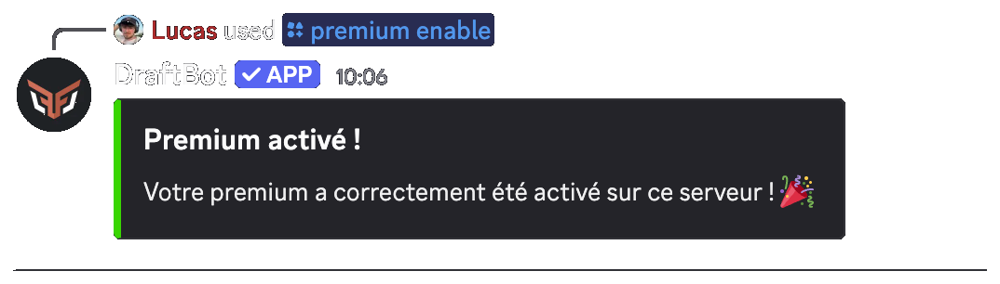
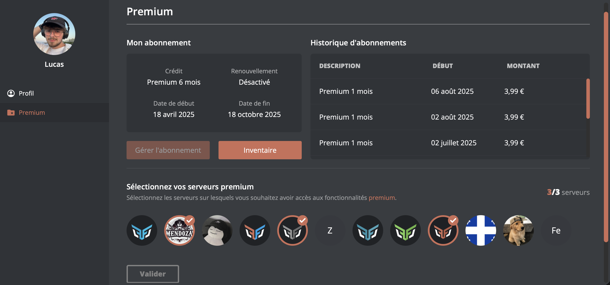
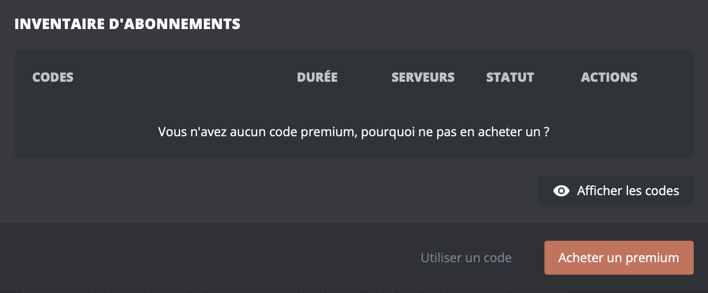
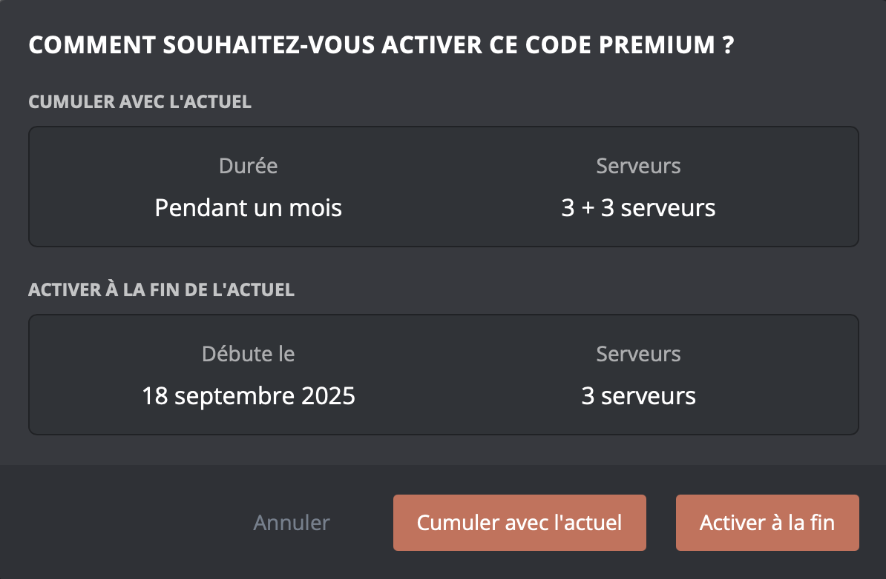

## Activation du premium
Lors de l'achat du Premium, il est directement associé à votre compte Discord. Pour profiter de ses avantages, vous devez l’activer sur l'un de vos serveurs. Vous avez deux possibilités pour l'activer.

::tabs
  ::tab{ label="Via une commande" }
    Pour activer le Premium sur le serveur, exécutez simplement la commande \</premium activer> pour l'activer sur votre serveur.

    
  ::

  ::tab{ label="Via le Panel" }
    [⫸ Accéder au panel de **DraftBot**](/dashboard/user/premium)

    Pour activer le Premium sur un serveur, cliquez sur l’icône du serveur souhaité puis validez.

    
  ::
::

::hint{ type="info" }
  Vous devez disposer d'une **permission administrateur** pour cette action.
::

Si vous avez reçu un code Premium d’un tiers, vous devez l’activer pour qu’il soit associé à votre compte Discord et que vous puissiez en profiter.

Rendez-vous sur le [panel](/dashboard/user/premium), accédez à la rubrique "inventaire" puis sélectionnez "Utilisez un code" et entrez le code. Le code se trouve dans votre inventaire. Vous pouvez le garder ou l’activer immédiatement afin de bénéficier des avantages.

## Gestion du Premium

### Commandes disponibles
En souscrivant à un premium, vous avez plusieurs commandes essentielles pour gérer votre abonnement.

| Commandes | Descriptions |
|-----------|--------------|
| \</premium infos>   | Connaître l’état de son abonnement premium.
| \</premium activer>   | Activer votre abonnement Premium sur un serveur.
| \</premium désactiver>   | Désactiver votre abonnement Premium sur un serveur.
| \</premium codes>   | Afficher son inventaire de code premium.

### Acumulation des premiums
Vous pouvez accumuler plusieurs premium sur votre compte. Si vous souscrivez à un premium alors que vous en avez déjà un actif, le précédent se convertira en code.

Vous pouvez activer cette option sur votre compte et choisir parmi deux possibilités.

**Cumuler avec l'actuel :**
Cette option permet d’accumuler **uniquement** des serveurs, ce qui vous donnera plus de serveurs.

**L'activer à la fin de l'actuel :**
Cette option vous permet d’activer le premium à la fin de votre abonnement actuel.

### Désactivation du premium
Vous avez la possibilité de désactiver les avantages premium d’un serveur. Pour ce faire, vous avez deux possibilité.

::tabs
  ::tab{ label="Via une commandes" }
    Pour désactiver le premium sur un serveur, Exécutez simplement la commande \</premium désactiver> puis le nom du serveur ou l'identifiant pour le désactiver.
  ::

  ::tab{ label="Via le Panel" }
    [⫸ Accéder au panel de **DraftBot**](/dashboard/user/premium)

    Pour désactiver un premium sur un serveur, cliquez sur l’icône du serveur souhaité puis valider.
  ::
::

::hint{ type="info" }
  Il n'est pas nécessaire d'être sur le serveur ou de bénéficier d’une permission.
::

