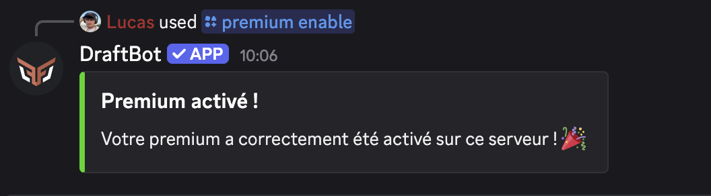

## Activation du premium
Lorsque vous achetez un premium, il est directement associé à votre compte Discord. Pour profiter de ses avantages, vous devez l’activer sur votre serveur. Vous avez deux options pour le faire.

::tabs
  ::tab{ label="Via une commandes" }
    Pour activer le premium sur le serveur, Exécutez simplement la commande \</premium activer> pour l'activer.

    
  ::

  ::tab{ label="Via le Panel" }
    [⫸ Accéder au panel de **DraftBot**](/dashboard/user/premium)

    Pour activer le premium sur un serveur, cliquez sur l’icône du serveur souhaité puis valider.
  ::
::

::hint{ type="info" }
  Vous devez bénéficier d'une **permission administrateur** pour cette action.
::

## Gestions

### Cumulations

## Avantages
##

