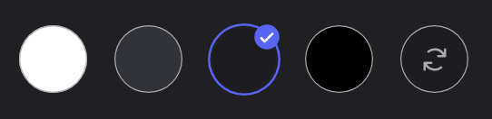

## Style d'écriture

La documentation est une partie essentielle de **DraftBot**, elle permet à chaque utilisateur d'avoir une bonne expérience et utilisation du bot. Il est important qu'il puisse trouver des réponses à ses questions de manière simple et en autonomie.

Voici donc quelques conseils pour améliorer votre qualité d'écriture :

1. **Clarté et Concision :**
Utilisez un vocabulaire **clair et précis**, en essayant au maximum de correspondre aux expressions de **DraftBot**. Évitez le jargon inutile et les phrases longues. **Votre objectif est de rendre l'information facilement compréhensible pour le lecteur.**
2. **Restez bienveillants :** Évitez le plus possible les expressions subjectives comme *"simplement"*, *"juste"*, *"logiquement"*. **Gardez en tête que nous avons tous une expérience et un passé différent**. Ces mots n'apportent aucune information utile et peuvent parfois même être réducteurs et blessants, notamment pour les personnes découvrant Discord ou débutant leur utilisation avec **DraftBot**.
3. **Utilisez le discours informatif :** L'intérêt de la documentation est clairement de transmettre des **informations et connaissances** concernant l'utilisation du bot. Afin de correspondre à ce discours, essayez autant que possible de **rester neutre et objectif**, sans chercher à convaincre, divertir ou imposer des choix ou actions.
4. **Cohérence :** Gardez une cohérence dans le style, le ton, et la terminologie à travers toute la documentation. Cela aide à maintenir une expérience de lecture fluide et professionnelle. Dans ce but, employez le **vouvoiement uniquement** et essayez au maximum d'utiliser la **forme déclarative à la voix active**, au **présent** dans la majorité des cas. Des exceptions et écarts peuvent évidemment être faits selon la situation, pour revenir sur une explication passée ou aborder une possibilité à venir.

## Règles de rédaction

### Introduction orienté utilisateur

Lors de la rédaction d'une page, toujours commencer par une présentation du système du point de vue de l'utilisateur.

Lorsqu'un gérant de serveur prend la décision de mettre en place un système, il voudra toujours se placer à la place de l'utilisateur cible, s'il est convaincu, il passera à la mise en place.

### Structure recommandée d'une page de module

Pour maintenir une cohérence à travers toute la documentation, suivez cette structure lors de la rédaction d'une page de module :

1. **Vue utilisateur** : Commencez par expliquer ce que voit/fait un membre lambda (commandes utilisateur, fonctionnalités visibles)
2. **Vue administrateur** : Expliquez les fonctionnalités de gestion et commandes admin
3. **Configuration** : Détaillez les options de configuration (via tabs "Panel" / "Commande /config")
4. **Cas d'usage avancés** : Migrations, astuces (optionnel)

::hint{ type="success" }
  Cette structure permet au lecteur de comprendre **d'abord** l'utilité du module avant de plonger dans la configuration technique.
::

### Fonctionnalités Premium

Lorsqu'on veut souhaite indiquer qu'une fonctionnalité est premium, ne pas l'indiquer dans le titre ou dans la description de la fonctionnalité.
Préférer utiliser un hint info, plusieurs formulations comme celles-ci peuvent être adéquates :

**Limite étendue par le premium**

::tabs
  ::tab{ label="Prévisualisation"}
    ::hint{ type="info" }
      Vous pouvez lancer jusqu'à 3 giveaways en simultané. Les serveurs [premium](/premium) <:icon_premium_:1096140508625125417> n'ont pas de limite.
    ::
  ::

  ::tab{ label="Markdown"}
    ```
    ::hint{ type="info" }
      Vous pouvez lancer jusqu'à 3 giveaways en simultané. Les serveurs [premium](/premium) <:icon_premium_:1096140508625125417> n'ont pas de limite.
    ::
    ```
  ::
::

**Fonctionnalité premium**

::tabs
  ::tab{ label="Prévisualisation"}
    ::hint{ type="info" }
      Cette fonctionnalité est réservée aux serveurs [premium](/premium) <:icon_premium_:1096140508625125417>.
    ::
  ::

  ::tab{ label="Markdown"}
    ```
    ::hint{ type="info" }
      Cette fonctionnalité est réservée aux serveurs [premium](/premium) <:icon_premium_:1096140508625125417>.
    ::
    ```
  ::
::

**Fonctionnalité premium étendue**

::tabs
  ::tab{ label="Prévisualisation"}
    ::hint{ type="info" }
      Les fonctionnalités accompagnées du symbole <:icon_premium:1096140508625125417> sont réservées aux serveurs [premium](/premium) <:icon_premium_:1096140508625125417>.
    ::
  ::

  ::tab{ label="Markdown"}
    ```
    ::hint{ type="info" }
      Les fonctionnalités accompagnées du symbole <:icon_premium:1096140508625125417> sont réservées aux serveurs [premium](/premium) <:icon_premium_:1096140508625125417>.
    ::
    ```
  ::
::

### Captures d'écran

Elles sont essentielles pour illustrer et aérer la documentation.
Afin d'être en harmonie avec le reste de la documentation :
1. Préférez faire des prises larges sans modification des captures.

    Les modifications nécessaires tel que le détourage, ou le cadrage des captures seront faites par un référent rédacteur une fois la rédaction et des corrections terminées.

2. Utilisez exclusivement le thème Discord appelé "Sombre".



### Liens vers le panel

Permettez à l'utilisateur de se rendre sur la page concernée du panel à chaque changement de page :
- En haut de la section concernée
- Sur chaque section concernée (même si ça revient plusieurs fois sur la même page)

::tabs
  ::tab{ label="Prévisualisation"}
    [⫸ Accéder au panel de **DraftBot**](/dashboard/first/niveaux)
  ::

  ::tab{ label="Markdown"}
    ```
    [⫸ Accéder au panel de **DraftBot**](/dashboard/first/nomDuModule)
    ```

    1. `first` permet de selectionner automatiquement le premier serveur de la liste.
    2. `nomDuModule` doit correspondre à la page concernée.
  ::
::

### Valeurs et comportements par défaut

Indiquez toujours les valeurs par défaut lorsqu'une fonctionnalité en propose :

**Format recommandé :**
- Directement dans la description : "par défaut entre **15 et 25 XP**"
- Entre parenthèses pour les options : "configurable **100-1500**"
- Dans un hint info pour les comportements complexes

**Exemple :**
```markdown
Chaque message rapporte une quantité d'expérience **aléatoire** comprise entre deux valeurs que vous configurez (par défaut entre **15 et 25 XP**).
```

### Comportements particuliers et edge cases

Certaines fonctionnalités ont des comportements spécifiques dans des cas limites (edge cases). Documentez-les clairement pour éviter la confusion :

**Format recommandé :**

```markdown
**Comportements particuliers :**

- **Nom du cas** : Explication claire du comportement avec un exemple concret si nécessaire.
- **Autre cas** : Description...
```

**Exemple :**
```markdown
- **Saut de niveaux** : Si un membre saute plusieurs niveaux d'un coup (via \</adminxp ajouter>), il reçoit **toutes les récompenses** des niveaux intermédiaires. Par exemple, si un membre passe du niveau 5 au 25, il recevra les récompenses des niveaux 10, 15, 20 et 25.
```

### Permissions Discord requises

Lorsqu'une fonctionnalité nécessite des permissions Discord spécifiques, documentez-les dans un hint warning :

::hint{ type="warning" }
  **Permissions requises** : Pour envoyer les annonces, DraftBot doit disposer des permissions suivantes dans le salon choisi : **Voir le salon**, **Envoyer des messages**, **Intégrer des liens** et **Joindre des fichiers**. Si ces permissions sont retirées, les annonces seront automatiquement désactivées.
::

**Bonnes pratiques :**
- Listez **toutes** les permissions nécessaires
- Expliquez les **conséquences** si les permissions manquent
- Indiquez si le système se désactive automatiquement ou génère une erreur

## Outils de structuration

Organisez votre contenu de manière logique. Utilisez des titres, des sous-titres, des onglets et des captures d'écran de manière à ce qu'il soit facile à suivre.
Retrouvez ci-dessous toutes les structurations possibles.

### Titres

::tabs
  ::tab{ label="Prévisualisation"}

    ## H2

    ### H3


    #### H4
  ::

  ::tab{ label="Markdown"}
    ```mdc
    ## H2
    ### H3
    #### H4
    ```
  ::
::

::hint{ type="warning" }
  **Attention à ne pas encapsuler de titres à l'intérieur d'éléments blocs** *(comme les menus déroulants ou les tabs)* !
::

### Markdown de base

::tabs
  ::tab{ label="Prévisualisation"}
    **Gras**

    *Italique*

    **_Gras italique_**

    ***Gras italique***

    ~~Barré~~

    `Code`

    www.lien-automatique.com

    [lien vers une URL](https://www.youtube.com/watch?v=dQw4w9WgXcQ)

    [lien vers une page du panel](/dashboard/first/messages)

    [lien vers un nouvel onglet](https://www.youtube.com/watch?v=dQw4w9WgXcQ)

    

    > "Citation"

    :shortcut{value="meta"} :shortcut{value="A"} + :shortcut{value="C"}
  ::

  ::tab{ label="Markdown"}
    ```mdc
    **Gras**

    *Italique*

    **_Gras italique_**

    ***Gras italique***

    ~~Barré~~

    `Code`

    www.lien-automatique.com

    [lien vers une URL](https://www.youtube.com/watch?v=dQw4w9WgXcQ)

    [lien vers un nouvel onglet](https://www.youtube.com/watch?v=dQw4w9WgXcQ)

    [lien vers une page du panel](/dashboard/first/messages)

    

    > "Citation"

    :shortcut{value="meta"} :shortcut{value="A"} + :shortcut{value="C"}
    ```
  ::
::

### Emojis & mentions

::tabs
  ::tab{ label="Prévisualisation"}
    Emoji texte : :fire:

    Emoji caractère : 🔥

    Emoji Discord custom : <:draftbot:816002768971759636>

    Emoji Discord custom animé : <a:db_Hero:980109817349820476>

    Mention de commande : \</commande>

    Mention de salon : <#salon>
  ::

  ::tab{ label="Markdown"}
    Emoji texte : `:fire:`

    Emoji caractère : `🔥`

    Emoji Discord custom : `<:draftbot:816002768971759636>`

    Emoji Discord custom animé : `<a:db_Hero:980109817349820476>`

    Mention de commande : `\</commande>`

    Mention de salon : `<#salon>`
  ::
::

### Puces & listes

::tabs
  ::tab{ label="Prévisualisation"}
    - Puce 1
    - Puce 2
    - Puce 3
        - Puce 3.1
            - Puce 3.1.1

    1. Num 1
    2. Num 2
    3. Num 3

    - [ ] case 1
    - [x] case 2
  ::

  ::tab{ label="Markdown"}
    ```mdc
    - Puce 1
    - Puce 2
    - Puce 3
      - Puce 3.1
        - Puce 3.1.1

    1. Num 1
    2. Num 2
    3. Num 3

    - [ ] case 1
    - [x] case 2
    ```
  ::
::

### Hints d'informations

Les hints permettent de mettre en avant des informations importantes. Choisissez le type selon le contexte :

::tabs
  ::tab{ label="Prévisualisation"}
    ::hint{ type="success" }
      Petite information sympathique positive
    ::

    ::hint{ type="info" }
      Petite information sympathique informative
    ::

    ::hint{ type="warning" }
      Petite information moyennement sympathique d'avertissement
    ::

    ::hint{ type="danger" }
      Petite information pas sympathique
    ::
  ::

  ::tab{ label="Markdown"}
    ```mdc
    ::hint{ type="success" }
      Petite information sympatique positive
    ::

    ::hint{ type="info" }
      Petite information sympatique informative
    ::

    ::hint{ type="warning" }
      Petite information moyennement sympatique d'avertissement
    ::

    ::hint{ type="danger" }
      Petite information pas sympatique
    ::
    ```
  ::
::

::hint{ type="info" }
  **Hints multiples consécutifs** : Utilisez plusieurs hints consécutifs uniquement si les informations sont de **types différents** (ex: un info suivi d'un warning). Sinon, regroupez les informations dans un seul hint avec des puces.
::

### Tableau

Les tableaux sont essentiels pour comparer des options ou lister des fonctionnalités de manière structurée.

**Utilisez un tableau pour :**
- Comparer plusieurs types d'options
- Lister des commandes avec leurs descriptions
- Présenter des variables de personnalisation

::tabs
  ::tab{ label="Prévisualisation"}
    | Courbe | Difficulté | Description |
    |--------|------------|-------------|
    | **Constant** | Fixe | Chaque niveau nécessite exactement la même quantité d'XP |
    | **Linear** | Croissante modérée | Progression linéaire |
    | **Exponential** | Croissante rapide | Difficulté croissante exponentielle |
  ::

  ::tab{ label="Markdown"}
    ```mdc
    | Courbe | Difficulté | Description |
    |--------|------------|-------------|
    | **Constant** | Fixe | Chaque niveau nécessite exactement la même quantité d'XP |
    | **Linear** | Croissante modérée | Progression linéaire |
    | **Exponential** | Croissante rapide | Difficulté croissante exponentielle |
    ```
  ::
::

### Déroulant

::tabs
  ::tab{ label="Prévisualisation"}
    ::collapse{ label="Texte" }
      Long

      texte

      sur

      plusieurs

      lignes
    ::
  ::

  ::tab{ label="Markdown"}
    ```mdc
    ::collapse{ label="Texte" }
      Long

      texte

      sur

      plusieurs

      lignes
    ::
    ```
  ::
::

### Tabs

::tabs
  ::tab{ label="Tab 1" }
    Information 1
  ::

  ::tab{ label="Tab 2" }
    Information 2
  ::

  ::tab{ label="Tab 3" }
    Information 3
  ::
::

```mdc
::tabs
  ::tab{ label="Tab 1" }
    Information 1
  ::

  ::tab{ label="Tab 2" }
    Information 2
  ::

  ::tab{ label="Tab 3" }
    Information 3
  ::
::
```

### Carte

::tabs
  ::tab{ label="Prévisualisation"}
    ::card
    ---
    title: Modules
    icon: material-symbols:view-module-rounded
    to: /docs/modules
    target: _blank
    color: '#00ff00'
    ---
      Découvrez une page secrète dans un nouvel onglet
    ::
  ::

  ::tab{ label="Markdown"}
    ```mdc
    ::card
  ---
    title: Modules
    icon: material-symbols:view-module-rounded
    to: /docs/modules
    target: _blank
    color: '#00ff00'
  ---
    Découvrez une page secrète dans un nouvel onglet
    ::
    ```
  ::
::

