Le module **Suggestions** permet à vos membres de proposer des idées sur lesquelles la communauté peut voter, et que les modérateurs peuvent ensuite accepter, refuser ou planifier. Il s'accompagne d'un système de récompenses pour valoriser les contributeurs.

## Utilisation

### Soumettre une suggestion

Ouvrez le [menu des suggestions](#menu-des-suggestions) avec la commande \</suggestion>, puis cliquez sur le bouton "Nouvelle suggestion".

**DraftBot** vous ouvrira ensuite un pop-up où vous pourrez renseigner :

- Titre ➜ Le titre à donner à votre suggestion. Il permettra aussi de la référencer dans le [menu des suggestions](#menu-des-suggestions).
- Description ➜ Le corps de votre suggestion, où vous pourrez la détailler pour mieux l'expliquer aux autres membres.

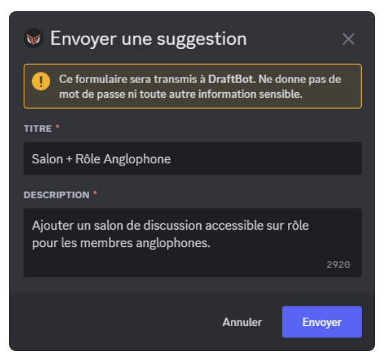

::hint{ type="info" }
  Une fois votre suggestion terminée, DraftBot vous affichera un message de confirmation. À ce moment-là, vous pourrez modifier votre envoi, y [ajouter une image](#ajouter-une-image), le valider, ou bien l'annuler :

  
::

::hint{ type="success" }
  Vous voulez ajouter plus de contenu à votre suggestion ? Pas de panique : DraftBot vous permet d'y intégrer un [commentaire](#commenter-une-suggestion), et même une [illustration](#ajouter-une-image) !

  
::

### Menu des suggestions

Pour accéder au menu des suggestions, vous devez entrer la commande \</suggestion>.

Un menu s'ouvre alors. Il vous permet de :
- soumettre de nouvelles suggestions,
- commenter une de vos suggestions,
- [supprimer](#supprimer-une-suggestion) une de vos suggestions en attente (si l'option est [activée](#membres)),
- accéder à une de vos suggestions (en cliquant sur son titre) ou encore,
- consulter l'état de vos suggestions (nombre de votes, statut).

Vous pourrez également décider de vous faire notifier ou non en cas de changement de [statut](#gérer-les-suggestions) sur l'une de vos suggestions (si l'option "Notification lors du changement de statut" est [activée](#modération)).

::hint{ type="info" }
  Pour ne pas surcharger vos salons, la commande s'effectue en toute discrétion : le message d'envoi de la commande est supprimé immédiatement, et la réponse de DraftBot est visible uniquement par l'utilisateur de la commande !
::

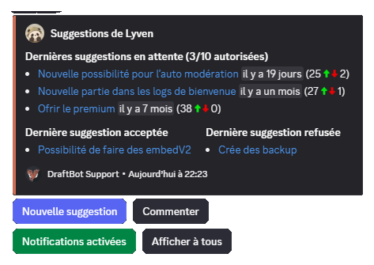

### Ajouter une image

Vous pouvez joindre une image à votre suggestion en déposant simplement le fichier dans la zone prévue ou en cliquant sur le bouton "`parcourir`" dans la fenêtre "`Envoyer une suggestion`" de DraftBot (image ci-dessous).

### Commenter une suggestion

Vous avez oublié quelque chose lors de l'envoi de votre suggestion ?

**DraftBot** vous permet de commenter vos suggestions en cliquant sur "Commenter" dans le [menu des suggestions](#menu-des-suggestions).

Une fois le commentaire ajouté, il apparaît en bas de votre message de suggestion :

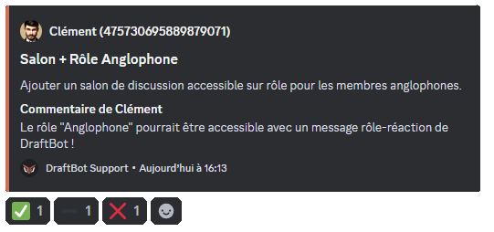

### Supprimer une suggestion

Vous avez changé d'avis ? Si l'administrateur a [activé l'option](#membres), le bouton "Supprimer" du [menu des suggestions](#menu-des-suggestions) vous permet de retirer vous-même l'une de vos suggestions **en attente**, sans passer par un modérateur.

Sélectionnez la suggestion concernée, puis confirmez : **DraftBot** supprime son message dans le salon de réception, ainsi que le [fil de discussion](#fils-de-discussion-automatiques) qui y était éventuellement rattaché.

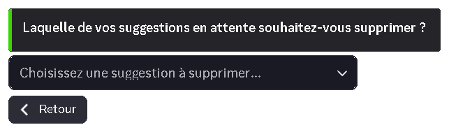

::hint{ type="warning" }
  La suppression est **définitive**. Une fois acceptée, refusée ou prévue, une suggestion ne peut plus être supprimée par son auteur.
::

### Gérer les suggestions

En tant que modérateur, vous pouvez **accepter**, **refuser** ou **prévoir** une suggestion en deux clics ou via une commande.

::hint{ type="warning" }
  Vous avez besoin de la permission "Gérer les messages" pour pouvoir accepter, refuser ou prévoir une suggestion.
::

::collapse{ label="Accepter une suggestion"}
  Une suggestion a reçu suffisamment de votes, et/ou vous a tapé dans l'œil ? Vous pouvez l'accepter, ce qui aura pour effet d'interrompre le vote, et de valider la suggestion. Pour ce faire, deux moyens sont à votre disposition :

  ::tabs
    ::tab{ label="Accès rapide" }
      Sur ordinateur, faites un clic droit (sur mobile, appuyez longtemps) sur la suggestion que vous souhaitez accepter, ouvrez ensuite la ligne "Applications". Vous aurez alors la possibilité d'accepter la suggestion.

      
    ::

    ::tab{ label="Commande" }
      La commande \</suggestmod accepter> vous permet également d'accepter une suggestion. Vous devrez pour cela saisir l'[identifiant](/docs/autres/recuperer-un-identifiant#identifiant-dun-message) du message de la suggestion à accepter.
    ::
  ::
  Quelle que soit la méthode, vous pourrez ajouter une raison d'acceptation si vous le souhaitez.

  ::hint{ type="info" }
    Si vous avez activé l'option "fil de tri pour les suggestions acceptées", la suggestion sera automatiquement déplacée dans le fil défini.
  ::
::

::collapse{ label="Refuser une suggestion"}
  Une suggestion a reçu beaucoup de votes négatifs, ou n'est tout simplement pas réalisable ? Vous pouvez la refuser, ce qui aura pour effet d'interrompre le vote, et d'invalider la suggestion. Pour ce faire, deux moyens sont à votre disposition :

  ::tabs
    ::tab{ label="Accès rapide" }
      Sur ordinateur, faites un clic droit (sur mobile, appuyez longtemps) sur la suggestion que vous souhaitez refuser, ouvrez ensuite la ligne "Applications". Vous aurez alors la possibilité de refuser la suggestion.

      
    ::

    ::tab{ label="Commande" }
      La commande \</suggestmod refuser> vous permet également de refuser une suggestion. Vous devrez pour cela saisir l'[identifiant](/docs/autres/recuperer-un-identifiant#identifiant-dun-message) du message de la suggestion à refuser.
    ::
  ::
  Quelle que soit la méthode, vous devez obligatoirement indiquer une raison pour valider le refus.

  ::hint{ type="info" }
    Si vous avez activé l'option "fil de tri pour les suggestions refusées", la suggestion sera automatiquement déplacée dans le fil défini.
  ::
::

::collapse{ label="Prévoir une suggestion"}
  Une suggestion a été retenue et sa mise en œuvre est prévue ? Vous pouvez la marquer comme "prévue", ce qui interrompt le vote. Ce statut peut être donné directement à une suggestion en cours, ou à une suggestion déjà acceptée. Deux moyens sont à votre disposition :

  ::tabs
    ::tab{ label="Accès rapide" }
      Sur ordinateur, faites un clic droit (sur mobile, appuyez longtemps) sur la suggestion que vous souhaitez prévoir, ouvrez ensuite la ligne "Applications". Vous aurez alors la possibilité de marquer la suggestion comme "prévue".

      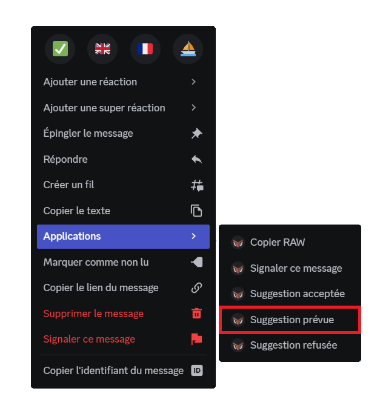
    ::

    ::tab{ label="Commande" }
      La commande \</suggestmod prevue> vous permet également de prévoir une suggestion. Vous devrez pour cela saisir l'[identifiant](/docs/autres/recuperer-un-identifiant#identifiant-dun-message) du message de la suggestion prévue. Finalement, vous aurez la possibilité de donner une raison pour expliquer ce choix, ou donner des détails dessus.
    ::
  ::
::

::hint{ type="info" }
  Le statut d'une suggestion peut être modifié **à tout moment**, par clic droit ou par commande, même après traitement. Pour réouvrir le vote, repassez la suggestion en attente via \</suggestmod attente>.
::

::hint{ type="success" }
  À chaque changement d'état d'une suggestion, le membre qui l'a envoyée sera notifié par DraftBot via messages privés, s'il a [activé les notifications](#menu-des-suggestions) dans le menu de ses suggestions.
::

## Classement des suggestions

::hint{ type="info" }
  Cette fonctionnalité est réservée aux serveurs [premium](/premium) <:icon_premium:1096140508625125417>.
::

La commande \</suggestmod classement> vous permet d’afficher un classement des suggestions, selon les critères suivants :

- Ordre par :
    - nombre de votes positifs
    - nombre de votes négatifs
    - ratio (rapport entre les votes positifs et négatifs)

- Filtre : Permet de trier les suggestions par un mot-clé.

## Recherche par mots-clés

La commande \</suggestmod rechercher> vous permet de rechercher des suggestions à partir de leur titre. ([premium](/premium) <:icon_premium:1096140508625125417>)

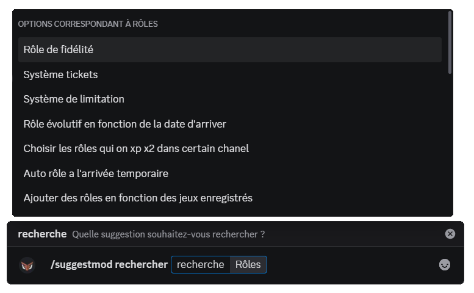

## Configuration

::tabs
  ::tab{ label="Depuis le panel" }
    [⫸ Accéder au panel de **DraftBot**](/dashboard/first/suggestions)

    Pour activer le module, cliquez sur le bouton en haut à droite. L'ensemble des options de configuration apparaît alors et reste accessible en quelques clics.

    

    ::hint{ type="warning" }
      Une fois vos modifications terminées, n'oubliez pas de les enregistrer avec le bouton "Enregistrer" situé en bas de page !
    ::
  ::

  ::tab{ label="Via la commande /config" }
    ::hint{ type="info" }
      Pour accéder directement à la configuration de ce module, sans passer par le menu principal, vous pouvez saisir la commande \</config Suggestions> !
    ::

    Une fois la commande exécutée, DraftBot affiche un message comportant :
    - des **informations** sur l'état actuel du module,
    - des **boutons d'action** pour modifier chaque partie de la configuration (détaillées dans les sections ci-dessous).

    
  ::
::

::hint{ type="warning" }
  **Permissions requises** dans le salon de réception des suggestions : **Voir le salon**, **Envoyer des messages**, **Intégrer des liens**, **Ajouter des réactions** et **Gérer les messages** (pour la modération). Sans ces permissions, le module ne pourra pas fonctionner correctement.
::

### Salon de réception

::tabs
  ::tab{ label="Depuis le panel" }
    [⫸ Accéder au panel de **DraftBot**](/dashboard/first/suggestions)

    Pour modifier le \<#salon> dans lequel les suggestions envoyées par les membres devront être postées, choisissez-le dans le sélecteur du panel.

    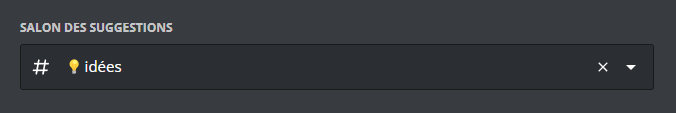

    ::hint{ type="info" }
      Si vous ne trouvez pas le salon dans la liste, pensez à réactualiser la page !
    ::
  ::

  ::tab{ label="Via la commande /config" }
    Cliquez sur le bouton "Salon de réception", puis renseignez le \<#salon> désiré :

    
  ::
::

::hint{ type="info" }
  Vous pouvez régler ce salon en lecture seule, pour que les suggestions restent toujours facilement accessibles !
::

### Mention

::tabs
  ::tab{ label="Depuis le panel" }
    [⫸ Accéder au panel de **DraftBot**](/dashboard/first/suggestions)

    Sélectionnez le rôle à mentionner lors de la publication d'une nouvelle suggestion.

    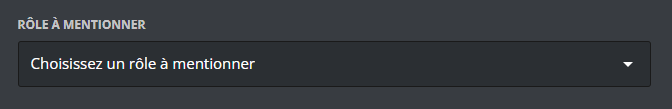
  ::

  ::tab{ label="Via la commande /config" }
    Cliquez sur le bouton "Mention" pour définir le rôle à mentionner. Le rôle sélectionné recevra une notification à chaque nouvelle suggestion postée.

    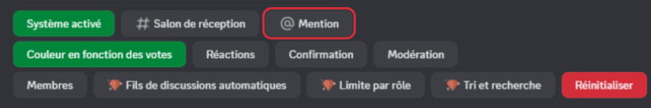
  ::
::

### Délai entre les suggestions

::tabs
  ::tab{ label="Depuis le panel" }
    [⫸ Accéder au panel de **DraftBot**](/dashboard/first/suggestions)

    **DraftBot** permet de mettre en place un **nombre de suggestions** autorisées sur une période définie (par exemple 1 suggestion toutes les 30 minutes, ou 3 par jour), mais aussi des rôles immunisés, qui ne seront pas pris en compte dans cette restriction.

    
  ::

  ::tab{ label="Via la commande /config" }
    Cliquez sur le bouton "Membres" pour ouvrir le menu de gestion des membres.

    Vous aurez le choix entre :
    - Définir un délai entre deux suggestions
    - Définir des rôles immunisés à ce délai

    
  ::
::

### Couleur en fonction des votes

::tabs
  ::tab{ label="Depuis le panel" }
    [⫸ Accéder au panel de **DraftBot**](/dashboard/first/suggestions)

    **DraftBot** permet de faire varier automatiquement la couleur d'une suggestion en fonction du ratio votes positifs / votes neutres / votes négatifs.

    

    ::hint{ type="info" }
      Les serveurs [premium](/premium) <:icon_premium:1096140508625125417> peuvent personnaliser le dégradé utilisé pour indiquer la popularité d'une suggestion.
    ::
  ::

  ::tab{ label="Via la commande /config" }
    Cliquez sur le bouton "Couleur en fonction des votes" pour ouvrir le menu de gestion des couleurs.

    

    Depuis ce menu, vous pouvez :
    - Activer / Désactiver le dégradé automatique des suggestions
    - Modifier les couleurs <:icon_premium:1096140508625125417>

    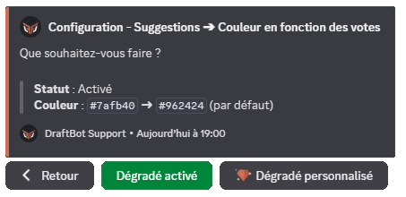
  ::
::

::hint{ type="info" }
  Par défaut, DraftBot fera varier progressivement la couleur de la suggestion, du rouge (plus de votes négatifs que positifs) vers le vert (plus de votes positifs que négatifs), en fonction de l'écart entre les votes.
::

### Réactions

::tabs
  ::tab{ label="Depuis le panel" }
    [⫸ Accéder au panel de **DraftBot**](/dashboard/first/suggestions)

    Choisissez les émojis qui représenteront les votes des membres.

    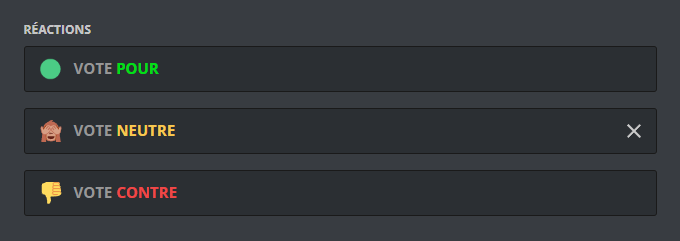

    Vous pouvez également décider de masquer les réactions de la suggestion une fois qu'elle est traitée.

    
  ::

  ::tab{ label="Via la commande /config" }
    Cliquez sur le bouton "Réactions" pour ouvrir le menu de configuration.

    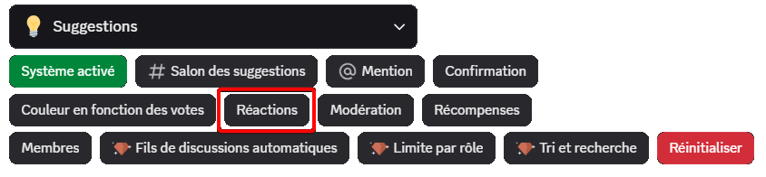

    Depuis ce menu, vous pouvez :
    - Activer / Désactiver la suppression des réactions après traitement
    - Définir les émojis à utiliser pour les votes favorables, neutres et défavorables

    
  ::
::

::hint{ type="success" }
  En plus des émojis Discord, vous pouvez utiliser les émojis personnalisés de votre serveur, et même ses émojis animés, si vous en avez [configuré](https://support.discord.com/hc/fr/articles/360041139231-Ajout-d-Emojis) !
::

### Confirmation

::tabs
  ::tab{ label="Depuis le panel" }
    [⫸ Accéder au panel de **DraftBot**](/dashboard/first/suggestions)

    Depuis ce menu, vous pouvez :
    - Choisir si l'auteur d'une suggestion doit ou non la confirmer *avant* envoi
    - Personnaliser le message de confirmation envoyé au membre *après* la publication de sa suggestion

    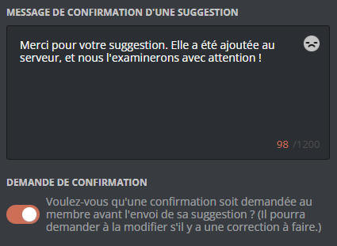
  ::

  ::tab{ label="Via la commande /config" }
    Cliquez sur le bouton "Confirmation" pour ouvrir le menu de configuration.

    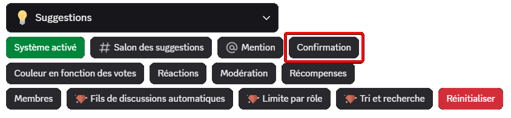

    Depuis ce menu, vous pouvez :
    - Choisir si l'auteur d'une suggestion doit la confirmer *avant* envoi
    - Personnaliser le message de confirmation envoyé au membre *après* la publication de sa suggestion

    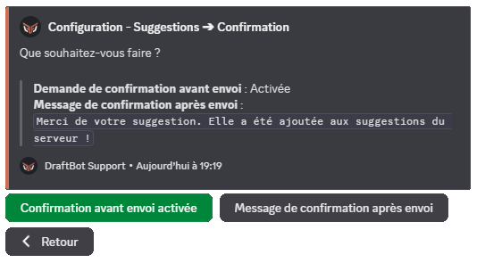
  ::
::

Vous pouvez personnaliser le message de confirmation avec différentes variables :

| Variable | Description | Exemple |
|----------|-------------|---------|
| `{title}` | Titre de la suggestion | Système de questionnaire |
| `{count}` | Nombre de suggestions en cours pour le membre | 3 |
| `{max}` | Nombre maximum de suggestions autorisées simultanément | 5 |

*En plus des [autres variables](/docs/autres/variables) déjà disponibles globalement !*

### Modération

Cette section vous permet de :
- Définir si les suggestions pourront être traitées (Tri des suggestions)
- Définir si le modérateur qui modifie le statut d'une suggestion doit être anonymisé
- Définir l'état par défaut des notifications, ou les désactiver globalement
- Définir un fil où ranger toutes les suggestions acceptées
- Définir un fil où ranger toutes les suggestions refusées

::hint{ type="warning" }
  Si vous désactivez le tri des suggestions, **vous ne pourrez plus accepter/refuser/prévoir les suggestions**.
::

::hint{ type="info" }
  Pour les notifications, vous avez le choix entre : désactivées par défaut, activées par défaut, ou totalement désactivées.
::

::tabs
  ::tab{ label="Depuis le panel" }
    [⫸ Accéder au panel de **DraftBot**](/dashboard/first/suggestions)

    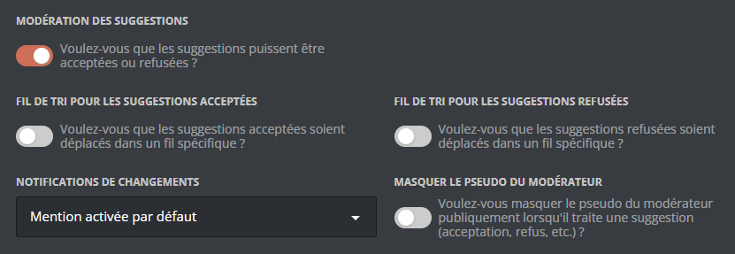
  ::

  ::tab{ label="Via la commande /config" }
    Cliquez sur le bouton "Modération" pour ouvrir le menu de configuration.

    

    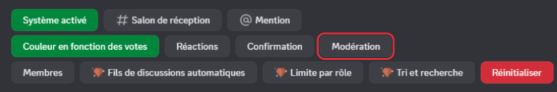
  ::
::

### Membres

Cette section permet de :
- Limiter le nombre de suggestions en attente qu'un membre peut avoir (illimité par défaut)
- Définir si l'auteur d'une suggestion aura la possibilité d'y ajouter un [commentaire](#commenter-une-suggestion)
- Définir si l'auteur d'une suggestion pourra la [supprimer](#supprimer-une-suggestion) lui-même tant qu'elle est en attente (désactivé par défaut)

::tabs
  ::tab{ label="Depuis le panel" }
    [⫸ Accéder au panel de **DraftBot**](/dashboard/first/suggestions)

    Réglez la limite désirée en faisant varier la jauge, et activez ou non l'option "Suppression par l'auteur".

    

    ::hint{ type="success" }
      Par défaut, le nombre de suggestions en attente simultanément par membre est illimité !
    ::
  ::

  ::tab{ label="Via la commande /config" }
    Cliquez sur le bouton "Membres" pour ouvrir le menu de configuration.

    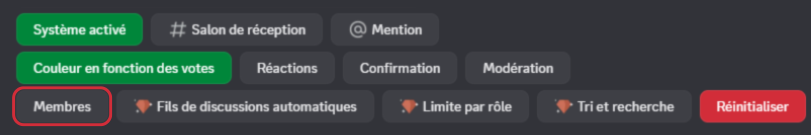

    
  ::
::

### Fils de discussion automatiques

::hint{ type="info" }
  Cette fonctionnalité est réservée aux serveurs [premium](/premium) <:icon_premium:1096140508625125417>.
::

DraftBot peut créer automatiquement un fil de discussion attaché à chaque suggestion, permettant à l'auteur et aux modérateurs d'interagir ensemble. Vous pouvez activer/désactiver cette fonctionnalité et personnaliser la façon dont les fils sont nommés.

Le nom du fil peut être personnalisé avec la variable suivante :

| Variable | Description | Exemple |
|----------|-------------|---------|
| `{title}` | Titre de la suggestion | Système de questionnaire |

*En plus des [autres variables](/docs/autres/variables) déjà disponibles globalement !*

::tabs
  ::tab{ label="Depuis le panel" }
    [⫸ Accéder au panel de **DraftBot**](/dashboard/first/suggestions)

    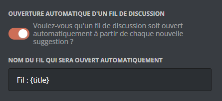
  ::

  ::tab{ label="Via la commande /config" }
    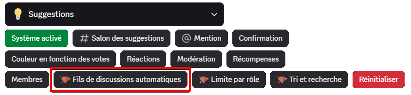

    
  ::
::

### Limite par rôle

::hint{ type="info" }
  Cette fonctionnalité est réservée aux serveurs [premium](/premium) <:icon_premium:1096140508625125417>.
::

Cette fonctionnalité vous permet de définir des limites de suggestions en attente simultanées différentes selon les rôles possédés par les membres.

::hint{ type="success" }
  Pour favoriser vos membres les plus actifs, n'hésitez pas à utiliser cette option en binôme avec des rôles octroyés par le [système de niveaux](/docs/engagement/niveaux#créer-une-récompense) 😉
::

::tabs
  ::tab{ label="Depuis le panel" }
    [⫸ Accéder au panel de **DraftBot**](/dashboard/first/suggestions)

    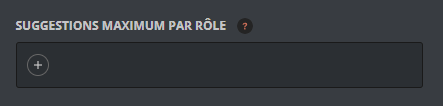
  ::

  ::tab{ label="Via la commande /config" }
    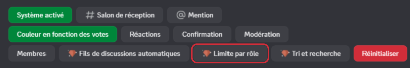

    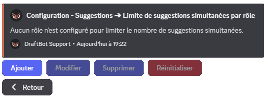
  ::
::

### Tri et recherche

::hint{ type="info" }
  Cette fonctionnalité est réservée aux serveurs [premium](/premium) <:icon_premium:1096140508625125417>.
::

Cette option permet d'activer l'indexation des suggestions, ce qui rend possible la [recherche avancée](#recherche-par-mots-clés) et le tri des suggestions.

::tabs
  ::tab{ label="Depuis le panel" }
    [⫸ Accéder au panel de **DraftBot**](/dashboard/first/suggestions)

    
  ::

  ::tab{ label="Via la commande /config" }
    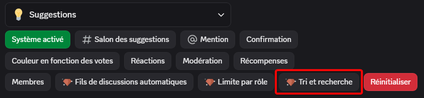
  ::
::

## Récompenses

DraftBot peut récompenser automatiquement l'auteur d'une suggestion lorsqu'il atteint un certain nombre de suggestions acceptées, refusées, en attente ou prévues.

### Créer une récompense

Lors de la création, vous définissez :

1. **Statut de suggestion** : acceptée, en attente, refusée ou prévue
2. **Nombre de suggestions** : le seuil déclencheur
3. **Type de récompense** : rôle, argent, expérience, objet d'inventaire ou personnalisée
4. **Paramètres spécifiques** selon le type choisi

::tabs
  ::tab{ label="Depuis le panel" }
    [⫸ Accéder au panel de **DraftBot**](/dashboard/first/suggestions)

    Dans la section "Récompenses", cliquez sur "Créer une récompense" :

    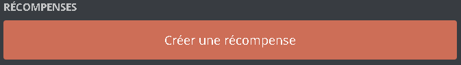
  ::

  ::tab{ label="Via la commande /config" }
    Accédez au menu "Suggestions" > "Récompenses" > "Créer une récompense", puis suivez les étapes de configuration.

    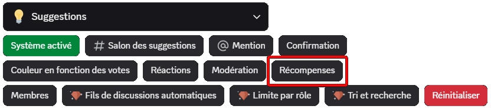
  ::
::

::tabs
  ::tab{ label="Rôle" }
    Attribuez un rôle au membre qui atteint l'objectif. Vous pouvez choisir un rôle **permanent** ou **temporaire** au moment de la création.

    **Paramètres :**
    - Le rôle à attribuer
    - La durée (uniquement pour un rôle temporaire)

    ::hint{ type="warning" }
      Le rôle sélectionné doit avoir été créé au préalable et être accessible à DraftBot (ne pas être situé plus haut que le rôle le plus élevé de DraftBot).
    ::

    ::hint{ type="info" }
      Contrairement aux récompenses de niveau, les rôles ne sont **jamais retirés** automatiquement si le statut de la suggestion est modifié par la suite.
    ::
  ::

  ::tab{ label="Argent" }
    Donnez de l'argent du [système d'économie](/docs/engagement/economie) au membre.

    **Paramètres :**
    - Montant à donner

    ::hint{ type="warning" }
      Le système d'économie doit être **activé** sur votre serveur pour utiliser ce type de récompense.
    ::
  ::

  ::tab{ label="Expérience" }
    Donnez des points d'expérience du [système de niveaux](/docs/engagement/niveaux).

    **Paramètres :**
    - Quantité d'XP à donner

    ::hint{ type="warning" }
      Le système de niveaux doit être **activé** sur votre serveur pour utiliser ce type de récompense.
    ::

    ::hint{ type="success" }
      Si le gain d'XP fait monter le membre de niveau, il recevra automatiquement les récompenses de niveau et une annonce sera envoyée (si configurée).
    ::
  ::

  ::tab{ label="Objet d'inventaire" }
    Donnez un ou plusieurs [objets d'inventaire](/docs/engagement/inventaire) au membre.

    **Paramètres :**
    - L'objet à donner
    - La quantité (jusqu'à 1 million)

    ::hint{ type="info" }
      Si vous n'avez pas encore créé d'objets, vous devrez d'abord [configurer votre inventaire](/docs/engagement/inventaire) depuis le module Inventaire du panel.
    ::
  ::

  ::tab{ label="Récompense personnalisée" }
    Offrez une récompense **en dehors de Discord** : codes promotionnels, goodies physiques, mentions spéciales, etc.

    **Paramètres :**
    - Nom/description de la récompense (jusqu'à 250 caractères)

    ::hint{ type="success" }
      **Comment ça fonctionne ?** Lorsqu'un membre obtient cette récompense, **vous recevez une notification par message privé de DraftBot** avec les informations du membre. Vous pouvez alors lui remettre la récompense manuellement.
    ::

    ::hint{ type="warning" }
      Assurez-vous que vos messages privés sont ouverts pour recevoir les notifications !
    ::
  ::
::

### Annonces de récompenses

Une fois vos récompenses créées, configurez où et comment annoncer leur obtention.

- **Salon dédié** : Choisissez un salon spécifique pour les annonces.
- **Message personnalisé** : Personnalisez le message avec les [variables disponibles globalement](/docs/autres/variables), ainsi que `{reward}`, `{target.count}` et `{target.type}` pour afficher la récompense obtenue.

**Message par défaut** : `{user}, voici votre récompense pour avoir atteint **{target.count} {target.type}** !`

::tabs
  ::tab{ label="Depuis le panel" }
    [⫸ Accéder au panel de **DraftBot**](/dashboard/first/suggestions)

    Dans la section "Récompenses" :

    
  ::

  ::tab{ label="Via la commande /config" }
    Accédez au menu "Suggestions" > "Récompenses" > "Annonces de récompenses".

    
  ::
::

::hint{ type="warning" }
  **Permissions requises** : Pour envoyer les annonces, DraftBot doit disposer des permissions suivantes dans le salon choisi : **Voir le salon**, **Envoyer des messages**, **Intégrer des liens** et **Joindre des fichiers**. Si ces permissions sont retirées, les annonces seront automatiquement désactivées.
::
