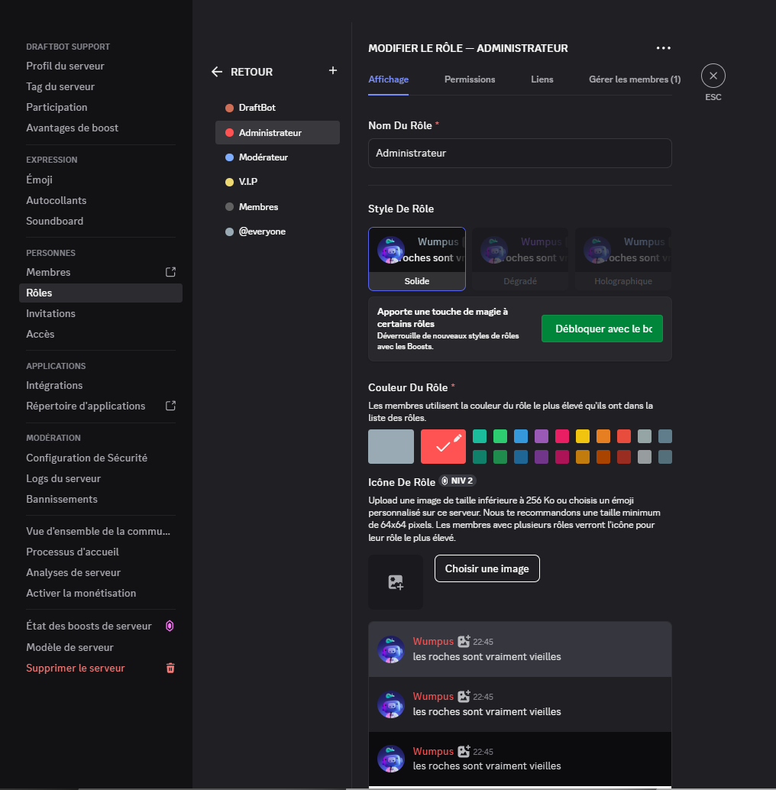

## Inviting DraftBot

Let's start by inviting **DraftBot** to the server by [`clicking here`](/invite).

::hint{ type="success" }
  Congratulations, 𝗗𝗿𝗮𝗳𝘁𝗕𝗼𝘁 is now added to your server!
::

## Installing DraftBot

Once **DraftBot** has been added to your server, you need to give it the permissions it requires. To do so, open your server settings and go to the Roles section.

::hint{ type="warning" }
  The **Administrator** permission is **strongly recommended** for **DraftBot**.

  Without it, you must make sure to grant it the [permissions](#draftbot-permission-guidelines) it needs in its other roles and in every channel where it has to act.
::

If you want **DraftBot** to be able to assign roles, make sure those roles sit lower in the server hierarchy. You can change the order by dragging roles up and down:

::hint{ type="info" }
  In our example, **DraftBot** will be able to assign the second, third, fourth and fifth roles, but will not be able to grant the first one.
::

### DraftBot permission guidelines

| Essential | Strongly recommended |
|-----------|----------------------|
| View Channels | **Administrator** |
| Manage Webhooks | Manage Channels |
| Send Messages | Manage Roles |
| Send Messages in Threads | Manage Expressions |
| Embed Links | View Audit Log |
| Attach Files | Manage Nicknames |
| Add Reactions | Kick Members |
| Use External Emoji | Timeout Members |
| Manage Messages | Mute Members |
| Read Message History | Deafen Members |
|  | Move Members |

::hint{ type="success" }
  With this installation done, and if you chose to trust **DraftBot** by leaving it as Administrator, you should not run into any problem. The initial setup is now complete.
::

## Configuring commands
DraftBot uses Discord slash commands. This lets users run commands easily by typing `/`. You can configure them and restrict them to certain **roles**, **channels** and **members**.

To configure DraftBot's commands, go to **your server** settings on Discord, then to the **Integrations** section. You will find every bot on your server there, including DraftBot. Click **DraftBot** to display all of its commands and configure their permissions.

::hint{ type="info" }
  Command permissions can currently only be configured from Discord on desktop or Discord in a browser.
::

::hint{ type="danger" }
  Pay close attention to how you configure your slash commands: wrong permissions given to the wrong people could compromise your server's security.
::

