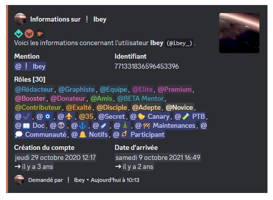
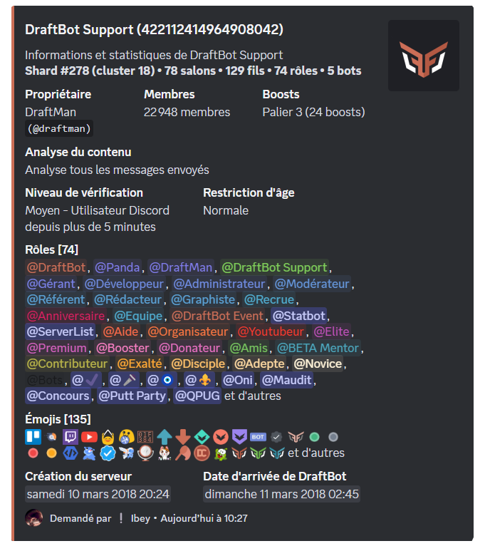
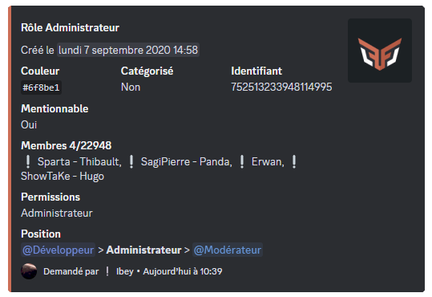
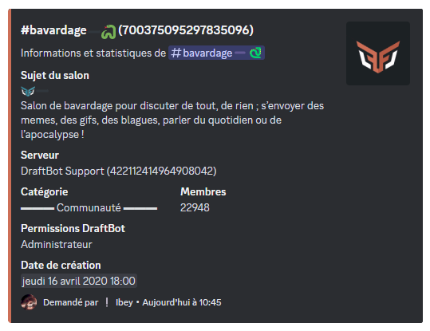
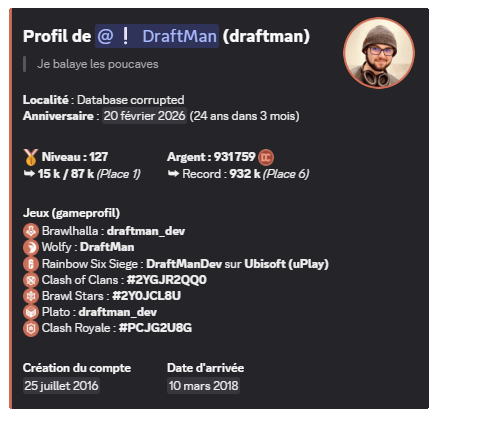

## /info user

The \</info user> command gives you detailed information about a user:

- The user's mention and ID.
- The different roles they hold on the server.
- The date they joined the server.
- The date their account was created.
- DraftBot badges: premium, members of the DraftBot team.
- Discord badges: HypeSquad, partner, active developer, early verified bot developer, etc.

::hint{ type="info" }
  If the user is not present on your server, the join date and the roles are not displayed.
::

::hint{ type="info" }
  You can see another user's information by using their **username** or their **ID** after the command. For example: `/info user user:@Username`.
::

## /info server

The \</info server> command gives you detailed information about your Discord server:

- The server's name.
- The shard and cluster it sits on in the "[Status](/status)" page.
- The owner's username.
- The number of members, channels, threads, roles, emojis, bots and boosts.
- The security level: verification and age restriction.
- The date the server was created.
- The date DraftBot joined the server.

## /info role

The \</info role> command gives you detailed information about a specific role:

- The role's ID.
- The role's hexadecimal color code.
- Whether it is displayed separately or not.
- Whether it is mentionable or not.
- The number of members holding it.
- The permissions it has.
- Its position in the hierarchy among the other roles.

## /info channel

The \</info channel> command gives you detailed information about a specific channel or category:

- The channel's or category's ID.
- The channel's topic.
- The server's name and its ID.
- The category the channel is in.
- The number of members with permission to view the channel.
- DraftBot's permissions.
- The date the channel or category was created.

::hint{ type="info" }
  To tell the different types of channels and categories apart, an icon appears next to their name: a "#" icon for text channels, a "📁" icon for categories, a "🔊" icon for voice channels, a "📢" icon for announcement channels.
::

## /profile

The \</profile> command gives you detailed information about a server member's profile:

- The member's mention.
- The locality, which only appears if the member has set it through the \</locality> command.
- Their level and rank in the server leaderboard.
- The money they hold on the server.
- Their birth date, if it has been enabled and made visible.
- Game profiles: their username on the different games and platforms.
- The date their account was created.
- The date they joined the server.

::hint{ type="info" }
  You can add a description to your profile with the \</description> command.
::

::hint{ type="info" }
  You can see another user's profile by using their **username** or their **ID** after the command. For example: `/profile member:@Username`.
::
