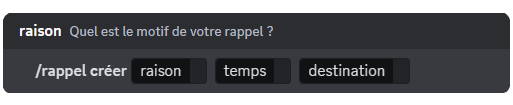

## Creating a reminder

To create a reminder, run the \</reminder create> command. DraftBot then offers you these fields:

- **The reason**: so you know what your reminder is about.
- **The time**: how long from now you want to receive your reminder.
- **The destination**: where you want to receive it, between your direct messages and the channel the reminder was created in.

::hint{ type="warning" }
  You can create up to 3 reminders at the same time. [Premium](/premium) <:icon_premium:1096140508625125417> servers can have up to 10 at the same time.
::

::hint{ type="warning" }
  Note that reminders have to be 3 months or less.
::

::hint{ type="success" }
  🎉 Congratulations, you have created a reminder! You will be mentioned on your server by DraftBot, or notified in your direct messages, when the time comes.
::

## Editing a reminder

You can edit a reminder at any time, even one that is already running, with the \</reminder edit> command. All you have to do is select the reminder you want to edit and choose a new reason, a new delay and another destination.

## Deleting a reminder

To delete a running reminder, run the \</reminder delete> command and select the reminder you want to remove from the list.

## Seeing the list of reminders

You can see the list of reminders with the \</reminder list> command. You get a summary of every running reminder, sorted by their duration.
