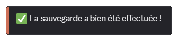
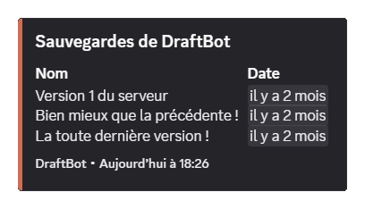
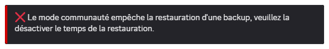
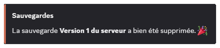
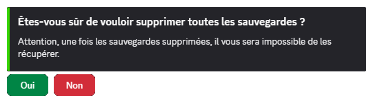

## What is the backup module?

The **Backups** module creates a **complete copy of your server's structure**, so you can restore it later in case of a mistake or a redesign.

A backup includes:

- The server's **general information**
- The **categories and channels** (text and voice)
- The **server roles**
- The **members' roles**

::hint{ type="warning" }
  To work properly, DraftBot has to sit **right at the top of the role hierarchy** and have the **Administrator** permission.
::

## Creating a backup

The \</backup create> command creates a backup.

The `name` option is available for setting a custom name to identify the backup.

::hint{ type="info" }
  Backup names cannot exceed **30** characters.
::

::hint{ type="success" }
  **Congratulations!** You have created a backup!
::

## Listing backups

The \</backup list> command displays every existing backup.

The list displays:

- The **name**
- The **creation date**

## Restoring a backup

The \</backup restore> command restores an existing backup.

The `backup` option is available for selecting the backup to restore.

::hint{ type="warning" }
  **Warning:** when you request a restoration of your server, you must have **disabled** your server's community option first, if that is not already the case.
::

## Deleting a backup

The \</backup remove> command deletes a specific backup. It has a `backup` option for selecting the backup to delete.

::hint{ type="info" }
  When you run the command, a confirmation is requested before deletion.
::

## Resetting every backup

The \</backup reset> command deletes every backup of the server.

::hint{ type="danger" }
  If you agree to delete every backup, this action **cannot be undone**.
::
