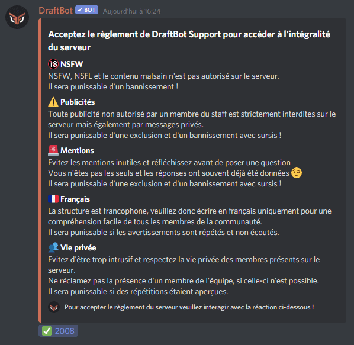
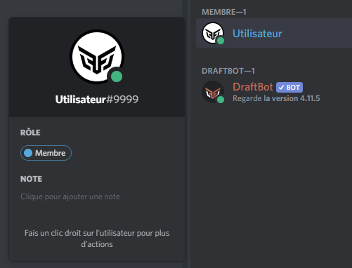
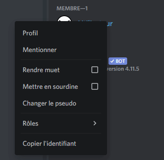
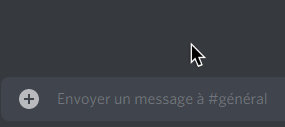
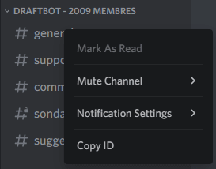
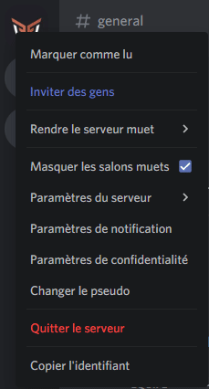

## Message ID

::hint{ type="warning" }
  You first have to enable `developer mode` to obtain IDs.

  To do so, go to the user settings, then Advanced, and enable developer mode.
::

To obtain a message's ID, you have to:

- Long-press or right-click a message
- Then press **Copy Message ID**

## Role ID

::hint{ type="warning" }
  You first have to enable `developer mode` to obtain IDs.

  To do so, go to the user settings, then Advanced, and enable developer mode.
::

To obtain a role's ID, you have to:

- Press or click a member holding the role whose ID you want
- Then long-press the role (on a smartphone) or right-click the role and choose **Copy Role ID** (on desktop).

If you need to mention a role (on the web panel, for example), simply write `<@&[Role-ID]>`.

## Member ID

::hint{ type="warning" }
  You first have to enable `developer mode` to obtain IDs.

  To do so, go to the user settings, then Advanced, and enable developer mode.
::

To obtain a member's ID, you have to:

- Right-click or click the person whose ID you want
    - On a smartphone, tap the three dots in the top right corner
- Then press **Copy User ID**.

If you need to mention a member (on the web panel, for example), you can write `<@Member-ID>`.

## Emoji ID

To obtain an emoji's ID, all you have to do is:

- Write your emoji in a text channel
- Put a backslash before the emoji
- Then send your message.

::hint{ type="info" }
  On **Android**, to obtain an emoji's ID:

  - Send `:TheNameOfYourEmoji:` in a text channel
  - Then copy the result, which is the emoji's ID
::

## Channel ID

::hint{ type="warning" }
  You first have to enable `developer mode` to obtain IDs.

  To do so, go to the user settings, then Advanced, and enable developer mode.
::

To obtain a channel's ID, you can:

- Press or right-click a channel's name
- Then press **Copy Channel ID**.

If you need to mention a channel (on the web panel, for example), you have to write `<#Channel-ID>`

## Server ID

::hint{ type="warning" }
  You first have to enable `developer mode` to obtain IDs.

  To do so, go to the user settings, then Advanced, and enable developer mode.
::

If you want to obtain a server's ID, all you have to do is:

- Right-click or press the server's image/name
- Then press **Copy Server ID**.

