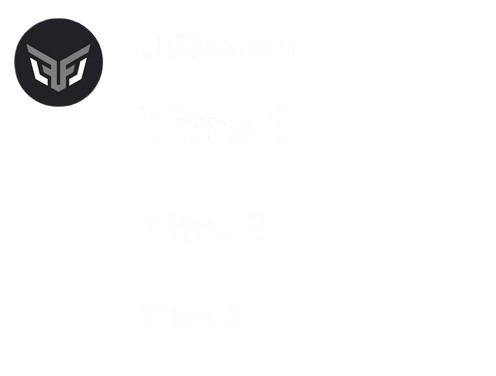
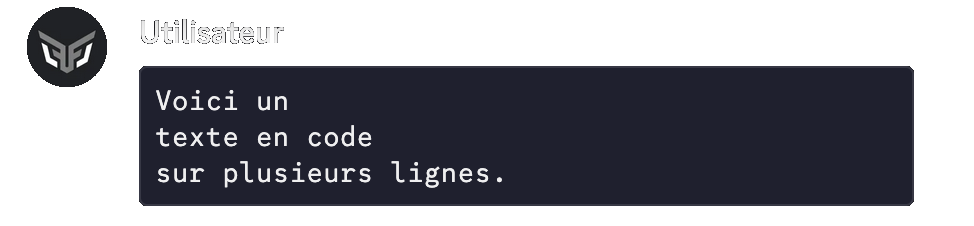
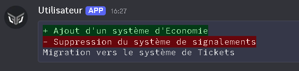

## Basic markdown

| **Preview** | **Markdown** |
|------------|--------------|
| *Italic* | `*Text*` or `_Text_` |
| **Bold** | `**Text**` |
| ~~Strikethrough~~ | `~~Text~~` |
| Underlined | `__Text__` |

::hint{ type="info" }
  You can stack several Markdown marks to combine formats: ***bold italic*** with `***Text***`.
::

## Advanced formatting

### Heading

To create a heading, put a specific number of hash characters `#` as the first term(s) of a new line.
The more `#` you use (3 maximum) for a heading, the smaller the heading.

**Markdown:**
```
# Heading 1
## Heading 2
### Heading 3
```


::hint{ type="info" }
  Remember to put a space between your heading and the code.

  This applies to every list and heading Markdown mark.
::

### Subtext

You can turn text into subtext, so it is displayed smaller than normal text, by adding `-#` at the beginning of the line.

**Markdown:**
```
-# Text
```


### Masked link

You can embed a masked, clickable hyperlink in a text.

**Markdown:**
```
[Text](hyperlink)
```


### List

You can create a bullet list using `-` or `*` at the beginning of each line.
You can also indent your list by adding a space before the `-` or `*` at the beginning of each line.

**Markdown:**
```
- Line 1
- Line 2
...
```


### Quote

**Markdown:**
```
> Text on a single line
or
>>> Text
over
several lines
```


### Spoiler

You can hide your text, so that it is only visible when clicked, with spoilers.

**Markdown:**
```
||Text||
```


### Code block

**Markdown:**
```
```Text
Text
Text```
```


### Language code

**Example markdown:**
```
```diff
+ addition
- removal```
```


::collapse{ label="See the different codes available" }
  | Code | Category |
  |------|-----------------|
  | python, py | Programming language |
  | javascript, js | Programming language |
  | typescript, ts | Programming language |
  | java | Programming language |
  | c | Programming language |
  | cpp | Programming language |
  | csharp, cs | Programming language |
  | go | Programming language |
  | rust | Programming language |
  | kotlin | Programming language |
  | swift | Programming language |
  | php | Programming language |
  | ruby, rb | Programming language |
  | perl | Programming language |
  | lua | Programming language |
  | html | Markup language |
  | css, scss, less | Style language |
  | json | Structured data |
  | xml | Structured data |
  | yaml, yml | Structured data |
  | markdown, md | Text formatting |
  | bash, sh, shell | Terminal |
  | zsh | Terminal |
  | powershell, ps | Terminal |
  | batch, bat | Terminal |
  | sql | Database |
  | ini | Configuration file |
  | toml | Configuration file |
  | env | Configuration file |
  | dockerfile | Configuration file |
  | nginx | Configuration file |
  | apache | Configuration file |
  | diff | Comparison (+/-) |
  | regex | Regular expression |
  | plaintext, text | Plain text |

  ::hint{ type="info" }
    Other variables may be available.
    Simply put them after the first ``` (see the example above).
  ::
::


### Inline code
**Markdown:**
```
`Text`
or
``Text``
```

