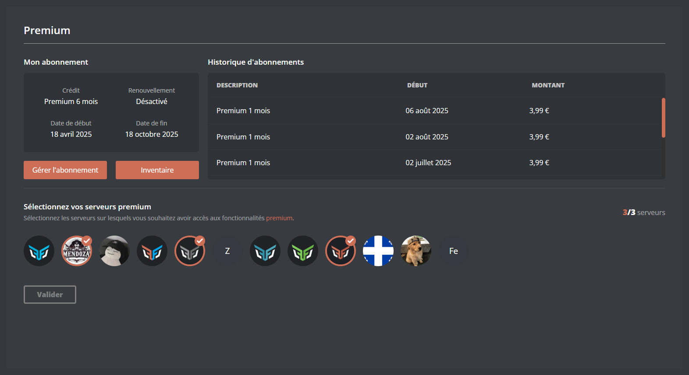
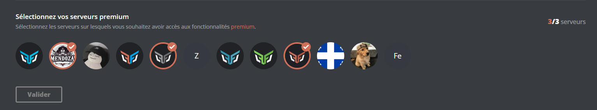
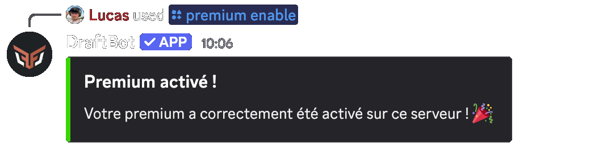
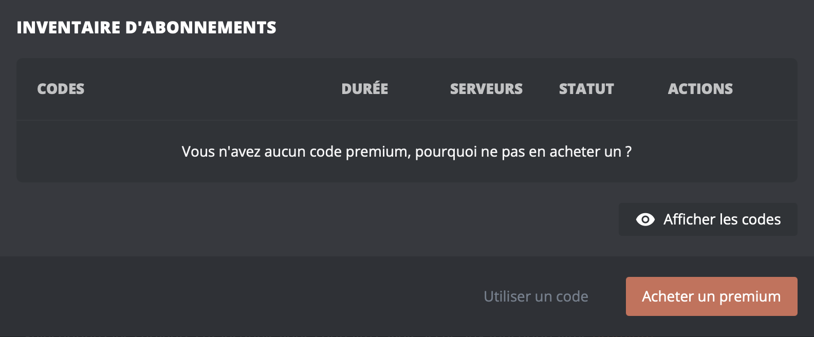
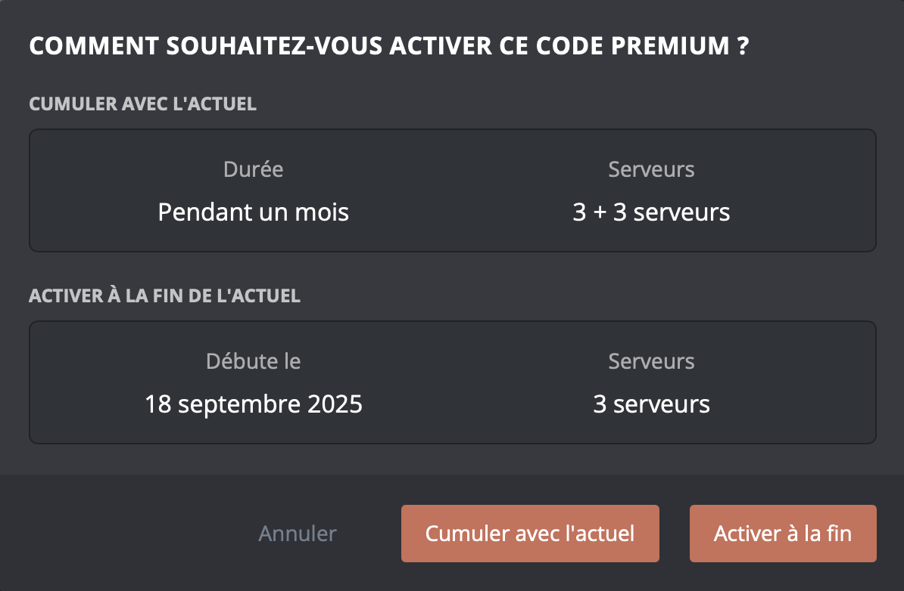

## Your subscription

From the [panel](/dashboard/user/premium), you will find every piece of information about your premium:

- Credit or subscription
- Renewal status
- Start date and end date
- Payment history
- Your activated servers

- **Manage subscription**: lets you manage the renewal of your subscription and check your purchase invoices.

- **Inventory**: lets you display, share and activate your premium codes.

::hint{ type="info" }
  The "Manage subscription" button is not available when premium has been activated from a [premium code](#premium-codes).
::

## Activating a server

When premium is purchased, it is associated with your Discord account straight away. To enjoy its benefits, you have to activate it on one of your servers. There are two ways of doing so:

::tabs
  ::tab{ label="From the panel" }
    [⫸ Open the **DraftBot** panel](/dashboard/user/premium)

    To activate premium on a server, click the icon of the server you want, then confirm.

    
  ::

  ::tab{ label="Through a command" }
    To activate premium on your server, simply run the \</premium enable> command.

    
  ::
::

::hint{ type="info" }
  You need the **Administrator** permission on the server for this action.
::

## Premium codes

If you have received a premium code from someone else, or bought it through the **"Buy premium"** button, you can activate it so that it is associated with your Discord account and you can enjoy it.

Go to the **[panel](/dashboard/user/premium)**, open the **"inventory"** section, then select **"Use a code"** and enter the code. The code is in your inventory. You can keep it or activate it straight away to enjoy the benefits.

::hint{ type="info" }
  You do not need to be on the server, nor to have any particular permission.
::

::hint{ type="info" }
  From the \</premium codes> command, a **"Redeem a code"** button also adds a premium code directly to your inventory, without going through the panel. You can then activate it whenever you want.
::

## Available commands

By taking out a premium subscription, you get several essential commands for managing it.

| Commands | Descriptions |
|-----------|--------------|
| \</premium infos>   | Check the state of your premium subscription.
| \</premium enable>   | Activate your premium subscription on a server.
| \</premium disable>   | Deactivate your premium subscription on a server.
| \</premium codes>   | Display your premium code inventory, and redeem a new code through the "Redeem a code" button.

## Stacking premium

If you take out a premium subscription while already having an active one, this new purchase is converted into a [premium code](#premium-codes). You can then combine it with the current one as you prefer.

- **Stack with current:**
    With this option, you can accumulate **servers only**, which lets you activate premium on more servers.

- **Activate it at the end of the current one:**
    With this option, you can extend your premium subscription over time.

## Deactivating premium

You can deactivate the premium benefits on a server where you have activated them. There are two ways of doing so.

    ::tabs
      ::tab{ label="From the panel" }
        [⫸ Open the **DraftBot** panel](/dashboard/user/premium)

        To deactivate premium on a server, click the icon of the server you want, then confirm.
      ::

      ::tab{ label="Through a command" }
        To deactivate premium on a server, simply run the \</premium disable> command, giving the name or the ID of the server concerned.
      ::
    ::
