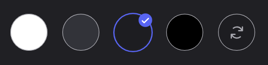

## Writing style

The documentation is an essential part of **DraftBot**: it gives every user a good experience of the bot. It matters that they can find answers to their questions easily and on their own.

Here are a few pieces of advice for improving the quality of your writing:

1. **Clarity and concision:**
Use **clear and precise** vocabulary, matching **DraftBot**'s wording as closely as possible. Avoid needless jargon and long sentences. **Your goal is to make the information easy for the reader to understand.**
2. **Stay considerate:** avoid subjective expressions such as *"simply"*, *"just"*, *"obviously"* as much as possible. **Keep in mind that we all have different experience and backgrounds.** These words add no useful information and can sometimes come across as dismissive or hurtful, particularly to people discovering Discord or starting out with **DraftBot**.
3. **Use informative language:** the point of the documentation is to convey **information and knowledge** about using the bot. To match that, stay **neutral and objective** as much as possible, without trying to convince, entertain or push choices or actions.
4. **Consistency:** keep the style, tone and terminology consistent throughout the documentation. This maintains a smooth, professional reading experience. To that end, use the **declarative form in the active voice** as much as possible, in the **present tense** in most cases. Exceptions and departures can of course be made depending on the situation, to come back to an earlier explanation or to raise a future possibility.

## Writing rules

### A user-oriented introduction

When writing a page, always start with a presentation of the system from the user's point of view.

When a server manager decides to enable a system, they always put themselves in their members' shoes. If they are convinced, they will move on to setting it up.

### Recommended structure of a module page

To keep the whole documentation consistent, follow this structure when writing a module page:

1. **User view**: start by explaining what an ordinary member sees and does (user commands, visible features)
2. **Administrator view**: explain the management features and admin commands
3. **Configuration**: detail the configuration options (through the "Panel" / "/config command" tabs)
4. **Advanced use cases**: migrations, tips (optional)

::hint{ type="success" }
  This structure lets the reader understand what the module is **for** before diving into the technical configuration.
::

### Premium features

When you want to indicate that a feature is premium, do not put it in the title or in the feature's description.
Use an info hint instead; several wordings such as these work well:

**Limit extended by premium**

::tabs
  ::tab{ label="Preview"}
    ::hint{ type="info" }
      You can run up to 3 giveaways at the same time. [Premium](/premium) <:icon_premium_:1096140508625125417> servers have no limit.
    ::
  ::

  ::tab{ label="Markdown"}
    ```
    ::hint{ type="info" }
      You can run up to 3 giveaways at the same time. [Premium](/premium) <:icon_premium_:1096140508625125417> servers have no limit.
    ::
    ```
  ::
::

**Premium feature**

::tabs
  ::tab{ label="Preview"}
    ::hint{ type="info" }
      This feature is reserved for [premium](/premium) <:icon_premium_:1096140508625125417> servers.
    ::
  ::

  ::tab{ label="Markdown"}
    ```
    ::hint{ type="info" }
      This feature is reserved for [premium](/premium) <:icon_premium_:1096140508625125417> servers.
    ::
    ```
  ::
::

**Premium feature in a table**

::tabs
  ::tab{ label="Preview"}
    ::hint{ type="info" }
      Features marked with the <:icon_premium:1096140508625125417> symbol are reserved for [premium](/premium) <:icon_premium_:1096140508625125417> servers.
    ::
  ::

  ::tab{ label="Markdown"}
    ```
    ::hint{ type="info" }
      Features marked with the <:icon_premium:1096140508625125417> symbol are reserved for [premium](/premium) <:icon_premium_:1096140508625125417> servers.
    ::
    ```
  ::
::

### Screenshots

They are essential for illustrating the documentation and giving it room to breathe.
To stay in harmony with the rest of the documentation:
1. Prefer wide shots with no editing of the screenshots.

    The necessary edits, such as cutting out or cropping the screenshots, are done by a writing referent once the writing and the corrections are finished.

2. Use the Discord theme called "Dark" exclusively.



### Links to the panel

Let the user reach the relevant page of the panel every time the page changes:
- At the top of the section concerned
- In every section concerned (even if it comes up several times on the same page)

::tabs
  ::tab{ label="Preview"}
    [⫸ Open the **DraftBot** panel](/dashboard/first/levels)
  ::

  ::tab{ label="Markdown"}
    ```
    [⫸ Open the **DraftBot** panel](/dashboard/first/moduleName)
    ```

    1. `first` automatically selects the first server in the list.
    2. `moduleName` has to match the page concerned.
  ::
::

### Configuration from the Panel and /config

Always put the "**From the panel**" choice first rather than "**Using the /config command**", to keep the pages consistent so that members do not have to look for it.

::tabs
  ::tab{ label="From the panel" }
    [⫸ Open the **DraftBot** panel](/dashboard/first/levels)

    This is for configuring from the panel.
  ::

  ::tab{ label="Using the /config command" }
    If you would rather do the whole setup from Discord, you can use the /config command, then go to the "Levels" tab.
  ::
::

### Default values and behaviors

Always give the default values when a feature offers any:

**Recommended format:**
- Directly in the description: "**15 to 25 XP** by default"
- In brackets for options: "configurable **100-1500**"
- In an info hint for complex behaviors

**Example:**
```markdown
Each message grants a **random** amount of experience between two values you configure (**15 to 25 XP** by default).
```

### Specific behaviors and edge cases

Some features behave in specific ways in particular situations (edge cases). Document them clearly to avoid confusion:

**Recommended format:**

```markdown
**Specific behaviors:**

- **Name of the case**: a clear explanation of the behavior, with a concrete example if needed.
- **Another case**: description…
```

**Example:**
```markdown
- **Skipping levels**: if a member skips several levels at once (through \</adminxp add>), they receive **every reward** of the intermediate levels. For example, if a member goes from level 5 to 25, they will receive the rewards of levels 10, 15, 20 and 25.
```

### Required Discord permissions

When a feature requires specific Discord permissions, document them in a warning hint:

::hint{ type="warning" }
  **Required permissions**: to send announcements, DraftBot needs the following permissions in the chosen channel: **View Channel**, **Send Messages**, **Embed Links** and **Attach Files**. If these permissions are removed, announcements are disabled automatically.
::

**Good practice:**
- List **every** required permission
- Explain the **consequences** if the permissions are missing
- State whether the system disables itself automatically or returns an error

### Navigation icons

Every page of the documentation *(apart from a few)* has to set an icon through `navigation.icon`.

Two icon libraries are used:

- **[`twemoji`](https://icones.js.org/collection/twemoji):** **only** for **feature pages** *(Member welcome, Engagement, Games & events, Community, Security, Utilities)* and the **home/installation** pages.
- **[`material-symbols`](https://icones.js.org/collection/material-symbols?s=filter&variant=Outline):** for **every page** of the documentation.

**Examples**

::card
---
icon: material-symbols:edit-document-outline
---
::

```yaml
navigation.icon: material-symbols:edit-document-outline
```

::card
---
icon: twemoji:locked
---
::

```yaml
navigation.icon: material-symbols:edit-document-outline
```

## Multilingual structure

The documentation exists in French and in English. French is authoritative:
every page is written in French first, then translated.

### Where to put a file

French pages live under `docs/fr/`, English ones under `docs/en/`.
**File and folder names are in English and identical in both languages** —
that is what pairs a page with its translation. A French page is therefore
called `docs/fr/3.engagement/0.levels.md`, not `0.niveaux.md`.

The numeric prefixes determine the display order in the menu.

### Declaring a page's address

A page's address no longer comes from its file name but from its
frontmatter:

```yaml
---
title: Levels
slug: /engagement/levels
---
```

The `slug` is the full path, without the `/docs/en` prefix. It has to
start with the `slug` of the `_dir.yml` file of its folder, minus its
`/_dir` suffix.

`_dir.yml` files carry one too, ending in `/_dir`:

```yaml
slug: /engagement/_dir
title: Engagement
```

### Images

A page's images live in the `assets/` folder of its category, in a
subfolder named after the page:

```
docs/fr/3.engagement/
├─ assets/levels/panel.png
└─ 0.levels.md              
```

### Checking your work

```bash
node scripts/check-translations.mjs   # slugs, duplicates and up-to-date translations
node scripts/check-links.mjs          # missing images and internal links
```

### Translations

You do not have to translate anything yourself. When a French page changes, a
translation pull request is opened automatically — it needs to be reviewed,
not written. While it awaits review, the English documentation displays the
up-to-date French version rather than an outdated translation.

### Excluding a page from translation

A page that is not meant to exist in English carries `translate: false`
in its frontmatter:

```yaml
---
title: 2026
slug: /annexes/changelog/2026
translate: false
---
```

It then drops out of the list of pages to translate. This is the case of the
changelog, which stays in French.

This key does not propagate: putting it in a `_dir.yml` only excludes that
file, not the pages of the folder. Every page to exclude has to carry it.

## Structuring tools

Organize your content logically. Use headings, subheadings, tabs and screenshots so that it is easy to follow.
Below are all of the structures available.

### Headings

::tabs
  ::tab{ label="Preview"}

    ## H2

    ### H3


    #### H4
  ::

  ::tab{ label="Markdown"}
    ```mdc
    ## H2
    ### H3
    #### H4
    ```
  ::
::

::hint{ type="warning" }
  **Be careful not to nest headings inside block elements** *(such as collapsible menus or tabs)*!
::

### Basic markdown

::tabs
  ::tab{ label="Preview"}
    **Bold**

    *Italic*

    **_Bold italic_**

    ***Bold italic***

    ~~Strikethrough~~

    `Code`

    www.automatic-link.com

    [link to a URL](https://www.youtube.com/watch?v=dQw4w9WgXcQ)

    [link to a panel page](/dashboard/first/messages)

    [link to a new tab](https://www.youtube.com/watch?v=dQw4w9WgXcQ)

    

    > "Quote"

    :shortcut{value="meta"} :shortcut{value="A"} + :shortcut{value="C"}
  ::

  ::tab{ label="Markdown"}
    ```mdc
    **Bold**

    *Italic*

    **_Bold italic_**

    ***Bold italic***

    ~~Strikethrough~~

    `Code`

    www.automatic-link.com

    [link to a URL](https://www.youtube.com/watch?v=dQw4w9WgXcQ)

    [link to a new tab](https://www.youtube.com/watch?v=dQw4w9WgXcQ)

    [link to a panel page](/dashboard/first/messages)

    

    > "Quote"

    :shortcut{value="meta"} :shortcut{value="A"} + :shortcut{value="C"}
    ```
  ::
::

### Emojis & mentions

::tabs
  ::tab{ label="Preview"}
    Text emoji: :fire:

    Character emoji: 🔥

    Custom Discord emoji: <:draftbot:816002768971759636>

    Animated custom Discord emoji: <a:db_Hero:980109817349820476>

    Command mention: \</command>

    Channel mention: <#channel>
  ::

  ::tab{ label="Markdown"}
    Text emoji: `:fire:`

    Character emoji: `🔥`

    Custom Discord emoji: `<:draftbot:816002768971759636>`

    Animated custom Discord emoji: `<a:db_Hero:980109817349820476>`

    Command mention: `\</command>`

    Channel mention: `<#channel>`
  ::
::

### Bullets & lists

::tabs
  ::tab{ label="Preview"}
    - Bullet 1
    - Bullet 2
    - Bullet 3
        - Bullet 3.1
            - Bullet 3.1.1

    1. Num 1
    2. Num 2
    3. Num 3

    - [ ] box 1
    - [x] box 2
  ::

  ::tab{ label="Markdown"}
    ```mdc
    - Bullet 1
    - Bullet 2
    - Bullet 3
      - Bullet 3.1
        - Bullet 3.1.1

    1. Num 1
    2. Num 2
    3. Num 3

    - [ ] box 1
    - [x] box 2
    ```
  ::
::

### Information hints

Hints highlight important information. Choose the type according to the context:

::tabs
  ::tab{ label="Preview"}
    ::hint{ type="success" }
      A nice, positive little piece of information
    ::

    ::hint{ type="info" }
      A nice, informative little piece of information
    ::

    ::hint{ type="warning" }
      A moderately nice little warning
    ::

    ::hint{ type="danger" }
      A not-so-nice little piece of information
    ::
  ::

  ::tab{ label="Markdown"}
    ```mdc
    ::hint{ type="success" }
      A nice, positive little piece of information
    ::

    ::hint{ type="info" }
      A nice, informative little piece of information
    ::

    ::hint{ type="warning" }
      A moderately nice little warning
    ::

    ::hint{ type="danger" }
      A not-so-nice little piece of information
    ::
    ```
  ::
::

::hint{ type="info" }
  **Several hints in a row**: only use several consecutive hints if the pieces of information are of **different types** (an info followed by a warning, for example). Otherwise, gather the information in a single hint with bullets.
::

### Table

Tables are essential for comparing options or listing features in a structured way.

**Use a table to:**
- Compare several types of options
- List commands with their descriptions
- Present customization variables

::tabs
  ::tab{ label="Preview"}
    | Curve | Difficulty | Description |
    |--------|------------|-------------|
    | **Constant** | Fixed | Every level requires exactly the same amount of XP |
    | **Linear** | Moderate increase | Linear progression |
    | **Exponential** | Fast increase | Exponentially increasing difficulty |
  ::

  ::tab{ label="Markdown"}
    ```mdc
    | Curve | Difficulty | Description |
    |--------|------------|-------------|
    | **Constant** | Fixed | Every level requires exactly the same amount of XP |
    | **Linear** | Moderate increase | Linear progression |
    | **Exponential** | Fast increase | Exponentially increasing difficulty |
    ```
  ::
::

### Collapsible

::tabs
  ::tab{ label="Preview"}
    ::collapse{ label="Text" }
      A long

      text

      over

      several

      lines
    ::
  ::

  ::tab{ label="Markdown"}
    ```mdc
    ::collapse{ label="Text" }
      A long

      text

      over

      several

      lines
    ::
    ```
  ::
::

### Tabs

::tabs
  ::tab{ label="Tab 1" }
    Information 1
  ::

  ::tab{ label="Tab 2" }
    Information 2
  ::

  ::tab{ label="Tab 3" }
    Information 3
  ::
::

```mdc
::tabs
  ::tab{ label="Tab 1" }
    Information 1
  ::

  ::tab{ label="Tab 2" }
    Information 2
  ::

  ::tab{ label="Tab 3" }
    Information 3
  ::
::
```

### Card

::tabs
  ::tab{ label="Preview"}
    ::card
    ---
    title: Levels
    icon: material-symbols:view-module-rounded
    to: /docs/engagement/levels
    target: _blank
    color: '#00ff00'
    ---
      Discover a secret page in a new tab
    ::
  ::

  ::tab{ label="Markdown"}
    ```mdc
    ::card
  ---
    title: Levels
    icon: material-symbols:view-module-rounded
    to: /docs/engagement/levels
    target: _blank
    color: '#00ff00'
  ---
    Discover a secret page in a new tab
    ::
    ```
  ::
::

