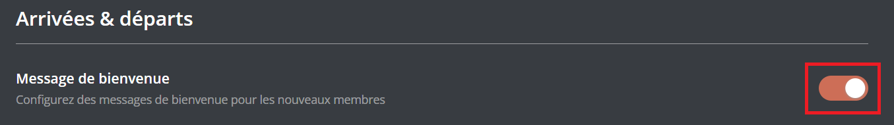
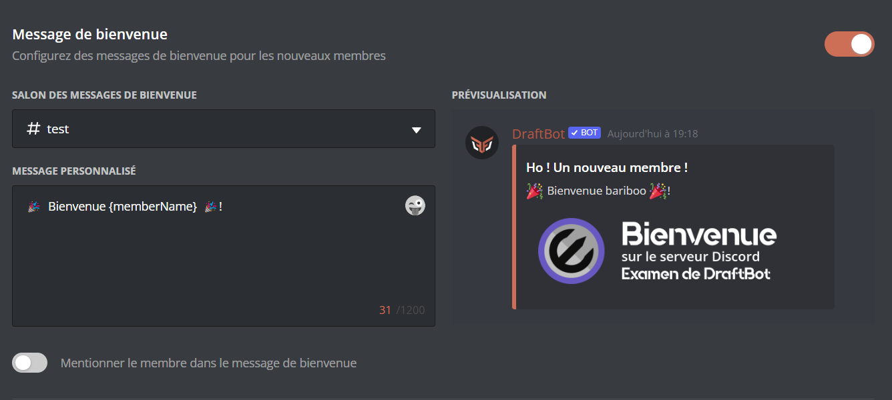
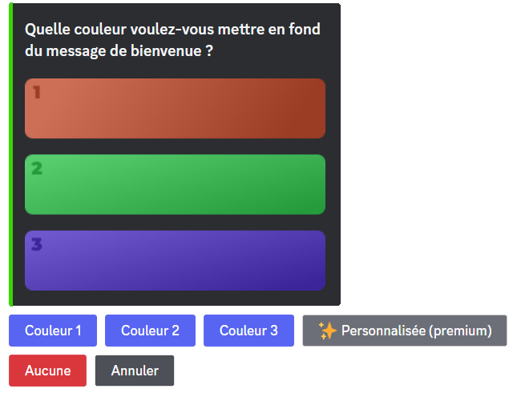
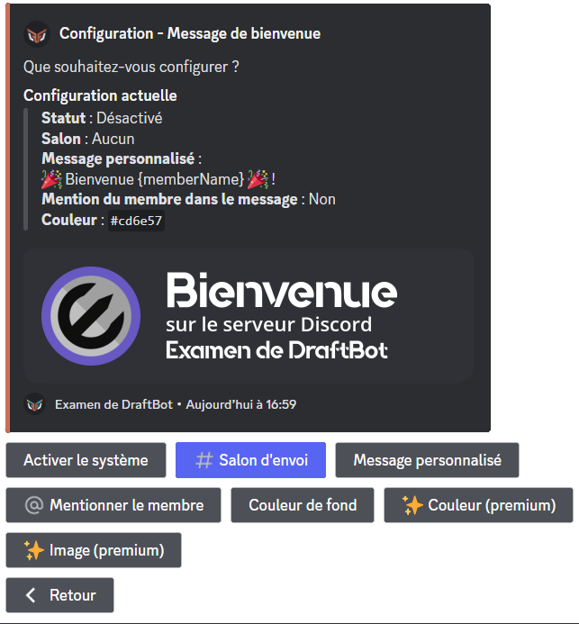
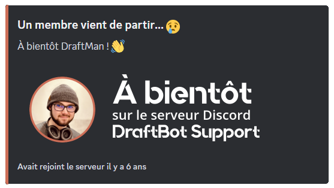
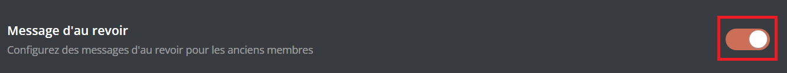
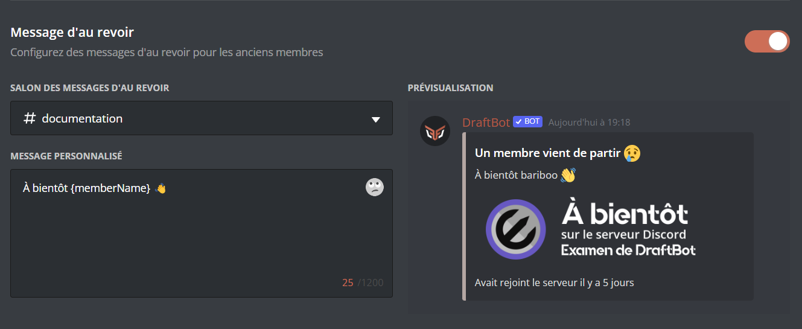
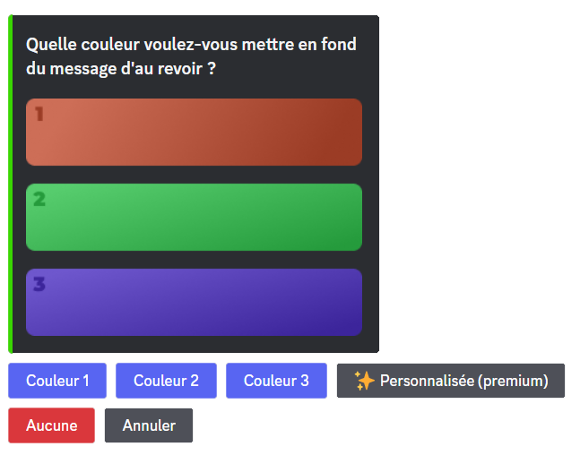
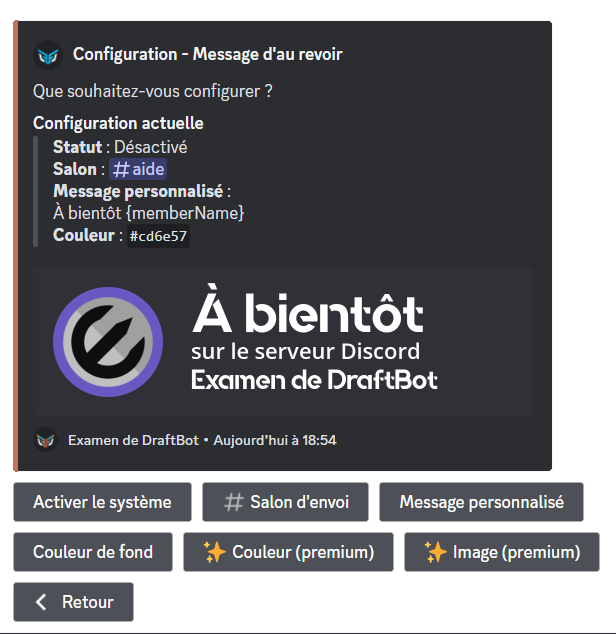

## Welcome messages

Welcome messages are sent when a member joins your server. They let you greet a newcomer and give them information about your server.

### Configuration

::tabs
  ::tab{ label="From the panel" }

    [⫸ Open the **DraftBot** panel](/dashboard/first/welcome)

    You then need to enable the system by clicking the module's activation button. To disable it, click that same button again.

    

    ::hint{type="warning"}
      Once you are done, remember to save your changes with the "Save" button at the bottom of the page.
    ::

    
  ::

  ::tab{ label="Using the /config command" }
    Start by opening the \</config> command ➜ 👋
    Welcome & goodbye ➜ "Welcome message".

    Here are the different buttons and what they do:
    - "Enable the system" ➜ Enables or disables the system.
    - "Sending channel" ➜ Sets the channel where the welcome message is sent.
    - "Custom message" ➜ Sets the message that is sent in the welcome message (1,200 characters maximum).

    ::collapse{ label="Variables" }
      Variables are pieces of text that change depending on the person, the server, the channel or the time. Here are the ones you can use in DraftBot's welcome messages.

      - `{user}` ➜ Member mention
      - `{user.id}` ➜ Member ID
      - `{user.username}` ➜ Member username
      - `{user.nickname}` ➜ Member nickname or username
      - `{server}` ➜ Server name
      - `{server.id}` ➜ Server ID
      - `{server.name}` ➜ Server name
      - `{server.membercount}` ➜ Number of members on the server
      - `{server.humancount}` ➜ Number of humans on the server
      - `{channel}` ➜ Channel mention
      - `{channel.id}` ➜ Channel ID
      - `{channel.name}` ➜ Channel name
      - `{date}` ➜ Current date (DD/MM/YYYY)
      - `{time}` ➜ Current time (HH:MM)
      - `{timestamp}` ➜ Current timestamp in seconds
    ::

    - "Mention the member" ➜ Once this option is enabled, the member is mentioned in the welcome message.
    - "Background color" ➜ Changes the background color of the welcome message.

    ::hint{ type="info" }
      You can choose between three colors as well as the default one, which makes the image transparent (with the "None" button).

      If you want a custom color, you need to subscribe to a [premium](/premium) <:icon_premium:1096140508625125417> plan.

      
    ::

    - "Color" ➜ Sets the color of the sidebar of your welcome message. (<:icon_premium:1096140508625125417>)
    - "Image" ➜ Adds a background image to your welcome message. (<:icon_premium:1096140508625125417>)

    ::hint{ type="info" }
      Features marked with the <:icon_premium:1096140508625125417> symbol are reserved for [premium](/premium) <:icon_premium:1096140508625125417> servers.
    ::

    ::hint{ type="info" }
      The optimal image dimensions are 1,000 x 300 pixels.
    ::

    
  ::
::

::hint{ type="warning" }
  Welcome messages are only sent once the **onboarding process** is complete and the **server rules** set through Discord have been accepted.
::

## Goodbye messages

Goodbye messages are sent when a member leaves your server. They let the community know that a member has left and wish them well.

### Configuration

::tabs
  ::tab{ label="From the panel" }

    [⫸ Open the **DraftBot** panel](/dashboard/first/welcome)

    You first need to enable the system by clicking the module's activation button. To disable it, click that same button again.

    

    ::hint{type="warning"}
      Once you are done, remember to save your changes with the "Save" button at the bottom of the page.
    ::

    
  ::

  ::tab{ label="Using the /config command" }
    Start by opening the \</config> command ➜ 👋
    Welcome & goodbye ➜ "Goodbye message".

    Here are the different buttons and what they do:
    - "Enable the system" ➜ Enables or disables the system.
    - "Sending channel" ➜ Sets the channel where the goodbye message is sent.

    - "Custom message" ➜ Sets the message that is sent in the goodbye message.

    ::collapse{ label="Variables" }
      Variables are pieces of text that change depending on the person, the server, the channel or the time. Here are the ones you can use in DraftBot's goodbye messages.

      - `{user}` ➜ Member mention
      - `{user.id}` ➜ Member ID
      - `{user.username}` ➜ Member username
      - `{user.nickname}` ➜ Member nickname or username
      - `{user.tag}` ➜ Member tag _(Username#0000)_
      - `{server}` ➜ Server name
      - `{server.id}` ➜ Server ID
      - `{server.name}` ➜ Server name
      - `{server.membercount}` ➜ Number of members on the server
      - `{channel}` ➜ Channel mention
      - `{channel.id}` ➜ Channel ID
      - `{channel.name}` ➜ Channel name
      - `{date}` ➜ Current date (DD/MM/YYYY)
      - `{time}` ➜ Current time (HH:MM)
      - `{timestamp}` ➜ Current timestamp in seconds
    ::

    ::hint{ type="warning" }
      Your message must be 1,200 characters at most.
    ::

    - "Background color" ➜ Changes the background color of the goodbye message.

    ::hint{ type="info" }
      You can choose between three colors as well as the default one (with the "None" button).

      If you want a custom color, you need to subscribe to a [premium](/premium) <:icon_premium:1096140508625125417> plan.

      
    ::

    - "Color" ➜ Sets the color of the sidebar of your goodbye message. (<:icon_premium:1096140508625125417>)
    - "Image" ➜ Adds a background image to your goodbye message. (<:icon_premium:1096140508625125417>)

    ::hint{ type="info" }
      Features marked with the <:icon_premium:1096140508625125417> symbol are reserved for [premium](/premium) <:icon_premium:1096140508625125417> servers.
    ::

    ::hint{ type="info" }
      The optimal image dimensions are 1,000 x 300 pixels.
    ::

    
  ::
::

