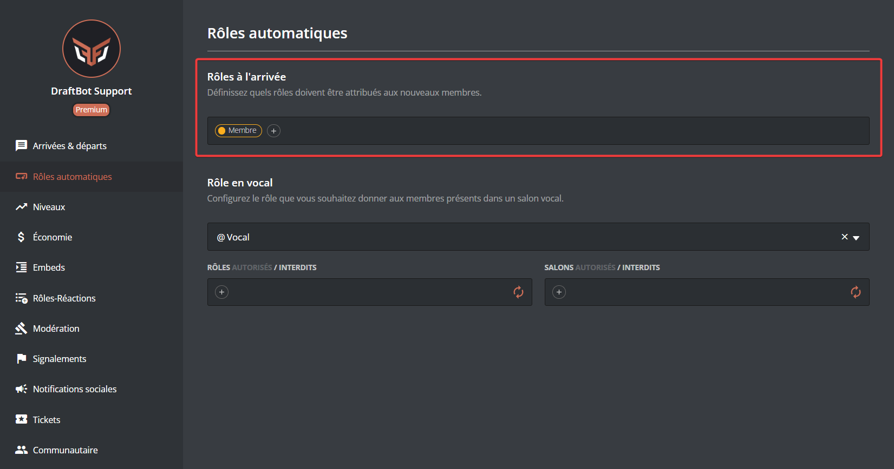
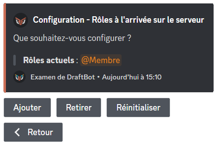
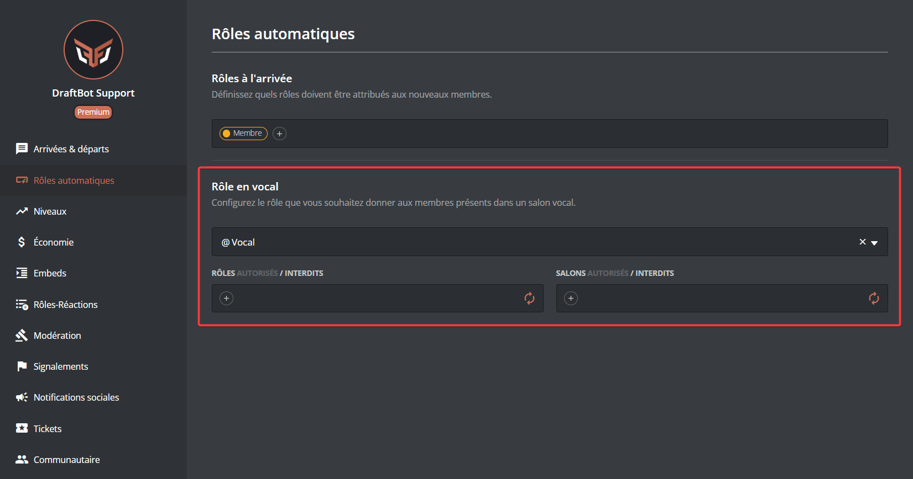
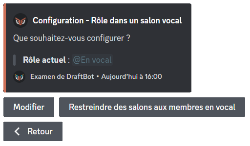
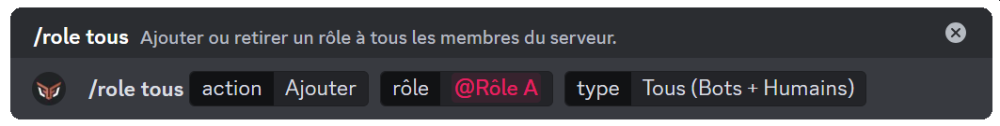
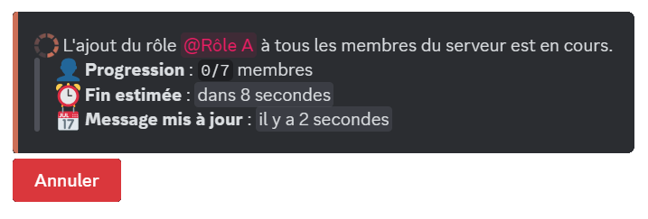
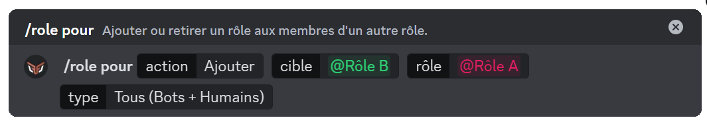

## Automatic roles

### On join

::tabs
  ::tab{ label="From the panel" }
    [⫸ Open the **DraftBot** panel](/dashboard/first/autoroles)

    Then select the role you want to grant automatically when a new member joins.

    ::hint{ type="warning" }
      Some roles may appear in red for one of the following reasons:

      - DraftBot does not have permission to manage roles.

      - DraftBot's role is below the roles you want to assign.

      - The user's role is below the roles they want to assign.

      - The role is managed by a bot or by Discord.
    ::

    
  ::

  ::tab{ label="Using the /config command" }
    Start by opening \</config> ➜ 🏷️ Automatic roles ➜ "On join".

    To add an automatic role granted when a member joins your server, click "Add".

    To remove a role from this list, click "Remove".

    To remove **all** automatic roles, click "Reset".

    ::hint{ type="info" }
      You can create up to 3 automatic roles. [Premium](/premium) <:icon_premium:1096140508625125417> servers can create up to 10.
    ::

    
  ::
::

### In voice

::tabs
  ::tab{ label="From the panel" }
    [⫸ Open the **DraftBot** panel](/dashboard/first/autoroles)

    Then select the role you want to grant automatically when a member joins a voice channel.

    ::hint{ type="warning" }
      Some roles may appear in red for one of the following reasons:

      - DraftBot does not have permission to manage roles.

      - DraftBot's role is below the roles you want to assign.

      - The user's role is below the roles they want to assign.

      - The role is managed by a bot or by Discord.
    ::

    
  ::

  ::tab{ label="Using the /config command" }
    Start by opening \</config> ➜ 🏷️ Automatic roles ➜ "In voice".

    To grant an automatic role to a member in voice, click **"Configure"**.

    ::hint{ type="info" }
      You can either select an existing role or create one directly.
    ::

    To remove an automatic voice role, click **"Edit"**.

    ::hint{ type="info" }
      You can delete the role from the server once the system is disabled.
    ::

    ### Restricting channels to members in voice

    To restrict channels to members in voice, click **"Restrict channels to members in voice"**, then select the channel in question. Only members holding this role will be able to see it.

    
  ::
::

## Assigning roles in bulk

::tabs
  ::tab{ label="/role all" }
    The \</role all> command gives a specified role to every member of the server.
    
    Choose the action to perform (add or remove), then select the role concerned. You also need to choose whether every member is affected (humans + bots) or only one of the two.

    Once the command is launched, the roles are assigned and a message keeps you informed of its progress[^1].
    
    [^1]:The more members there are, the longer the task takes.
  ::

  ::tab{ label="/role for" }
    The \</role for> command adds a role in bulk, but lets you set a condition for granting the role.

    Choose the action to perform (add or remove), select the role that determines whether the role is granted, then select the role you want to add. You also need to choose whether every member is affected (humans + bots) or only one of the two.
    
    Here, role A is given to every member holding role B.

    Once the command is launched, the roles are assigned and a message keeps you informed of its progress[^1].
    
  ::
::
