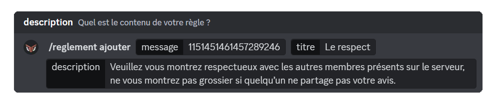
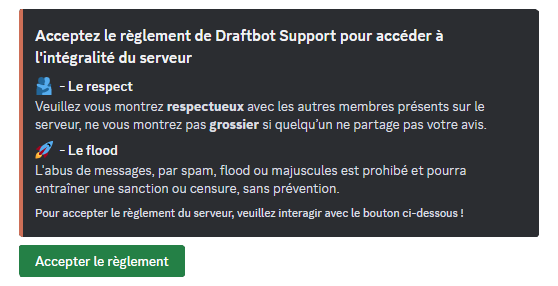
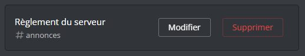

## Creating the rules message

To begin, run the \</rules create> command. **DraftBot** will then let you **add the role** you want to assign to members, as well as **lock** that role to stop them from removing it themselves.

Members receive this role once they have read the rules and clicked the `Accept the rules` button.

## Adding rules

Now that the rules message has been created, it does not contain any rule yet: it is up to you to add them one by one.

To do so, use the \</rules add> command. DraftBot will ask you for three pieces of information: the rules message, the title of your rule and its description.

::hint{ type="warning" }
  The "rules message" field expects **the ID** of the rules message you have just created.
  To find out how to obtain it, see the [Finding an ID](/docs/misc/finding-an-id#message-id) page.
::

::hint{ type="info" }
  Once a rule has been added, **DraftBot** offers two choices: add another rule or come back to it later.
::

::hint{ type="warning" }
  The title is limited to **256** characters, while the description is limited to **1024** characters.
::

## Editing a rule

You can edit your rules at any time, whether to make a correction or to make them look the way you want. You will need the \</rules edit> command.

The procedure is not very different from the \</rules add> command, except that one extra field appears: `rule`.

This field lets you select **the rule** you want to edit.

::hint{ type="info" }
  You can edit the rules from the panel in the [Messages](/dashboard/first/messages) section. The embed is named **"Server rules"**.

  
::

## Removing a rule

If you are not happy with a rule and want to remove it, you can use the \</rules remove> command. You only need to obtain **the ID** of the rules message and select the **rule**.

