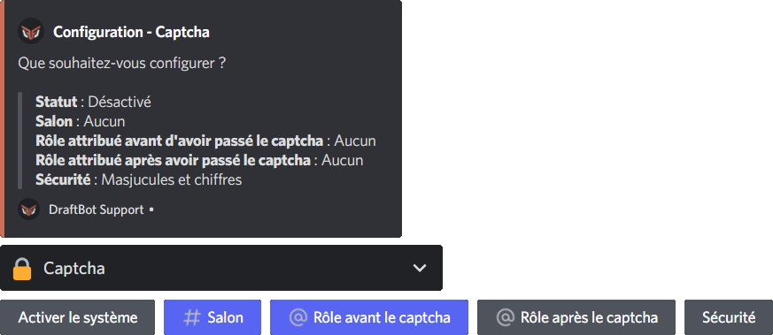

::hint{ type="info" }
  **Before enabling the captcha**, note that Discord already offers ways to filter arrivals: the server's **verification level** (email address, phone number, account age) and, in Community mode, the **rules screen** and **onboarding**. These settings add no extra step for your members and are enough for most servers.

  DraftBot's captcha remains useful if your server is not in Community mode, or if you want an additional barrier on top of these protections.
::

::hint{ type="warning" }
  If your server uses **Discord's native rules screen** (the one new members must accept before accessing the server, enabled through Community mode), DraftBot's captcha will only appear once those rules have been accepted.
::

## Configuration

You can configure the captcha system on your server with the \</config> command, then going to the "Captcha" tab of the selector.

You will then be able to:

- **Enable or disable** the captcha
- **Choose** one of the 4 security levels (easy, medium, complex and very complex)
- **Create or select** the verification channel where captchas are sent
- **Create or select** a role assigned to members who have not completed the captcha yet
- **Select** (optional) a role assigned to members who have completed the captcha

::hint{ type="info" }
  Configuring the captcha system is not available on the **DraftBot** panel yet.
::

## Using the captcha

When a new member joins your Discord server, a message appears in the channel you have set for the captcha.

The member then has to type the characters shown on the image meant for them in order to access the server.

::hint{ type="info" }
  The join message is only sent after the Discord community rules and DraftBot's captcha have both been validated.
::

::hint{ type="warning" }
  If the member does not answer within 2 minutes, or fails the captcha more than 3 times, they will be kicked automatically!
::
