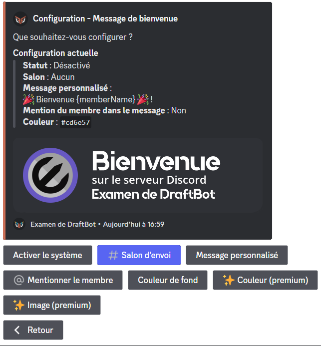
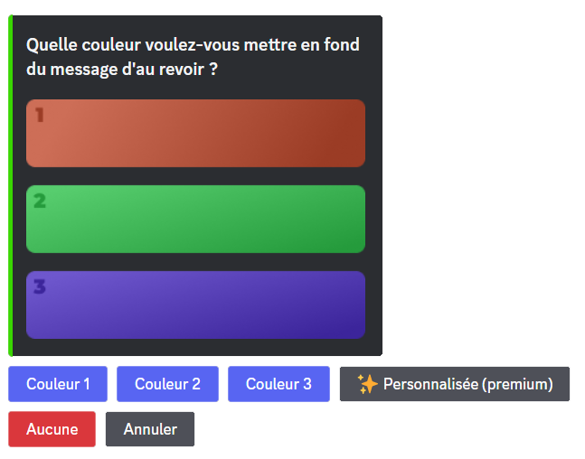
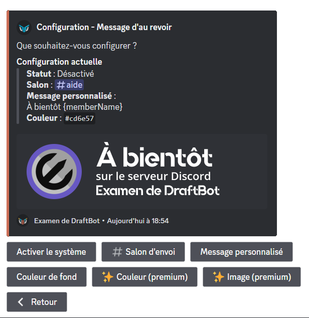

## Welcome Messages

Welcome messages are sent when a member joins your server. They allow you to welcome a new arrival and provide them with information about your server.

### Configuration

::tabs
  ::tab{ label="Via the /config command" }
    Please go to the \</config> ➜ 👋
    Arrivals & departures ➜ "Welcome message".

    Here are the different buttons and their uses:
    - "Enable the system" ➜ Allows you to enable or disable the system.
    - "Departure channel" ➜ Set the channel where the welcome sausage will be sent.
    - "Custom message" ➜ Set the message that will be sent in the welcome message (maximum 1,200 characters).

    ::collapse{ label="Variable" }
      A variable is a piece of text that changes depending on the person, the server, the channel, or the time. Here are the ones you can use in DraftBot's welcome messages.

      - `{user}` ➜ Mention the member
      - `{user.id}` ➜ Member ID
      - `{user.username}` ➜ Member's username
      - `{user.nickname}` ➜ Member's nickname or username
      - `{server}` ➜ Server name
      - `{server.id}` ➜ Server ID
      - `{server.name}` ➜ Server name
      - `{server.membercount}` ➜ Number of members on the server
      - `{channel}` ➜ Channel mention
      - `{channel.id}` ➜ Channel ID
      - `{channel.name}` ➜ Channel name
      - `{date}` ➜ Current date (DD/MM/YYYY)
      - `{time}` ➜ Current time (HH:MM)
      - `{timestamp}` ➜ Current timestamp in seconds
    ::

    - "Mention the member" ➜ Once this option is enabled, the member will be mentioned in the welcome message.
    - "Background color" ➜ Allows you to change the background color of the welcome message.

    ::hint{ type="info" }
      You can choose between three colors and the default one, which will make the image transparent (with the "None" button).

      If you want a custom color, you must subscribe to a [premium <:icon_premium_:1096140508625125417>](/premium) subscription.

      
    ::

    - "Color" ➜ Set the color of the sidebar of your welcome message. (<:icon_premium:1096140508625125417>)
    - "Image" ➜ Allows you to add a background image to your welcome message. (<:icon_premium:1096140508625125417>)

    ::hint{ type="info" }
      Features accompanied by the <:icon_premium:1096140508625125417> symbol are reserved for [premium](/premium) <:icon_premium_:1096140508625125417> servers.
    ::

    ::hint{ type="info" }
      The optimal image dimensions are 1,000 x 300 pixels.
    ::

    
  ::

  ::tab{ label="Via the panel" }
    First, go to the [DraftBot panel](/dashboard/first/welcome) ➜ Arrivals & departures.

    You must then enable the system by clicking the module activation button. If you want to disable it, click the same button again.

    

    ::hint{type="warning"}
      Once done, don't forget to save your changes with the "Save" button at the bottom of the page.
    ::

    
  ::
::

::hint{ type="warning" }
  Welcome messages are only sent once the **welcome process** is complete and the **server rules** set via Discord have been accepted.
::

## Goodbye messages

Goodbye messages are sent when a member leaves your server. They inform the community that a member has left the server and wish them well in their future endeavors.

### Configuration

::tabs
  ::tab{ label="Via the /config command" }
    First, go to the \</config> ➜ 👋
    Arrivals & Departures ➜ "Goodbye Message".

    Here are the different buttons and their uses:
    - "Enable the system" ➜ Allows you to enable or disable the system.
    - "Send channel" ➜ Set the channel where the goodbye message will be sent.

    - "Custom message" ➜ Set the message that will be sent in the welcome message.

    ::collapse{ label="Variables" }
      Variables are pieces of text that change depending on the person, the server, the channel, or even the time. Here are those available in DraftBot's goodbye messages.

      - `{user}` ➜ Mention the member
      - `{user.id}` ➜ Member ID
      - `{user.username}` ➜ Member's username
      - `{user.nickname}` ➜ Member's nickname or username
      - `{user.tag}` ➜ Member's tag _(Username#0000)_
      - `{server}` ➜ Server name
      - `{server.id}` ➜ Server ID
      - `{server.name}` ➜ Server name
      - `{server.membercount}` ➜ Number of members on the server
      - `{channel}` ➜ Channel mentions
      - `{channel.id}` ➜ Channel ID
      - `{channel.name}` ➜ Channel name
      - `{date}` ➜ Current date (DD/MM/YYYY)
      - `{time}` ➜ Current time (HH:MM)
      - `{timestamp}` ➜ Current timestamp in seconds
    ::

    ::hint{ type="warning" }
      Your message must be a maximum of 1,200 characters.
    ::

    - "Background color" ➜ Allows you to change the background color of the goodbye message.

    ::hint{ type="info" }
      You can choose between three colors as well as the default one (with the "None" button).

      If you want a custom color, you must subscribe to a [premium <:icon_premium_:1096140508625125417>](/premium) plan.

      
    ::

    - "Color" ➜ Set the color of the sidebar of your goodbye message. (<:icon_premium:1096140508625125417>)
    - "Image" ➜ Allows you to add a background image to your goodbye message. (<:icon_premium:1096140508625125417>)

    ::hint{ type="info" }
      Features accompanied by the <:icon_premium:1096140508625125417> symbol are reserved for [premium](/premium) <:icon_premium_:1096140508625125417> servers.
    ::

    ::hint{ type="info" }
      The optimal image dimensions are 1,000 x 300 pixels.
    ::

    
  ::

  ::tab{ label="From the panel" }
    First, go to the [DraftBot **panel**](/dashboard/first/welcome) ➜ Arrivals & Departures.

    You must first enable the system by clicking the module activation button. If you want to disable it, click the same button again.

    

    ::hint{type="warning"}
      Once done, don't forget to save your changes with the "Save" button at the bottom of the page.
    ::

    
  ::
::