## Checking your level

To check your own progress, use the \</level> command.

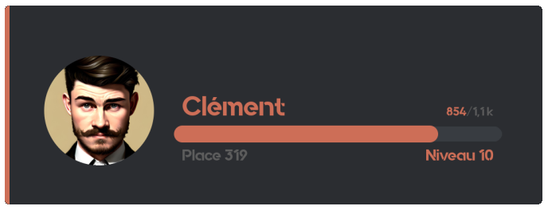

::hint{ type="info" }
  To check another member's progress, add their mention as an argument to the \</level> command.
::

## Level rewards

Motivate your members by offering them rewards when they reach certain levels! To see the rewards available on your server, use the \</rewards> command.

| Type | Description | Example |
|------|-------------|---------|
| **Permanent role** | Grants a Discord role for good | "Active" role at level 10 |
| **Temporary role** | Grants a role for a limited time | "VIP 7 days" role at level 20 |
| **Money** | Money from the [economy system](/docs/engagement/economy) | 5000 coins at level 15 |
| **Inventory item** | One or more [inventory items](/docs/engagement/inventory) | 3x "Boost potion" at level 25 |
| **Custom reward** | A reward you hand out yourself | Promo code, goodies, etc. |

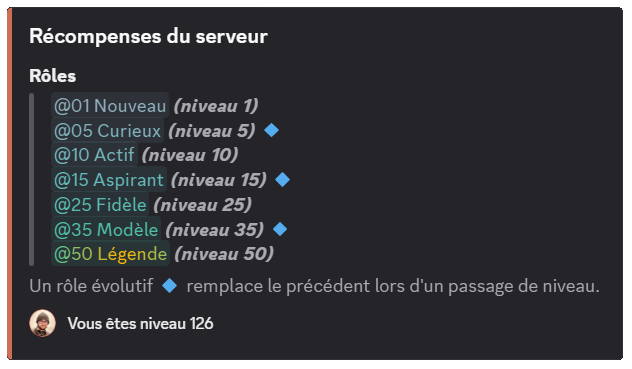

::hint{ type="info" }
  You can create up to **10 rewards** for free. [Premium](/premium) <:icon_premium:1096140508625125417> servers have **no limit**!
::

## Member leaderboard

You can display the member leaderboard, from the highest to the lowest level, in three ways:

### The /toplevel command

You can display the leaderboard with the \</toplevel> command.

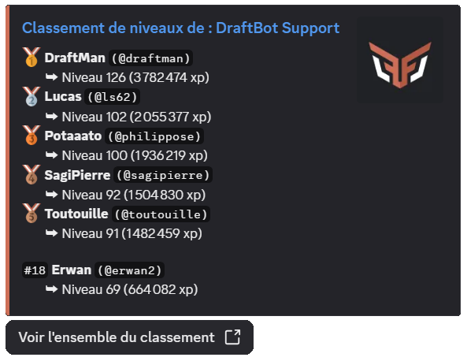

::hint{ type="success" }
  If you want to display a specific number of rows (only the top 3, for example), you can add that number as an argument to the \</toplevel> command.
::

::hint{ type="info" }
  If the **"Allow viewing other members' experience"** option is disabled, members can only check their own progress with \</level>, but the leaderboards (\</toplevel> and the online leaderboard) **remain accessible** to everyone.
::

### Online leaderboard

If you have enabled the **online leaderboard**, you can open it from the **"View the whole leaderboard"** button of the \</toplevel> command.

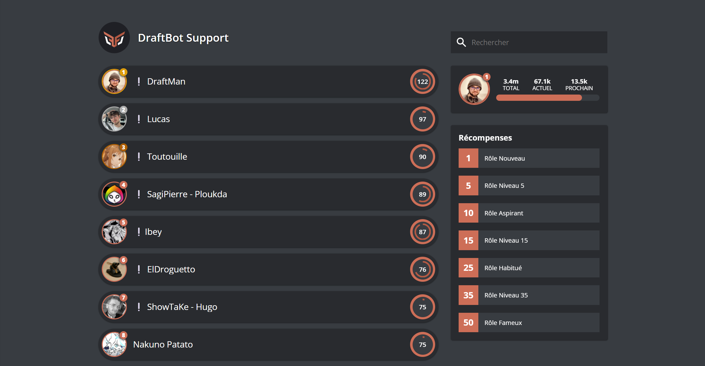

::hint{ type="info" }
  If you are a server administrator, you can also reach it from the [**panel**](/dashboard/first/levels), in the **Levels** module, through the **"Access to the leaderboard"** button.
::

### Real-time leaderboard

[Premium](/premium) <:icon_premium:1096140508625125417> servers can set up a member leaderboard in a dedicated channel, updated automatically in real time.

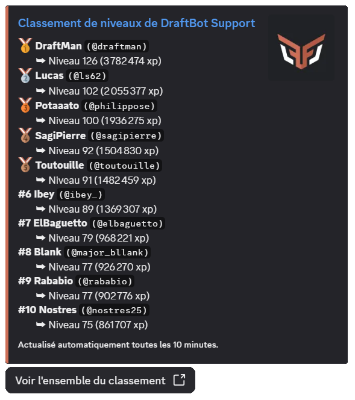

::hint{ type="success" }
  The advantage of this feature is that the message displaying the leaderboard can show up to 25 members and is refreshed automatically every 10 minutes, unless nothing has changed!
::

## Managing members' levels

As an administrator, you have several commands to manage members' experience:

| Command | Description |
|----------|-------------|
| \</dropxp> | Creates a message with a button: the **first member** to click wins the experience. You can set a time limit (**10 minutes** maximum). |
| \</adminxp add member> | Adds experience to a specific member. |
| \</adminxp add server> | Adds experience to **every member** of the server (asynchronous operation). |
| \</adminxp add role> | Adds experience to every member holding a **specific role** (asynchronous operation). |
| \</adminxp remove member> | Removes experience from a member. **Warning**: this can cause the loss of levels and of the associated reward roles. |
| \</adminxp remove server> | Removes experience from **every member** of the server (asynchronous operation). |
| \</adminxp remove role> | Removes experience from every member holding a **specific role** (asynchronous operation). |
| \</adminxp set> | Sets a member's XP to an exact amount (replaces their current XP). |
| \</adminxp transfer> | Transfers experience from one member to another (the giver loses the transferred XP). |
| \</adminxp reset server> | **Resets every level on the server**. This action cannot be undone! |

::hint{ type="info" }
  Admin commands can only be used by members of your server holding the **administrator permission**.
::

::hint{ type="info" }
  **Bulk operations**: commands targeting "every member" or "a role" run **asynchronously**.
  A progress message is displayed and updates automatically. You can cancel the operation at any time with the button provided.
::

::hint{ type="warning" }
  When you **remove XP** or **set** a lower XP amount, members may lose levels. In that case, their **reward roles** are removed automatically.
::

## Earning experience

### Experience per message

The main way to earn experience is **written participation** on the server. Each message grants a **random** amount of experience, between two configurable bounds (**15 to 25 XP** by default).

::hint{ type="info" }
  A **cooldown** (30 seconds by default, configurable) applies between each XP gain for the same member. This prevents spam and encourages quality conversations.
::

::hint{ type="info" }
  [Premium](/premium) <:icon_premium:1096140508625125417> servers can **customize this interval** independently of the voice one.
::

### Experience in voice

[Premium](/premium) <:icon_premium:1096140508625125417> servers can enable experience gain based on **voice activity**. Each member active in voice earns a **random** amount of experience (15 to 25 XP by default, configurable), at a **regular interval** (every 2 minutes by default, configurable).

::hint{ type="success" }
  This interval is also **customizable** independently of the message one.
::

::hint{ type="info" }
  **Requirements** to earn XP in voice:
  - The user must **not be muted** or **deafened** (neither self-deafened nor server-deafened).
  - The channel must **not be a stage channel** or set as the **AFK channel** (in the Discord settings).
  - **At least 2 human users** must be present and active (not muted/deafened) in the same channel.

  If these conditions are no longer met, the member stops earning XP until they are met again.
::

### Other ways to earn experience

Thanks to DraftBot's **ecosystem**, you can grant experience through other features:

| Feature | Description |
|----------------|-------------|
| **Giveaways** | Offer XP as a reward |
| **Economy shop** | Sell XP for server money |
| **Birthday gifts** | Offer XP automatically |
| **Experience drop** (\</dropxp>) | Create interactive events |
| **Advent calendar** | Daily rewards in December |

### Threads and forums

The level system distinguishes between two types of discussion spaces:

| Type of space | Description |
|---------------|-------------|
| **Threads** | Created in text or announcement channels. Their XP gain can be enabled or disabled through the **"Enable xp gain in threads"** option |
| **Forum posts** | Messages published in forum channels. Their XP gain is controlled by the **"Enable xp gain in forum posts"** option |

::hint{ type="info" }
  Threads and forum posts **automatically inherit** their parent channel's settings regarding allow/deny lists and multipliers.
::

To manage your server with precision, you can block or boost experience gain based on the member's role or the channel used, as detailed below.

### Allow and deny lists

The **role** and **channel** lists let you control precisely who can earn XP and where:

| Mode | Description |
|------|-------------|
| **With** | Only the listed members/channels can earn XP. For roles, a member only needs **at least one** allowed role to earn XP, even if they hold other unlisted roles |
| **Without** | The listed members/channels **cannot** earn XP. If a member holds at least one forbidden role, they will not earn XP |

### Experience multipliers

You can apply **multipliers** (x1.5, x2, x2.5, x3) to certain roles or channels to boost XP gain.

::hint{ type="info" }
  [Premium](/premium) <:icon_premium:1096140508625125417> servers can use custom values ranging from x0.1 to x10.
::

- If a member holds several boosted roles, **only the highest boost** is applied.
- If a channel inherits its category's boost **and** has its own boost, **only the channel's boost** is applied.
- Role boosts and channel boosts, however, **stack** with each other (multiplication).

::hint{ type="info" }
  **Example**: a member holding an x2 role who writes in an x1.5 channel earns x3 (2 × 1.5). Conversely, if they hold two boosted roles (x2 and x1.5), only the x2 is applied.
::

### Additional options

Other advanced options are available to fine-tune the system:

| Option | Description |  |
|--------|-------------|--|
| **XP gain per message in voice channels** | Three modes are available for text messages sent in voice channels: **Everyone** (any message grants XP, whether or not the author is connected to voice), **Only if voice-connected** (XP is only granted if the member is also connected to the voice channel), or **Disabled** (no text message in voice channels grants XP) |  |
| **Long messages count double** | Messages of 250 characters or more (threshold configurable between 100 and 1500) grant double XP |  |
| **Allow viewing other members' experience** | If disabled, members can only check their own level through \</level>, and the reply becomes ephemeral (visible only to the person who ran it). Administrators can still check every member's level |  |
| **Reset XP when leaving the server** | If enabled, members who leave the server lose their progress for good. If they come back, they start from zero |  |
| **Reset XP on ban** | If enabled, banned members lose their progress for good |  |
| **Color customization** | Change the color of level embeds and cards | <:icon_premium:1096140508625125417> |

::hint{ type="info" }
  Features marked with the <:icon_premium:1096140508625125417> symbol are reserved for [premium](/premium) <:icon_premium:1096140508625125417> servers.
::

::hint{ type="info" }
  Below is the amount of XP needed to reach the next level with the default curve.

  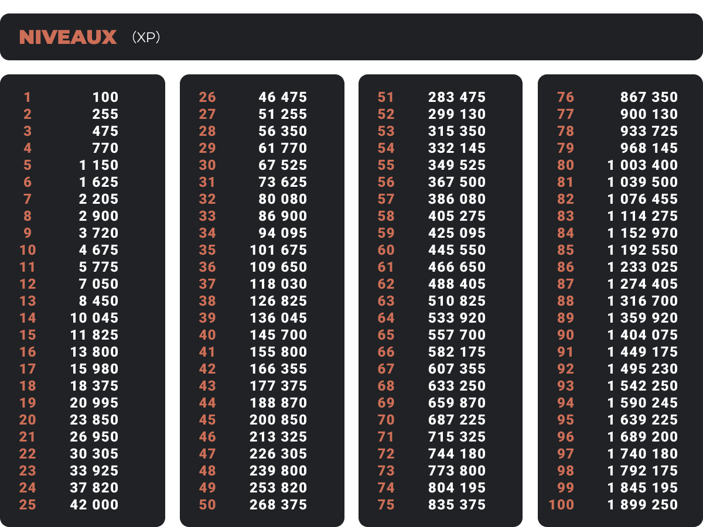
::

### Customizable experience curve

You can change the **experience curve** to adjust how hard it is to progress through levels. Four predefined curves are available:

| Curve | Difficulty | Description |
|--------|------------|-------------|
| **Constant** | Fixed | Every level requires exactly the same amount of XP |
| **Linear** | Moderate increase | Each level requires progressively more XP, in a linear way |
| **Exponential** | Fast increase | Difficulty grows exponentially, high levels are much harder to reach (default) |
| **Custom** <:icon_premium:1096140508625125417> | Your choice | Define your own progression formula |

::hint{ type="success" }
  **Curve multiplier**: you can apply a global multiplier (x0.5, x1, x2, etc.) to the selected curve to adjust difficulty without changing the progression style.
::

::hint{ type="warning" }
  **Important**: when you change the XP curve, every member's level is **recalculated automatically** based on their total XP. If you make levels harder to reach, some members may lose levels and their associated rewards!
::

### Maximum level

[Premium](/premium) <:icon_premium:1096140508625125417> servers can set a **maximum level** to cap progression. Once that level is reached, members **stop earning any experience** until the cap is raised or removed.

::hint{ type="info" }
  XP earned during that period is not counted retroactively.
::

## Level announcements

No milestone should go unnoticed, which is why you can set up announcements when a user levels up.

### Level-up announcements

You can configure level-up announcements with **three options**:

- **Disabled**: no announcement is sent
- **In the current channel**: the announcement appears in the channel where the member earned the level
- **In a dedicated channel**: the announcement is sent to a specific channel of your choice

::hint{ type="info" }
  **Minimum level**: set a threshold (level 10, for instance) to avoid spamming for low levels.

  **Custom color** <:icon_premium:1096140508625125417>: premium servers can change the color of the announcement embed.
::

::hint{ type="warning" }
  **Required permissions**: to send announcements, DraftBot needs the following permissions in the chosen channel: **View Channel**, **Send Messages**, **Embed Links** and **Attach Files**. If these permissions are removed, announcements are disabled automatically.
::

::hint{ type="info" }
  The level-up announcement is triggered **whatever the source of the XP** that caused the level-up: messages, voice, \</adminxp>, \</dropxp>, birthday gift, bingo, giveaway, Counter, or any other command or feature granting experience.
::

#### Customizing the message

The announcement message is **fully customizable** with dynamic variables:

| Variable | Description | Example |
|----------|-------------|---------|
| `{user}` | Member mention | @DraftBot |
| `{user.id}` | Member ID | 689210436019716137 |
| `{user.username}` | Username | DraftBot |
| `{user.nickname}` | Nickname on the server | Draft |
| `{user.globalname}` | Discord global name | DraftBot Official |
| `{level}` | Level reached | 25 |
| `{server}` / `{server.name}` | Server name | My Great Server |
| `{server.id}` | Server ID | 382341865001844737 |
| `{server.membercount}` | Number of members | 15000 |
| `{channel}` | Channel mention | #general |
| `{channel.id}` | Channel ID | 923456789012345678 |
| `{channel.name}` | Channel name | general |
| `{date}` | Current date | 15/01/2025 |
| `{time}` | Current time | 14:30 |
| `{timestamp}` | Dynamic Discord timestamp | <t:1736947800:F> |

### Reward announcements

Set up **separate** announcements for level rewards. They use the same options and variables, with `{reward}` added to display the reward obtained.

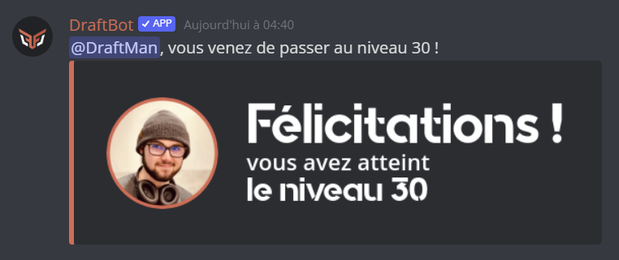

## Configuring the level system

::tabs
  ::tab{ label="From the panel" }

    [⫸ Open the **DraftBot** panel](/dashboard/first/levels)

    To enable the module, the first step is to click the button in the top right corner:

    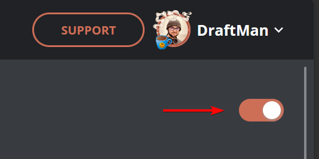

    Every feature then appears:

    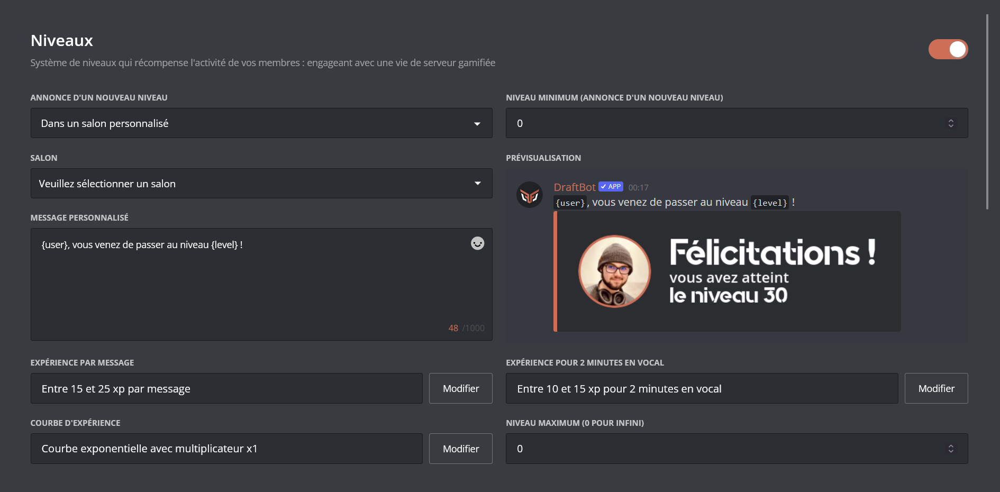

    ::hint{type="warning"}
      Once your changes are done, remember to save them with the "Save" button at the bottom of the page!
    ::
  ::

  ::tab{ label="Using the /config command" }

    If you would rather do the whole setup from Discord, you can use the \</config> command, then go to the "Levels" tab. The menu then looks like this:

    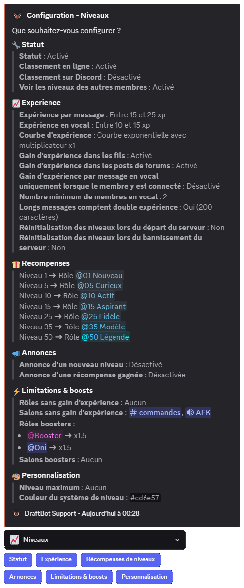

    The body of the **message** lets you see the **current state** of your level system at a glance, while the **buttons** below let you **change its configuration**.

    ::collapse{ label="Status" }
      This menu lets you:
      - Enable / disable the level system
      - Enable / disable the online leaderboard
      - Enable / disable the leaderboard on Discord (<:icon_premium:1096140508625125417>)

      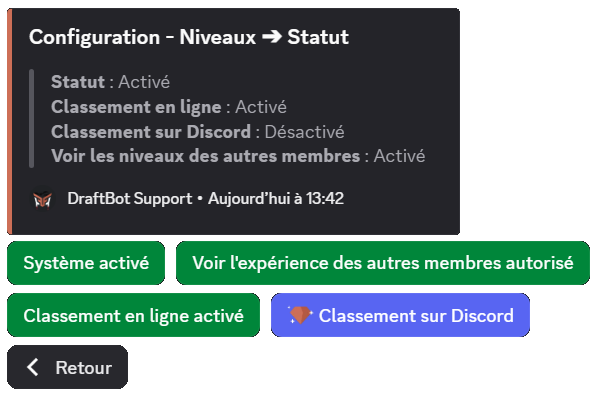

      ::hint{ type="success" }
        When you enable the leaderboard on Discord, you can either use an existing channel or let DraftBot create one for you. You can even set how many leaderboard rows to display!
      ::
    ::

    ::collapse{ label="Experience" }
      This menu lets you:
      - Enable / disable / adjust the experience granted per message
      - Enable / disable / adjust the experience granted in voice (<:icon_premium:1096140508625125417>)
      - Enable / disable experience gain in threads
      - Enable / disable experience gain per message in voice channels
      - Enable / disable / adjust double XP for long messages
      - Choose whether the level of members leaving the server is reset to 0

      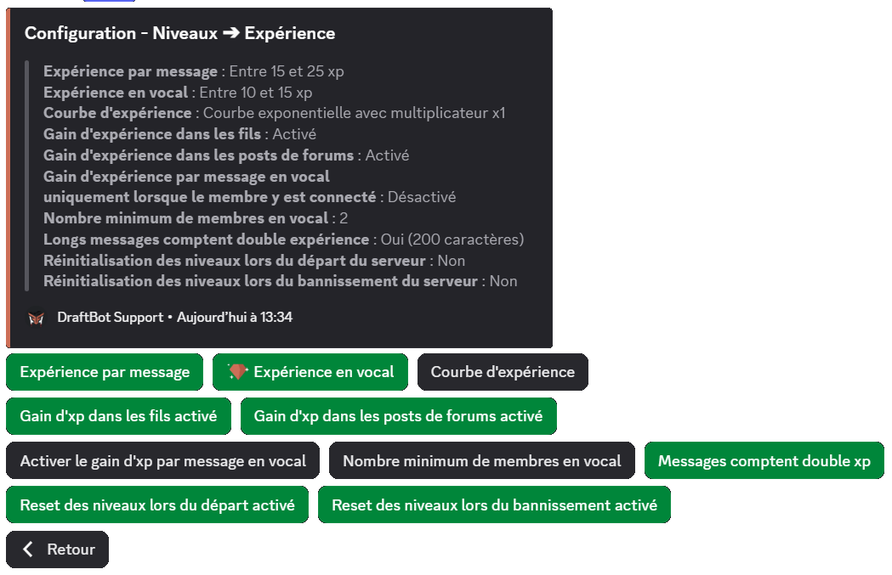
    ::

    ::collapse{ label="Level rewards" }
      This menu lets you configure level rewards, so you can:
      - Create / edit / delete a [reward](#level-rewards)
      - Reset the rewards.

      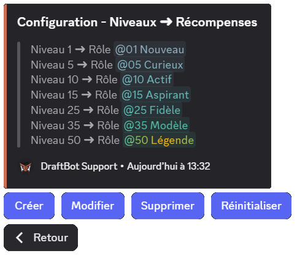
    ::

    ::collapse{ label="Announcements" }
      This menu configures level-up and reward announcements. You can:
      - Configure level-up announcements:
          - Enable / disable announcements
          - Choose the channel where announcements are sent
          - Set a minimum level for announcements
          - Customize the announcement message
      - Configure reward announcements:
          - Enable / disable announcements
          - Choose the channel where announcements are sent
          - Customize the announcement message

      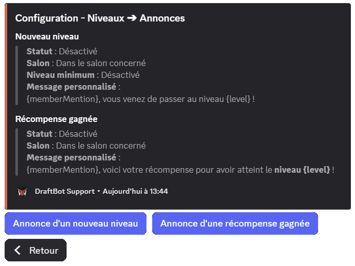
    ::

    ::collapse{ label="Limitations & boosts" }
      This menu configures different gains depending on a member's role or the channel they post in. You can set:
      - which roles have XP gain enabled or disabled,
      - which channels have XP gain enabled or disabled,
      - which roles get a multiplier (x1.5, x2, x2.5, x3),
      - which channels get a multiplier (x1.5, x2, x2.5, x3).

      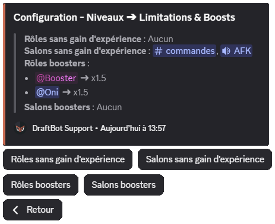
    ::

    ::collapse{ label="Customization" }
      This menu offers exclusive customizations reserved for [premium servers](/premium) <:icon_premium:1096140508625125417>:
      - Set a maximum level
      - Customize the color of the levels interface (orange by default)

      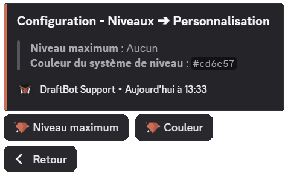
    ::
  ::
::

### Configuring rewards

The basic reward setup goes like this:

::tabs
  ::tab{ label="From the panel" }

    [⫸ Open the **DraftBot** panel](/dashboard/first/levels)

    Two sections are available:

    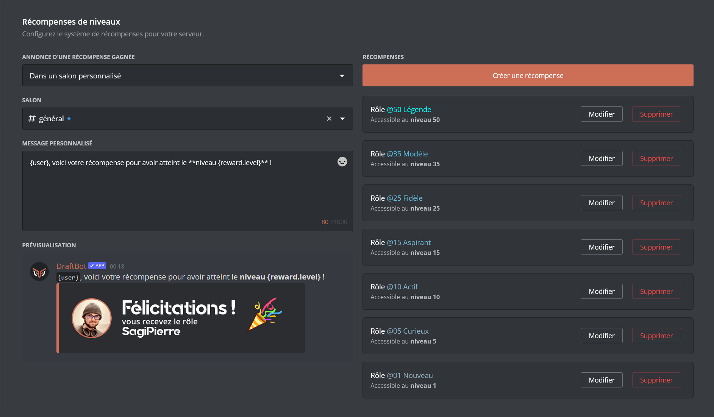

    1. **Create a reward**: this option lets you create rewards and assign them to the level-ups of your choice. *(Learn how to [create a reward](#creating-a-reward)!)*

    2. **Configure announcements**: you can enable or disable announcements, choose the channel they appear in, and even customize the message!

    ::collapse{ label="See how to configure announcements:" }
      You can:
      - Choose whether the announcement is sent in the active channel or in a dedicated one
          - Create or select a dedicated channel
      - Customize the announcement message

      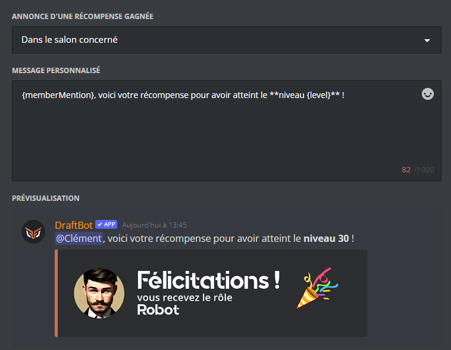
    ::

    ::hint{ type="success" }
      If you have already set up [shop articles](/docs/engagement/economy#creating-a-shop-article), they appear at the bottom of the screen, where you can edit or delete them.
    ::
  ::

  ::tab{ label="Using the /config command" }
    Through the \</config> command, click the "Level rewards" button. A menu for configuring rewards is then displayed, letting you:

    - Create / edit / delete a [reward](#creating-a-reward)
    - Reset the rewards

    
  ::
::

### Creating a reward

DraftBot lets you reward your members' activity through items of various types:

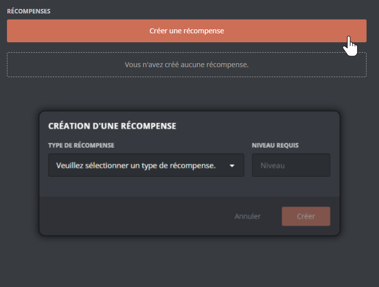

::tabs
  ::tab{ label="Role" }
    You can let your members obtain roles (temporary or permanent) when they reach a given level. To add a role to the rewards, select the reward type **"role"** or **"temporary role"**.

    Then choose:
    - The required level
    - The role to assign
    - The stacking mode: **Cumulative** or **Evolving**
    - The duration of the role *(for a temporary role)*

    ::hint{ type="info" }
      **Cumulative role**: the member keeps every reward role they have obtained (level 5, 10, 15, etc.).

      **Evolving role**: only the role of the latest level reached is kept. Previous evolving reward roles are removed automatically on the next XP gain.
    ::

    ::hint{ type="success" }
      In the \</rewards> command, a **🔹** marker is displayed next to role rewards set to **Evolving** mode, making them easy to spot.
    ::

    ::hint{ type="warning" }
      The selected role must have been created on your server beforehand, and must be accessible to DraftBot (so it must not sit higher than DraftBot's highest role).
    ::

    **Specific behaviors:**

    - **Skipping levels**: if a member skips several levels at once (through \</adminxp add>), they receive **every reward** from the intermediate levels they have not obtained yet. For example, if a member goes straight from level 5 to level 25, they will receive the rewards of levels 10, 15, 20 and 25. For **evolving** roles, only the role of the highest level is kept.
    - **Losing levels**: if a member drops below the required level (through \</adminxp remove> or a change to the XP curve), the reward roles are **removed automatically**. Money, item and custom rewards are not taken back.
  ::

  ::tab{ label="Money" }
    If the [economy system](/docs/engagement/economy) is enabled, you can reward your members with the server's virtual money.

    Choose:
    - The required level
    - The amount of money to grant

    ::hint{ type="warning" }
      The economy system must be **enabled** on your server to use this reward type. If you disable it, a warning is displayed during configuration.
    ::

    ::hint{ type="info" }
      Unlike roles, money that has been granted **cannot be taken back automatically** if the member loses their level.
    ::
  ::

  ::tab{ label="Inventory item" }
    Reward your members with custom, fictional [inventory items](/docs/engagement/inventory).

    Choose:
    - The required level
    - The item to grant (among the existing ones, or create a new one)
    - The quantity of that item (up to 1 million)

    ::hint{ type="info" }
      Like money, items that have been granted **cannot be taken back automatically** if the member loses their level.
    ::
  ::

  ::tab{ label="Custom item" }
    Offer rewards **outside Discord**: promotional codes, game keys, physical goodies, subscriptions, etc.

    Choose:
    - The required level
    - The name/description of the item (up to 250 characters)

    ::hint{ type="success" }
      **How does it work?** When a member obtains this reward, **you receive a direct message notification from DraftBot** with the member's details. You can then hand the reward over in person, however you like.
    ::

    ::hint{ type="info" }
      Ideal for one-off rewards: access to a private channel, a coaching session, custom goodies, etc.
    ::
  ::
::

::hint{ type="info" }
  You can set up to 10 level rewards. [Premium](/premium) <:icon_premium:1096140508625125417> servers have no limit!
::

## Migrating from MEE6

If you were already using a level system through MEE6, you can import your members' progress into DraftBot's level system!

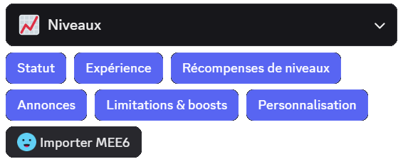

After clicking **Import MEE6** and confirming that you want to proceed with the import, DraftBot automatically retrieves all of the members' level information.

::hint{ type="warning" }
  Make sure MEE6 is present on your server and that its leaderboard is publicly accessible!
::
